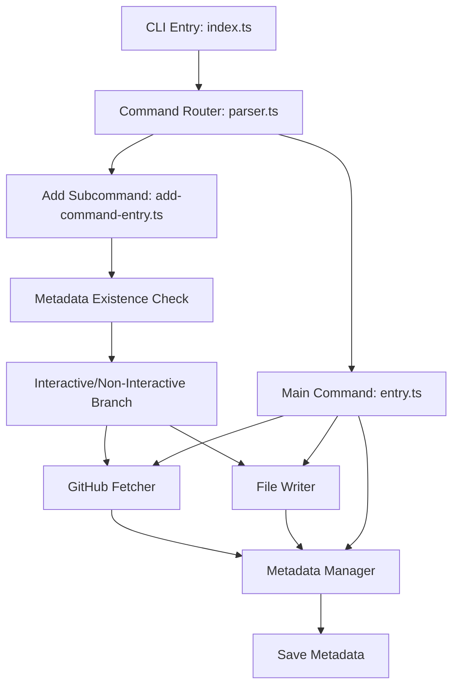
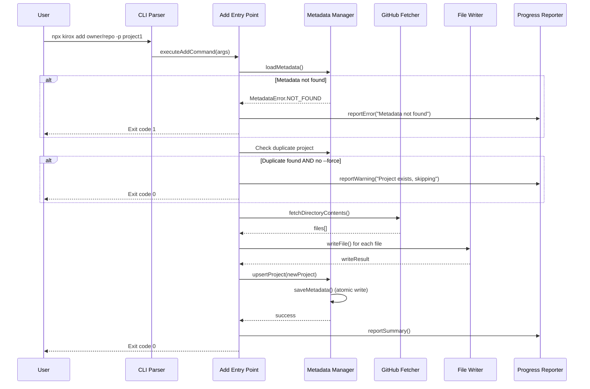
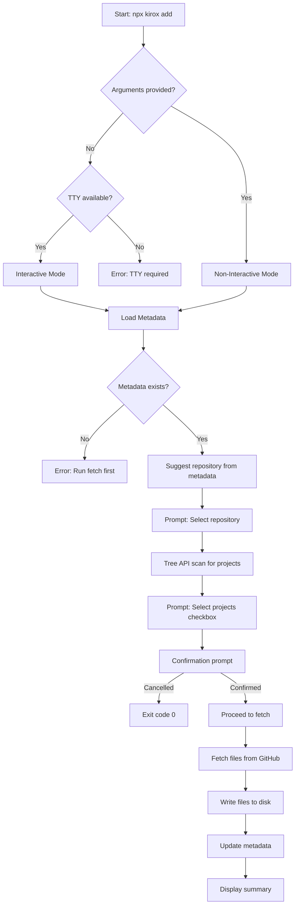
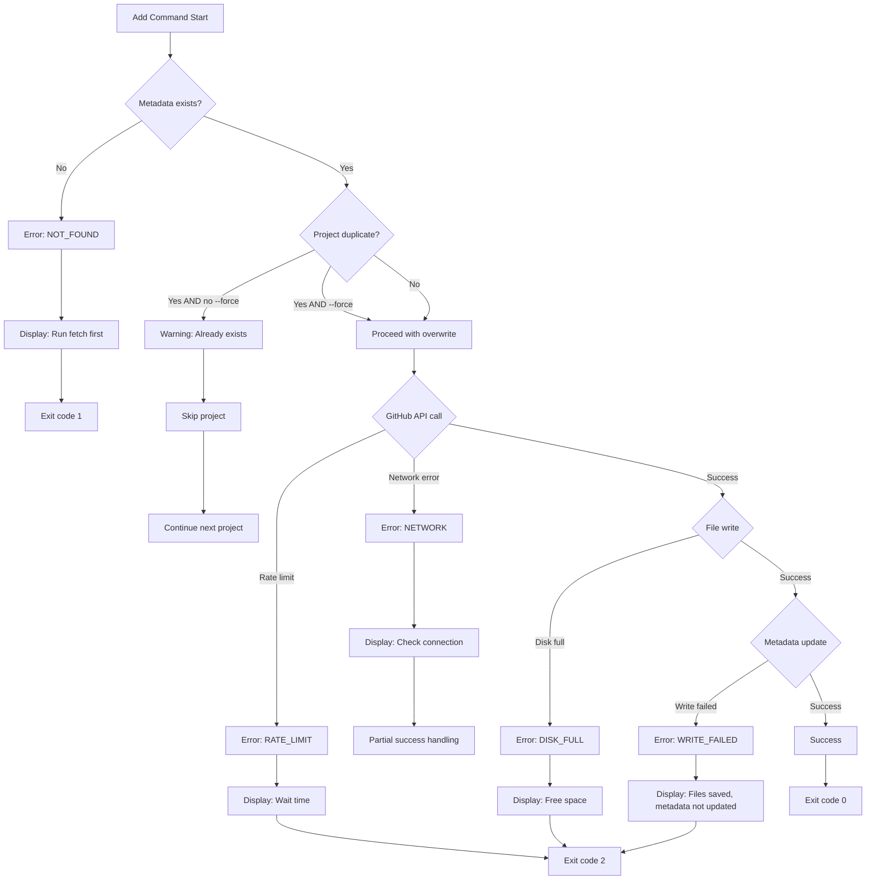
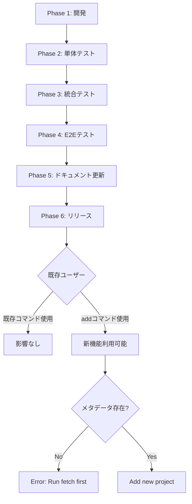

# 技術設計書: kirox add サブコマンド

## Overview

本機能は、既存のメタデータファイル（`.kirox-meta.json`）に新しいプロジェクトを段階的に追加する`add`サブコマンドを提供します。初回のfetch操作後に、ユーザーが追加のプロジェクトを柔軟に取得できるようにすることで、プロジェクト管理の利便性が向上します。

**Purpose**: 既存のトラッキングメタデータに新規プロジェクトを追加し、段階的なプロジェクト管理ワークフローを実現する。

**Users**: Kirox CLIユーザー（開発者）は、初回fetch後に新しいプロジェクトを追加する際に、このサブコマンドを利用してメタデータを自動的に更新し、既存プロジェクトとの統合を容易にする。

**Impact**: 現在のKirox CLIは単一のfetch操作でプロジェクトを取得し、後から追加する場合は全体を再取得する必要がある。本機能により、既存メタデータへの追加操作が可能となり、再取得の手間が不要になる。

### Goals

- 既存メタデータに新しいプロジェクトを安全に追加
- interactiveモードとnon-interactiveモードの両方をサポート
- 既存の`--check-updates`および`--update`機能との完全な統合
- メタデータの一貫性とアトミック性を保証

### Non-Goals

- 既存プロジェクトの削除機能（将来的な`remove`サブコマンドで実装）
- メタデータのマージや競合解決（同一プロジェクトの上書き更新のみ）
- 複数のメタデータファイル管理（単一のメタデータファイルのみサポート）

## Architecture

### 既存アーキテクチャ分析

Kirox CLIは4層アーキテクチャを採用しており、`add`サブコマンドはこれを尊重して実装します：

- **CLI Layer** (`src/cli/`): Commander.jsを使用したサブコマンド定義とルーティング
- **GitHub Integration Layer** (`src/github/`): 既存のfetcher/parallel-fetcherを再利用
- **File System Layer** (`src/filesystem/`): 既存のwriter.tsを再利用
- **Tracking Layer** (`src/tracking/`): 既存のmetadata-manager.tsを拡張

**保持される既存パターン**:
- 単方向データフロー（CLI → GitHub → FileSystem → Tracking）
- Promise.allSettledによる部分的失敗の許容
- アトミックなメタデータ書き込み（temp file + rename）
- 依存注入によるReporting層の横断利用

**新規コンポーネントの必要性**:
- `add-command-entry.ts`: addサブコマンド専用のエントリポイント（既存entry.tsと並行）
- メタデータ存在チェックロジック（既存のloadMetadataを拡張）
- 重複プロジェクト検出と警告メカニズム

### High-Level Architecture



### 技術スタック調整

**既存技術スタックとの整合性**:
- **Commander.js v12.x**: サブコマンド機能（`.command()`メソッド）を活用
- **Octokit v5.x**: 既存のGitHub API統合を再利用
- **Node.js fs/promises**: メタデータファイル操作に使用
- **TypeScript 5.x**: 型安全性を維持

**新規導入の必要性**: なし（既存スタックで実装可能）

### 主要設計決定

#### 決定 1: サブコマンドアーキテクチャ

**Context**: Kirox CLIは現在、単一のエントリポイント（`entry.ts`）で全ての処理を行っている。`add`機能を追加する際に、既存コードを変更するか、サブコマンドとして分離するかを決定する必要がある。

**Alternatives**:
1. **既存entry.tsに`--add`フラグを追加**: 既存ロジックを拡張してフラグで分岐
2. **Commander.jsのサブコマンド機能を使用**: `.command('add')`でaddサブコマンドを定義し、専用エントリポイントを作成
3. **別バイナリとして分離**: `kirox-add`という独立したCLIコマンドを作成

**Selected Approach**: **Commander.jsのサブコマンド機能を使用**

サブコマンドとして実装し、`add-command-entry.ts`という専用エントリポイントを作成します。

```typescript
// src/cli/parser.ts
program
  .command('add')
  .description('Add new projects to existing metadata')
  .argument('[repository]', 'GitHub repository')
  .option('-p, --project <name>', 'Project name(s)')
  .option('--force', 'Overwrite existing projects')
  // ... other options
  .action(async (repository, options) => {
    await executeAddCommand({ repository, ...options });
  });
```

**Rationale**:
- **拡張性**: 将来的な`remove`、`list`等のサブコマンド追加が容易
- **明確な責任分離**: addロジックが独立し、既存fetchロジックに影響を与えない
- **ユーザー体験の向上**: `npx kirox add`という直感的なコマンド構文
- **既存技術スタックの活用**: Commander.jsはサブコマンドをネイティブサポート

**Trade-offs**:
- **Gain**: コードの保守性向上、機能の独立性、将来的な拡張性
- **Sacrifice**: 若干のコード重複（引数パース、設定読み込み）

#### 決定 2: メタデータ存在チェックのタイミング

**Context**: `add`コマンドは既存メタデータを前提とするため、メタデータファイルの存在を検証する必要がある。検証のタイミングによって、ユーザーフィードバックとパフォーマンスが変わる。

**Alternatives**:
1. **引数パース直後に検証**: GitHub API呼び出し前に即座にエラーを返す
2. **ファイル取得後に検証**: GitHub APIで成功してからメタデータを確認
3. **メタデータ更新時に検証**: 最後の段階で確認し、存在しなければ作成

**Selected Approach**: **引数パース直後に検証**

`add-command-entry.ts`の冒頭で`loadMetadata()`を呼び出し、`MetadataError.NOT_FOUND`をキャッチして明確なエラーメッセージを表示します。

```typescript
// Early validation in add-command-entry.ts
try {
  await loadMetadata(metadataPath);
} catch (error) {
  if (error instanceof MetadataError && error.type === MetadataErrorType.NOT_FOUND) {
    console.error('Metadata file not found. Please run regular fetch first.');
    return { success: false, exitCode: 1 };
  }
  throw error;
}
```

**Rationale**:
- **高速フィードバック**: GitHub API呼び出し前にエラーを検出し、無駄な処理を回避
- **明確なエラーメッセージ**: ユーザーに次のアクションを即座に提示
- **既存機能の再利用**: `loadMetadata()`の既存エラーハンドリングを活用

**Trade-offs**:
- **Gain**: ユーザー体験の向上、無駄なAPI呼び出し削減
- **Sacrifice**: なし（この場合は純粋な利益）

#### 決定 3: 重複プロジェクト検出とハンドリング

**Context**: ユーザーが既に存在するプロジェクトを`add`コマンドで追加しようとした場合の動作を定義する必要がある。

**Alternatives**:
1. **即座にエラーで終了**: 重複を検出したら処理を中止
2. **警告を表示してスキップ**: 重複プロジェクトをスキップし、他のプロジェクトは処理継続
3. **`--force`オプションで上書き許可**: デフォルトはスキップ、`--force`で上書き更新

**Selected Approach**: **`--force`オプションで上書き許可**

重複プロジェクトを検出した場合、デフォルトでは警告を表示してスキップし、`--force`が指定されている場合のみ既存エントリを更新します。

```typescript
// Duplicate detection logic
const existingProject = metadata.projects.find(
  (p) => p.repository === repository && p.projectName === projectName
);

if (existingProject && !args.force) {
  reporter.reportWarning(`Project already exists: ${projectName} (skipping)`);
  continue; // Skip to next project
}

if (existingProject && args.force) {
  reporter.reportVerbose(`Overwriting existing project: ${projectName}`);
  // Proceed with upsert
}
```

**Rationale**:
- **安全性優先**: デフォルトは既存データを保護
- **柔軟性の提供**: `--force`で意図的な上書きを許可
- **既存パターンとの一貫性**: Kiroxの`--force`オプションの既存動作と整合

**Trade-offs**:
- **Gain**: データ損失リスク低減、既存ワークフローとの一貫性
- **Sacrifice**: 上書き時に`--force`の明示的な指定が必要

## System Flows

### シーケンス図: Addコマンド実行フロー



### フローチャート: インタラクティブモード分岐



## Requirements Traceability

本機能は9つの主要要件領域をカバーします。以下は要件と技術コンポーネントのマッピングです：

| 要件 | 要件概要 | コンポーネント | インターフェース | フロー |
|------|---------|-------------|-------------|-------|
| 1.1-1.7 | Non-Interactive追加コマンド | AddCommandEntry, MetadataManager | executeAddCommand(), upsertProject() | Addコマンド実行フロー |
| 2.1-2.6 | Interactive追加コマンド | InteractivePrompt, AddCommandEntry | promptMissingArguments(), promptProjectSelection() | インタラクティブモード分岐 |
| 3.1-3.6 | メタデータ統合とバリデーション | MetadataManager, DuplicateDetector | loadMetadata(), detectDuplicate(), validateSchema() | メタデータ更新フロー |
| 4.1-4.5 | ファイル書き込みと上書き制御 | FileWriter, PromptService | writeFile(), confirmOverwrite() | ファイル書き込みフロー |
| 5.1-5.6 | 進捗表示とサマリー | ProgressReporter | reportProgress(), reportSummary() | 進捗レポートフロー |
| 6.1-6.5 | エラーハンドリングと復旧 | ErrorHandler, MetadataManager | handle(), rollbackMetadata() | エラーハンドリングフロー |
| 7.1-7.4 | 既存機能との統合 | MetadataManager | loadMetadata() (共通化) | 更新チェックフロー |
| 8.1-8.4 | 設定ファイルとの統合 | ConfigLoader, ConfigMerger | loadConfig(), mergeConfig() | 設定マージフロー |
| 9.1-9.4 | 下位互換性とヘルプ | CommandParser | parseArguments() | コマンドルーティング |

## Components and Interfaces

### CLI層

#### AddCommandEntry

**Responsibility & Boundaries**
- **Primary Responsibility**: `add`サブコマンドの実行フローを統括し、メタデータの存在確認、引数の処理、GitHub取得、ファイル書き込み、メタデータ更新を順次実行
- **Domain Boundary**: CLI層に属し、ユーザー入力の受け付けから実行結果の返却までを担当
- **Data Ownership**: 実行結果（成功/失敗カウント）とコマンド引数の管理
- **Transaction Boundary**: 単一プロジェクト追加操作のスコープ（複数プロジェクトの場合は各プロジェクトが独立したトランザクション）

**Dependencies**
- **Inbound**: CLI Parser（`parser.ts`）からアクションハンドラとして呼び出される
- **Outbound**: MetadataManager, GitHubFetcher, FileWriter, ProgressReporter, ErrorHandler
- **External**: なし（既存の内部モジュールのみ依存）

**Service Interface**

```typescript
interface AddCommandService {
  /**
   * Execute add command with provided arguments
   *
   * @param argv - Command-line arguments
   * @returns Execution result with success status
   */
  executeAddCommand(argv: string[]): Promise<ExecutionResult>;
}
```

- **Preconditions**: メタデータファイルが存在すること、有効なリポジトリとプロジェクト名が提供されること
- **Postconditions**: 成功時、新しいプロジェクトメタデータが追加され、ファイルがディスクに書き込まれる。失敗時、部分的に取得したファイルは保持されるがメタデータは更新されない
- **Invariants**: メタデータファイルの整合性が常に保たれる（アトミック書き込み）

**Integration Strategy**
- **Modification Approach**: 既存の`entry.ts`とは独立した新規ファイル`add-command-entry.ts`を作成
- **Backward Compatibility**: 既存のmain fetchコマンド（`npx kirox owner/repo -p project`）の動作は一切変更しない
- **Migration Path**: 新規機能のため、段階的移行は不要

#### CommandParser拡張

**Responsibility & Boundaries**
- **Primary Responsibility**: `add`サブコマンドの定義とルーティング
- **Domain Boundary**: CLI層のルートレベルで、サブコマンド分岐を管理
- **Data Ownership**: コマンド定義とオプション仕様
- **Transaction Boundary**: 引数パースとバリデーションのみ（実行は各エントリポイントに委譲）

**Dependencies**
- **Inbound**: CLI Entry (`index.ts`)から呼び出される
- **Outbound**: AddCommandEntry（`add`サブコマンド実行時）、MainEntry（通常fetchコマンド実行時）
- **External**: Commander.js v12.x

**External Dependencies Investigation**

Commander.js v12.x の`.command()`メソッドを使用してサブコマンドを定義します。

**公式ドキュメント調査結果**:
- **API Signature**: `program.command(name, opts?): Command`
- **サブコマンド定義**: `.command('add')`で新規Commandインスタンスを作成
- **Action Handler**: `.action((args, options) => { ... })`でサブコマンドのロジックを定義
- **Options継承**: サブコマンドは独自のオプションを定義可能（親コマンドのオプションとは独立）
- **Version Compatibility**: v12.xでは`.command()`の動作が安定しており、破壊的変更なし

**実装上の注意点**:
- サブコマンドのアクションハンドラは非同期関数をサポート（`async`/`await`が利用可能）
- サブコマンドのヘルプは`.description()`で定義
- サブコマンドのオプションは親コマンドと名前が衝突しても問題なし（スコープが分離）

**API Contract**

既存の`parseArguments()`を拡張し、サブコマンドのルーティングを追加：

```typescript
// src/cli/parser.ts
export function parseArguments(argv: string[]): ParsedArguments {
  const program = new Command();

  // Existing main command (unchanged)
  program
    .name('kirox')
    .argument('[repository]', 'GitHub repository')
    .option('-p, --project <name>', 'Project name')
    // ... existing options

  // New 'add' subcommand
  program
    .command('add')
    .description('Add new projects to existing metadata')
    .argument('[repository]', 'GitHub repository')
    .option('-p, --project <name>', 'Project name(s)')
    .option('-o, --output <path>', 'Output directory', '.')
    .option('-s, --subdir <path>', 'Subdirectory path')
    .option('--force', 'Overwrite existing projects', false)
    .option('--dry-run', 'Dry-run mode', false)
    .option('--verbose', 'Verbose logging', false)
    .option('--config <path>', 'Custom config file path')
    .action(async (repository, options) => {
      // Route to add command entry point
      const result = await executeAddCommand({
        repository: repository || '',
        projects: parseProjects(options.project || ''),
        output: options.output,
        subdir: options.subdir,
        force: options.force,
        dryRun: options.dryRun,
        verbose: options.verbose,
        config: options.config,
        // Add-specific: always enable tracking for add command
        track: true,
        checkUpdates: false,
        update: false,
      });

      process.exit(result.exitCode);
    });

  program.parse(argv);
  // ... existing logic
}
```

- **Preconditions**: 有効な`argv`配列が提供される
- **Postconditions**: `add`サブコマンドが検出された場合、`executeAddCommand()`が呼び出され、プロセスが終了する
- **Invariants**: 既存のmainコマンドの動作は変更されない

### Tracking層

#### DuplicateProjectDetector

**Responsibility & Boundaries**
- **Primary Responsibility**: メタデータ内の既存プロジェクトとの重複を検出
- **Domain Boundary**: Tracking層に属し、メタデータの整合性チェックを担当
- **Data Ownership**: 重複検出結果（boolean + 既存プロジェクト情報）
- **Transaction Boundary**: 読み取り専用操作（メタデータ変更なし）

**Dependencies**
- **Inbound**: AddCommandEntry（add実行前のチェック）
- **Outbound**: MetadataManager（メタデータ読み込み）
- **External**: なし

**Service Interface**

```typescript
interface DuplicateDetectionResult {
  isDuplicate: boolean;
  existingProject?: ProjectMetadata;
}

interface DuplicateProjectDetector {
  /**
   * Check if project already exists in metadata
   *
   * @param repository - Repository in "owner/repo" format
   * @param projectName - Project name to check
   * @param metadataPath - Path to metadata file
   * @returns Detection result with existing project info
   */
  detectDuplicate(
    repository: string,
    projectName: string,
    metadataPath: string
  ): Promise<DuplicateDetectionResult>;
}
```

- **Preconditions**: メタデータファイルが存在すること
- **Postconditions**: 重複判定結果が返される（副作用なし）
- **Invariants**: メタデータファイルは変更されない

**Implementation Note**:
既存の`metadata-manager.ts`の`upsertProject()`内部で重複検出を行っているため、新規に`DuplicateProjectDetector`を作成せず、既存ロジックを拡張します。具体的には、`upsertProject()`の前に明示的にチェックを行い、重複時の動作を`--force`オプションで制御します。

#### MetadataManager拡張

**既存機能の保持**:
- `loadMetadata()`: メタデータファイルの読み込みとバリデーション
- `saveMetadata()`: アトミックなメタデータ書き込み（temp file + rename）
- `upsertProject()`: プロジェクトの挿入または更新
- `upsertFile()`: ファイルメタデータの挿入または更新

**新規機能の追加**:
なし（既存機能で`add`コマンドの要件を満たす）

**Integration Strategy**:
- **Modification Approach**: 既存の`metadata-manager.ts`を変更せず、そのまま再利用
- **Backward Compatibility**: 既存の`--check-updates`および`--update`コマンドは`add`で追加されたプロジェクトを自動的に認識
- **Migration Path**: 既存メタデータフォーマットとの完全互換性を維持

### GitHub統合層

**既存コンポーネントの再利用**:
- `GitHubFetcher` (`fetcher.ts`): ディレクトリコンテンツ取得、リポジトリパース
- `ParallelFetcher` (`parallel-fetcher.ts`): 並列ファイル取得（セマフォ制御）
- `Octokit Client`: GitHub API認証とリクエスト

**新規実装の必要性**: なし（既存のGitHub統合ロジックをそのまま利用）

### FileSystem層

**既存コンポーネントの再利用**:
- `FileWriter` (`writer.ts`): ファイル書き込み、上書き確認プロンプト
- `PathUtils` (`path-utils.ts`): リモートパス→ローカルパス変換

**新規実装の必要性**: なし（既存のファイルシステムロジックをそのまま利用）

### Reporting層

**既存コンポーネントの再利用**:
- `ProgressReporter` (`progress-reporter.ts`): 進捗表示、サマリー表示
- `ErrorHandler` (`error-handler.ts`): エラー分類とメッセージ生成
- `Logger` (`logger.ts`): 構造化ログ、verboseモード

**新規機能の追加**:
- `reportWarning()`: 重複プロジェクトのスキップ警告表示（既存の`reportVerbose()`で代替可能）

## Data Models

### 既存データモデル（変更なし）

本機能は既存のメタデータスキーマをそのまま使用し、新規のデータ構造は導入しません。

#### Metadata構造

```typescript
interface Metadata {
  version: string;
  projects: ProjectMetadata[];
}

interface ProjectMetadata {
  repository: string;        // "owner/repo" format
  projectName: string;
  subdir?: string;
  fetchedAt: string;        // ISO 8601 timestamp
  files: FileMetadata[];
}

interface FileMetadata {
  path: string;             // Relative to repository root
  sha: string;              // GitHub SHA-1 hash
  localHash: string;        // Local SHA-256 hash
  size: number;
  fetchedAt: string;        // ISO 8601 timestamp
}
```

**Business Rules & Invariants**:
- プロジェクトの一意性: `repository` + `projectName`の組み合わせが一意キー
- サブディレクトリの扱い: 同じ`projectName`でも`subdir`が異なれば別プロジェクト
- タイムスタンプ: 常にISO 8601形式のUTC時刻
- ファイルの一意性: プロジェクト内で`path`が一意キー

### データ整合性保証

**トランザクション境界**:
- 単一プロジェクト追加操作: アトミック（全ファイル取得成功 → メタデータ更新）
- 複数プロジェクト追加操作: プロジェクトごとに独立したトランザクション（一部失敗を許容）

**アトミック書き込み戦略**:
既存の`saveMetadata()`を使用し、temp file + renameパターンでメタデータの一貫性を保証：

1. `.kirox-meta.json.tmp`に新しいメタデータを書き込み
2. 書き込み成功後、`fs.rename()`でアトミックに置き換え
3. 失敗時、tempファイルを削除してロールバック

## Error Handling

### エラー戦略

Kirox CLIの既存エラーハンドリングパターンを継承し、`add`コマンド固有のエラーを追加します。

### エラーカテゴリと対応

#### User Errors (終了コード: 1)

| エラーシナリオ | エラーメッセージ | ユーザーアクション |
|-------------|---------------|-----------------|
| メタデータファイル不存在 | "Metadata file not found. Please run `npx kirox owner/repo -p project` first." | 通常のfetchコマンドを先に実行 |
| 無効なリポジトリ形式 | "Invalid repository format: {input}. Expected format: owner/repo or owner/repo#branch" | リポジトリ形式を修正 |
| プロジェクト名未指定 | "Project name is required. Use -p option or run in interactive mode." | `-p`オプションを追加または対話モードで実行 |
| 重複プロジェクト（--forceなし） | "Project already exists: {project}. Use --force to overwrite." | `--force`オプションを追加して再実行 |

#### System Errors (終了コード: 2)

| エラーシナリオ | エラーメッセージ | システム対応 |
|-------------|---------------|------------|
| GitHub APIレート制限 | "GitHub API rate limit exceeded. Please wait {minutes} minutes." | レート制限リセット時刻を表示 |
| ネットワークエラー | "Network error: {details}. Check your internet connection." | リトライ推奨メッセージ |
| メタデータ書き込み失敗 | "Failed to update metadata: {details}. Files were downloaded but tracking data was not saved." | 取得済みファイルは保持、メタデータは変更なし |
| ディスク容量不足 | "Disk space error: {details}. Free up space and retry." | ディスク容量確認を促す |

#### Business Logic Errors (終了コード: 1)

| エラーシナリオ | エラーメッセージ | 対応 |
|-------------|---------------|-----|
| プロジェクトが存在しない | "Project not found: {repository}/.kiro/specs/{project}" | リポジトリとプロジェクト名を確認 |
| 無効なメタデータスキーマ | "Invalid metadata format. Please check {path}." | メタデータファイルの修復または削除 |

### エラーフロー



### モニタリング

既存のKirox CLIモニタリング機構を使用：

- **エラーログ**: `ErrorHandler.handle()`で分類され、`Logger.logError()`に記録
- **詳細ログ**: `--verbose`フラグでメタデータ更新の詳細をログ出力
- **サマリー表示**: 成功/失敗プロジェクト数、ファイル数をサマリー表示

## Testing Strategy

### Unit Tests

1. **DuplicateProjectDetector.detectDuplicate()**
   - 重複プロジェクトの正確な検出
   - サブディレクトリが異なる同名プロジェクトの判定
   - メタデータファイル不存在時のエラーハンドリング

2. **AddCommandEntry.executeAddCommand()**
   - 引数パースと検証ロジック
   - `--force`オプションによる重複上書き動作
   - メタデータ存在チェックのエラーハンドリング

3. **CommandParser.parseArguments() (add拡張)**
   - `add`サブコマンドの正しいルーティング
   - サブコマンドオプションのパース
   - mainコマンドとの干渉がないこと

4. **MetadataManager (既存機能)**
   - `upsertProject()`の重複検出ロジック
   - アトミックな`saveMetadata()`の動作

### Integration Tests

1. **CLI → Metadata Manager統合**
   - `add`コマンド実行時の完全なフロー（引数パース → メタデータチェック → GitHub取得 → ファイル書き込み → メタデータ更新）
   - 複数プロジェクト追加時の部分的失敗ハンドリング

2. **Interactive Mode統合**
   - 対話モードでのリポジトリ提案（既存メタデータから）
   - Tree API検索とプロジェクト選択UIの統合
   - 確認プロンプトのキャンセル処理

3. **既存機能との統合**
   - `add`で追加したプロジェクトが`--check-updates`で認識されること
   - `add`で追加したプロジェクトが`--update`で更新可能なこと

### E2E Tests

1. **Non-Interactive Mode基本フロー**
   - `npx kirox add owner/repo -p new-project`で新規プロジェクト追加
   - メタデータファイルに正しく追加されること
   - ファイルが正しくディスクに書き込まれること

2. **Interactive Mode基本フロー**
   - 引数なしで`npx kirox add`を実行
   - リポジトリとプロジェクトの対話的選択
   - 確認プロンプトでの実行

3. **エラーシナリオ**
   - メタデータファイル不存在時のエラー表示
   - 重複プロジェクト追加時の警告と`--force`動作
   - GitHub API失敗時の部分的成功ハンドリング

4. **複数プロジェクト追加**
   - `npx kirox add owner/repo -p proj1,proj2,proj3`で複数プロジェクト追加
   - 各プロジェクトが独立してメタデータに追加されること
   - 一部失敗時の成功プロジェクトのみ保存されること

### Performance Tests

1. **メタデータ読み込みパフォーマンス**
   - 100プロジェクト存在時のloadMetadata()の実行時間（目標: 100ms以内）

2. **重複検出パフォーマンス**
   - 100プロジェクト存在時の重複検出時間（目標: 10ms以内）

## Migration Strategy

本機能は新規サブコマンドの追加であり、既存機能への破壊的変更はありません。段階的な移行は不要ですが、導入フローを定義します。

### 導入フェーズ



### フェーズ詳細

**Phase 1: 開発**
- `add-command-entry.ts`の実装
- `parser.ts`へのサブコマンド定義追加
- 既存コンポーネントの統合

**Phase 2-4: テスト**
- Unit/Integration/E2Eテストの実装と実行
- 既存テストスイートの継続的合格確認

**Phase 5: ドキュメント更新**
- README.mdに`add`コマンドの使用例を追加
- `--help`テキストの更新

**Phase 6: リリース**
- npm公開（バージョンはメジャー/マイナーバンプを検討）

### ロールバック戦略

新機能のため、ロールバックは以下のいずれか：

1. **機能無効化**: `add`サブコマンドの定義をコメントアウト
2. **バージョンダウングレード**: 以前のnpmバージョンに戻す

既存機能への影響がないため、ロールバックリスクは低い。
