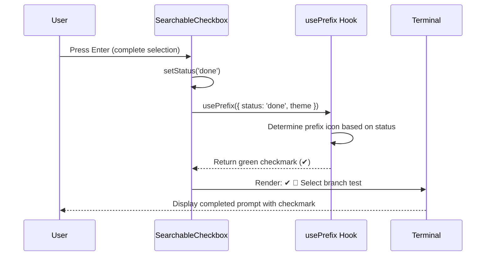

# Technical Design: searchableCheckbox完了表示修正

## Overview

このバグ修正は、Kirox CLIのインタラクティブモードで使用されるsearchableCheckboxカスタムプロンプトの完了時表示を修正します。現在、ユーザーがブランチ・サブディレクトリ・プロジェクトの選択を完了しても、プロンプトの先頭記号が疑問符(?)のままでチェックマーク(✔)に変更されません。

**Purpose**: searchableCheckboxプロンプトの完了時に、@inquirer/coreの`usePrefix`フックに`status`パラメータを正しく渡すことで、一貫したビジュアルフィードバックを提供します。

**Users**: Kirox CLIのインタラクティブモードを使用するすべての開発者が、ブランチ・サブディレクトリ・プロジェクト選択時に視覚的な完了確認を得られます。

**Impact**: 1つのファイル(`src/cli/prompts/searchable-checkbox.ts`)の完了時レンダリングロジックのみを変更します。既存の動作、API、テストには影響しません。

### Goals

- searchableCheckboxの完了時にチェックマーク(✔)プレフィックスを表示
- すべてのインタラクティブプロンプトで一貫した視覚表示を実現
- 既存機能への影響ゼロ(表示のみの変更)

### Non-Goals

- searchableCheckboxの機能変更(選択ロジック、バリデーション等)
- 他のプロンプトコンポーネント(branch-prompt.ts等)の修正
- テストコードの大幅な変更

## Architecture

### Existing Architecture Analysis

Kirox CLIは既に@inquirer/coreベースのカスタムプロンプトを使用しており、以下のパターンが確立されています:

- **CLI Layer**: `src/cli/prompts/`にカスタムプロンプトを配置
- **Inquirer Integration**: `@inquirer/core`の`createPrompt`、`useState`、`usePrefix`フックを使用
- **Visual Consistency**: Chalkによる色付けとfiguresによるアイコン表示

**現在の問題**:
```typescript
// src/cli/prompts/searchable-checkbox.ts:192
const prefix = usePrefix({ theme }); // ❌ statusパラメータが欠落
```

リポジトリ入力プロンプト(標準@inquirerプロンプト)は正常にチェックマークを表示しますが、searchableCheckboxは`status`パラメータを渡していないため、完了時も疑問符(?)のままになっています。

### Technology Alignment

**既存技術スタックとの整合性**:
- @inquirer/core v10.x: 既存の依存関係を維持
- TypeScript strict mode: 型安全性を保持
- Chalk 5.x: 色付けライブラリを継続使用
- figures: アイコンライブラリを継続使用

**新規依存関係**: なし

### Key Design Decisions

#### Decision 1: usePrefix フックへの status パラメータ追加

**Context**: searchableCheckboxプロンプトは完了時にチェックマークを表示する必要がありますが、現在は`usePrefix({ theme })`のみを呼び出しており、`status`パラメータが欠落しています。

**Alternatives**:
1. **カスタムプレフィックスロジックの実装**: 手動で`status`に基づいてプレフィックス文字列を生成
2. **usePrefixフックに status パラメータを追加**: @inquirer/coreの標準パターンに従う
3. **完了時の別のレンダリング関数**: `status === 'done'`時に完全に異なるレンダリングパスを使用

**Selected Approach**: **Option 2 - usePrefixフックに status パラメータを追加**

```typescript
// 修正前
const prefix = usePrefix({ theme });

// 修正後
const prefix = usePrefix({ status, theme });
```

**Rationale**:
- @inquirer/coreの公式ドキュメントで推奨されているパターン
- 他の標準プロンプト(@inquirer/checkbox、@inquirer/select等)と同じAPI使用
- テーマシステムとの完全な統合(成功アイコン、色の自動適用)
- 最小限のコード変更で最大の効果

**Trade-offs**:
- **Gain**: @inquirer/coreの標準動作に完全準拠、将来のアップデートに強い
- **Sacrifice**: なし(純粋な機能追加)

## System Flows

### Prompt Completion Flow



**Key Points**:
1. ユーザーがEnterキーを押すと`status`が'done'に変更
2. `usePrefix`フックが`status: 'done'`を検知
3. 自動的に緑色のチェックマーク(✔)を返す
4. 完了したプロンプトが一貫した表示でレンダリング

## Requirements Traceability

| Requirement | Summary | Components | Implementation |
|-------------|---------|------------|----------------|
| 1.1-1.5 | ブランチ選択完了表示 | searchableCheckbox | usePrefix({ status, theme }) |
| 2.1-2.4 | サブディレクトリ選択完了表示 | searchableCheckbox | usePrefix({ status, theme }) |
| 3.1-3.5 | プロジェクト選択完了表示 | searchableCheckbox | usePrefix({ status, theme }) |
| 4.1-4.4 | searchableCheckbox修正 | searchableCheckbox | usePrefix({ status, theme }) |
| 5.1-5.4 | ビジュアル一貫性 | usePrefix hook | Theme integration |
| 6.1-6.5 | 既存機能への影響回避 | All components | Display-only change |

すべての要件は、searchableCheckboxの完了時レンダリングロジックへの単一の変更によって実現されます。

## Components and Interfaces

### CLI Layer / Prompts

#### searchableCheckbox Custom Prompt

**Responsibility & Boundaries**
- **Primary Responsibility**: ブランチ・サブディレクトリ・プロジェクト選択のためのフィルタ可能なチェックボックスUI提供
- **Domain Boundary**: CLI層のユーザー入力処理
- **Data Ownership**: プロンプト状態(検索テキスト、選択状態、カーソル位置)
- **Transaction Boundary**: 単一のユーザー選択セッション

**Dependencies**
- **Inbound**:
  - `branch-prompt.ts`: ブランチ選択UI
  - `searchable-project-prompt.ts`: プロジェクト選択UI
  - `searchable-subdir-prompt.ts`: サブディレクトリ選択UI
- **Outbound**:
  - `@inquirer/core`: `createPrompt`, `useState`, `usePrefix`フック
  - `chalk`: 色付け
  - `@inquirer/figures`: アイコン表示

**External Dependencies Investigation**:
- **@inquirer/core v10.x**:
  - `usePrefix`フックは`{ status, theme }`パラメータをサポート
  - `status`が'done'の場合、自動的にテーマの成功アイコンを使用
  - デフォルトテーマでは`chalk.green(figures.tick)`(緑色のチェックマーク)
  - 完全なTypeScript型定義を提供
  - 破壊的変更なし(既存コードと完全互換)

**Contract Definition**

**Interface (変更なし)**:
```typescript
interface SearchableCheckboxConfig<Value> {
  message: string;
  prefix?: string;
  pageSize?: number;
  instructions?: string | boolean;
  choices: readonly (string | Separator | Choice<Value>)[];
  loop?: boolean;
  required?: boolean;
  validate?: (
    choices: readonly NormalizedChoice<Value>[]
  ) => boolean | string | Promise<string | boolean>;
  theme?: PartialDeep<SearchableCheckboxTheme>;
}

function searchableCheckbox<Value>(
  config: SearchableCheckboxConfig<Value>
): Promise<Value[]>;
```

**Internal State Change**:
```typescript
// 現在の実装
const [status, setStatus] = useState<'idle' | 'done'>('idle');
const prefix = usePrefix({ theme }); // ❌ statusパラメータ欠落

// 修正後の実装
const [status, setStatus] = useState<'idle' | 'done'>('idle');
const prefix = usePrefix({ status, theme }); // ✅ statusパラメータを追加
```

**Rendering Logic Change**:
```typescript
// 完了時のレンダリング (Line 311-314)
if (status === 'done') {
  const selection = items.filter((item) => !Separator.isSeparator(item) && item.checked);
  const answer = theme.style.answer(theme.style.renderSelectedChoices(selection, items));
  return `${prefix} ${message} ${answer}`; // prefixが自動的にチェックマークになる
}
```

**Preconditions**: なし(既存の動作を維持)

**Postconditions**:
- `status === 'done'`の場合、`prefix`は緑色のチェックマーク(✔)を返す
- 完了したプロンプトは`✔ {emoji} {message} {answer}`形式で表示される

**Integration Strategy**:
- **Modification Approach**: 既存コードの拡張(1行の変更)
- **Backward Compatibility**: 完全に互換(表示のみの変更、APIは不変)
- **Migration Path**: 不要(即座に適用可能)

## Error Handling

### Error Strategy

この修正は表示のみの変更であり、新しいエラーケースは導入されません。

**既存エラーハンドリングの維持**:
- バリデーションエラー: `validate`関数の結果に基づく表示(変更なし)
- キャンセル処理: `CancelPromptError`のスロー(変更なし)
- 無効な入力: キーボードイベントハンドリング(変更なし)

### Monitoring

既存のデバッグログとエラーレポーティングをそのまま使用します。この修正は視覚表示のみに影響するため、新しいモニタリングは不要です。

## Testing Strategy

### Unit Tests

**既存テストの維持** (tests/unit/cli/):
1. `searchableCheckbox`の選択ロジックテスト
2. フィルタリング機能のテスト
3. バリデーション機能のテスト
4. キーボードイベント処理のテスト

**新規テスト (追加推奨)**:
5. **完了時プレフィックス表示テスト**:
   - `status === 'done'`の場合、`usePrefix`が正しく呼び出されることを確認
   - モックの`usePrefix`が`{ status: 'done', theme }`で呼ばれることを検証

### Integration Tests

**既存統合テストの実行** (tests/integration/):
1. ブランチ選択フロー(interactive-branch-selection.test.ts)
2. プロジェクト選択フロー(interactive-project-selection.test.ts)
3. サブディレクトリ選択フロー(interactive-subdir-selection.test.ts)

**視覚的検証** (手動テスト):
4. `npm run dev`を実行し、各選択プロンプト完了時にチェックマークが表示されることを目視確認
5. すべてのプロンプトで一貫した表示(✔ 🌿、✔ 📋、✔ 📁)を確認

### E2E Tests

**既存E2Eテストの実行** (tests/e2e/):
1. 完全なインタラクティブフロー(basic-flow.test.ts)
2. エラーシナリオ(error-scenarios.test.ts)

すべての既存テストが修正後も通過することを確認します。この変更は表示のみに影響するため、テストロジックの変更は不要です。

## Security Considerations

この修正はUI表示のみに影響し、セキュリティへの影響はありません。

- 認証・認可: 影響なし
- データ保護: 影響なし
- 入力バリデーション: 既存ロジックを維持
