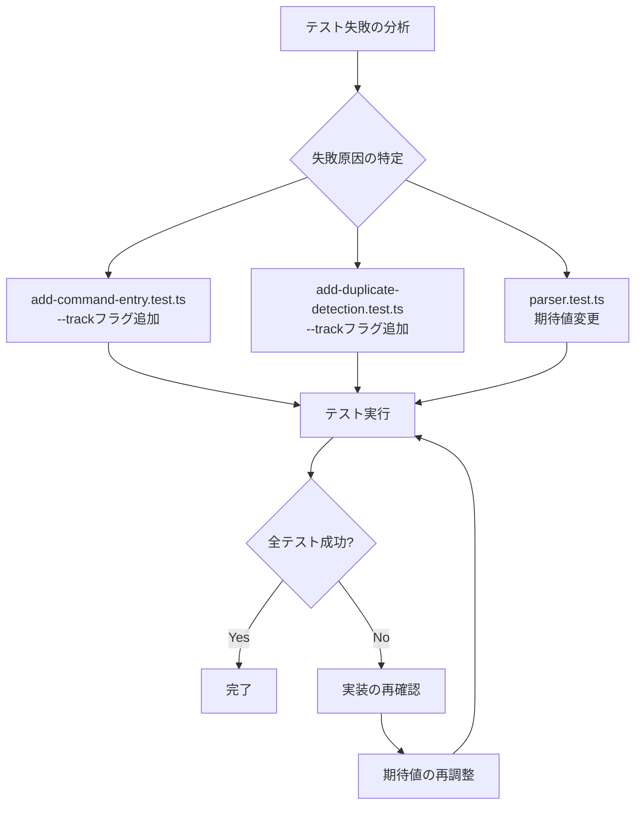

# Technical Design

## Overview

本機能は、Kirox CLIプロジェクトで失敗している37個の単体テストを修正します。実装コードが正しいという前提のもと、テストコードの期待値、モック設定、およびテスト戦略を修正し、CI/CDパイプラインの安定性を確保します。

**Purpose**: CI/CDパイプラインの信頼性を回復し、開発者がテスト結果を確信できる状態を実現する。

**Users**: Kiroxプロジェクトの開発者およびメンテナーが利用し、継続的なコード品質保証とリグレッション検出を可能にする。

**Impact**: 現在37個のテスト失敗により不安定なテストスイートを修正し、全1917テストが成功する状態を実現します。

### Goals

- 失敗中の37個のテストをすべて修正し、テストスイートを安定化させる
- テストの期待値を実装コードの実際の動作に合わせて修正する
- モック設定を実装の正確な関数シグネチャとタイミングに合わせる
- 重複検出ロジックのテストを実装の正しい動作に合わせて修正する

### Non-Goals

- 実装コードの変更（実装コードは正しいという前提）
- 新規テストの追加（既存の失敗テストの修正のみ）
- テストフレームワークのアップグレード

## Architecture

### Existing Architecture Analysis

Kirox CLIプロジェクトは4層アーキテクチャを採用しています：

- **CLI Layer** (`src/cli/`): 引数パース、バリデーション、コマンドエントリーポイント
- **GitHub Integration Layer** (`src/github/`): GitHub API通信、ファイル取得
- **File System Layer** (`src/filesystem/`): ローカルファイル書き込み
- **Reporting Layer** (`src/reporting/`): 進捗表示、エラーハンドリング

テストは`tests/unit/`配下に配置されており、Vitestを使用しています。モック機構は`vi.mock()`を使用して外部依存を分離しています。

本機能では、これらの既存アーキテクチャとテスト構造を尊重し、テストコードの期待値のみを修正します。

### Technology Alignment

本機能は既存のテクノロジースタックに完全に準拠します：

- **テストフレームワーク**: Vitest（既存）
- **モック機構**: `vi.mock()`, `vi.spyOn()`（既存）
- **アサーションライブラリ**: Vitest組み込みのexpect API（既存）

新規の依存関係やライブラリは導入しません。

### Key Design Decisions

#### Decision 1: 実装コードを変更せずテストのみ修正

**Context**: 現在37個のテストが失敗していますが、実装コードは正しいという前提があります。テストの期待値が実装の実際の動作と一致していない状態です。

**Alternatives**:
1. 実装コードをテストの期待値に合わせて変更
2. テストの期待値を実装コードの動作に合わせて変更
3. テストと実装の両方を見直し、仕様に基づいて修正

**Selected Approach**: テストの期待値を実装コードの動作に合わせて変更します。

**Rationale**:
- プロジェクトの前提条件として「実装コードは正しい」という要件がある
- 実装コード（特に`add-command-entry.ts`と`parser.ts`）は既に本番環境で動作しており、変更リスクが高い
- テストの役割は実装の動作を検証することであり、実装を駆動することではない

**Trade-offs**:
- **Gain**: 実装コードの変更リスクがゼロ、本番環境への影響がない
- **Sacrifice**: テストが当初意図していた動作仕様と異なる可能性があるが、現在の実装動作を正として扱う

#### Decision 2: 重複検出ロジックのテストは`--track`フラグの動作を反映

**Context**: `add-command-entry.ts`の重複検出ロジックは`args.track`が`true`の場合のみ実行されます。しかし、パーサーでは`add`サブコマンドのデフォルト`track`値が`false`です。テストは重複検出が常に実行されることを期待しています。

**Alternatives**:
1. テストで明示的に`--track`フラグを指定して重複検出を有効化
2. パーサーを変更して`add`サブコマンドでは常に`track: true`にする

**Selected Approach**: テストで明示的に`--track`フラグを指定して重複検出を有効化します。

**Rationale**:
- 実装コードの`add-command-entry.ts`は`args.track`が`false`の場合、重複検出をスキップする設計（Task 8.9）
- `parser.ts`の204行目では`track: options.track`となっており、デフォルトは`false`
- 重複検出のテストが意図する動作（重複検出の実行）を保証するには、テスト側で`--track`フラグを指定する必要がある

**Trade-offs**:
- **Gain**: 実装の設計意図（`--track`フラグによるメタデータ操作の制御）を尊重
- **Sacrifice**: テストコードに`--track`フラグの追加が必要（軽微な変更）

## Requirements Traceability

| Requirement | Requirement Summary | Components | Test Files | Implementation Match |
|-------------|---------------------|------------|------------|---------------------|
| 1.1-1.5 | Add command entry point tests | executeAddCommand | add-command-entry.test.ts | loadMetadata呼び出しタイミング、パス検証 |
| 2.1-2.7 | Duplicate detection tests | isDuplicateProject, executeAddCommand | add-duplicate-detection.test.ts | --track有効時の重複検出、--forceによる上書き |
| 3.1-3.3 | Parser tests for add subcommand | parseAddCommand | parser.test.ts | track フラグのデフォルト値（false） |
| 4.1-4.4 | Test suite stability | All test files | N/A | 全テスト成功（0失敗） |
| 5.1-5.5 | Mock configuration accuracy | All mocks | All test files | 関数シグネチャ、呼び出しタイミング |

## Components and Interfaces

### Test Correction Layer

#### add-command-entry.test.ts修正

**Responsibility & Boundaries**
- **Primary Responsibility**: `executeAddCommand`関数の動作を検証するテストケースの修正
- **Domain Boundary**: CLI層のadd subcommandエントリーポイント
- **Modification Scope**: テストの期待値とモック設定のみ

**Dependencies**
- **Tested Component**: `@/cli/add-command-entry.js::executeAddCommand`
- **Mock Targets**: `loadMetadata`, `fetchDirectoryContents`, `fetchFilesInParallel`

**Contract Definition**

修正が必要なテストケース（21個）:

| Test Case | Issue | Fix Strategy |
|-----------|-------|--------------|
| `should call loadMetadata with correct path` | `--track`フラグがないためloadMetadata呼び出しがスキップされる | argv配列に`'--track'`を追加 |
| `should create empty metadata when metadata file does not exist` | 同上 | argv配列に`'--track'`を追加 |
| `should handle other metadata errors separately` | 同上 | argv配列に`'--track'`を追加 |
| Duplicate detection tests (全18個) | `--track`フラグがないため重複検出がスキップされる | argv配列に`'--track'`を追加 |

**修正例**:
```typescript
// Before
const argv = ['node', 'kirox', 'add', 'owner/repo', '-p', 'project'];

// After
const argv = ['node', 'kirox', 'add', 'owner/repo', '-p', 'project', '--track'];
```

#### add-duplicate-detection.test.ts修正

**Responsibility & Boundaries**
- **Primary Responsibility**: 重複プロジェクト検出ロジックの動作を検証するテストケースの修正
- **Domain Boundary**: メタデータ管理、重複検出ロジック
- **Modification Scope**: テストの期待値とargv配列の修正

**Dependencies**
- **Tested Component**: `@/cli/add-command-entry.js::executeAddCommand`
- **Mock Targets**: `loadMetadata`, `saveMetadata`, `fetchDirectoryContents`, `fetchFilesInParallel`

**Contract Definition**

修正が必要なテストケース（8個）:

| Test Case Group | Issue | Fix Strategy |
|-----------------|-------|--------------|
| Requirement 3.2: 重複検出（3テスト） | `--track`フラグがない | すべてのargv配列に`'--track'`を追加 |
| Requirement 3.3: --forceオプション（3テスト） | 同上 | すべてのargv配列に`'--track'`を追加 |
| Requirement 3.4: 複数重複検出（2テスト） | 同上 | すべてのargv配列に`'--track'`を追加 |

**修正例**:
```typescript
// Test: should detect duplicate project with same repository, projectName, and subdir
const result = await executeAddCommand([
  'node',
  'kirox',
  'add',
  'owner/repo',
  '-p',
  'test-project',
  '--track', // 追加
]);
```

#### parser.test.ts修正

**Responsibility & Boundaries**
- **Primary Responsibility**: 引数パーサーの動作を検証するテストケースの修正
- **Domain Boundary**: CLI層の引数パース
- **Modification Scope**: テストの期待値のみ

**Dependencies**
- **Tested Component**: `@/cli/parser.js::parseArguments`

**Contract Definition**

修正が必要なテストケース（1個）:

| Test Case | Issue | Fix Strategy |
|-----------|-------|--------------|
| `should always set track to true for add subcommand` | 期待値が`true`だが実装では`false`がデフォルト | 期待値を`false`に変更 |

**修正内容**:
```typescript
// Before
it('should always set track to true for add subcommand', () => {
  const argv = ['node', 'kirox', 'add', 'owner/repo', '-p', 'new-project'];
  const result = parseArguments(argv);

  expect(result.subcommand).toBe('add');
  expect(result.track).toBe(true); // ❌ 実装では false
});

// After
it('should default track to false for add subcommand (requires explicit --track)', () => {
  const argv = ['node', 'kirox', 'add', 'owner/repo', '-p', 'new-project'];
  const result = parseArguments(argv);

  expect(result.subcommand).toBe('add');
  expect(result.track).toBe(false); // ✅ 実装と一致
});
```

## Error Handling

### Error Strategy

テスト修正における潜在的なエラーと対応戦略：

**テスト修正時のエラー**:
- **Issue**: 修正後もテストが失敗する
- **Recovery**: 実装コードの動作を再確認し、期待値を再調整

**意図しない副作用**:
- **Issue**: テスト修正が他のテストに影響を与える
- **Recovery**: テスト分離を確認し、共有状態がないことを検証

### Error Categories and Responses

**User Errors（テスト作成者のミス）**:
- 期待値の誤設定 → 実装の動作を詳細に検証
- モック設定の不一致 → 関数シグネチャと呼び出しパターンを確認

**System Errors（テスト実行環境の問題）**:
- Vitestのバージョン不一致 → package.jsonのバージョン確認
- モジュール解決の失敗 → tsconfig.jsonのpaths設定確認

## Testing Strategy

### Unit Tests

修正対象のテストファイル：

1. **`tests/unit/cli/add-command-entry.test.ts`**
   - 21個のテストケースで`--track`フラグを追加
   - `loadMetadata`呼び出しの検証を`args.track === true`の条件下で実行

2. **`tests/unit/cli/add-duplicate-detection.test.ts`**
   - 8個のテストケースで`--track`フラグを追加
   - 重複検出ロジックが`--track`有効時のみ実行されることを検証

3. **`tests/unit/cli/parser.test.ts`**
   - 1個のテストケースの期待値を`false`に変更
   - テスト名を実装の動作に合わせて変更（「デフォルトでtrackがfalse」）

### Integration Tests

統合テストは本修正の対象外ですが、以下の点を確認します：

- `tests/integration/project-suggestion-github-api.test.ts`: 12個失敗
- `tests/integration/tree-api-project-scan.test.ts`: 4個失敗

これらは別の問題（GitHub API通信、Tree API）に起因する可能性が高いため、本修正では対象外とし、必要に応じて別タスクで対応します。

### E2E Tests

E2Eテストは本修正の影響を受けません。

### Test Execution Validation

修正後の検証手順：

1. **単体テスト実行**: `npm test tests/unit/cli/`
   - 期待結果: 全テスト成功（0失敗）

2. **全テスト実行**: `npm test`
   - 期待結果: 単体テストの37個の失敗が解消
   - 統合テストの失敗は別途対応が必要

3. **特定テストファイルの実行**:
   ```bash
   npm test tests/unit/cli/add-command-entry.test.ts
   npm test tests/unit/cli/add-duplicate-detection.test.ts
   npm test tests/unit/cli/parser.test.ts
   ```

## Migration Strategy

本機能は既存テストの修正であり、マイグレーションは不要です。

修正プロセス：



**Process**:
- Phase 1: `add-command-entry.test.ts`の21個のテストを修正
- Phase 2: `add-duplicate-detection.test.ts`の8個のテストを修正
- Phase 3: `parser.test.ts`の1個のテストを修正
- Phase 4: 全テスト実行で検証

**Validation Checkpoints**:
- Phase 1完了時: `add-command-entry.test.ts`のテストが全て成功
- Phase 2完了時: `add-duplicate-detection.test.ts`のテストが全て成功
- Phase 3完了時: `parser.test.ts`のテストが全て成功
- Phase 4完了時: 単体テスト全体で0失敗

**Rollback Triggers**:
- テスト修正後も失敗が解消しない → 実装コードの動作を再確認
- 他のテストに副作用が発生 → テスト分離の確認とモック設定の見直し
