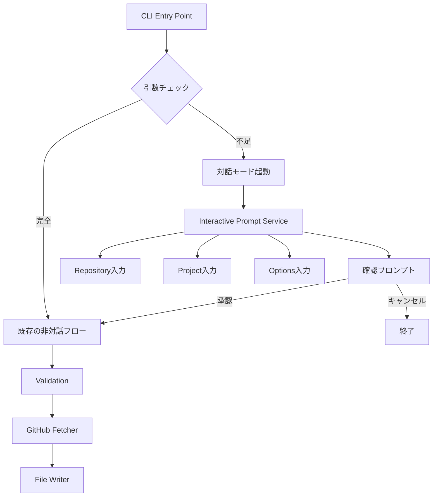
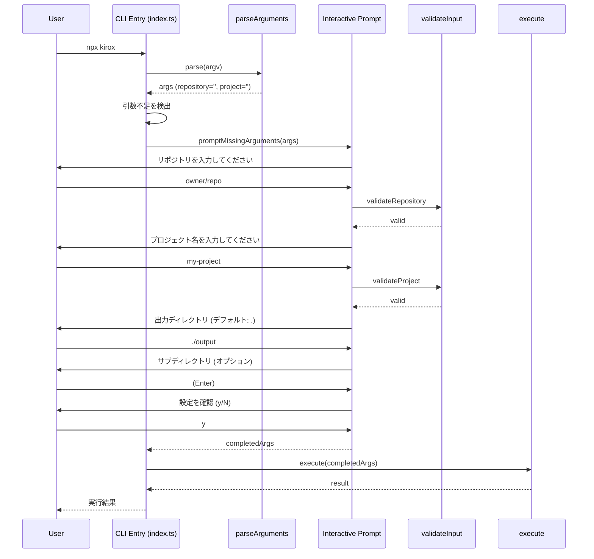
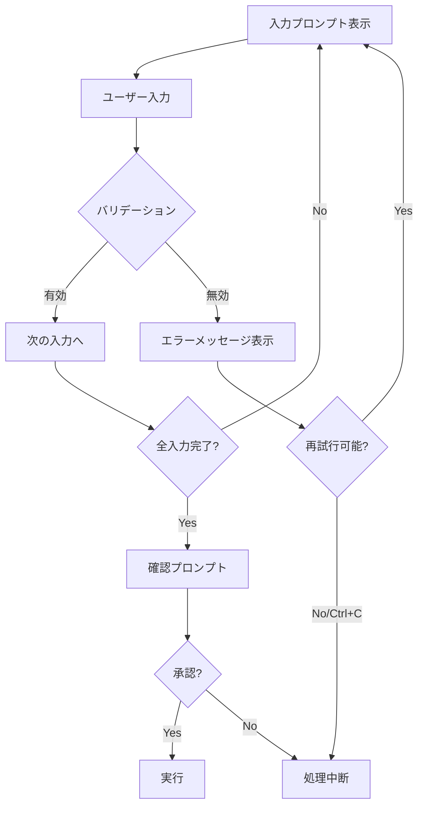

# 技術設計書

## Overview

この機能は、Kirox CLIに対話的なプロンプトモードを追加し、コマンドライン引数を指定せずに`npx kirox`を実行した際に、ユーザーがステップバイステップで必要なパラメータを入力できるようにします。現在の明示的なオプション指定方式（`npx kirox owner/repo -p project`）との完全な後方互換性を維持しながら、初めてのユーザーや複雑なオプションを覚えていないユーザーに対してより直感的な体験を提供します。

**ユーザー**: CLI初心者、頻繁にオプションを忘れる開発者、対話的なワークフローを好むユーザーが、ガイド付きプロンプトを通じてKirox CLIを利用します。

**影響**: 既存の非対話モード（全引数指定方式）には一切影響を与えず、引数が不足している場合のみ対話モードが起動します。

### Goals

- オプションなし実行時の自動対話モード起動
- リポジトリ、プロジェクト名、オプションパラメータの段階的入力
- 入力内容の確認とキャンセル機能
- 既存の非対話モードとの完全な共存

### Non-Goals

- 既存CLIオプションの変更や削除
- 対話モードでの高度な入力補完機能（将来的な拡張として検討）
- 設定ファイルの対話的生成機能

## Architecture

### 既存アーキテクチャ分析

Kirox CLIは4層アーキテクチャを採用しており、CLI層は以下の責任を持ちます：

- **CLI層** (`src/cli/`): コマンドライン引数の解析、バリデーション、メイン実行フロー
- **既存のプロンプト機能**: `src/filesystem/prompt.ts`に既存の`confirm`関数があり、ファイル上書き確認に使用されている

**統合ポイント**:
- 既存の`parseArguments`関数は引数不足時にエラーをスローする動作を維持
- 新しい対話モジュールは`execute`関数の前段階で動作し、欠落した引数を補完
- 既存のバリデーション機構（`validateInput`、`validateBranchName`）を再利用

### High-Level Architecture



### 技術アラインメント

**既存パターンの維持**:
- `@inquirer/prompts`を使用（対話的プロンプトのデファクトスタンダード）
- `src/cli/`配下に新規ファイルを追加（レイヤー分離の維持）
- 既存の型定義（`ParsedArguments`、`ValidationError`）を拡張
- Commanderによる引数パースは維持し、対話モードは補完のみ

**新規コンポーネントの根拠**:
- `interactive-prompt.ts`: 対話的入力ロジックの責任分離
- 既存の`prompt.ts`は単純なconfirm機能のみで、複雑な入力フローには不十分

**技術スタック整合性**:
- `@inquirer/prompts`を新規依存として追加（軽量かつモジュール化）
- 既存のTypeScript/ESM環境を維持
- chalk（既存依存）と統合してカラフルなプロンプトを実現

**ステアリング準拠**:
- 単一責任原則（SRP）: 対話ロジックを独立したモジュールに分離
- レイヤー分離: CLI層内での完結、他層への影響なし
- テスタビリティ: 対話ロジックをモック可能な関数として設計

### 主要な設計決定

#### 決定1: `@inquirer/prompts`の採用

**決定**: Node.js組み込み`readline/promises`ではなく、`@inquirer/prompts`を使用

**コンテキスト**: 対話的なCLIプロンプトを実装するために、プロンプト表示と入力受付の機能が必要。既存コードでは`readline`の`createInterface`を使用している。

**検討した代替案**:
1. **readline/promises（Node.js組み込み）**: 標準ライブラリによる実装
   - メリット: 外部依存なし、軽量
   - デメリット: 低レベルAPI、エラーハンドリングやバリデーションを自前実装する必要がある
2. **readline（コールバック版）**: 既存の`prompt.ts`で使用されているパターン
   - メリット: 既存コードとの一貫性
   - デメリット: Promise化が必要、async/awaitとの親和性が低い、機能が限定的
3. **@inquirer/prompts**: モジュール化された対話的プロンプトライブラリ
   - メリット: TypeScript完全サポート、async/awaitネイティブ、豊富な機能、広く使われている
   - デメリット: 外部依存の追加

**選択したアプローチ**: `@inquirer/prompts`を使用し、`input`と`confirm`プロンプトを活用

**根拠**:
- **モジュール化されており軽量**: 必要なプロンプト（`input`, `confirm`）のみをインポート可能
- **TypeScript完全サポート**: 型定義が組み込まれており、開発者体験が向上
- **Promise/async-awaitネイティブ**: `readline/promises`より使いやすく、読みやすいAPI
- **豊富なエラーハンドリング**: Ctrl+C、AbortSignalなどが組み込みでサポートされている
- **メンテナンス性**: npmで週800万DL以上、コミュニティサポートが充実
- **将来の拡張性**: select、checkbox等の高度なプロンプトが必要になった場合、同じライブラリで対応可能
- **既存パターンとの整合性**: 既存の`prompt.ts`もシンプルなconfirm機能であり、`@inquirer/prompts`のconfirmで置き換え可能

**トレードオフ**:
- 獲得: 開発速度の向上、保守性、テスト容易性、将来の拡張性、優れたUX
- 犠牲: 外部依存の追加（約50KB、モジュール化されているため最小限）

#### 決定2: 引数パースと対話モードの分離

**決定**: 既存の`parseArguments`関数は変更せず、新しい`promptMissingArguments`関数で引数を補完

**コンテキスト**: 既存の非対話モードとの後方互換性を維持しながら、対話モードを追加する必要がある。

**検討した代替案**:
1. **`parseArguments`を変更し、内部で対話プロンプトを統合**
   - メリット: 単一の関数で完結
   - デメリット: 単一責任原則違反、既存動作への影響リスク
2. **Commanderの`.prompt()`機能を使用**（存在しない機能）
   - デメリット: Commanderはプロンプト機能を提供していない
3. **`execute`関数内で引数不足を検出し、対話モードを起動**
   - メリット: 引数パースと対話ロジックの明確な分離
   - デメリット: `execute`関数が複雑化する可能性

**選択したアプローチ**: `index.ts`（メインエントリポイント）で引数不足を検出し、`promptMissingArguments`関数を呼び出して引数を補完した後、既存の`execute`関数に渡す

**根拠**:
- 既存の`parseArguments`と`execute`関数は変更不要
- 対話ロジックが独立したモジュールとして管理可能
- テスト容易性が向上（対話モジュールを個別にテスト可能）

**トレードオフ**:
- 獲得: 既存コードへの影響最小化、責任の明確な分離、テスト容易性
- 犠牲: エントリポイントのロジックがわずかに増加

#### 決定3: 入力バリデーションの段階的実施

**決定**: 各入力項目ごとにリアルタイムバリデーションを実施し、無効な入力時は再入力を促す

**コンテキスト**: ユーザーが無効な入力をした場合、全ての入力を完了してからエラーを表示するか、入力直後にエラーを表示するかの選択。

**検討した代替案**:
1. **全入力完了後に一括バリデーション**
   - メリット: 実装がシンプル
   - デメリット: ユーザーが全て入力し直す必要があり、UXが悪い
2. **入力時にバリデーションなし、確認時に検証**
   - メリット: 実装が簡潔
   - デメリット: 確認後に再入力が必要になる可能性
3. **各入力項目ごとにリアルタイムバリデーション**
   - メリット: 即座にフィードバック、再入力の範囲が最小
   - デメリット: 実装がやや複雑化

**選択したアプローチ**: 各入力項目ごとにリアルタイムバリデーションを実施し、既存の`validateInput`、`validateBranchName`関数を再利用

**根拠**:
- 既存のバリデーション機構（`REPOSITORY_PATTERN`、`validateBranchName`等）を再利用可能
- ユーザーは入力直後にエラーを認識でき、修正が容易
- 最終確認時にはバリデーション済みのデータのみが存在

**トレードオフ**:
- 獲得: 優れたUX、既存バリデーションの再利用、エラー修正の迅速化
- 犠牲: 各入力関数内でのバリデーションループ実装が必要

## System Flows

### 対話モード起動フロー



### バリデーションと再入力フロー



## Requirements Traceability

| 要件 | 要件概要 | コンポーネント | インターフェース | フロー |
|------|---------|--------------|----------------|--------|
| 1.1 | オプションなし実行時の対話モード起動 | Interactive Prompt Service | `shouldEnterInteractiveMode()` | 対話モード起動フロー |
| 1.2 | 部分的引数指定時の対話モード起動 | Interactive Prompt Service | `promptMissingArguments()` | 対話モード起動フロー |
| 1.3 | 完全引数指定時の非対話モード維持 | CLI Entry | 引数チェックロジック | - |
| 1.4 | `--check-updates`/`--update`時の対話モードスキップ | CLI Entry | 引数チェックロジック | - |
| 2.1-2.5 | リポジトリ情報の対話的入力 | Interactive Prompt Service | `promptRepository()` | バリデーションと再入力フロー |
| 3.1-3.4 | プロジェクト名の対話的入力 | Interactive Prompt Service | `promptProject()` | バリデーションと再入力フロー |
| 4.1-4.6 | オプションパラメータの対話的入力 | Interactive Prompt Service | `promptOutput()`, `promptSubdir()` | 対話モード起動フロー |
| 5.1-5.5 | 確認と実行 | Interactive Prompt Service | `confirmExecution()` | 対話モード起動フロー |
| 6.1-6.4 | 非対話モードとの共存 | CLI Entry | 引数チェックロジック | - |
| 7.1-7.5 | エラーハンドリングとユーザビリティ | Interactive Prompt Service | エラーハンドリング機構 | バリデーションと再入力フロー |

## Components and Interfaces

### CLI層

#### Interactive Prompt Service

**責任と境界**

- **主要責任**: 欠落したCLI引数を対話的プロンプトを通じてユーザーから収集する
- **ドメイン境界**: CLI層のユーザー入力処理サブドメイン
- **データ所有権**: 対話セッション中の一時的な入力データ（最終的に`ParsedArguments`として返却）
- **トランザクション境界**: 単一の対話セッション（全入力完了または中断まで）

**依存関係**

- **インバウンド**: CLI Entry Point（`index.ts`）から呼び出される
- **アウトバウンド**:
  - `@inquirer/prompts`（外部ライブラリ - input, confirm）
  - `validateInput`（既存バリデーター）
  - `validateBranchName`（既存バリデーター）
- **外部**: `@inquirer/prompts` npm パッケージ

**外部依存の調査**: `@inquirer/prompts`

- **API署名**:
  ```typescript
  import { input, confirm } from '@inquirer/prompts';

  // テキスト入力プロンプト
  const answer = await input({
    message: '質問メッセージ',
    default: 'デフォルト値',
    validate: (value) => {
      // バリデーションロジック
      return value.length > 0 ? true : 'エラーメッセージ';
    }
  });

  // 確認プロンプト
  const confirmed = await confirm({
    message: '確認メッセージ',
    default: false
  });
  ```
- **認証**: 不要（npm公開パッケージ）
- **レート制限**: なし
- **バージョン互換性**: Node.js 18.0.0+（ESM対応）、TypeScript 5.x完全サポート
- **パッケージサイズ**: 約50KB（モジュール化されており、inputとconfirmのみで約20KB）
- **一般的な問題**:
  - 非TTY環境では動作しない（`process.stdin.isTTY`チェックが必要）
  - Ctrl+C中断時は`ExitPromptError`がスローされる
  - nodemonと併用時は`--no-stdin`フラグが必要
- **ベストプラクティス**:
  - `validate`関数でリアルタイムバリデーション
  - `try-catch`で`ExitPromptError`をハンドリング
  - AbortSignalでタイムアウトやキャンセル制御可能
  - TypeScript型推論により、戻り値の型が自動的に決定される

**契約定義**

**Service Interface**:

```typescript
/**
 * 対話的プロンプトサービス
 * 欠落したCLI引数をユーザーから収集する
 */
interface InteractivePromptService {
  /**
   * 欠落した引数を対話的に補完
   *
   * @param args - パース済み引数（不完全な状態）
   * @returns 補完された引数
   * @throws ExitPromptError - ユーザーがCtrl+Cで中断した場合（@inquirer/prompts）
   */
  promptMissingArguments(
    args: ParsedArguments
  ): Promise<ParsedArguments>;

  /**
   * リポジトリ情報の入力を促す
   * @inquirer/prompts の input を使用
   *
   * @param currentValue - 現在の値（部分的に指定されている場合）
   * @returns バリデート済みのリポジトリ文字列
   */
  promptRepository(currentValue: string): Promise<string>;

  /**
   * プロジェクト名の入力を促す
   * @inquirer/prompts の input を使用
   *
   * @param currentValue - 現在の値（部分的に指定されている場合）
   * @returns バリデート済みのプロジェクト名
   */
  promptProject(currentValue: string): Promise<string>;

  /**
   * 出力ディレクトリの入力を促す
   * @inquirer/prompts の input を使用、デフォルト値あり
   *
   * @param defaultValue - デフォルト値（'.'）
   * @returns 出力ディレクトリパス
   */
  promptOutput(defaultValue: string): Promise<string>;

  /**
   * サブディレクトリの入力を促す（オプション）
   * @inquirer/prompts の input を使用
   *
   * @returns サブディレクトリパス（空文字列の場合はundefined）
   */
  promptSubdir(): Promise<string | undefined>;

  /**
   * 実行確認プロンプトを表示
   * @inquirer/prompts の confirm を使用
   *
   * @param args - 補完された引数
   * @returns ユーザーが承認した場合true
   */
  confirmExecution(args: ParsedArguments): Promise<boolean>;
}

/**
 * 実装例（@inquirer/prompts使用）
 */
async function promptRepository(currentValue: string): Promise<string> {
  if (currentValue) {
    return currentValue;
  }

  return await input({
    message: 'GitHubリポジトリを入力してください',
    validate: (value: string) => {
      const errors = validateRepositoryFormat(value);
      if (errors.length > 0) {
        return errors[0].message;
      }
      return true;
    }
  });
}

async function confirmExecution(args: ParsedArguments): Promise<boolean> {
  console.log('\n設定内容:');
  console.log(`  リポジトリ: ${args.repository}`);
  console.log(`  プロジェクト: ${args.project}`);
  console.log(`  出力先: ${args.output}`);
  if (args.subdir) {
    console.log(`  サブディレクトリ: ${args.subdir}`);
  }

  return await confirm({
    message: 'この設定で実行しますか?',
    default: false
  });
}
```

**事前条件**:
- `process.stdin.isTTY`がtrue（TTY環境）
- `@inquirer/prompts`がインストールされている

**事後条件**:
- 成功時: 全ての必須項目がバリデート済みの状態で`ParsedArguments`を返却
- 中断時: `ExitPromptError`がスローされ、呼び出し側でハンドリング

**不変条件**:
- リポジトリ形式は`owner/repo`または`owner/repo#branch`
- プロジェクト名は空でなく、パストラバーサルを含まない
- 出力ディレクトリは有効なパス文字列

**状態管理**

- **状態モデル**: ステートレス（各呼び出しは独立）
- **永続化**: なし（対話セッション中のみメモリ保持）
- **並行性**: 単一スレッド、シーケンシャル実行

**統合戦略**

- **変更アプローチ**: 既存コードを変更せず、新規モジュール追加
- **後方互換性**: 既存の非対話モード（全引数指定）の動作は完全に維持
- **移行パス**: 段階的な採用が可能（引数指定ユーザーは影響なし、オプションなし実行ユーザーのみ対話モード利用）

#### CLI Entry Point（index.ts）の拡張

**責任と境界**

- **主要責任**: コマンドライン引数の解析、対話モード判定、メイン実行フローの統括
- **ドメイン境界**: CLI層のエントリポイント
- **データ所有権**: コマンドライン引数、実行結果
- **トランザクション境界**: 単一のCLI実行（起動から終了まで）

**依存関係**

- **インバウンド**: Node.jsプロセス（`process.argv`）
- **アウトバウンド**:
  - `parseArguments`（既存）
  - `promptMissingArguments`（新規）
  - `execute`（既存）
- **外部**: なし

**契約定義**

**拡張ロジック**:

```typescript
/**
 * 対話モードに入るべきかどうかを判定
 *
 * @param args - パース済み引数
 * @returns 対話モードに入るべき場合true
 */
function shouldEnterInteractiveMode(args: ParsedArguments): boolean;
```

**事前条件**:
- `parseArguments`が正常に完了している

**事後条件**:
- `--check-updates`または`--update`が指定されている場合はfalse
- リポジトリまたはプロジェクトが欠落している場合はtrue
- それ以外はfalse

**不変条件**:
- 既存の動作に影響を与えない

#### Argument Validator（既存の拡張）

**責任と境界**

- **主要責任**: 既存のバリデーション機能を対話モードから再利用可能にする
- **ドメイン境界**: CLI層のバリデーションサブドメイン
- **データ所有権**: バリデーションルール
- **トランザクション境界**: 単一のバリデーション呼び出し

**依存関係**

- **インバウンド**:
  - `validateInput`（既存）
  - Interactive Prompt Service（新規利用）
- **アウトバウンド**: なし
- **外部**: なし

**契約定義**

既存の`validateInput`、`validateBranchName`関数を変更せず、対話モードから個別フィールドのバリデーションを行うためのヘルパー関数を追加：

```typescript
/**
 * リポジトリ形式のバリデーション
 *
 * @param repository - リポジトリ文字列
 * @returns バリデーションエラーの配列（空の場合は有効）
 */
function validateRepositoryFormat(repository: string): ValidationError[];

/**
 * プロジェクト名のバリデーション
 *
 * @param project - プロジェクト名
 * @returns バリデーションエラーの配列（空の場合は有効）
 */
function validateProjectName(project: string): ValidationError[];
```

**事前条件**:
- 入力値が文字列型

**事後条件**:
- バリデーションエラーの配列を返却（空配列 = 有効）

**統合戦略**

- **変更アプローチ**: 既存のバリデーションロジックから共通部分を抽出し、ヘルパー関数として公開
- **後方互換性**: 既存の`validateInput`関数の動作は変更なし

## Error Handling

### エラー戦略

対話モードでは、以下の3種類のエラーを明確に区別して処理します：

1. **ユーザー入力エラー**: バリデーション失敗、無効な形式 → 再入力を促す
2. **ユーザーキャンセル**: Ctrl+C、確認プロンプトでのキャンセル → 適切なメッセージと終了コード
3. **システムエラー**: readline初期化失敗、標準入出力エラー → 既存のエラーハンドリング機構を使用

### エラーカテゴリと対応

#### ユーザー入力エラー（バリデーション失敗）

**シナリオ**: ユーザーが無効な形式でリポジトリやプロジェクト名を入力

**エラーレスポンス**:
- エラーメッセージを表示（例: `無効な形式です。owner/repo または owner/repo#branch の形式で入力してください`）
- 期待される入力形式の例を提示
- 同じプロンプトを再表示し、再入力を促す

**実装**:
```typescript
// @inquirer/prompts の validate 機能を使用
const repository = await input({
  message: 'GitHubリポジトリを入力してください (owner/repo)',
  validate: (value: string) => {
    const errors = validateRepositoryFormat(value);
    if (errors.length > 0) {
      return errors[0].message; // エラーメッセージを返すと自動的に再プロンプト
    }
    return true; // true を返すとバリデーション成功
  }
});
```

**@inquirer/promptsの利点**:
- `validate`関数がfalseやエラーメッセージを返すと自動的に再入力を促す
- whileループが不要、宣言的なバリデーション
- エラーメッセージが自動的に赤色で表示される

#### ユーザーキャンセル（Ctrl+C、確認拒否）

**シナリオ1: Ctrl+Cによる中断**

**エラーレスポンス**:
- `処理を中断しました` メッセージを表示
- exitCode 130でプロセス終了（SIGINT標準）

**実装**:
```typescript
// @inquirer/prompts は Ctrl+C で ExitPromptError をスローする
try {
  const args = await promptMissingArguments(parsedArgs);
  // ... 実行処理
} catch (error) {
  if (error instanceof Error && error.name === 'ExitPromptError') {
    console.log('\n処理を中断しました');
    process.exit(130);
  }
  throw error; // その他のエラーは再スロー
}
```

**シナリオ2: 確認プロンプトでのキャンセル（n/N入力）**

**エラーレスポンス**:
- `処理を中断しました` メッセージを表示
- exitCode 0でプロセス終了（ユーザーの意図的な操作）

**実装**:
```typescript
const confirmed = await confirmExecution(args);
if (!confirmed) {
  console.log('処理を中断しました');
  process.exit(0);
}
```

#### システムエラー（readline初期化失敗、TTYなし）

**シナリオ**: 非TTY環境（パイプ、リダイレクト）で対話モードが起動された

**エラーレスポンス**:
- `対話モードはTTY環境でのみ利用可能です。引数を明示的に指定してください。` メッセージを表示
- 使用例を表示
- exitCode 1でプロセス終了

**実装**:
```typescript
if (!process.stdin.isTTY) {
  console.error('対話モードはTTY環境でのみ利用可能です。');
  console.log('使用例: npx kirox owner/repo -p project-name');
  process.exit(1);
}
```

### エラーフロー図

```mermaid
flowchart TD
    A[対話モード開始] --> B{TTYチェック}
    B -->|非TTY| C[エラーメッセージ + exit 1]
    B -->|TTY| D[try-catch設定]
    D --> E[@inquirer/prompts プロンプト表示]
    E --> F{ユーザー入力}
    F -->|Ctrl+C| G[ExitPromptError → 中断 + exit 130]
    F -->|入力| H{validate関数}
    H -->|エラー文字列| I[エラー表示 + 自動再プロンプト]
    I --> E
    H -->|true| J[次の入力へ]
    J --> K{全入力完了?}
    K -->|No| E
    K -->|Yes| L[confirm プロンプト]
    L --> M{承認?}
    M -->|false| N[中断メッセージ + exit 0]
    M -->|true| O[実行開始]
    O --> P{実行成功?}
    P -->|No| Q[既存エラーハンドリング]
    P -->|Yes| R[正常終了 + exit 0]
```

### モニタリング

対話モードのエラーは既存のロギング機構（`Logger`）を使用して記録します：

- **入力エラー**: `logger.warn('Invalid input', { field, error })`
- **キャンセル**: `logger.info('User cancelled interactive mode')`
- **システムエラー**: `logger.error('Interactive mode failed', { error })`

## Testing Strategy

### Unit Tests

対話ロジックのコア機能を個別にテスト：

1. **`shouldEnterInteractiveMode`関数**
   - 引数が空の場合: `true`を返す
   - リポジトリのみ指定の場合: `true`を返す
   - 完全な引数の場合: `false`を返す
   - `--check-updates`指定時: `false`を返す

2. **`validateRepositoryFormat`関数**
   - 有効な形式（`owner/repo`）: エラーなし
   - 有効な形式（`owner/repo#branch`）: エラーなし
   - 無効な形式（スラッシュなし）: エラー返却
   - 無効な形式（空文字列）: エラー返却

3. **`validateProjectName`関数**
   - 有効なプロジェクト名: エラーなし
   - 空のプロジェクト名: エラー返却
   - パストラバーサル（`..`）: エラー返却
   - パスセパレータ（`/`、`\`）: エラー返却

4. **`promptRepository`関数（モック化したreadline）**
   - 有効な入力: 入力値を返す
   - 無効な入力後に有効な入力: 再プロンプト後に入力値を返す
   - バリデーションエラーメッセージの表示

5. **`confirmExecution`関数**
   - `y`入力: `true`を返す
   - `Y`入力: `true`を返す
   - `n`入力: `false`を返す
   - 空入力: `false`を返す

### Integration Tests

対話モードと既存フローの統合をテスト：

1. **対話モードから非対話モードへの遷移**
   - 対話モードで全引数を入力 → `execute`関数が正しく呼び出される
   - 入力されたパラメータが正しく`ParsedArguments`に変換される

2. **部分的引数指定時の対話モード起動**
   - リポジトリのみ指定 → プロジェクト名のみプロンプト表示
   - プロジェクト名のみ指定（不正） → エラーまたはリポジトリプロンプト

3. **既存バリデーションとの統合**
   - 対話モードで入力した値が`validateInput`で検証される
   - バリデーションエラー時に適切なエラーメッセージが表示される

4. **設定ファイルとの統合**
   - `.kiroxrc.json`で設定されたデフォルト値が対話モードのデフォルトとして使用される
   - 対話モードでの入力が設定ファイルより優先される

5. **エラーハンドリングの統合**
   - 対話モードでキャンセル後、プロセスが適切な終了コードで終了
   - 対話モード後の実行時エラーが既存の`ErrorHandler`で処理される

### E2E Tests

実際のユーザー操作をシミュレート：

1. **基本的な対話フロー**
   - `npx kirox`実行 → 全プロンプトに回答 → ファイル取得成功

2. **部分的引数指定フロー**
   - `npx kirox owner/repo`実行 → プロジェクト名のみプロンプト → ファイル取得成功

3. **キャンセルフロー**
   - 対話モード中にCtrl+C → 適切なメッセージとexit 130
   - 確認プロンプトで`n`入力 → 適切なメッセージとexit 0

4. **バリデーションエラーフロー**
   - 無効なリポジトリ形式入力 → エラーメッセージ → 再入力 → 成功

5. **非対話モード維持の確認**
   - `npx kirox owner/repo -p project`実行 → 対話モードなしで直接実行

### Performance Tests

対話モードのパフォーマンスへの影響を検証：

1. **起動時間への影響**
   - 完全な引数指定時: 対話モード判定のオーバーヘッドが1ms未満

2. **メモリ使用量**
   - 対話モード実行時: 既存の非対話モードと比較して5MB以内の増加

3. **応答時間**
   - プロンプト表示からユーザー入力受付まで: 100ms以内

## Security Considerations

### 入力バリデーションとインジェクション防止

**脅威**: 悪意のある入力によるパストラバーサル、コマンドインジェクション

**対策**:
- 既存のバリデーション機構（`validateInput`、`validateProjectName`）を再利用
- プロジェクト名での`..`、`/`、`\`の拒否
- サブディレクトリパスでの絶対パス拒否（`validateSubdirPath`）
- リポジトリ形式の厳格な正規表現チェック（`REPOSITORY_PATTERN`）

**実装箇所**: `validateProjectName`、`validateRepositoryFormat`

### 標準入出力のセキュリティ

**脅威**: 非TTY環境での意図しない対話モード起動、パスワードの平文表示

**対策**:
- TTYチェックによる非対話環境での対話モード無効化
- パスワード入力機能は現時点で不要（GitHub Tokenは環境変数経由）

**実装箇所**: `shouldEnterInteractiveMode`内のTTYチェック

### プロセス終了と機密情報のクリーンアップ

**脅威**: Ctrl+C中断時のメモリ上の機密情報残留

**対策**:
- 対話モードでは機密情報（GitHub Token等）を扱わない
- SIGINT処理で適切なクリーンアップと終了コード設定

**実装箇所**: SIGINT イベントハンドラ

### コンプライアンス

現時点で特定のコンプライアンス要件（GDPR、PCI DSS等）は該当しません。対話モードで収集する情報（リポジトリ名、プロジェクト名）は公開情報であり、個人情報や機密情報は含まれません。
