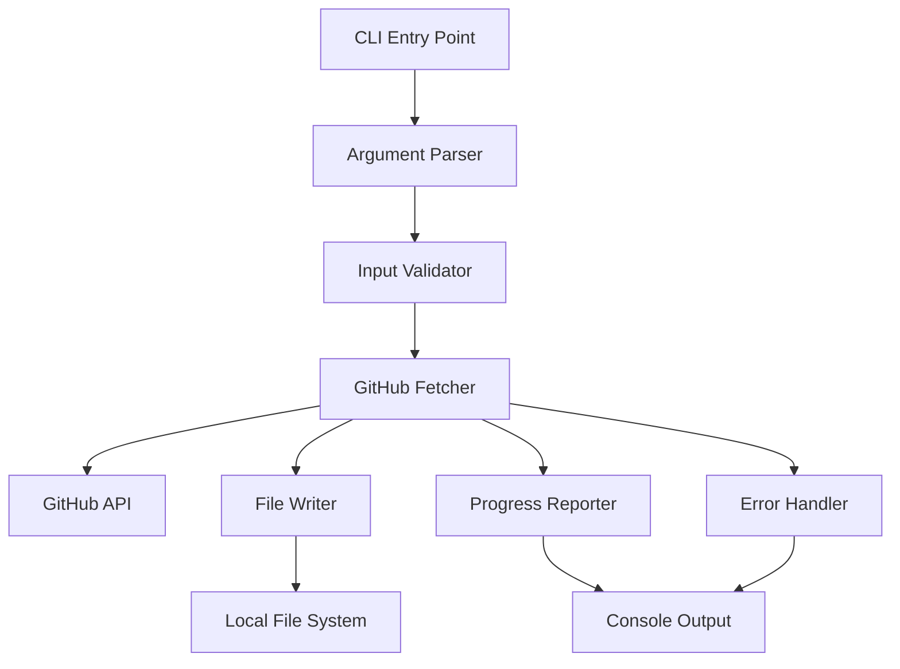
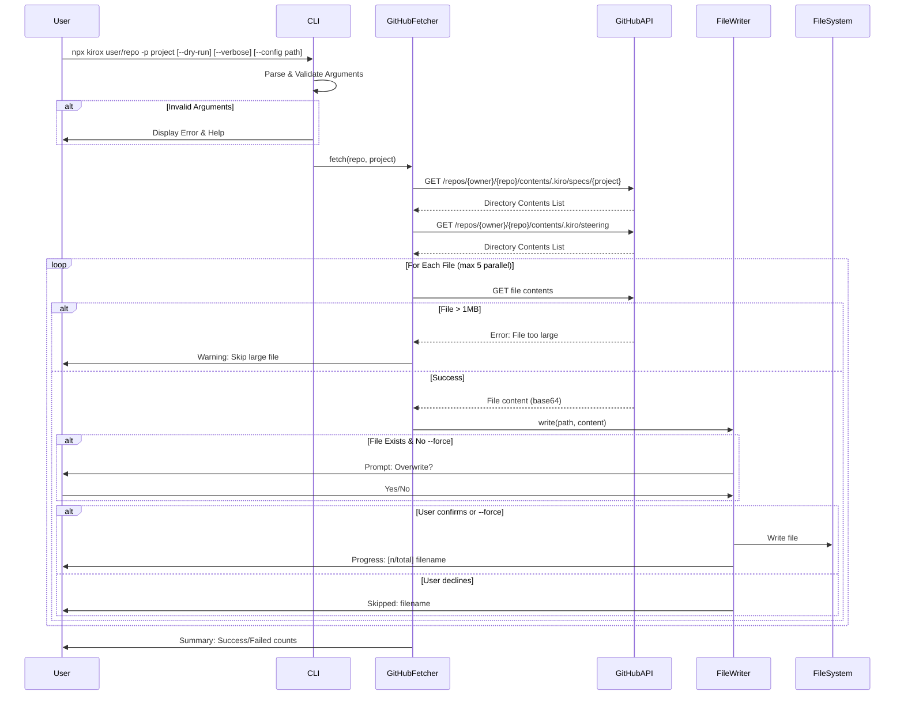
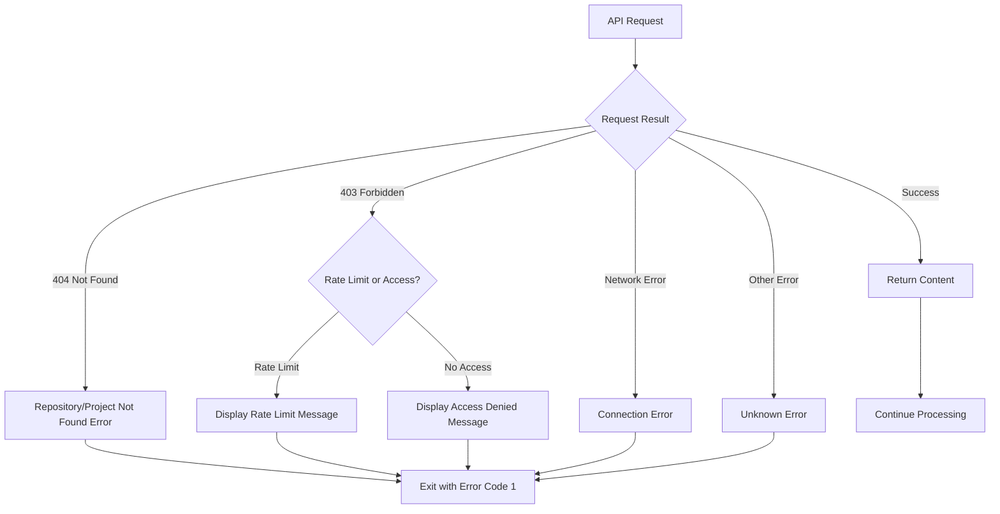
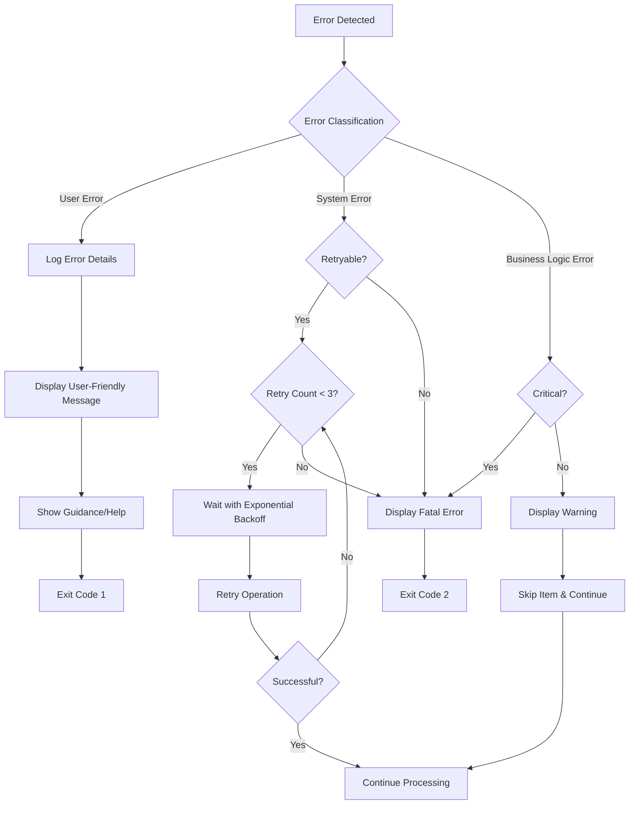

# Kirox CLI 技術設計書

## Overview

**目的**: Kirox CLIは、リモートGitHubリポジトリからKiro仕様書およびステアリングファイルを効率的に取得し、ローカル開発環境に配置するnpxコマンドラインツールを提供する。

**ユーザー**: Node.js開発者がSpec-Driven Developmentの成果物を複数プロジェクト間で共有・再利用する際に使用する。

**影響**: プロジェクト間での仕様書とステアリング情報の手動コピーを自動化し、開発の一貫性とスピードを向上させる。

### Goals

- GitHubリポジトリから特定プロジェクトの`.kiro/specs/<project>`および`.kiro/steering/`ディレクトリ配下のファイルを自動取得
- npxによるインストール不要な即時実行環境の提供
- GitHub API制約（レート制限、ファイルサイズ制限）への適切な対応
- ローカルファイルの意図しない上書きを防ぐ保護機能
- わかりやすい進捗表示とエラーメッセージによる優れたUX
- 開発者体験向上のためのオプション（--dry-run、--verbose、--config等）の提供

### Non-Goals

- Git履歴の取得や管理機能
- ファイルの編集・コミット機能
- GitHub以外のリポジトリプラットフォーム（GitLab、Bitbucket等）のサポート
- 取得したファイルの自動マージやコンフリクト解決

## Architecture

### 既存アーキテクチャの分析

本プロジェクトは新規開発（greenfield）のため、既存システムとの統合は不要。ただし、Kiroエコシステムの`.kiro/specs/`および`.kiro/steering/`ディレクトリ構造規約に準拠する必要がある。

### High-Level Architecture



**アーキテクチャ統合**:
- 既存パターン保持: 該当なし（新規プロジェクト）
- 新コンポーネント理由: CLI → Parser → Validator → Fetcher → FileWriterの単方向フローにより、責任分離と単体テスト容易性を実現
- 技術スタック整合: Node.js/TypeScriptエコシステムの標準ツール・ライブラリを使用
- ステアリング準拠: ステアリングファイル未作成のため、将来的に準拠予定

### Technology Stack and Design Decisions

#### Technology Stack

**Runtime & Language**
- **Node.js 18+**: 選定理由: npxエコシステムとの統合、組み込みfetch API利用可能、LTS版による安定性
- **TypeScript 5.x**: 選定理由: 型安全性による開発時エラー検出、IDE補完によるDX向上、npm公開時の型定義提供

**Core Dependencies**
- **octokit (v5.x)**: 選定理由: GitHub公式SDK、TypeScript完全サポート、レート制限自動処理、認証機構内蔵
- **commander (v12.x)**: 選定理由: CLI引数パース標準ライブラリ、宣言的API、バリデーション機能、ヘルプメッセージ自動生成
- **chalk (v5.x)**: 選定理由: ターミナル出力の色付け、進捗表示の視認性向上、クロスプラットフォーム対応

**Development Tools**
- **Vitest**: 選定理由: 高速な単体テスト実行、TypeScript/ESM完全サポート、Jestとの高い互換性
- **tsx**: 選定理由: TypeScriptの直接実行、開発時の迅速なフィードバック

#### Key Design Decisions

**1. GitHub API クライアント選定: Octokit vs 直接REST呼び出し**

- **Decision**: Octokit SDKを使用
- **Context**: GitHubリポジトリのコンテンツ取得にはGitHub REST APIを利用する必要がある。直接fetch APIで実装するか、公式SDKを使用するか選択が必要。
- **Alternatives**:
  - 直接fetch + GitHub REST API: 軽量、依存関係最小
  - Octokit SDK: 公式サポート、型安全、エラーハンドリング内蔵
  - GraphQL API: 1リクエストで複数データ取得可能
- **Selected Approach**: Octokit SDK (@octokit/rest)を使用し、`repos.getContent()`メソッドでファイル取得を実装
- **Rationale**:
  - GitHub APIのレート制限、リトライ、認証を自動処理
  - TypeScript型定義により開発時の型安全性確保
  - base64デコード等の定型処理を抽象化
- **Trade-offs**:
  - ゲイン: 開発速度向上、バグ削減、GitHub API変更への追従
  - 犠牲: バンドルサイズ増加（約200KB）、Octokit更新への依存

**2. ファイル取得戦略: 並列取得 vs 逐次取得**

- **Decision**: セマフォによる並列度制御（最大5並列）
- **Context**: 100個以上のファイルを取得する際、逐次処理では時間がかかる一方、無制限並列はAPIレート制限に抵触する。
- **Alternatives**:
  - 完全逐次処理: 安全だが遅い
  - 無制限並列処理: 高速だがレート制限リスク
  - セマフォ制御並列処理: バランス型
- **Selected Approach**: Promise.allSettled()とセマフォパターンで最大5ファイル並列取得
- **Rationale**:
  - GitHub APIレート制限（認証済み: 5000req/h）を考慮した安全な並列度
  - 失敗したリクエストを個別に処理可能
  - トータル実行時間を大幅に短縮（100ファイルで約80%削減見込み）
- **Trade-offs**:
  - ゲイン: 実行時間短縮、レート制限回避、部分失敗時の継続実行
  - 犠牲: 実装複雑度増加、デバッグ難易度上昇

**3. CLI引数パース: 自前実装 vs Commanderライブラリ**

- **Decision**: Commanderライブラリを使用
- **Context**: `npx kirox <repo> -p <project> [--force] [--dry-run] [--verbose] [--config path]`形式のCLI引数を解析し、バリデーションとヘルプメッセージ生成が必要。
- **Alternatives**:
  - process.argv直接パース: 依存関係なし、完全制御
  - Commander: 宣言的、バリデーション内蔵
  - Yargs: 高機能、複雑なCLI向け
- **Selected Approach**: Commanderで引数定義、必須パラメータ検証、ヘルプ自動生成
- **Rationale**:
  - npmで最も広く使われているCLIライブラリ（週800万DL以上）
  - 宣言的APIによりコード可読性向上
  - TypeScript型定義により型安全な引数アクセス
- **Trade-offs**:
  - ゲイン: 開発速度、標準化されたヘルプ出力、引数バリデーション自動化
  - 犠牲: 依存関係追加（約30KB）、Commanderの学習コスト

## System Flows

### ファイル取得フロー（シーケンス図）



### エラーハンドリングフロー



## Requirements Traceability

| Requirement | 要件概要 | Components | Interfaces | Flows |
|-------------|---------|------------|------------|-------|
| 1.1 | リポジトリからファイル取得 | GitHubFetcher, FileWriter | `fetchRepositoryFiles()`, `writeFile()` | ファイル取得フロー |
| 1.2 | プロジェクト指定 | ArgumentParser | `parseArguments()` | CLI引数解析 |
| 1.3, 1.4 | ファイル配置 | FileWriter | `writeFile()` | ファイル書き込み |
| 2.1-2.6 | エラーハンドリング | ErrorHandler, GitHubFetcher | `handleError()` | エラーハンドリングフロー |
| 3.1-3.4 | 上書き制御 | FileWriter, PromptService | `promptOverwrite()` | ファイル取得フロー（分岐） |
| 4.1-4.4 | 進捗表示 | ProgressReporter | `reportProgress()`, `reportSummary()` | ファイル取得フロー |
| 5.1-5.4 | npx実行環境 | package.json, CLI Entry | `bin` フィールド設定 | - |
| 6.1-6.3 | GitHub API制約 | GitHubFetcher | `checkRateLimit()`, `validateFileSize()` | エラーハンドリングフロー |

## Components and Interfaces

### CLI Layer

#### CLI Entry Point

**Responsibility & Boundaries**
- **Primary Responsibility**: アプリケーションのエントリポイントとして、CLI引数を受け取り、コマンド実行を統括する
- **Domain Boundary**: ユーザーインターフェース層（CLI）
- **Data Ownership**: コマンドライン引数、実行コンテキスト
- **Transaction Boundary**: 1回のCLI実行が1つのトランザクション

**Dependencies**
- **Inbound**: Node.js runtime (npx)
- **Outbound**: ArgumentParser, GitHubFetcher, ProgressReporter, ErrorHandler
- **External**: Commander.js (CLI framework)

**External Dependencies Investigation**:
- **Commander.js v12.x**:
  - 公式ドキュメント: https://github.com/tj/commander.js
  - API: `program.command()`, `program.option()`, `program.action()`
  - 引数型定義: `program.opts<CLIOptions>()`でTypeScript型安全性確保
  - バリデーション: 必須引数は`.requiredOption()`で宣言
  - エラーハンドリング: `.exitOverride()`でカスタムエラー処理可能

**Contract Definition**

**Service Interface**:
```typescript
interface CLIEntryPoint {
  execute(argv: string[]): Promise<ExecutionResult>;
}

interface ExecutionResult {
  success: boolean;
  filesDownloaded: number;
  filesFailed: number;
  errors: CLIError[];
}

interface CLIError {
  type: ErrorType;
  message: string;
  details?: unknown;
}

type ErrorType = 'VALIDATION' | 'NETWORK' | 'API' | 'FILESYSTEM' | 'UNKNOWN';
```

- **Preconditions**: Node.js 18+がインストールされている
- **Postconditions**: 成功時は指定ファイルがローカルに配置され、ExecutionResultを返す
- **Invariants**: エラー発生時も必ずExecutionResultを返し、プロセスを適切に終了

#### Argument Parser

**Responsibility & Boundaries**
- **Primary Responsibility**: CLI引数を解析し、構造化されたオプションオブジェクトに変換する
- **Domain Boundary**: ユーザーインターフェース層（入力処理）
- **Data Ownership**: パース済みCLIオプション
- **Transaction Boundary**: 引数解析は副作用を持たない純粋な変換処理

**Dependencies**
- **Inbound**: CLI Entry Point
- **Outbound**: Input Validator
- **External**: Commander.js

**Contract Definition**

**Service Interface**:
```typescript
interface ArgumentParser {
  parse(argv: string[]): ParsedArguments;
}

interface ParsedArguments {
  repository: string; // 形式: "owner/repo"
  project: string;
  force: boolean;
  dryRun: boolean; // 実際の書き込みを行わずに動作確認
  verbose: boolean; // 詳細ログ出力
  config?: string; // 設定ファイルパス
}
```

- **Preconditions**: argvは有効な文字列配列
- **Postconditions**: ParsedArgumentsオブジェクトを返す、不正な引数の場合はエラーをスロー
- **Invariants**: 同じ入力に対して常に同じ出力（冪等性）

#### Input Validator

**Responsibility & Boundaries**
- **Primary Responsibility**: パース済み引数の妥当性を検証し、ビジネスルールに準拠するかチェックする
- **Domain Boundary**: バリデーション層
- **Data Ownership**: 検証結果（成功/失敗とエラーメッセージ）
- **Transaction Boundary**: 検証は副作用を持たない純粋な判定処理

**Dependencies**
- **Inbound**: Argument Parser
- **Outbound**: なし（純粋関数）
- **External**: なし

**Contract Definition**

**Service Interface**:
```typescript
interface InputValidator {
  validate(args: ParsedArguments): ValidationResult;
}

interface ValidationResult {
  valid: boolean;
  errors: ValidationError[];
}

interface ValidationError {
  field: string;
  message: string;
}
```

- **Preconditions**: ParsedArgumentsが渡される
- **Postconditions**: ValidationResultを返す、副作用なし
- **Invariants**: 検証ロジックは入力を変更しない

**Validation Rules**:
- repository: `owner/repo`形式の正規表現マッチ
- project: 空文字列禁止、特殊文字（`/`, `\`, `..`）禁止
- force: boolean型のみ許可

### GitHub Integration Layer

#### GitHub Fetcher

**Responsibility & Boundaries**
- **Primary Responsibility**: GitHub APIを使用してリポジトリのファイルコンテンツを取得し、base64デコードを行う
- **Domain Boundary**: 外部サービス統合層
- **Data Ownership**: 取得したファイルメタデータとコンテンツ
- **Transaction Boundary**: ファイル取得は個別にリトライ可能な独立した操作

**Dependencies**
- **Inbound**: CLI Entry Point
- **Outbound**: FileWriter, ProgressReporter, ErrorHandler
- **External**: Octokit (@octokit/rest), GitHub REST API

**External Dependencies Investigation**:
- **Octokit v5.x**:
  - 公式ドキュメント: https://github.com/octokit/octokit.js
  - インストール: `npm install octokit`
  - 認証: `new Octokit({ auth: process.env.GITHUB_TOKEN })`で環境変数からトークン取得
  - API: `octokit.rest.repos.getContent({ owner, repo, path })`
  - レスポンス型: `{ type: 'file' | 'dir', content?: string, encoding?: 'base64', ... }`
  - レート制限: 認証済み5000req/h、未認証60req/h
  - エラー: `RequestError`クラスでステータスコード・メッセージを提供
  - リトライ: Octokit内蔵のリトライ機構（デフォルト3回）
  - base64デコード: Node.js組み込み`Buffer.from(content, 'base64').toString('utf-8')`

**Contract Definition**

**Service Interface**:
```typescript
interface GitHubFetcher {
  fetchRepositoryFiles(
    repository: string,
    project: string
  ): Promise<FetchResult>;

  checkRateLimit(): Promise<RateLimitInfo>;
}

interface FetchResult {
  files: FileContent[];
  errors: FetchError[];
}

interface FileContent {
  path: string;
  content: string; // デコード済みテキスト
  size: number;
}

interface FetchError {
  path: string;
  error: Error;
  retryable: boolean;
}

interface RateLimitInfo {
  remaining: number;
  limit: number;
  resetAt: Date;
}
```

- **Preconditions**: 有効なリポジトリ形式（owner/repo）とプロジェクト名
- **Postconditions**: 取得成功したファイルとエラー情報を含むFetchResultを返す
- **Invariants**: APIエラー時も部分的な結果を返す（fail-fast しない）

**State Management**:
- **State Model**: Idle → Fetching → Completed/Failed
- **Persistence**: ステートレス（メモリ内のみ）
- **Concurrency**: セマフォパターンで最大5並列リクエスト制御

### File System Layer

#### File Writer

**Responsibility & Boundaries**
- **Primary Responsibility**: 取得したファイルをローカルファイルシステムに書き込み、上書き確認を管理する
- **Domain Boundary**: ファイルシステム統合層
- **Data Ownership**: ローカルファイルシステム上の`.kiro/`ディレクトリ
- **Transaction Boundary**: 個別ファイル書き込みは原子的操作

**Dependencies**
- **Inbound**: GitHub Fetcher
- **Outbound**: Prompt Service, Progress Reporter
- **External**: Node.js fs/promises, path

**Contract Definition**

**Service Interface**:
```typescript
interface FileWriter {
  writeFile(
    filePath: string,
    content: string,
    options: WriteOptions
  ): Promise<WriteResult>;

  ensureDirectory(dirPath: string): Promise<void>;
}

interface WriteOptions {
  force: boolean;
  prompt: boolean;
  dryRun: boolean; // 実際の書き込みを行わずに動作確認
  verbose: boolean; // 詳細ログ出力
}

interface WriteResult {
  written: boolean;
  skipped: boolean;
  reason?: string;
}
```

- **Preconditions**: 有効なファイルパスとコンテンツ
- **Postconditions**: ファイルが書き込まれるか、スキップされたことを示すWriteResultを返す
- **Invariants**: ディレクトリが存在しない場合は自動作成、ファイル書き込みは原子的

#### Prompt Service

**Responsibility & Boundaries**
- **Primary Responsibility**: ユーザーに対話的な確認プロンプトを表示し、入力を受け取る
- **Domain Boundary**: ユーザーインターフェース層（対話処理）
- **Data Ownership**: ユーザー入力結果
- **Transaction Boundary**: 1つのプロンプト表示が1つの操作単位

**Dependencies**
- **Inbound**: File Writer
- **Outbound**: なし
- **External**: readline (Node.js built-in)

**Contract Definition**

**Service Interface**:
```typescript
interface PromptService {
  confirm(message: string): Promise<boolean>;
}
```

- **Preconditions**: 標準入出力が利用可能
- **Postconditions**: ユーザーの選択結果をbooleanで返す
- **Invariants**: プロンプトはブロッキング操作、タイムアウトなし

### Reporting Layer

#### Progress Reporter

**Responsibility & Boundaries**
- **Primary Responsibility**: ファイル取得の進捗状況をリアルタイムでコンソールに表示する
- **Domain Boundary**: ユーザーインターフェース層（出力）
- **Data Ownership**: 進捗状態（現在/合計ファイル数）
- **Transaction Boundary**: 各進捗報告は独立したイベント

**Dependencies**
- **Inbound**: GitHub Fetcher, File Writer
- **Outbound**: なし
- **External**: chalk (ターミナル色付け)

**External Dependencies Investigation**:
- **chalk v5.x**:
  - 公式ドキュメント: https://github.com/chalk/chalk
  - インストール: `npm install chalk`
  - インポート: `import chalk from 'chalk'` (ESM only)
  - API: `chalk.green('Success')`, `chalk.red.bold('Error')`
  - 色サポート検出: 自動検出、環境変数`FORCE_COLOR`で強制可能
  - パフォーマンス: 色付けはI/Oボトルネックに比べて無視できるレベル

**Contract Definition**

**Service Interface**:
```typescript
interface ProgressReporter {
  reportStart(repository: string, project: string): void;
  reportProgress(current: number, total: number, fileName: string): void;
  reportSummary(success: number, failed: number): void;
  reportError(error: string): void;
  reportVerbose(message: string): void; // --verbose時の詳細ログ
  reportDryRun(filePath: string, content: string): void; // --dry-run時のファイル情報表示
}
```

- **Preconditions**: なし（出力のみ）
- **Postconditions**: コンソールにフォーマット済みメッセージを出力
- **Invariants**: 出力順序は呼び出し順序に従う

#### Error Handler

**Responsibility & Boundaries**
- **Primary Responsibility**: エラーを分類し、ユーザーフレンドリーなエラーメッセージに変換する
- **Domain Boundary**: エラーハンドリング層
- **Data Ownership**: エラー分類とメッセージテンプレート
- **Transaction Boundary**: エラーハンドリングは副作用を持たない変換処理

**Dependencies**
- **Inbound**: すべてのコンポーネント
- **Outbound**: Progress Reporter
- **External**: なし

**Contract Definition**

**Service Interface**:
```typescript
interface ErrorHandler {
  handle(error: Error): ErrorResult;
  formatMessage(errorType: ErrorType, details: unknown): string;
}

interface ErrorResult {
  type: ErrorType;
  message: string;
  exitCode: number;
  recoverable: boolean;
}

type ErrorType =
  | 'REPOSITORY_NOT_FOUND'
  | 'PROJECT_NOT_FOUND'
  | 'NETWORK_ERROR'
  | 'RATE_LIMIT'
  | 'ACCESS_DENIED'
  | 'FILE_TOO_LARGE'
  | 'TOO_MANY_FILES'
  | 'FILESYSTEM_ERROR'
  | 'VALIDATION_ERROR';
```

- **Preconditions**: Errorオブジェクトまたはエラー情報
- **Postconditions**: 構造化されたErrorResultを返す
- **Invariants**: 同じエラータイプに対して一貫したメッセージフォーマット

## Data Models

### Domain Model

#### Core Concepts

**Repository Reference (Value Object)**
```typescript
interface RepositoryReference {
  readonly owner: string;
  readonly repo: string;

  toString(): string; // "owner/repo" 形式
}
```

**Project Specification (Value Object)**
```typescript
interface ProjectSpecification {
  readonly name: string;
  readonly specPath: string; // ".kiro/specs/{name}"
}
```

**File Metadata (Entity)**
```typescript
interface FileMetadata {
  readonly path: string; // リポジトリ内の相対パス
  readonly content: string; // デコード済みコンテンツ
  readonly size: number;
  readonly sha: string; // GitHubのコミットSHA
  readonly downloadUrl: string;
}
```

**Business Rules & Invariants**:
- RepositoryReferenceは必ず`owner/repo`形式に変換可能でなければならない
- ProjectSpecificationのnameは空文字列不可、パストラバーサル文字（`..`, `/`, `\`）を含まない
- FileMetadataのsizeは1MB以下（GitHub API制約）
- ファイル総数は100個以下（要件で定義された制限）

### Logical Data Model

**CLI Configuration**
```typescript
interface CLIConfiguration {
  repository: RepositoryReference;
  project: ProjectSpecification;
  options: FetchOptions;
}

interface FetchOptions {
  force: boolean; // 上書き確認スキップ
  concurrency: number; // 並列取得数（デフォルト5）
}
```

**Fetch Operation State**
```typescript
interface FetchOperationState {
  totalFiles: number;
  fetchedFiles: number;
  failedFiles: number;
  errors: OperationError[];
}

interface OperationError {
  filePath: string;
  errorType: ErrorType;
  message: string;
  timestamp: Date;
}
```

### Data Contracts & Integration

**API Data Transfer**

**GitHub API Response Schema** (Octokit型定義):
```typescript
// GET /repos/{owner}/{repo}/contents/{path} レスポンス
type GitHubContent = GitHubFile | GitHubDirectory[];

interface GitHubFile {
  type: 'file';
  name: string;
  path: string;
  size: number;
  content: string; // base64エンコード
  encoding: 'base64';
  sha: string;
  download_url: string;
}

interface GitHubDirectory {
  type: 'dir';
  name: string;
  path: string;
  sha: string;
}
```

**Internal File Transfer Schema**:
```typescript
interface FetchedFile {
  relativePath: string; // ".kiro/specs/project/requirements.md"
  localPath: string; // "/Users/user/project/.kiro/specs/project/requirements.md"
  content: string; // UTF-8テキスト
  size: number;
}
```

**Validation Rules**:
- `content`は必ずUTF-8デコード可能な文字列
- `size`は1MB（1,048,576 bytes）以下
- `relativePath`は`.kiro/specs/`または`.kiro/steering/`で始まる

**Serialization Format**: JSON（GitHub API）、プレーンテキスト（ローカルファイル）

## Error Handling

### Error Strategy

エラーを発生源と回復可能性で分類し、各カテゴリに応じた処理パターンを適用する。

**Error Categories and Responses**

#### User Errors (4xx相当)

| エラータイプ | トリガー | 対応 | 回復可能性 |
|------------|---------|------|-----------|
| VALIDATION_ERROR | 不正な引数形式 | フィールドレベルのエラーメッセージとヘルプ表示 | Yes（引数修正後再実行） |
| REPOSITORY_NOT_FOUND | 存在しないリポジトリ指定 | 「リポジトリが見つかりません」メッセージ、リポジトリ名確認を促す | Yes（正しいリポジトリ指定） |
| PROJECT_NOT_FOUND | 存在しないプロジェクト指定 | 「プロジェクトが見つかりません」メッセージ、利用可能プロジェクト一覧の取得方法を提示 | Yes（正しいプロジェクト指定） |
| ACCESS_DENIED | プライベートリポジトリへのアクセス権限なし | 「アクセス権限がありません」メッセージ、GitHub Personal Access Token設定方法を提示 | Yes（認証情報設定） |

#### System Errors (5xx相当)

| エラータイプ | トリガー | 対応 | 回復可能性 |
|------------|---------|------|-----------|
| NETWORK_ERROR | ネットワーク接続失敗、DNS解決失敗 | 「接続エラーが発生しました」メッセージ、自動リトライ（最大3回） | Partial（リトライ成功可能性） |
| RATE_LIMIT | GitHub APIレート制限到達 | 「API制限に達しました。{resetTime}まで待ってください」メッセージ、リセット時刻表示 | Yes（時間経過後） |
| FILESYSTEM_ERROR | ディスク容量不足、書き込み権限なし | 「ファイル書き込みエラー」メッセージ、具体的な原因（権限/容量）を表示 | Yes（権限付与/容量確保） |

#### Business Logic Errors (422相当)

| エラータイプ | トリガー | 対応 | 回復可能性 |
|------------|---------|------|-----------|
| FILE_TOO_LARGE | 1MBを超えるファイル検出 | 警告メッセージ表示、該当ファイルをスキップして処理継続 | Partial（大きいファイルは取得不可） |
| TOO_MANY_FILES | 100個を超えるファイル検出 | 「ファイル数が多すぎます」メッセージ、処理中断 | No（要件上の制限） |

### Process Flow Visualization



### Monitoring

**Error Tracking**:
- すべてのエラーを構造化ログとして標準エラー出力に記録
- ログフォーマット: `[ERROR] {timestamp} {errorType}: {message} {details}`

**Logging Strategy**:
- INFO: 処理開始、完了、進捗マイルストーン
- WARN: スキップしたファイル、リトライ実行
- ERROR: 致命的エラー、回復不能な状態

**Health Monitoring**:
- GitHub APIレート制限の残数を定期的にチェック（残り10%未満で警告）
- ファイル取得成功率をトラッキング（50%未満で警告）

## Testing Strategy

### Unit Tests

- **Argument Parser**: 各種引数パターンのパース成功/失敗ケース（10+ test cases）
- **Input Validator**: バリデーションルールごとの境界値テスト（リポジトリ形式、プロジェクト名特殊文字）
- **Error Handler**: 各ErrorTypeに対する適切なメッセージフォーマット生成（12 test cases）
- **File Writer**: ファイル存在時の上書き確認フロー、--forceオプション動作（8 test cases）
- **GitHub Fetcher**: base64デコード、ファイルサイズ制限チェック、並列度制御（モックAPI使用、15+ test cases）

### Integration Tests

- **CLI → GitHub API → File System**: エンドツーエンドでの正常系フロー（実際のテストリポジトリ使用）
- **Error Recovery Flow**: ネットワークエラー時の自動リトライとフォールバック（モックサーバー使用）
- **Rate Limit Handling**: レート制限到達時の適切なエラーメッセージとリセット時刻表示
- **Concurrent File Fetching**: 並列取得時のセマフォ制御と進捗表示の正確性
- **Overwrite Prompt Flow**: ファイル上書き確認プロンプトの表示とユーザー入力処理（モック標準入力）

### E2E Tests

- **正常系シナリオ**: `npx kirox user/repo -p project` → ファイル取得 → ローカル配置確認
- **エラーシナリオ**: 存在しないリポジトリ/プロジェクト指定 → 適切なエラーメッセージ表示
- **上書きシナリオ**: 既存ファイルあり → プロンプト表示 → Yes/No選択 → 結果確認
- **--forceオプション**: 既存ファイルあり + --force → プロンプトなしで上書き
- **--dry-runオプション**: 実際の書き込みなしで動作確認 → 取得予定ファイル一覧表示
- **--verboseオプション**: 詳細ログ出力 → API呼び出し詳細、ファイルサイズ等の情報表示
- **--configオプション**: 設定ファイル指定 → カスタム設定での実行確認
- **部分失敗シナリオ**: 一部ファイル取得失敗 → サマリーに成功/失敗数表示

### Performance Tests

- **大量ファイル取得**: 50ファイル取得時の実行時間（目標: 30秒以内、並列度5）
- **レート制限回避**: 100ファイル取得時にレート制限に抵触しないこと（セマフォ制御検証）
- **メモリ使用量**: 100ファイル取得時のメモリ使用量（目標: 100MB以内）
- **同時実行**: 複数プロジェクト同時取得時のリソース競合なし

## Configuration Management

### 設定ファイルサポート

**設定ファイル形式**: `.kiroxrc.json`（JSON形式）

**設定項目**:
```typescript
interface KiroxConfig {
  githubToken?: string; // GitHub Personal Access Token
  defaultConcurrency?: number; // デフォルト並列度（デフォルト: 5）
  outputDirectory?: string; // 出力ディレクトリ（デフォルト: カレントディレクトリ）
  verbose?: boolean; // デフォルトで詳細ログ出力
  force?: boolean; // デフォルトで上書き確認をスキップ
}
```

**設定ファイルの検索順序**:
1. `--config`オプションで指定されたファイル
2. カレントディレクトリの`.kiroxrc.json`
3. ホームディレクトリの`.kiroxrc.json`
4. 環境変数（`GITHUB_TOKEN`等）

**設定の優先順位**:
1. CLIオプション（最高優先度）
2. 設定ファイル
3. 環境変数
4. デフォルト値（最低優先度）

## Security Considerations

### 認証とアクセス制御

**GitHub Personal Access Token**:
- 環境変数`GITHUB_TOKEN`から取得、コード内にハードコーディングしない
- トークンスコープ: `public_repo`（パブリックリポジトリ）または`repo`（プライベートリポジトリ）
- トークン未設定時はパブリックリポジトリのみアクセス可能（APIレート制限60req/h）

**Threat Model**:
- パストラバーサル攻撃: プロジェクト名に`../`を含めて`.kiro/`外のファイルを読み書きするリスク
  - 対策: プロジェクト名のバリデーションで`..`, `/`, `\`を禁止
- コマンドインジェクション: リポジトリ名に特殊文字を含めてシェルコマンドを実行するリスク
  - 対策: コマンド実行を使用せず、Node.js APIのみで実装
- 秘密情報漏洩: 誤って`.env`ファイルや認証情報をリポジトリにコミットするリスク
  - 対策: Kirox CLIは`.kiro/`ディレクトリのみを対象とし、`.env`等は対象外

### データ保護

**ローカルファイルの保護**:
- ファイル書き込み権限: デフォルトで`0644`/（所有者のみ書き込み可能）
- ディレクトリ作成権限: デフォルトで`0755`（所有者のみ書き込み可能）

**通信の保護**:
- GitHub APIとの通信はHTTPS（TLS 1.2以上）を使用
- 証明書検証を無効化しない
