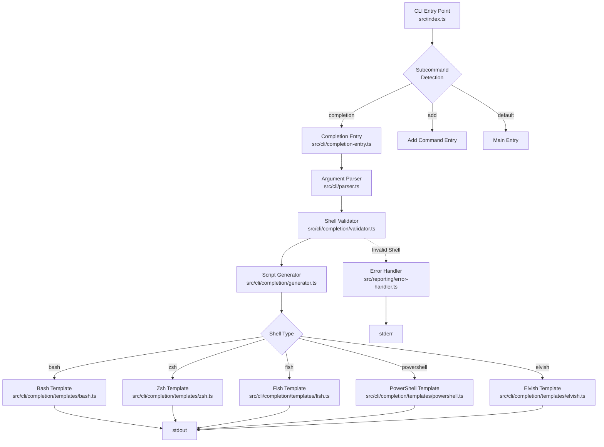
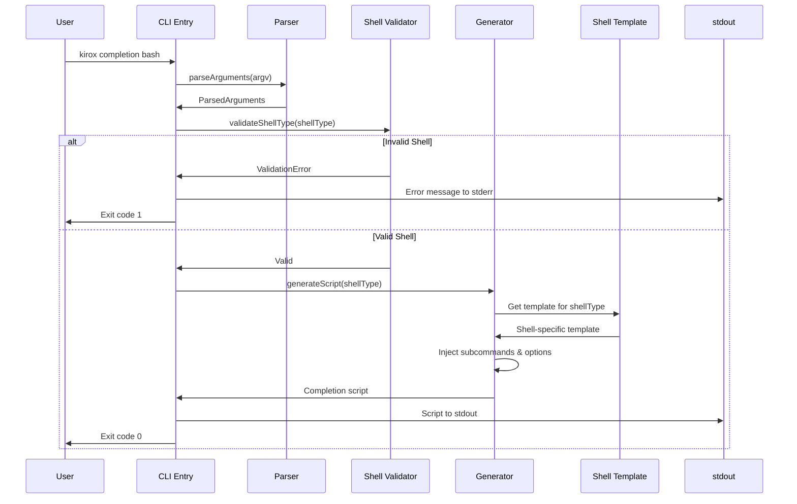

# 技術設計書

## Overview

Kirox CLIにシェル補完機能を追加する。`kirox completion <shell>`コマンドで、bash、zsh、fish、powershell、elvishの各シェル用の補完スクリプトを標準出力に生成する。これにより、ユーザーは各シェル環境でコマンド補完を簡単にセットアップでき、CLI操作の効率が大幅に向上する。

### Goals

- 5つの主要シェル（bash、zsh、fish、powershell、elvish）に対応した補完スクリプトの生成
- 既存のKirox CLIアーキテクチャとの一貫性を保つ実装
- 標準出力への出力によるリダイレクト可能な設計
- 100ms以内の高速なスクリプト生成

### Non-Goals

- シェル補完スクリプトの自動インストール機能（ユーザーが手動でシェル設定ファイルにインストール）
- 補完候補の動的取得（実行時のGitHub API呼び出しなど）
- 補完スクリプトの自動更新機能

## Architecture

### 既存アーキテクチャの分析

Kirox CLIは4層アーキテクチャを採用しており、completion機能も同様のパターンに従う：

- **CLI Layer** (`src/cli/`): Commander.jsを使用したサブコマンド構造
- **Reporting Layer** (`src/reporting/`): エラーハンドリングとログ出力
- 既存の`add`サブコマンドと同様の実装パターンを採用
- エントリポイント（`src/index.ts`）でのサブコマンドルーティング

### High-Level Architecture



### 技術アラインメント

**既存パターンの保持:**
- Commander.jsによるサブコマンド定義パターン（`parseAddCommand`と同様）
- エラーハンドリングとレポーティング層の活用
- 4層アーキテクチャの維持（CLI層のみを拡張）

**新規コンポーネントの根拠:**
- 補完スクリプト生成ロジックは独立したドメインであり、既存レイヤーから分離
- シェル固有のテンプレートを独立したモジュールとして管理

**技術スタック整合性:**
- TypeScript 5.x（厳格な型チェック）
- Commander.js（既存パターン）
- Node.js 18+（標準APIのみ使用、外部依存なし）

**ステアリング準拠:**
- `structure.md`: CLI層への配置、ケバブケースのファイル命名
- `tech.md`: ESM形式、async/await優先
- `product.md`: npx即時実行、優れた開発者体験

### 技術設計上の重要な決定事項

#### 決定1: ランタイム生成 vs. 事前生成済みスクリプト配布

**Context:** シェル補完スクリプトをリリース時に生成して配布するか、ランタイムで動的に生成するか

**Alternatives:**
- **事前生成**: リリースアーカイブに補完スクリプトファイルを同梱
- **ランタイム生成**: `kirox completion <shell>`コマンドで実行時に生成
- **ハイブリッド**: 両方をサポート

**Selected Approach:** ランタイム生成（`kirox completion <shell>`）

**Rationale:**
- npmパッケージサイズの最小化（5つのシェルスクリプトファイルを含めない）
- サブコマンドやオプションの追加時に自動的に最新の補完候補を反映
- just、Rye、Cargoなどの主要CLIツールと同様のアプローチ
- ユーザーがパッケージインストール不要（npxで即座に実行可能）

**Trade-offs:**
- **獲得**: 保守性向上、パッケージサイズ削減、常に最新の補完候補
- **犠牲**: 初回セットアップ時に1回のコマンド実行が必要（`kirox completion bash > ~/.kirox-completion.bash`）

#### 決定2: テンプレート管理アプローチ（静的文字列 vs. 動的生成）

**Context:** 各シェルの補完スクリプトをどのように管理・生成するか

**Alternatives:**
- **静的テンプレート文字列**: TypeScript内にシェルスクリプトを文字列で埋め込み
- **動的AST生成**: プログラマティックに補完スクリプトを構築
- **外部テンプレートファイル**: `.sh`, `.fish`などのファイルを読み込み

**Selected Approach:** 静的テンプレート文字列（TypeScript内に埋め込み）

**Rationale:**
- 各シェルのスクリプトは構文が大きく異なり、統一的なAST生成は複雑
- 外部ファイル管理によるビルドステップの複雑化を回避
- Commander.jsのメタデータから補完候補を動的に抽出し、テンプレートに注入
- テンプレートとロジックを同一ファイル内で管理することで変更追跡が容易

**Trade-offs:**
- **獲得**: シンプルな実装、TypeScriptの型安全性、ビルドステップ不要
- **犠牲**: 長い文字列リテラルの可読性（テンプレートリテラルで緩和）

#### 決定3: サブコマンド・オプション候補の抽出方法

**Context:** 補完スクリプトに含めるサブコマンドとオプションの候補をどのように取得するか

**Alternatives:**
- **ハードコード**: 補完候補を手動で列挙
- **Commander.jsメタデータ抽出**: `program.commands`と`program.options()`から動的に抽出
- **ヘルプテキストパース**: `--help`出力をパースして候補を抽出

**Selected Approach:** ハードコード（初期実装）+ 将来的にCommander.jsメタデータ抽出へ移行可能な設計

**Rationale:**
- Kirox CLIは現在2つのサブコマンド（add、completion）とオプションセットが安定
- ハードコードによる実装の単純化（Commander.jsのメタデータ構造に依存しない）
- サブコマンド追加時に補完スクリプトテンプレートを更新する明確なフロー
- 将来的にメタデータ駆動型への移行が可能な抽象化を維持

**Trade-offs:**
- **獲得**: 実装の単純性、テスト容易性、Commander.jsのバージョン変更への耐性
- **犠牲**: サブコマンド追加時の手動更新が必要（ただし更新箇所は明確）

## System Flows

### Completion Script Generation Flow



## Requirements Traceability

| 要件 | 要件概要 | コンポーネント | インターフェース | フロー |
|------|---------|--------------|----------------|--------|
| 1.1-1.6 | 各シェル用補完スクリプト生成 | Generator, Templates | `generateScript(shell)` | Completion Script Generation Flow |
| 2.1-2.4 | 入力バリデーションとエラーハンドリング | ShellValidator, ErrorHandler | `validateShellType(shell)` | Completion Script Generation Flow |
| 3.1-3.4 | 補完スクリプトの正確性 | Shell Templates | `BashTemplate`, `ZshTemplate`, etc. | - |
| 4.1-4.3 | ヘルプメッセージ | Parser (Commander.js) | `.addHelpText()` | - |
| 5.1-5.4 | 既存CLI構造との統合 | CompletionEntry, Parser | `parseCompletionCommand()` | Completion Script Generation Flow |
| 6.1-6.4 | パフォーマンスと出力形式 | Generator, Templates | `console.log()` | Completion Script Generation Flow |

## Components and Interfaces

### CLI層

#### CompletionEntry

**Responsibility & Boundaries**
- **Primary Responsibility**: `completion`サブコマンドの実行フローを制御する
- **Domain Boundary**: CLI層のサブコマンドハンドラー
- **Data Ownership**: 補完コマンドの実行結果（exit code）
- **Transaction Boundary**: 単一コマンド実行のスコープ

**Dependencies**
- **Inbound**: `src/index.ts`からのサブコマンドルーティング
- **Outbound**: `Parser`, `ShellValidator`, `Generator`, `ErrorHandler`
- **External**: なし

**Service Interface**

```typescript
interface CompletionService {
  /**
   * Execute completion subcommand
   *
   * @param argv - Command-line arguments
   * @returns Execution result with exit code
   *
   * Preconditions: argv includes 'completion' subcommand
   * Postconditions: Completion script written to stdout or error to stderr
   * Invariants: Exit code reflects success (0) or failure (1)
   */
  executeCompletionCommand(argv: string[]): Promise<ExecutionResult>;
}
```

#### Parser (拡張)

**Responsibility & Boundaries**
- **Primary Responsibility**: `completion`サブコマンドの引数をパースする
- **Domain Boundary**: CLI層の引数解析
- **Data Ownership**: パース済み引数（`ParsedArguments`）
- **Transaction Boundary**: 引数パースのスコープ

**Dependencies**
- **Inbound**: `CompletionEntry`からの呼び出し
- **Outbound**: Commander.js
- **External**: Commander.js (v12.x)

**Service Interface**

```typescript
interface ParserService {
  /**
   * Parse completion subcommand arguments
   *
   * @param argv - Command-line arguments
   * @returns Parsed arguments including shell type
   * @throws Error if required shell argument is missing
   *
   * Preconditions: argv includes 'completion' subcommand
   * Postconditions: Returns ParsedArguments with validated structure
   */
  parseCompletionCommand(argv: string[]): ParsedArguments;
}

// Extended type
type ParsedArguments = {
  subcommand: 'completion';
  shellType: string; // e.g., 'bash', 'zsh', 'fish', 'powershell', 'elvish'
  // ... existing fields
};
```

### Completion層（新規）

#### ShellValidator

**Responsibility & Boundaries**
- **Primary Responsibility**: シェル名のバリデーション（サポート対象チェック、大文字小文字正規化）
- **Domain Boundary**: 補完機能のバリデーション層
- **Data Ownership**: サポートされているシェルタイプのリスト
- **Transaction Boundary**: バリデーション単一実行

**Dependencies**
- **Inbound**: `CompletionEntry`からの呼び出し
- **Outbound**: なし
- **External**: なし

**Service Interface**

```typescript
type SupportedShell = 'bash' | 'zsh' | 'fish' | 'powershell' | 'elvish';

interface ValidationResult {
  valid: boolean;
  normalizedShell?: SupportedShell;
  error?: string;
}

interface ShellValidatorService {
  /**
   * Validate and normalize shell type
   *
   * @param shellType - Shell name from user input
   * @returns Validation result with normalized shell name
   *
   * Preconditions: shellType is non-empty string
   * Postconditions: Returns valid=true if supported, with normalized shell name
   * Invariants: Normalized shell is always lowercase if valid
   */
  validateShellType(shellType: string): ValidationResult;

  /**
   * Get list of supported shells
   *
   * @returns Array of supported shell names
   */
  getSupportedShells(): SupportedShell[];
}
```

#### Generator

**Responsibility & Boundaries**
- **Primary Responsibility**: シェル補完スクリプトの生成（テンプレート選択、補完候補注入）
- **Domain Boundary**: 補完スクリプト生成のコア機能
- **Data Ownership**: 補完候補（サブコマンド、オプション）のメタデータ
- **Transaction Boundary**: 単一スクリプト生成

**Dependencies**
- **Inbound**: `CompletionEntry`からの呼び出し
- **Outbound**: 各シェルテンプレート（`BashTemplate`, `ZshTemplate`, etc.）
- **External**: なし

**Service Interface**

```typescript
interface GeneratorService {
  /**
   * Generate shell completion script
   *
   * @param shell - Normalized shell type
   * @returns Completion script as string
   *
   * Preconditions: shell is a valid SupportedShell
   * Postconditions: Returns executable shell script for specified shell
   * Invariants: Generated script contains all current subcommands and options
   */
  generateScript(shell: SupportedShell): string;
}

interface CompletionMetadata {
  programName: string;
  subcommands: Array<{
    name: string;
    description: string;
    options: Array<{ flag: string; description: string }>;
  }>;
  globalOptions: Array<{ flag: string; description: string }>;
}
```

#### Shell Templates

**Responsibility & Boundaries**
- **Primary Responsibility**: 各シェル固有の補完スクリプトテンプレートを提供
- **Domain Boundary**: シェル別のスクリプト生成
- **Data Ownership**: シェル固有のスクリプト構文知識
- **Transaction Boundary**: テンプレート文字列の生成

**Dependencies**
- **Inbound**: `Generator`からの呼び出し
- **Outbound**: なし
- **External**: なし

**Service Interface**

```typescript
interface ShellTemplate {
  /**
   * Generate completion script for specific shell
   *
   * @param metadata - Completion metadata (subcommands, options)
   * @returns Shell-specific completion script
   *
   * Preconditions: metadata contains all required fields
   * Postconditions: Returns syntactically valid shell script
   * Invariants: Script uses shell-native completion syntax
   */
  generate(metadata: CompletionMetadata): string;
}

// Implementations for each shell
class BashTemplate implements ShellTemplate { ... }
class ZshTemplate implements ShellTemplate { ... }
class FishTemplate implements ShellTemplate { ... }
class PowerShellTemplate implements ShellTemplate { ... }
class ElvishTemplate implements ShellTemplate { ... }
```

## Data Models

### Domain Model

#### Core Concepts

**Entities:**
- **CompletionRequest**: ユーザーからの補完スクリプト生成リクエスト
  - 属性: `shellType` (string), `requestedAt` (timestamp)
  - 識別子: リクエストは一時的でIDなし

- **CompletionScript**: 生成された補完スクリプト
  - 属性: `shell` (SupportedShell), `content` (string), `generatedAt` (timestamp)
  - 識別子: シェルタイプがナチュラルキー

**Value Objects:**
- **SupportedShell**: 5つのシェルタイプを表すEnum
  - 不変: 'bash' | 'zsh' | 'fish' | 'powershell' | 'elvish'
  - バリデーション: 大文字小文字を区別しない入力から正規化

- **CompletionMetadata**: 補完候補のメタデータ
  - 不変: プログラム名、サブコマンドリスト、オプションリスト
  - 構造: ネストされたオブジェクト（サブコマンド → オプション）

**Business Rules & Invariants:**
- シェルタイプは必ずサポート対象の5つのいずれかでなければならない
- 補完スクリプトは標準出力にのみ出力される（副作用なし）
- 生成されたスクリプトは対応するシェルで構文エラーなく実行可能でなければならない

### Logical Data Model

補完機能はステートレスであり、永続化は不要。以下のインメモリデータ構造を使用：

**Entity: CompletionMetadata**

| 属性 | 型 | 説明 |
|------|-----|------|
| programName | string | CLIプログラム名（'kirox'） |
| subcommands | Subcommand[] | サブコマンドのリスト |
| globalOptions | Option[] | グローバルオプションのリスト |

**Entity: Subcommand**

| 属性 | 型 | 説明 |
|------|-----|------|
| name | string | サブコマンド名（例: 'add', 'completion'） |
| description | string | サブコマンドの説明 |
| options | Option[] | サブコマンド固有のオプション |

**Entity: Option**

| 属性 | 型 | 説明 |
|------|-----|------|
| flag | string | オプションフラグ（例: '-p, --project'） |
| description | string | オプションの説明 |

**Referential Integrity:**
- SubcommandはOptionを0個以上持つ（1:N）
- CompletionMetadataはSubcommandを1個以上、Optionを0個以上持つ

## Error Handling

### Error Strategy

補完機能は以下のエラー戦略を採用：

1. **入力バリデーションエラー**: 早期失敗（fail-fast）で即座にエラーメッセージを返す
2. **システムエラー**: 標準エラー出力への出力と適切なexit code
3. **graceful degradation**: 不要（補完スクリプト生成は単一トランザクション）

### Error Categories and Responses

#### User Errors (CLI入力エラー)

| エラータイプ | トリガー条件 | 応答 | Exit Code |
|-------------|-------------|------|-----------|
| シェル名未指定 | `kirox completion`のみ | サポートされているシェルリストと使用例を表示 | 1 |
| 未サポートのシェル | `kirox completion unknown` | "Unsupported shell 'unknown'. Supported: bash, zsh, fish, powershell, elvish" | 1 |
| 複数のシェル指定 | `kirox completion bash zsh` | 最初のシェル（bash）のみ使用、他を無視（警告なし） | 0 |

#### System Errors (内部エラー)

| エラータイプ | トリガー条件 | 応答 | Exit Code |
|-------------|-------------|------|-----------|
| テンプレート生成失敗 | 内部バグ、未定義テンプレート | "Failed to generate completion script for <shell>" | 2 |
| stdout書き込み失敗 | パイプブロック、ディスク満杯 | "Failed to write completion script to stdout" | 2 |

### Monitoring

- **エラーログ**: `ErrorHandler`を使用して構造化ログ出力（`--verbose`時）
- **ヘルスモニタリング**: 不要（ステートレスな単発実行）
- **メトリクス**: 不要（パフォーマンス要件は100ms以内で十分達成可能）

## Testing Strategy

### Unit Tests

1. **ShellValidator**
   - サポート対象の5つのシェル名が正しくバリデーションされる
   - 大文字小文字の違いが正しく正規化される（Bash → bash）
   - 未サポートのシェル名がエラーとして検出される
   - 空文字列、undefined、nullが適切に処理される

2. **Generator**
   - 各シェルタイプに対して正しいテンプレートが選択される
   - CompletionMetadataが正しくテンプレートに注入される
   - 生成されたスクリプトが空でないことの検証

3. **Shell Templates**
   - 各テンプレート（Bash, Zsh, Fish, PowerShell, Elvish）が構文的に有効なスクリプトを生成する
   - サブコマンドとオプションが正しくスクリプトに埋め込まれる
   - プログラム名が正しく埋め込まれる

4. **Parser (completion拡張)**
   - `kirox completion bash`が正しくパースされる
   - シェル名がParseArgumentsに正しく格納される
   - ヘルプメッセージが表示される（`--help`）

### Integration Tests

1. **CLI → Generator フロー**
   - `executeCompletionCommand(['node', 'kirox', 'completion', 'bash'])`が正しくBashスクリプトを返す
   - 各シェルタイプでエンドツーエンドのスクリプト生成が成功する

2. **Error Handling フロー**
   - 未サポートシェル指定時に適切なエラーメッセージが標準エラー出力に出力される
   - シェル名未指定時にヘルプメッセージが表示される

3. **stdout/stderr 出力**
   - 正常系で標準出力にのみスクリプトが出力される（標準エラー出力は空）
   - エラー時に標準エラー出力にのみメッセージが出力される（標準出力は空）

### E2E Tests

1. **基本フロー**
   - `kirox completion bash > completion.bash`でファイルにリダイレクトできる
   - 生成されたファイルが空でなく、bashスクリプトとして有効である

2. **エラーシナリオ**
   - `kirox completion unknown 2>&1`でエラーメッセージが取得できる
   - Exit codeが1である

3. **各シェルでのスクリプト有効性検証**（手動またはCI）
   - Bash: `bash -n completion.bash`で構文チェック
   - Zsh: `zsh -n completion.zsh`で構文チェック
   - Fish: `fish -n completion.fish`で構文チェック
   - PowerShell: `pwsh -Command "Test-Path completion.ps1"`で基本検証
   - Elvish: `elvish -compileonly completion.elv`で構文チェック

### Performance Tests

1. **スクリプト生成時間**
   - 各シェルタイプで100ms以内にスクリプトが生成されることを検証
   - 100回の連続生成で平均時間が100ms以内であることを検証

2. **メモリ使用量**
   - スクリプト生成時のメモリ使用量が10MB以内であることを検証（十分小さい）
