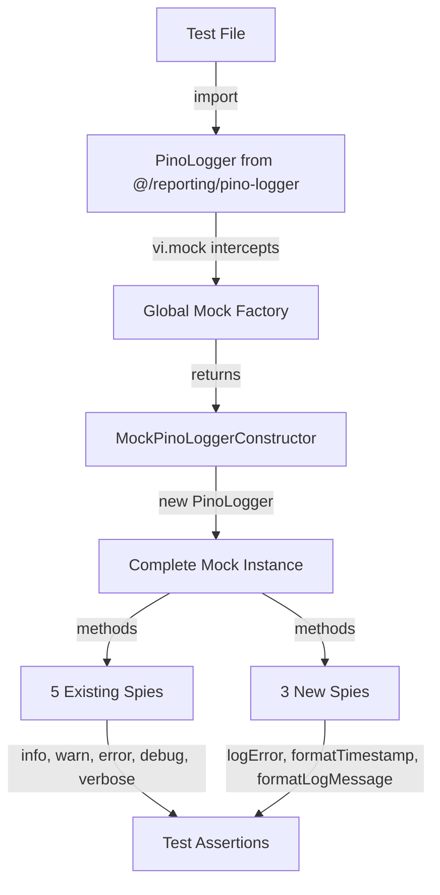
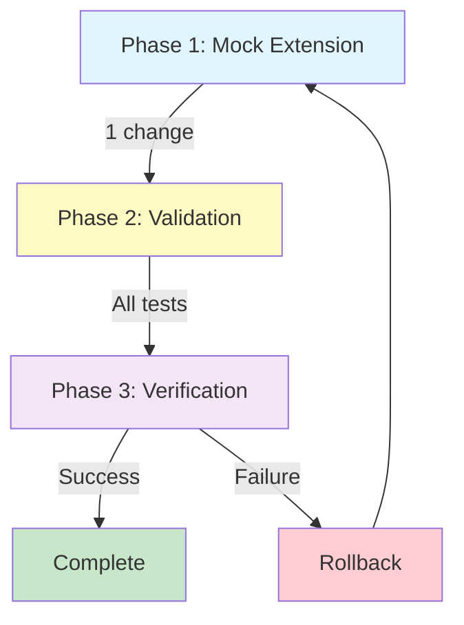

# Technical Design Document

## Overview

`kirox-fix-pino-logger-mocks`仕様で作成したPinoLoggerグローバルモックに3つのメソッド（logError、formatTimestamp、formatLogMessage）が欠落しているため、140件のテストが失敗している。本設計は、グローバルモック定義を完全な8メソッド実装に拡張し、全テストを通過させる。

**Purpose**: PinoLoggerモックを実装クラスと完全に一致させ、テストスイートの信頼性を回復する。

**Users**: テストファイル作成者とCI/CDパイプラインが、PinoLoggerを使用するコンポーネントのテストを実行する際に利用する。

**Impact**: 140件の失敗テストを修正し、継続的インテグレーションを正常化する。既存のテストロジックは変更せず、グローバルモック定義のみを拡張する。

### Goals

- PinoLoggerモックに欠落している3メソッド（logError、formatTimestamp、formatLogMessage）を追加
- 全2214件以上のテストが通過することを確認
- PinoLogger実装クラスとモックの完全な対応を文書化
- 将来のメソッド追加時の保守性を向上

### Non-Goals

- PinoLogger実装コード（src/reporting/pino-logger.ts）の変更は行わない
- テストロジックの変更は行わない
- 既存の5メソッド（info、warn、error、debug、verbose）の動作は変更しない

## Architecture

### Existing Architecture Analysis

**現在のグローバルモック構造** (tests/setup.ts):
- vi.mock()でPinoLoggerをモック化
- vi.fn().mockImplementation()パターンで vi.mocked()互換性を確保
- 5メソッドのみ実装: info、warn、error、debug、verbose

**実装クラス構造** (src/reporting/pino-logger.ts):
- 8つのpublicメソッド
  - ロギングメソッド: info、warn、error、debug、verbose
  - ユーティリティメソッド: logError、formatTimestamp、formatLogMessage
- Pinoライブラリをラップした軽量ロガー

**既存パターンの保持**:
- vi.fn().mockImplementation()パターンを継続使用
- グローバルモックファイルでの一元管理
- 全メソッドをスパイ関数（vi.fn()）として実装

### High-Level Architecture



### Technology Alignment

**既存技術スタックとの整合性**:
- **Vitest 1.x**: vi.mock()とvi.fn()パターンを継続使用
- **TypeScript 5.x**: 型安全なモック定義
- **Pino**: 実装クラスとのインターフェース完全互換性

**新規導入要素**:
- なし（既存パターンの拡張のみ）

## Key Design Decisions

### Decision 1: 既存モックパターンの拡張

**Context**: 3つのメソッドが欠落しているが、既存の5メソッドは正しく動作している。

**Alternatives**:
1. **既存モックを拡張**: 現在の`mockImplementation`に3メソッドを追加
2. **新しいモックヘルパー関数**: tests/helpers/create-pino-logger-mock.tsで関数化
3. **実装クラスの自動モック**: vi.mock()のautoMock機能を使用

**Selected Approach**: **既存モックを拡張**

tests/setup.tsのmockImplementation内に3メソッドを追加:
```typescript
vi.mock('@/reporting/pino-logger.js', () => ({
  PinoLogger: vi.fn().mockImplementation((verbose?: boolean) => ({
    info: vi.fn(),
    warn: vi.fn(),
    error: vi.fn(),
    debug: vi.fn(),
    verbose: vi.fn(),
    logError: vi.fn(),           // 追加
    formatTimestamp: vi.fn(),    // 追加
    formatLogMessage: vi.fn(),   // 追加
  }))
}));
```

**Rationale**:
- 最小限の変更で問題を解決
- 既存の5メソッドとの一貫性を保持
- vi.mocked()互換性を維持
- テストファイルへの影響ゼロ

**Trade-offs**:
- **獲得**: シンプルさ、既存テストへの影響なし、即座の問題解決
- **犠牲**: なし（純粋な拡張）

## Requirements Traceability

| Requirement | Components | Implementation |
|-------------|------------|----------------|
| 1.1-1.3 | logErrorメソッド | tests/setup.ts: `logError: vi.fn()` |
| 2.1-2.3 | formatTimestampメソッド | tests/setup.ts: `formatTimestamp: vi.fn()` |
| 3.1-3.3 | formatLogMessageメソッド | tests/setup.ts: `formatLogMessage: vi.fn()` |
| 4.1-4.4 | 全テスト通過 | モック拡張により全140件の失敗を解決 |
| 5.1-5.3 | モック完全性 | 実装クラスの全8メソッドを網羅 |

## Components and Interfaces

### Test Infrastructure

#### Global Mock Setup (tests/setup.ts)

**Responsibility & Boundaries**
- **Primary Responsibility**: PinoLogger実装クラスの全8メソッドを完全にモック化
- **Domain Boundary**: テストインフラストラクチャ層
- **Data Ownership**: グローバルモック定義とデフォルト実装

**Dependencies**
- **Inbound**: 全テストファイル（自動適用）
- **Outbound**: Vitest vi.mock() API
- **External**: なし

**Contract Definition**

**完全なモックインスタンス契約**:

| Method | Type | Purpose | Spy Status |
|--------|------|---------|------------|
| `info(message, details?)` | `vi.Mock` | INFOレベルログ | ✓ Spy |
| `warn(message, details?)` | `vi.Mock` | WARNレベルログ | ✓ Spy |
| `error(message, details?)` | `vi.Mock` | ERRORレベルログ | ✓ Spy |
| `debug(message, details?)` | `vi.Mock` | DEBUGレベルログ | ✓ Spy |
| `verbose(message, details?)` | `vi.Mock` | VERBOSE/DEBUG別名 | ✓ Spy |
| `logError(errorResult)` | `vi.Mock` | ErrorResult構造化ログ | ✓ Spy (新規) |
| `formatTimestamp()` | `vi.Mock` | タイムスタンプ文字列生成 | ✓ Spy (新規) |
| `formatLogMessage(level, message, details?)` | `vi.Mock` | ログメッセージ整形 | ✓ Spy (新規) |

**実装例**:
```typescript
vi.mock('@/reporting/pino-logger.js', () => ({
  PinoLogger: vi.fn().mockImplementation((verbose?: boolean) => ({
    // Existing methods (5)
    info: vi.fn(),
    warn: vi.fn(),
    error: vi.fn(),
    debug: vi.fn(),
    verbose: vi.fn(),

    // New methods (3)
    logError: vi.fn(),
    formatTimestamp: vi.fn(),
    formatLogMessage: vi.fn(),
  }))
}));
```

**Preconditions**:
- Vitestがsetupファイルを読み込み可能
- vitest.config.tsのsetupFiles設定が有効

**Postconditions**:
- 全テストファイルでPinoLoggerの全8メソッドが使用可能
- 各メソッドがvi.fn()スパイとして動作

**Invariants**:
- モックは全テスト実行中不変
- vi.mocked()互換性を維持

## Error Handling

### Error Strategy

本設計はテストインフラの修正であり、実行時エラーは発生しない。テスト実行時のエラーは以下の戦略で対処:

**Missing Method Error**:
- **検出**: テスト実行時に"is not a function"エラー
- **対応**: グローバルモック定義に該当メソッドを追加

**Spy Assertion Error**:
- **検出**: `expect(logger.method).toHaveBeenCalled()`で"not a spy"エラー
- **対応**: 該当メソッドがvi.fn()でラップされていることを確認

### Monitoring

**テスト実行監視**:
- CI/CDパイプラインでの`npm run test`実行結果を監視
- 失敗テスト数が0になることを確認
- テストカバレッジが95%以上を維持することを検証

## Testing Strategy

### Unit Tests

本設計自体はテストインフラの修正であるため、新規テストは作成しない。以下を検証:

1. **全テストスイート**: 2214件以上のテストが通過
2. **PinoLogger使用テスト**: logError、formatTimestamp、formatLogMessageを使用するテストが正常に動作
3. **既存テスト**: 修正前に通過していたテストのリグレッションがないこと

### Integration Tests

**グローバルモック統合検証**:
- 全テストファイルでPinoLoggerの8メソッド全てが使用可能
- vi.mocked()パターンが正常に動作
- メソッド呼び出しのアサーションが全て通過

### Validation Checklist

- [ ] tests/setup.tsに3メソッド追加
- [ ] npm run testで0件の失敗を確認
- [ ] 2214件以上のテスト通過を確認
- [ ] テストカバレッジ95%以上を維持
- [ ] CI/CDパイプライン全ステージ通過

## Migration Strategy



### Phase 1: モック拡張

**Actions**:
1. tests/setup.tsを編集
2. mockImplementation内に3メソッド追加:
   - `logError: vi.fn()`
   - `formatTimestamp: vi.fn()`
   - `formatLogMessage: vi.fn()`
3. 構文エラーがないことを確認

**Validation Checkpoint**:
- TypeScript型チェック通過: `npm run type-check`
- Setup file syntax verification

**Rollback Trigger**: 構文エラー発生時

### Phase 2: テスト検証

**Actions**:
1. 全テストスイート実行: `npm run test`
2. 失敗テスト数を確認
3. 通過テスト数を確認

**Validation Checkpoint**:
- ✅ 0件の失敗
- ✅ 2214件以上の通過

**Rollback Trigger**: いずれかの検証が失敗した場合

### Phase 3: 最終確認

**Actions**:
1. テストカバレッジ確認: `npm run test:coverage`
2. CI/CDパイプライン実行確認

**Validation Checkpoint**:
- ✅ カバレッジ ≥ 95%
- ✅ 全CI/CDステージ通過

**Rollback Trigger**: カバレッジ低下またはCI/CD失敗

### Rollback Strategy

**Rollback手順**:
1. tests/setup.tsの変更をgit checkoutで元に戻す
2. npm run testで既存状態を確認
3. 問題を再分析
