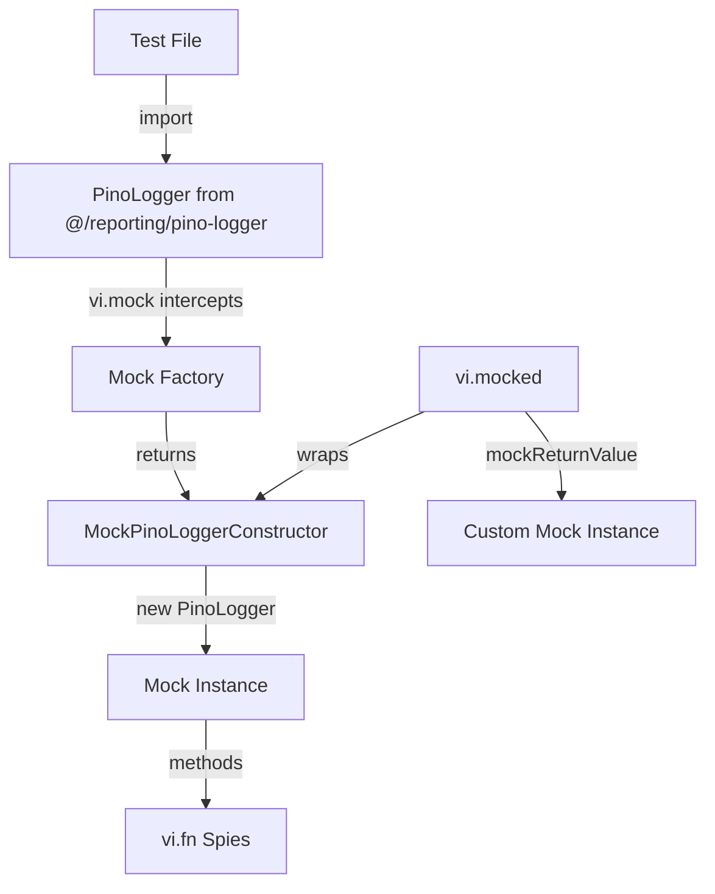
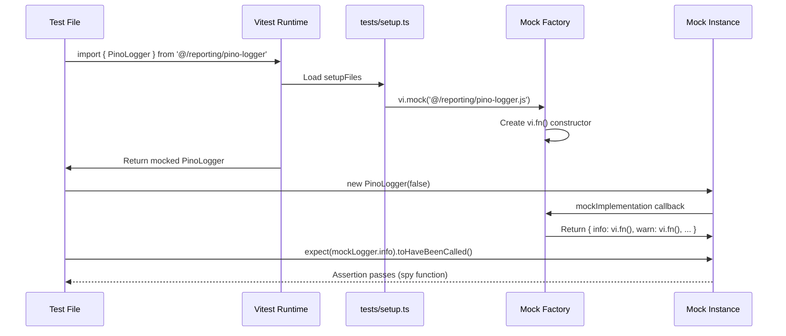
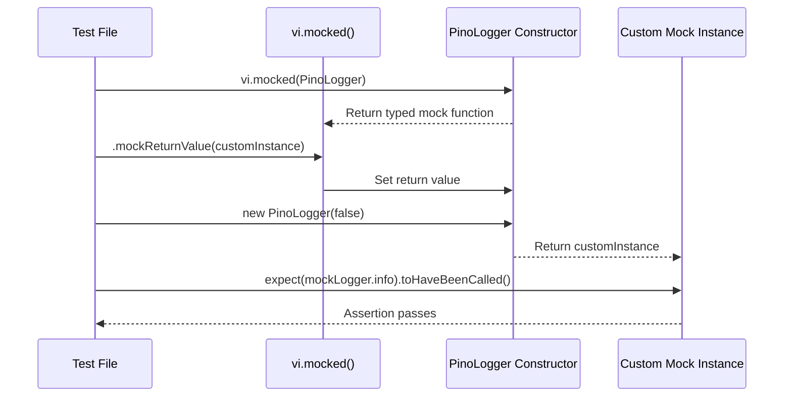
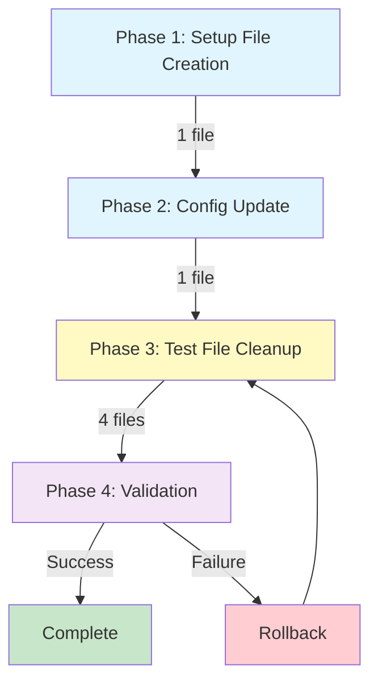

# Technical Design Document

## Overview

`kirox-lightweight-logger`仕様でPinoLoggerを導入した際、テストコードのモック設定に不備が発生し、92件のテストが失敗している。本設計は、Vitestのモックシステムに適合したPinoLoggerモック構造を定義し、全テストを通過させる。

**Purpose**: Vitestモックシステムと互換性のあるPinoLoggerモック実装を提供し、テストスイートの信頼性を回復する。

**Users**: テストファイル作成者とCI/CDパイプラインが、PinoLoggerを使用するコンポーネントのテストを実行する際に利用する。

**Impact**: 現在失敗している92件のテストを修正し、継続的インテグレーションを正常化する。既存のテストロジックは変更せず、モック設定のみを修正することで、テストの意図を保持する。

### Goals

- PinoLoggerのVitestモック設定を正しく構成し、全92件の失敗テストを通過させる
- `vi.mocked(PinoLogger).mockReturnValue()`パターンをサポートする
- モックインスタンスのメソッド（info、warn、error、debug）をスパイ関数として動作させる
- テストファイル間でモックパターンを統一し、保守性を向上させる

### Non-Goals

- PinoLogger実装コード（src/reporting/pino-logger.ts）の変更は行わない
- テストロジックの変更は最小限に留め、モック設定のみを修正する
- 既存のテストカバレッジを維持し、新規テストの追加は行わない

## Architecture

### Existing Architecture Analysis

**現在の問題構造**:
- テストファイルで`vi.mock('@/reporting/pino-logger.js')`を使用しているが、モック定義が不完全
- `interactive-error-handler.test.ts`では`Logger`という存在しないエクスポートをモック
- `add-command-entry.test.ts`では`vi.mocked(PinoLogger).mockReturnValue()`を使用しているが、PinoLoggerがモック関数として認識されていない
- `interactive-tty-check.test.ts`ではモックインスタンスのメソッドがスパイ関数でない

**既存パターンの保持**:
- テストファイルの構造とテストケースは変更しない
- `beforeEach`でのモックインスタンス生成パターンを維持
- `vi.fn()`を使用したスパイパターンを継続

### High-Level Architecture



### Technology Alignment

**既存技術スタックとの整合性**:
- **Vitest 1.x**: モックシステムの`vi.mock()`と`vi.fn()`を使用
- **TypeScript 5.x**: 型安全なモック定義を提供
- **Pino**: 実装コードとのインターフェース互換性を維持

**新規導入要素**:
- なし（既存のVitestモック機能のみを使用）

## Key Design Decisions

### Decision 1: モック関数としてのPinoLoggerコンストラクタ

**Context**: `vi.mocked(PinoLogger).mockReturnValue()`を使用するテストが存在するため、PinoLoggerコンストラクタ自体がモック関数である必要がある。

**Alternatives**:
1. **モッククラスを返す**: `vi.mock()`で通常のクラスを返し、テスト側で`vi.spyOn()`を使用
2. **vi.fn()ファクトリパターン**: コンストラクタをvi.fn()でラップしてモック関数化
3. **手動モックインスタンス**: 各テストで個別にモックインスタンスを作成

**Selected Approach**: **vi.fn()ファクトリパターン**

モックファクトリで以下を実装:
```typescript
vi.mock('@/reporting/pino-logger.js', () => ({
  PinoLogger: vi.fn().mockImplementation((verbose?: boolean) => ({
    info: vi.fn(),
    warn: vi.fn(),
    error: vi.fn(),
    debug: vi.fn(),
    verbose: vi.fn(),
  }))
}))
```

**Rationale**:
- `vi.fn()`でラップすることで、`vi.mocked(PinoLogger)`がモック関数として認識される
- `mockImplementation`により、`new PinoLogger()`でスパイメソッドを持つインスタンスが返される
- テストファイル間で一貫したモックパターンを提供

**Trade-offs**:
- **獲得**: vi.mocked()互換性、スパイメソッドの自動提供、テストコードの簡潔性
- **犠牲**: グローバルモックの複雑性がわずかに増加（ただし一箇所に集約）

### Decision 2: グローバルモックファイルの導入

**Context**: 複数のテストファイルで同じPinoLoggerモック設定を重複して記述しており、保守性が低い。

**Alternatives**:
1. **各テストファイルで個別にモック定義**: 現状のパターンを継続
2. **グローバル設定ファイル（tests/setup.ts）**: vitest.config.tsのsetupFilesで読み込み
3. **共有ユーティリティ関数**: tests/helpers/mock-logger.tsでモック生成関数を提供

**Selected Approach**: **グローバル設定ファイル（tests/setup.ts）**

vitest.config.tsに設定:
```typescript
export default defineConfig({
  test: {
    setupFiles: ['./tests/setup.ts'],
    // ...
  }
})
```

tests/setup.tsでモック定義:
```typescript
import { vi } from 'vitest';

vi.mock('@/reporting/pino-logger.js', () => ({
  PinoLogger: vi.fn().mockImplementation((verbose?: boolean) => ({
    info: vi.fn(),
    warn: vi.fn(),
    error: vi.fn(),
    debug: vi.fn(),
    verbose: vi.fn(),
  }))
}));
```

**Rationale**:
- 全テストファイルで自動的にモックが適用される
- モック定義の一元管理により、将来の変更が容易
- テストファイルからモック定義コードを削減し、可読性向上

**Trade-offs**:
- **獲得**: DRY原則の遵守、保守性向上、テストコードの簡潔化
- **犠牲**: グローバル設定の暗黙的な挙動（ただしVitest標準パターン）

## System Flows

### モック解決フロー



### vi.mocked()使用フロー



## Requirements Traceability

| Requirement | Components | Interfaces | Flows |
|-------------|------------|------------|-------|
| 1.1-1.3 | Mock Factory (tests/setup.ts) | `PinoLogger` export | モック解決フロー |
| 2.1-2.3 | Mock Implementation | `info()`, `warn()`, `error()`, `debug()` as `vi.fn()` | モック解決フロー |
| 3.1-3.3 | vi.fn() Constructor | `vi.mocked(PinoLogger).mockReturnValue()` | vi.mocked()使用フロー |
| 4.1-4.5 | Test File Modifications | 各テストファイルのモック削除 | - |
| 5.1-5.3 | Global Mock Setup | tests/setup.ts + vitest.config.ts | - |

## Components and Interfaces

### Test Infrastructure

#### Global Mock Setup (tests/setup.ts)

**Responsibility & Boundaries**
- **Primary Responsibility**: PinoLoggerのグローバルモック定義を提供し、全テストファイルで自動適用
- **Domain Boundary**: テストインフラストラクチャ層
- **Data Ownership**: モックファクトリ定義とデフォルト実装
- **Transaction Boundary**: Vitestランタイム起動時に一度だけ実行

**Dependencies**
- **Inbound**: 全テストファイル（暗黙的）
- **Outbound**: Vitest vi.mock() API
- **External**: なし

**Contract Definition**

**Module Export Contract**:
```typescript
// tests/setup.ts
import { vi } from 'vitest';

// Module mock registration
vi.mock('@/reporting/pino-logger.js', () => ({
  PinoLogger: vi.fn().mockImplementation((verbose?: boolean) => ({
    info: vi.fn(),
    warn: vi.fn(),
    error: vi.fn(),
    debug: vi.fn(),
    verbose: vi.fn(),
  }))
}));
```

- **Preconditions**: Vitestがsetupファイルを読み込み可能であること
- **Postconditions**: 全テストファイルで`@/reporting/pino-logger.js`のインポートがモックに解決される
- **Invariants**: モック定義はテスト実行中不変

**Mock Instance Contract**:

| Method | Type | Behavior | Spy Status |
|--------|------|----------|------------|
| `info(message, details?)` | `vi.Mock` | 呼び出しを記録、戻り値なし | ✓ Spy |
| `warn(message, details?)` | `vi.Mock` | 呼び出しを記録、戻り値なし | ✓ Spy |
| `error(message, details?)` | `vi.Mock` | 呼び出しを記録、戻り値なし | ✓ Spy |
| `debug(message, details?)` | `vi.Mock` | 呼び出しを記録、戻り値なし | ✓ Spy |
| `verbose(message, details?)` | `vi.Mock` | 呼び出しを記録、戻り値なし | ✓ Spy |

**Integration Strategy**:
- **Modification Approach**: 既存テストファイルから個別のvi.mock()定義を削除
- **Backward Compatibility**: テストロジックは変更せず、モック取得方法のみ変更
- **Migration Path**: 各テストファイルで以下を実施:
  1. `vi.mock('@/reporting/pino-logger.js')`ブロックを削除
  2. `beforeEach`でのインスタンス生成パターンは維持
  3. `vi.mocked(PinoLogger).mockReturnValue()`使用箇所はそのまま

#### Vitest Configuration (vitest.config.ts)

**Responsibility & Boundaries**
- **Primary Responsibility**: グローバル設定ファイル（tests/setup.ts）をテスト実行前に読み込む
- **Domain Boundary**: テスト設定層
- **Data Ownership**: Vitest実行設定

**Dependencies**
- **Inbound**: Vitestランタイム
- **Outbound**: tests/setup.ts
- **External**: Vitest

**Contract Definition**

**Configuration Contract**:
```typescript
export default defineConfig({
  test: {
    globals: true,
    environment: 'node',
    setupFiles: ['./tests/setup.ts'], // 追加
    coverage: { /* 既存設定 */ },
  },
  resolve: {
    alias: { '@': path.resolve(__dirname, './src') },
  },
});
```

- **Preconditions**: tests/setup.tsファイルが存在すること
- **Postconditions**: 全テスト実行前にsetup.tsが読み込まれる
- **Invariants**: 設定はテストセッション中不変

### Test File Modifications

#### add-command-entry.test.ts

**Modification Approach**: vi.mock()定義を削除し、グローバルモックを使用

**Before** (lines 18-50):
```typescript
vi.mock('pino', () => { /* 複雑なモック定義 */ });
vi.mock('@/reporting/logger.js', () => { /* ... */ });
```

**After**:
```typescript
// グローバルモックを使用（vi.mock削除）
// PinoLoggerはtests/setup.tsで自動的にモック化
```

**Contract Changes**: なし（モック取得方法のみ変更）

#### interactive-error-handler.test.ts

**Modification Approach**: 誤った`Logger`モックを削除し、正しい`PinoLogger`グローバルモックを使用

**Before** (lines 16-22):
```typescript
vi.mock('@/reporting/pino-logger.js', () => ({
  Logger: vi.fn().mockImplementation(() => ({ /* ... */ }))
}));
```

**After**:
```typescript
// グローバルモック（tests/setup.ts）を使用
// vi.mockブロック全体を削除
```

**Additional Changes**:
- Line 28: `mockLogger = new PinoLogger(false);` → グローバルモックから取得

#### interactive-tty-check.test.ts

**Modification Approach**: 誤った`@/reporting/logger.js`モックを削除

**Before** (lines 17-23):
```typescript
vi.mock('@/reporting/logger.js', () => ({
  Logger: vi.fn().mockImplementation(() => ({ /* ... */ }))
}));
```

**After**:
```typescript
// グローバルモック（tests/setup.ts）を使用
// vi.mockブロック全体を削除
```

**Additional Changes**:
- Line 30: `mockLogger = new PinoLogger();` → 引数なしで正常動作

#### interactive-prompt.test.ts（存在する場合）

**Modification Approach**: 同様にグローバルモックを使用

**Contract Changes**: 他のテストファイルと同様の変更パターン

## Error Handling

### Error Strategy

本設計はテストインフラストラクチャの修正であり、実行時エラーは発生しない。テスト実行時のエラーは以下の戦略で対処:

**モック設定エラー**: グローバル設定ファイル読み込み失敗時、Vitestがエラーを報告
**型不一致エラー**: TypeScript型チェックで事前検出
**スパイ関数アサーションエラー**: Vitestの標準エラーメッセージで原因を報告

### Error Categories and Responses

**Setup File Not Found** (Infrastructure Error):
- **検出**: Vitest起動時に`setupFiles`読み込み失敗
- **対応**: vitest.config.tsのパス設定を確認し、tests/setup.tsの存在を検証

**Mock Not Applied** (Configuration Error):
- **検出**: テスト実行時に`No 'PinoLogger' export is defined`エラー
- **対応**: グローバルモック定義の構文を確認し、vi.mock()の戻り値にPinoLoggerが含まれることを検証

**Spy Function Not Recognized** (Implementation Error):
- **検出**: `expect(mockLogger.info).toHaveBeenCalled()`で`not a spy`エラー
- **対応**: mockImplementation内で全メソッドがvi.fn()でラップされていることを確認

### Monitoring

**テスト実行監視**:
- CI/CDパイプラインでの`npm run test`実行結果を監視
- 失敗テスト数が0になることを確認
- テストカバレッジが既存レベル（95%以上）を維持することを検証

## Testing Strategy

### Unit Tests

本設計自体はテストインフラの修正であるため、新規テストは作成しない。以下の既存テストが全て通過することを検証:

1. **add-command-entry.test.ts** (73 tests): PinoLoggerモックを使用した全テストケース
2. **interactive-error-handler.test.ts** (15 tests): エラーハンドリングロジックのスパイアサーション
3. **interactive-tty-check.test.ts** (2 tests): TTY環境チェックのロガー呼び出し検証
4. **interactive-prompt.test.ts** (2 tests, if exists): プロンプト関連のロガー使用

### Integration Tests

**グローバルモック統合検証**:
- 全テストスイート（2214+ tests）が通過することを確認
- 各テストファイルでPinoLoggerインポートが正しくモックに解決されることを検証
- vi.mocked()パターンを使用するテストが正常に動作することを確認

### Regression Tests

**既存機能の保護**:
- テストロジックを変更しないため、リグレッションリスクは最小
- モック変更前後でテストカバレッジが同一であることを確認
- CI/CDパイプラインの全ステージ（lint、type-check、test、build）が通過することを検証

## Migration Strategy



### Phase 1: グローバルセットアップファイル作成

**Actions**:
1. `tests/setup.ts`を作成
2. PinoLoggerのvi.mock()定義を記述
3. 構文エラーがないことを確認

**Validation Checkpoint**:
- TypeScript型チェック通過: `npm run type-check`
- Setup file syntax verification: Node.jsで直接読み込み可能

**Rollback Trigger**: 構文エラーまたは型エラー発生時

### Phase 2: Vitest設定更新

**Actions**:
1. `vitest.config.ts`に`setupFiles: ['./tests/setup.ts']`を追加
2. 設定ファイルの妥当性を確認

**Validation Checkpoint**:
- Vitest起動確認: `npm run test -- --run --reporter=verbose`でsetup.ts読み込みログを確認
- No configuration errors

**Rollback Trigger**: Vitest設定エラーまたはsetup.ts読み込み失敗

### Phase 3: テストファイルクリーンアップ

**Actions**:
1. `add-command-entry.test.ts`: vi.mock('pino')とvi.mock('@/reporting/logger.js')を削除
2. `interactive-error-handler.test.ts`: vi.mock('@/reporting/pino-logger.js')を削除
3. `interactive-tty-check.test.ts`: vi.mock('@/reporting/logger.js')を削除
4. `interactive-prompt.test.ts` (if exists): 同様の削除

**Validation Checkpoint**:
- 各ファイル修正後に個別テスト実行: `npm run test -- <file-path>`
- 全92件のテストが通過することを確認

**Rollback Trigger**: いずれかのテストファイルで失敗が発生した場合、該当ファイルの変更を元に戻す

### Phase 4: 全体検証

**Actions**:
1. 全テストスイート実行: `npm run test`
2. テストカバレッジ確認: `npm run test:coverage`
3. CI/CDパイプライン実行確認

**Validation Checkpoint**:
- ✅ 0 failed tests, 2214+ passed tests
- ✅ Test coverage ≥ 95%
- ✅ All CI/CD stages pass (lint, type-check, test, build)

**Rollback Trigger**:
- 失敗テスト数 > 0
- カバレッジ低下
- CI/CD失敗

### Rollback Strategy

各フェーズでのロールバック手順:

**Phase 3 Rollback**:
- 変更したテストファイルをgit checkoutで元に戻す
- 個別にテストを再実行して問題を特定

**Phase 2 Rollback**:
- vitest.config.tsのsetupFiles設定を削除
- tests/setup.tsは保持（再試行用）

**Phase 1 Rollback**:
- tests/setup.tsを削除
- 設計を再検討
