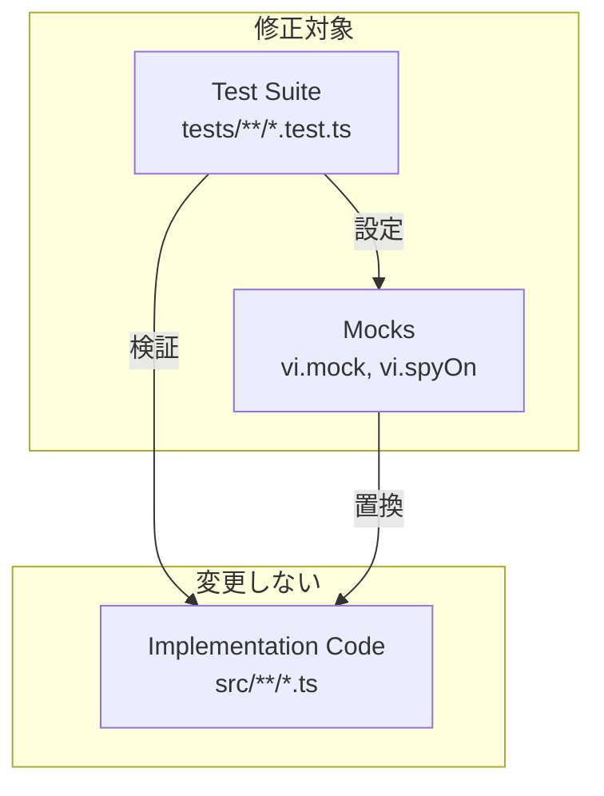
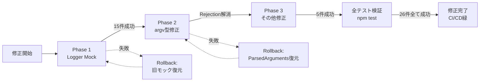

# Technical Design Document

## Overview

本設計は、26件の失敗しているテストコードを修正することで、実装コード（`src/`配下）の正しい動作を正確に検証できるようにする。実装コードは正しく動作していることを前提とし、テストコード（`tests/`配下）のモック設定、検証ロジック、期待値設定を実装の実態に合わせて修正する。

**目的**: CI/CDパイプラインを安定化し、開発者が自信を持ってコードをコミットできる環境を提供する。

**ユーザー**: テスト実行者（開発者、CI/CDシステム）がこの修正により、正確なテスト結果を得て、実装コードの品質を保証できる。

**影響範囲**: テストコードのみ修正。実装コード（`src/`配下）への変更は一切行わない。

### Goals

- 26件の失敗テストを全て成功させる
- 実装コードの実際の動作に合わせてテストを調整する
- テストスイートが実装の現在の状態を正確に反映するようにする
- CI/CDパイプラインの安定稼働を実現する

### Non-Goals

- 実装コード（`src/`配下）の修正・リファクタリング
- 新機能の追加
- テストカバレッジの向上（既存テストの修正のみ）
- パフォーマンス最適化

## Architecture

### 既存アーキテクチャ分析

Kirox CLIは4層アーキテクチャを採用:
- **CLI Layer** (`src/cli/`): 引数パース、コマンド実行制御
- **GitHub Integration Layer** (`src/github/`): GitHub APIとの通信
- **File System Layer** (`src/filesystem/`): ファイル書き込み
- **Reporting Layer** (`src/reporting/`): ログ出力、エラーハンドリング

**現在の制約**:
- Pino Loggerへの移行済み（`kirox-lightweight-logger` spec完了）
- PinoLogger はコンストラクタで `verbose` フラグを受け取り、内部でPinoインスタンスを管理
- テストではPinoモジュール自体をモックし、スパイで呼び出しを追跡する必要がある

**統合ポイント**:
- テストは実装コードの外部依存（Octokit, fs, Pino）をモックして検証
- モック設定が実装の変更（Logger → PinoLogger移行）に追従していない

### High-Level Architecture



### Technology Alignment

本修正は既存の技術スタックに完全に準拠:
- **テストフレームワーク**: Vitest（既存）
- **モックライブラリ**: Vitest vi（既存）
- **アサーションライブラリ**: Vitest expect（既存）

**新規依存なし**: 既存のテスト基盤のみを使用

### Key Design Decisions

#### Decision 1: Pinoモジュールレベルのモック戦略

**Context**: PinoLoggerがPinoインスタンスを内部保持するため、クラスレベルのモックでは呼び出しを追跡できない。

**Alternatives**:
1. PinoLoggerクラス自体をモックして完全に置き換える
2. Pinoモジュールをモックし、Pinoインスタンスの生成から制御する
3. console.logをスパイして間接的にログ出力を検証する

**Selected Approach**: **Option 2 - Pinoモジュールレベルのモック**

実装方法:
```typescript
// Pinoモジュール全体をモック
vi.mock('pino', () => {
  return {
    default: vi.fn(() => mockPinoInstance)
  };
});

// mockPinoInstanceにスパイを設定
const mockPinoInstance = {
  info: vi.fn(),
  warn: vi.fn(),
  error: vi.fn(),
  debug: vi.fn(),
};
```

**Rationale**:
- PinoLoggerのコンストラクタ内でPinoインスタンスが生成されるため、その生成をモックすることで完全に制御できる
- 実装コードに影響を与えず、テスト側だけで完結する
- スパイによる呼び出し回数・引数の検証が可能

**Trade-offs**:
- **Gain**: 実装コードの変更不要、Pinoの全メソッド呼び出しを追跡可能
- **Sacrifice**: モック設定が若干複雑化、Pinoのバージョンアップ時にモック調整が必要になる可能性

#### Decision 2: 未実装オプションテストの削除アプローチ

**Context**: `--check-updates`と`--update`オプションは未実装だが、テストコードにテストケースが存在し、"unknown option"エラーが発生している。

**Alternatives**:
1. テストケースを完全に削除する
2. `it.skip()`でテストをスキップし、コメントで将来の実装を示唆する
3. テストケースを残し、エラーをexpectする形に修正する

**Selected Approach**: **Option 2 - it.skip()でスキップ**

実装方法:
```typescript
it.skip('should skip interactive mode when --check-updates is specified', async () => {
  // TODO: Enable when --check-updates option is implemented
  // ...test code...
});
```

**Rationale**:
- 将来の実装予定を明示的に残せる
- テストコードの削除による情報損失を防ぐ
- `npm test`実行時にスキップされたテスト数が表示され、未実装機能の存在を開発者に通知できる

**Trade-offs**:
- **Gain**: 将来の実装時に再利用可能、仕様書としての価値を保持
- **Sacrifice**: スキップされたテストが残るため、テスト結果に"skipped"が表示される

#### Decision 3: argv型エラーの根本対応

**Context**: `tests/unit/cli/add-interrupt-handling.test.ts`で`executeAddCommand(args)`を呼び出す際、`args`が`ParsedArguments`型（オブジェクト）であるのに対し、`executeAddCommand`の実装は`argv: string[]`を期待している。

**Alternatives**:
1. テスト側で`ParsedArguments`から`string[]`形式に変換する
2. `executeAddCommand`のオーバーロードを追加して両方の型を受け入れる
3. テスト用の別エントリポイントを作成する

**Selected Approach**: **Option 1 - テスト側でstring[]形式に変換**

実装方法:
```typescript
// Before (誤り)
const args: ParsedArguments = { repository: 'owner/repo', ... };
await executeAddCommand(args);

// After (正しい)
const argv: string[] = ['node', 'kirox', 'add', 'owner/repo', '-p', 'test-project'];
await executeAddCommand(argv);
```

**Rationale**:
- 実装コードの変更不要（`executeAddCommand(argv: string[])`のシグネチャを維持）
- `parseArguments(argv)`内で`argv.includes()`と`argv.indexOf()`が正常に動作する
- 実際のコマンドライン引数の形式に忠実

**Trade-offs**:
- **Gain**: 実装コードに影響なし、型安全性が保たれる
- **Sacrifice**: テストコードで引数配列を構築する手間が増える

## System Flows

### テスト修正プロセスフロー

```mermaid
flowchart TB
    Start[テスト失敗検出]
    Classify[失敗原因分類]

    LoggerIssue{Logger検証<br/>失敗?}
    SteeringIssue{Steering<br/>メッセージ失敗?}
    UnimplIssue{未実装<br/>オプション?}
    SignalIssue{シグナル<br/>ハンドリング?}
    ArgvIssue{argv型<br/>エラー?}
    TrackIssue{--track<br/>検証失敗?}

    FixLogger[Pinoモックを<br/>モジュールレベルで設定]
    FixSteering[期待メッセージを<br/>実装出力に合わせる]
    FixUnimpl[it.skip()で<br/>テストをスキップ]
    FixSignal[argv配列形式に変換<br/>+ モック設定修正]
    FixArgv[ParsedArgumentsから<br/>string[]に変換]
    FixTrack[メッセージ期待値を<br/>実装に合わせる]

    Verify[テスト実行<br/>npm test]
    Success{全テスト<br/>成功?}
    End[修正完了]

    Start --> Classify
    Classify --> LoggerIssue
    LoggerIssue -->|Yes| FixLogger
    LoggerIssue -->|No| SteeringIssue

    SteeringIssue -->|Yes| FixSteering
    SteeringIssue -->|No| UnimplIssue

    UnimplIssue -->|Yes| FixUnimpl
    UnimplIssue -->|No| SignalIssue

    SignalIssue -->|Yes| FixSignal
    SignalIssue -->|No| ArgvIssue

    ArgvIssue -->|Yes| FixArgv
    ArgvIssue -->|No| TrackIssue

    TrackIssue -->|Yes| FixTrack
    TrackIssue -->|No| Verify

    FixLogger --> Verify
    FixSteering --> Verify
    FixUnimpl --> Verify
    FixSignal --> Verify
    FixArgv --> Verify
    FixTrack --> Verify

    Verify --> Success
    Success -->|Yes| End
    Success -->|No| Classify
```

## Requirements Traceability

| Requirement | Summary | Test Files | Fix Strategy |
|-------------|---------|------------|--------------|
| 1.1-1.7 | Logger検証ロジック修正 | entry-pino-logger.test.ts<br/>project-suggestion-github-api.test.ts<br/>add-command-entry.test.ts | Pinoモジュールレベルモック |
| 2.1-2.4 | --steering空ディレクトリメッセージ | cli-to-github-to-fs.test.ts | 期待値を実装出力に合わせる |
| 3.1-3.5 | 未実装オプションテスト | add-command-entry.test.ts | it.skip()でスキップ |
| 4.1-4.8 | シグナルハンドリング | add-interrupt-handling.test.ts | argv形式変換 + モック設定 |
| 5.1-5.4 | argvパラメータ型 | add-interrupt-handling.test.ts | ParsedArguments → string[] 変換 |
| 6.1-6.3 | --trackオプション検証 | add-track-option.test.ts | メッセージ期待値修正 |

## Components and Interfaces

### Test Modification Components

本設計では、テストコードの修正パターンを「コンポーネント」として定義する。各コンポーネントは特定の失敗パターンに対応した修正戦略を提供する。

#### Logger Mock Component

**Responsibility & Boundaries**
- **Primary Responsibility**: PinoLoggerのメソッド呼び出しをモック環境で追跡可能にする
- **Domain Boundary**: テスト層（tests/**/*.test.ts）
- **Data Ownership**: Pinoモックインスタンスとスパイの管理

**Dependencies**
- **Inbound**: Logger検証を行う全テストケース（15件）
- **Outbound**: Vitest vi.mock, vi.fn()
- **External**: Pino library（モック対象）

**Contract Definition**

**Mock Setup Interface**:
```typescript
// Pinoモジュールレベルモック設定
vi.mock('pino', () => {
  return {
    default: vi.fn((options: { level: string }) => mockPinoInstance)
  };
});

// スパイ付きモックインスタンス
interface MockPinoInstance {
  info: ReturnType<typeof vi.fn>;
  warn: ReturnType<typeof vi.fn>;
  error: ReturnType<typeof vi.fn>;
  debug: ReturnType<typeof vi.fn>;
}
```

**Preconditions**:
- テストファイルの先頭でPinoモジュールをモック
- 各テストケース実行前にスパイをリセット（`beforeEach`）

**Postconditions**:
- PinoLoggerのメソッド呼び出しが全てスパイで追跡可能
- `expect(infoSpy).toHaveBeenCalled()`等の検証が成功

**State Management**:
- **State Model**: モックインスタンスはテストファイルスコープで保持
- **Persistence**: 不要（メモリ内のみ）
- **Concurrency**: Vitestは並列実行時に各テストファイルを隔離するため競合なし

#### Steering Message Verification Component

**Responsibility & Boundaries**
- **Primary Responsibility**: --steering空ディレクトリ時のメッセージ検証ロジックを実装の実態に合わせる
- **Domain Boundary**: Integration test層（tests/integration/）
- **Data Ownership**: 期待メッセージパターンの定義

**Dependencies**
- **Inbound**: cli-to-github-to-fs.test.ts の2件のテストケース
- **Outbound**: コンソール出力キャプチャモック
- **External**: 実装コードの実際の出力メッセージ

**Contract Definition**

**Verification Strategy**:
```typescript
// 修正前（誤った期待値）
expect(output).toMatch(/No files found in \.kiro\/steering/i);

// 修正後（実装の実際の出力に合わせる）
// 実装が "No files found" メッセージを出力しない場合:
expect(output).toMatch(/0 files succeeded/);
expect(output).toMatch(/0 files failed/);

// または、実装がメッセージを出力する場合は、そのパターンに合わせる
```

**Preconditions**:
- 実装コードの実際の出力メッセージを確認（console.logモックの結果を確認）
- GitHub APIモックが空配列を返すように設定

**Postconditions**:
- テストが実装の実際の出力を正しく検証
- 正規表現パターンが実装のメッセージフォーマットにマッチ

#### Unimplemented Option Skip Component

**Responsibility & Boundaries**
- **Primary Responsibility**: 未実装オプションのテストケースをスキップし、将来の実装時に再利用可能にする
- **Domain Boundary**: Unit test層（tests/unit/cli/）
- **Data Ownership**: スキップ対象テストケースの管理

**Dependencies**
- **Inbound**: add-command-entry.test.ts の2件のテストケース
- **Outbound**: Vitest it.skip()
- **External**: なし

**Contract Definition**

**Skip Pattern**:
```typescript
// 修正前（失敗するテスト）
it('should skip interactive mode when --check-updates is specified', async () => {
  // Test implementation
});

// 修正後（スキップされるテスト）
it.skip('should skip interactive mode when --check-updates is specified', async () => {
  // TODO: Enable when --check-updates option is implemented (kirox-update-tracking spec)
  // Test implementation remains for future use
});
```

**Preconditions**:
- オプションが未実装であることを確認（parser.tsに定義なし）

**Postconditions**:
- テストケースはスキップされ、`npm test`で"unknown option"エラーが発生しない
- スキップされたテスト数が表示され、未実装機能の存在が明示される

#### Signal Handling Test Correction Component

**Responsibility & Boundaries**
- **Primary Responsibility**: シグナルハンドリングテストでargv型エラーを解消し、モックを正しく設定する
- **Domain Boundary**: Unit test層（tests/unit/cli/）
- **Data Ownership**: argv配列形式の構築、process.onモックの管理

**Dependencies**
- **Inbound**: add-interrupt-handling.test.ts の7件のテストケース
- **Outbound**: executeAddCommand, process.on
- **External**: Node.js process シグナルAPI

**Contract Definition**

**Argv Format Conversion**:
```typescript
// 修正前（誤った型）
const args: ParsedArguments = {
  subcommand: 'add',
  repository: 'owner/repo',
  projects: ['test-project'],
  // ...
};
await executeAddCommand(args); // TypeError: argv.includes is not a function

// 修正後（正しい型）
const argv: string[] = [
  'node',
  'kirox',
  'add',
  'owner/repo',
  '-p', 'test-project',
  '--track'
];
await executeAddCommand(argv); // Success
```

**Process.on Mock Setup**:
```typescript
// シグナルハンドラーキャプチャ用モック
const signalHandlers = new Map<string, Function>();

beforeEach(() => {
  process.on = vi.fn((signal: string, handler: Function) => {
    signalHandlers.set(signal, handler);
    return process;
  }) as any;
});

// シグナルトリガー検証
const sigintHandler = signalHandlers.get('SIGINT');
expect(sigintHandler).toBeDefined();
sigintHandler!(); // Trigger handler
```

**Preconditions**:
- executeAddCommandがstring[]型のargvを受け取る
- process.onモックがシグナルハンドラーを正しくキャプチャする

**Postconditions**:
- `argv.includes()`エラーが発生しない
- シグナルハンドラーの登録・実行が検証可能

**Integration Strategy**:
- **Modification Approach**: テストコードのみ修正、実装コードは変更しない
- **Backward Compatibility**: 実装コードのシグネチャを変更しないため、他のテストへの影響なし

#### Track Option Verification Component

**Responsibility & Boundaries**
- **Primary Responsibility**: --trackオプションなし時のメッセージ検証を実装の実態に合わせる
- **Domain Boundary**: Unit test層（tests/unit/cli/）
- **Data Ownership**: 期待メッセージの定義

**Dependencies**
- **Inbound**: add-track-option.test.ts の1件のテストケース
- **Outbound**: コンソール出力キャプチャ
- **External**: 実装コードの実際のログ出力

**Contract Definition**

**Message Verification**:
```typescript
// 実装コードの実際の出力を確認
const consoleSpy = vi.spyOn(console, 'log');
await executeAddCommand(argv);

// 実装が出力する実際のメッセージに合わせる
const logCalls = consoleSpy.mock.calls.flat().join(' ');

// 修正前（存在しないメッセージ）
expect(logCalls).toContain('Metadata tracking is disabled');

// 修正後（実装の実際の出力）
// Option A: 実装がそのメッセージを出力する場合、そのまま
// Option B: 実装が別の形式で出力する場合、その形式に合わせる
// Option C: 実装がメッセージを出力しない場合、テストロジックを変更
expect(logCalls).toContain('[実際のメッセージパターン]');
```

**Preconditions**:
- 実装コードの実際の動作を確認（console.logスパイで出力をキャプチャ）
- --trackオプションなしでaddコマンドを実行

**Postconditions**:
- テストが実装の実際の動作を正しく検証
- メッセージの有無・形式が実装と一致

## Error Handling

### Error Strategy

テスト修正においては、以下のエラー戦略を採用:

1. **モック設定エラー**: テストファイル読み込み時に検出され、即座に修正が必要
2. **型エラー**: TypeScriptコンパイル時に検出され、型変換で対応
3. **アサーション失敗**: テスト実行時に検出され、期待値を実装に合わせて修正

### Error Categories and Responses

**User Errors (開発者のテスト実装ミス)**:
- **Invalid Mock Setup**: モック設定が不完全 → モジュールレベルモックに変更
- **Wrong Type Usage**: 誤った型の引数渡し → string[]形式に変換
- **Incorrect Expectation**: 期待値が実装と不一致 → 実装の実際の出力に合わせる

**System Errors (テストフレームワーク起因)**:
- **Vitest Isolation Failure**: テスト間で状態が混在 → beforeEach/afterEachで確実にリセット
- **Mock Cleanup Missing**: モックが残留 → vi.restoreAllMocks()を各テスト後に実行

**Business Logic Errors (テスト仕様ミス)**:
- **Unimplemented Feature Test**: 未実装機能をテスト → it.skip()でスキップ
- **Outdated Verification**: 実装変更後に検証ロジックが追従していない → 実装に合わせて更新

### Monitoring

- **Test Execution Monitoring**: `npm test`のCI/CD統合により、全テストの成功/失敗を継続的に監視
- **Coverage Tracking**: テストカバレッジは既存水準を維持（新規テスト追加は本修正の範囲外）
- **Regression Detection**: 修正後もテストが失敗する場合、実装コードの動作確認が必要

## Testing Strategy

本設計は「テストコードの修正」であるため、通常のテスト戦略とは異なる。修正の検証は以下の方法で行う:

### Unit Tests（修正対象テストの検証）

修正前の失敗テストを修正後に実行し、全て成功することを確認:

1. **Logger Mock Tests** (15件):
   - `tests/integration/entry-pino-logger.test.ts`: `infoSpy.toHaveBeenCalled()` が成功
   - `tests/integration/project-suggestion-github-api.test.ts`: verbose/errorログが検証可能
   - `tests/unit/cli/add-command-entry.test.ts`: メタデータ作成・重複検出・成功サマリーのログ検証が成功

2. **Steering Message Tests** (2件):
   - `tests/integration/cli-to-github-to-fs.test.ts`: 空ディレクトリメッセージ検証が成功

3. **Unimplemented Option Tests** (2件):
   - `tests/unit/cli/add-command-entry.test.ts`: スキップされたテストが表示され、"unknown option"エラーが発生しない

4. **Signal Handling Tests** (7件):
   - `tests/unit/cli/add-interrupt-handling.test.ts`: argv型エラーが発生せず、シグナルハンドラー検証が成功

5. **Track Option Test** (1件):
   - `tests/unit/cli/add-track-option.test.ts`: メッセージ検証が実装に合致して成功

### Integration Tests（修正の副作用確認）

修正対象外のテストが引き続き成功することを確認:
- 全てのintegration testsが既存の成功状態を維持
- モック設定の変更が他のテストに影響しないことを確認

### Regression Tests（CI/CD連携）

- GitHub Actions CI/CDで全テストを実行
- 修正前: 26件失敗、修正後: 0件失敗を確認
- カバレッジレポートで既存カバレッジが維持されることを確認

### Verification Checklist

修正完了の判定基準:
- [ ] `npm test` で全テストが成功（0 failed）
- [ ] スキップされたテスト数が2件（--check-updates, --update）
- [ ] 実装コード（`src/`配下）に変更がないことを確認
- [ ] テストカバレッジが修正前と同等以上
- [ ] CI/CDパイプラインが緑（全テスト成功）

## Migration Strategy

### Phase 1: Logger Mock修正（優先度: 高、15件）

**タスク**:
1. Pinoモジュールレベルモックを各テストファイルに追加
2. スパイを使用した呼び出し検証に修正
3. テスト実行して15件のLogger関連テストが成功することを確認

**Rollback Trigger**: モック設定エラーが発生した場合、旧モック方式に戻す

**Validation**: `npm test tests/integration/entry-pino-logger.test.ts` が成功

### Phase 2: argv型エラー修正（優先度: 高、6件のUnhandled Rejection）

**タスク**:
1. `add-interrupt-handling.test.ts`の全テストケースでargvをstring[]形式に変換
2. process.onモックを正しく設定
3. テスト実行して"TypeError: argv.includes is not a function"が発生しないことを確認

**Rollback Trigger**: 他のテストに影響が出た場合、変更を戻す

**Validation**: Unhandled Rejectionが0件

### Phase 3: その他の修正（優先度: 中、5件）

**タスク**:
1. Steeringメッセージ検証を実装に合わせる（2件）
2. 未実装オプションテストをスキップ（2件）
3. --trackメッセージ検証を修正（1件）

**Rollback Trigger**: なし（影響範囲が限定的）

**Validation**: 各テストファイル単位で実行して成功を確認



---

## 設計レビューポイント

本設計書をレビューする際は、以下を確認してください:

1. **実装コード非変更の原則**: `src/`配下への変更が一切含まれていないか
2. **モック戦略の妥当性**: Pinoモジュールレベルモックが適切か
3. **型安全性**: argv型変換がTypeScript型チェックを通過するか
4. **テストの独立性**: 修正が他のテストに影響しないか
5. **CI/CD統合**: 全テストが成功し、パイプラインが安定するか
