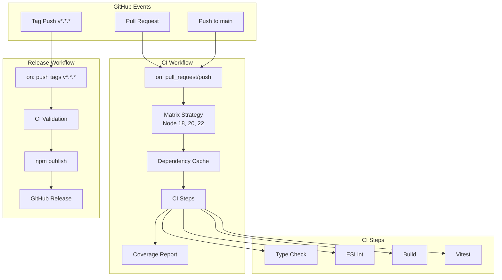
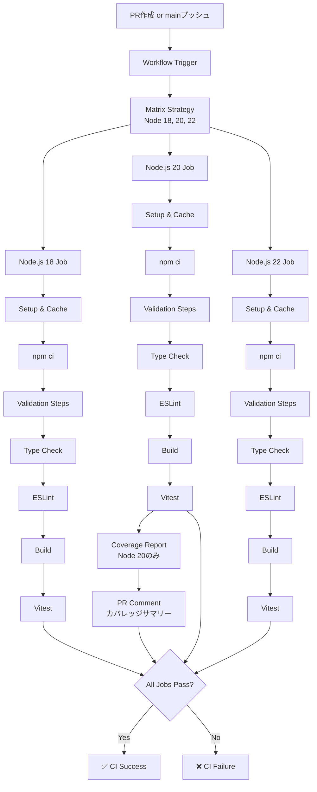
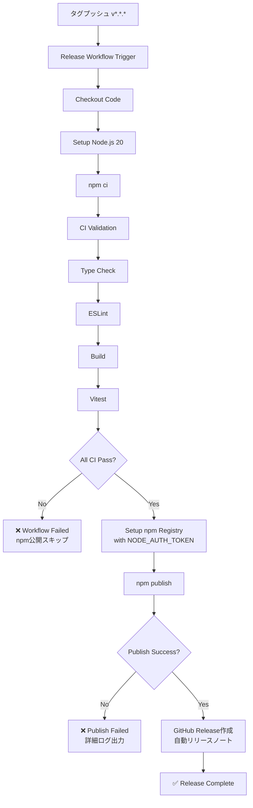
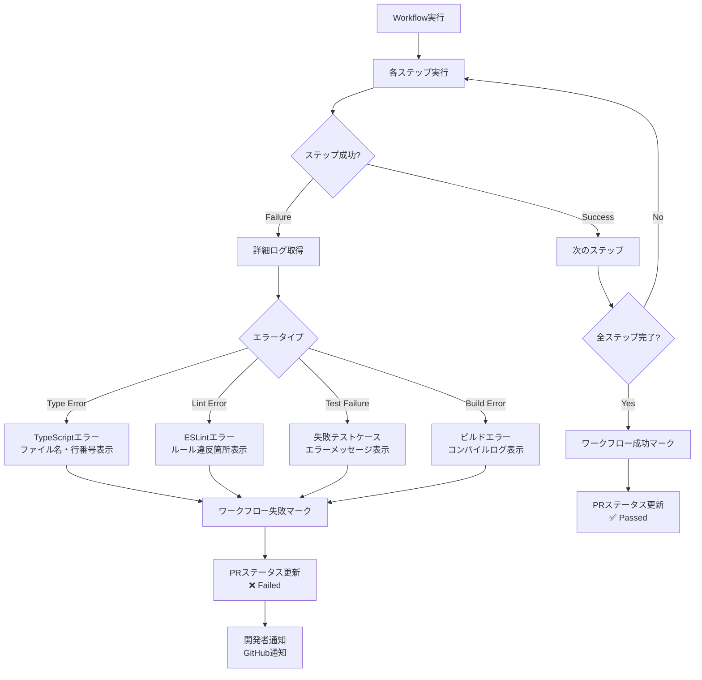
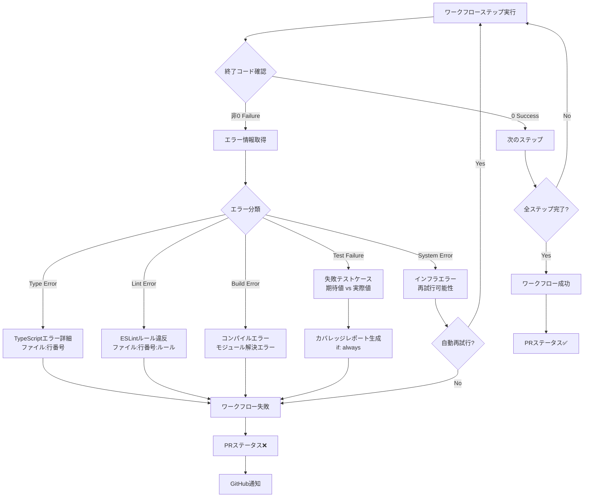

# Technical Design Document

## Overview

本機能は、Kirox CLIプロジェクトにGitHub Actions CI/CDワークフローを導入します。プルリクエストおよびmainブランチへのプッシュ時に自動的にコード品質検証を実行し、開発者に迅速なフィードバックを提供します。また、npmパッケージのリリースプロセスを自動化し、タグベースでのnpm公開とGitHubリリースノート生成を実現します。

**Purpose**: 開発者にコード品質の自動検証と迅速なフィードバックを提供し、リリースプロセスを標準化・自動化することで、手作業によるミスを防ぎ、プロジェクトの信頼性を向上させる。

**Users**: Kirox CLIプロジェクトの開発者とメンテナーが利用します。開発者はプルリクエスト作成時に自動CI検証を受け、メンテナーはタグプッシュによりnpm公開を実行します。

**Impact**: 現在CI/CDワークフローが存在しない状態から、完全自動化されたテスト・リント・ビルド検証環境へと移行します。手動でのnpm公開プロセスも自動化され、リリース作業の効率化と一貫性が実現されます。

### Goals

- プルリクエストとmainブランチプッシュ時の自動CI検証を実現
- 複数Node.jsバージョン（18, 20, 22）での並列テスト実行
- テストカバレッジの可視化とプルリクエストへの自動コメント投稿
- タグベースの自動npm公開とGitHubリリース作成
- ワークフロー実行時間の最適化（依存関係キャッシュ）

### Non-Goals

- プライベートリポジトリ用の高度なセキュリティスキャン（本プロジェクトはパブリック想定）
- デプロイメント環境へのCD（本プロジェクトはnpmパッケージのため、npm公開のみ）
- Slackやメール等への外部通知統合（将来的な拡張として検討）
- カバレッジ閾値によるワークフロー失敗制御（警告のみとし、ブロックはしない）

## Architecture

### Existing Architecture Analysis

Kirox CLIは現在CI/CDワークフローを持たないため、新規導入となります。既存のプロジェクト構造と技術スタックを尊重し、以下のパターンと制約を維持します。

- **既存のnpmスクリプト**: `package.json`で定義された`test`, `type-check`, `lint`, `build`スクリプトをそのまま利用
- **Vitestテストフレームワーク**: 既存のVitestセットアップ（`vitest.config.ts`）を変更せず、カバレッジ設定のみ拡張
- **Node.js 18+要件**: `package.json`の`engines`フィールドで定義されたNode.js 18以上の要件を満たす
- **TypeScript/ESMビルド**: 既存のTypeScriptコンパイル設定（`tsconfig.json`）を使用

### High-Level Architecture



**Architecture Integration**:

- **既存パターン保持**: npmスクリプトベースのビルド・テスト実行パターンを維持
- **新規コンポーネント**: `.github/workflows/`ディレクトリと2つのワークフローファイル（CI、Release）を追加
- **技術スタック適合**: Node.js、TypeScript、Vitestの既存スタックに完全適合
- **ステアリング準拠**: `tech.md`で定義されたNode.js 18+、TypeScript 5.x、Vitestの要件を満たす

## Technology Stack and Design Decisions

### Technology Alignment

本機能は既存のKirox CLIプロジェクトの技術スタックに完全に適合します。

**既存技術スタックの活用**:
- **GitHub Actions**: GitHubネイティブのCI/CDプラットフォーム、外部ツール不要
- **actions/checkout@v5**: リポジトリコードのチェックアウト（最新安定版）
- **actions/setup-node@v4**: Node.js環境のセットアップとnpm依存関係キャッシュ（最新安定版）
- **npm**: 既存のパッケージマネージャーを継続使用（yarn/pnpm移行なし）

**新規導入ライブラリ**:
- **davelosert/vitest-coverage-report-action@v2**: Vitestカバレッジレポートの自動PR投稿
  - 選定理由: Vitest公式ドキュメントで推奨、週200万DL以上の実績
  - 代替: 手動でカバレッジコメント投稿スクリプトを作成（保守コスト高）

**ステアリングとの整合性**:
- `tech.md`で定義されたNode.js 18+、TypeScript 5.x、Vitestの技術選定を尊重
- `structure.md`で定義されたプロジェクト構造（`.github/workflows/`配下にワークフロー配置）に従う

### Key Design Decisions

#### Decision 1: マトリクス戦略による複数Node.jsバージョンテスト

**Decision**: Node.js 18, 20, 22の3バージョンで並列テスト実行

**Context**: `package.json`で`engines.node: ">=18.0.0"`と定義されており、Node.js 18以降の互換性保証が必要。ユーザー環境は多様であり、複数バージョンでの動作検証が求められる。

**Alternatives**:
1. 単一バージョン（Node.js 20のみ）でテスト: 最速だが互換性リスク
2. すべてのLTSバージョン（16, 18, 20, 22）: 最も包括的だが実行時間増大
3. 最小・最大バージョン（18, 22）のみ: バランス型だが中間バージョンの問題を見逃す可能性

**Selected Approach**: Node.js 18（最小サポートバージョン）、20（現在のLTS）、22（次期LTS）の3バージョンでマトリクステスト

**Rationale**:
- Node.js 18: `engines`フィールドで定義された最小バージョン、互換性の下限を保証
- Node.js 20: 現在の推奨LTSバージョン、最も多くのユーザーが利用
- Node.js 22: 次期LTS、将来的な互換性を事前検証

**Trade-offs**:
- **得られるもの**: 幅広いNode.jsバージョンでの互換性保証、実運用環境の多様性をカバー
- **犠牲にするもの**: 単一バージョンと比較してCI実行時間が約3倍（並列実行により実時間は増加しない）

#### Decision 2: タグベース自動npm公開

**Decision**: `v*.*.*`形式のGitタグプッシュをトリガーとしたnpm公開ワークフロー

**Context**: 手動`npm publish`は人為的ミスのリスクがあり、バージョン不整合や公開忘れが発生しうる。リリースプロセスの標準化と自動化が求められる。

**Alternatives**:
1. mainブランチへのマージ時に自動公開: 最も自動化されているが、意図しない公開リスク
2. 手動ワークフロートリガー（workflow_dispatch）: 柔軟だがGitHub UI操作が必要
3. package.jsonバージョン変更検出による自動公開: コミット単位で動作するが、タグ管理が疎かになる

**Selected Approach**: Gitタグ（`v*.*.*`形式）プッシュによる自動トリガー型リリースワークフロー

**Rationale**:
- セマンティックバージョニング規約（v1.0.0）に準拠した明確なトリガー
- タグはGit履歴に永続的に記録され、リリース履歴の追跡が容易
- 意図的なタグプッシュのみが公開をトリガー、誤公開リスクを最小化
- GitHubリリースノートとの自然な統合（タグベースリリース）

**Trade-offs**:
- **得られるもの**: リリースプロセスの一貫性、誤公開防止、Git履歴との完全な統合
- **犠牲にするもの**: タグプッシュという追加ステップが必要（`git tag v1.0.0 && git push --tags`）

#### Decision 3: カバレッジレポートのPR自動コメント投稿

**Decision**: `davelosert/vitest-coverage-report-action@v2`を使用したカバレッジコメント自動投稿

**Context**: 開発者がカバレッジを定期的に確認できる仕組みがなく、テスト網羅性の低下リスクがある。PRレビュー時にカバレッジを可視化することで品質意識を向上させたい。

**Alternatives**:
1. カバレッジアーティファクトのみ保存: 最小限の実装だが、開発者が手動でダウンロードする必要
2. カスタムスクリプトでコメント投稿: 柔軟だが保守コストが高い
3. Codecov等の外部SaaSサービス: 高機能だが外部依存が増加

**Selected Approach**: GitHub公式推奨の`davelosert/vitest-coverage-report-action`を使用

**Rationale**:
- Vitest公式ドキュメントで推奨、週200万DL以上の実績と信頼性
- PRコメントの自動更新機能（スパム防止、同一コメントを編集）
- `file-coverage-mode: changes`により変更ファイルのみのカバレッジ表示が可能
- 追加の外部サービス契約や認証設定が不要（GitHub内で完結）

**Trade-offs**:
- **得られるもの**: PRレビュー時のカバレッジ可視化、開発者体験の向上、外部依存なし
- **犠牲にするもの**: サードパーティアクション依存（ただし、GitHub Marketplaceで検証済み）

## System Flows

### CI Workflow Execution Flow



### Release Workflow Execution Flow



### Error Handling Flow



## Requirements Traceability

| Requirement | 要件サマリー | Components | Interfaces | Flows |
|-------------|------------|------------|------------|-------|
| 1.1-1.9 | 継続的インテグレーション | CI Workflow | `on: pull_request/push` | CI Workflow Execution Flow |
| 2.1-2.4 | テストカバレッジレポート | Coverage Job, PR Comment | `davelosert/vitest-coverage-report-action@v2` | CI Workflow Execution Flow |
| 3.1-3.4 | 依存関係キャッシュ | Setup Node Job | `actions/setup-node@v4` with `cache: npm` | CI Workflow Execution Flow |
| 4.1-4.4 | ワークフロー並列実行 | Matrix Strategy | `strategy.matrix.node-version` | CI Workflow Execution Flow |
| 5.1-5.7 | リリースワークフロー | Release Workflow | `on: push tags v*.*.*` | Release Workflow Execution Flow |
| 6.1-6.4 | セキュリティとクレデンシャル | npm Publish Job | `NODE_AUTH_TOKEN` from secrets | Release Workflow Execution Flow |
| 7.1-7.4 | ステータスバッジ | README.md Badge | GitHub Actions Badge URL | - |
| 8.1-8.5 | エラー通知とデバッグ | Error Handling | Workflow logs, PR status | Error Handling Flow |

## Components and Interfaces

### CI/CD Layer

#### CI Workflow

**Responsibility & Boundaries**

- **Primary Responsibility**: プルリクエストおよびmainブランチプッシュ時にコード品質検証を自動実行し、結果をGitHub UIに表示
- **Domain Boundary**: CI/CD自動化ドメイン、コード品質検証プロセスの完全自動化
- **Data Ownership**: ワークフロー実行ログ、テスト結果、カバレッジレポート、PRステータス情報
- **Transaction Boundary**: 単一ワークフロー実行単位（プルリクエストまたはプッシュイベント毎）

**Dependencies**

- **Inbound**: GitHubプルリクエストイベント、mainブランチプッシュイベント
- **Outbound**: npm依存関係（`npm ci`）、TypeScriptコンパイラ、ESLint、Vitest
- **External**:
  - `actions/checkout@v5` - GitHubリポジトリコードチェックアウト
  - `actions/setup-node@v4` - Node.js環境セットアップとキャッシュ管理
  - `davelosert/vitest-coverage-report-action@v2` - カバレッジレポートPR投稿

**External Dependencies Investigation**:

- **actions/setup-node@v4**:
  - **キャッシュ機能**: `cache: 'npm'`オプションで`package-lock.json`ハッシュベースの自動キャッシュ
  - **認証**: `registry-url`と`NODE_AUTH_TOKEN`によるnpmレジストリ認証サポート
  - **バージョン管理**: `node-version`でセマンティックバージョニング指定可能（`18.x`, `20.x`等）
  - **互換性**: GitHub-hosted runners（ubuntu-latest, windows-latest, macos-latest）で完全サポート

- **davelosert/vitest-coverage-report-action@v2**:
  - **必須権限**: `pull-requests: write`（PRコメント投稿）、`contents: read`（コードチェックアウト）
  - **Vitest設定要件**: `coverage.reporter`に`json-summary`と`json`を含める必要
  - **コメント更新**: 既存のカバレッジコメントを検出し、新規作成ではなく編集で更新（スパム防止）
  - **カバレッジ閾値**: オプションで閾値設定可能だが、本設計では警告のみ（ワークフロー失敗なし）
  - **制約**: フォークからのPRでは`GITHUB_TOKEN`権限制限によりコメント投稿不可（セキュリティ制約）

**Contract Definition**

**Workflow Trigger Contract**:

```yaml
on:
  pull_request:
    branches: [main]
  push:
    branches: [main]
```

- **Preconditions**: GitHubリポジトリに`.github/workflows/ci.yml`が存在すること
- **Postconditions**: 成功時はPRステータスが✅、失敗時は❌として表示
- **Invariants**: 各Node.jsバージョンで独立してテスト実行、1つ失敗すれば全体が失敗

**Job Matrix Strategy**:

| Node Version | OS | キャッシュ | 実行ステップ |
|-------------|-----|---------|------------|
| 18.x | ubuntu-latest | npm | Type Check, Lint, Build, Test |
| 20.x | ubuntu-latest | npm | Type Check, Lint, Build, Test, Coverage |
| 22.x | ubuntu-latest | npm | Type Check, Lint, Build, Test |

**CI Steps Interface**:

```typescript
interface CISteps {
  checkout(): Promise<void>;                    // actions/checkout@v5
  setupNode(version: string): Promise<void>;    // actions/setup-node@v4
  installDependencies(): Promise<void>;         // npm ci
  typeCheck(): Promise<void>;                   // npm run type-check
  lint(): Promise<void>;                        // npm run lint
  build(): Promise<void>;                       // npm run build
  test(): Promise<void>;                        // npm test
  reportCoverage(): Promise<void>;              // vitest-coverage-report-action (Node 20のみ)
}
```

各ステップの戻り値は成功時は`resolved Promise`、失敗時は`rejected Promise`（ワークフロー失敗）

**State Management**:

- **State Model**: ワークフロー実行ステート（Queued → In Progress → Completed/Failed）
- **Persistence**: GitHub ActionsランナーのメモリとGitHub API（ステータスチェック結果）
- **Concurrency**: 複数PRやプッシュイベントは独立したワークフローインスタンスとして並列実行

**Integration Strategy**:

- **Modification Approach**: 新規ワークフローファイル作成（`.github/workflows/ci.yml`）
- **Backward Compatibility**: 既存コードに変更なし、npmスクリプトをそのまま利用
- **Migration Path**: 段階的移行不要、ワークフローファイル追加で即座に有効化

#### Release Workflow

**Responsibility & Boundaries**

- **Primary Responsibility**: Gitタグ（`v*.*.*`）プッシュをトリガーとしたnpm公開とGitHubリリース作成の自動化
- **Domain Boundary**: リリース自動化ドメイン、npmパッケージ公開プロセスの完全自動化
- **Data Ownership**: npmパッケージバイナリ、GitHubリリースノート、公開ログ
- **Transaction Boundary**: 単一リリースプロセス（タグプッシュから公開完了まで）

**Dependencies**

- **Inbound**: Gitタグプッシュイベント（`v*.*.*`形式）
- **Outbound**: npm依存関係、TypeScriptコンパイラ、npmレジストリ、GitHub Releases API
- **External**:
  - `actions/checkout@v5` - コードチェックアウト
  - `actions/setup-node@v4` - Node.js環境とnpmレジストリ認証設定
  - npmレジストリ（registry.npmjs.org） - パッケージ公開先

**External Dependencies Investigation**:

- **npm publish認証**:
  - **NPM_TOKEN**: GitHub Secretsに保存されたnpm Automation Tokenを使用
  - **NODE_AUTH_TOKEN**: `actions/setup-node`が環境変数として自動設定
  - **レジストリURL**: `registry-url: 'https://registry.npmjs.org'`で指定
  - **認証フロー**: setup-node → `.npmrc`ファイル生成 → `npm publish`実行時に自動認証

- **GitHub Releases API**:
  - **自動リリースノート**: タグ名とコミット履歴から自動生成
  - **アセット添付**: 必要に応じてビルド成果物を添付可能（本設計では不使用）
  - **権限**: `contents: write`権限が必要（デフォルトGITHUB_TOKENで対応）

**Contract Definition**

**Workflow Trigger Contract**:

```yaml
on:
  push:
    tags:
      - 'v*.*.*'
```

- **Preconditions**: `v*.*.*`形式のタグがリモートリポジトリにプッシュされること
- **Postconditions**: 成功時はnpmレジストリに公開され、GitHubリリースが作成される
- **Invariants**: CI検証が全て成功しない限りnpm公開は実行されない

**Release Steps Interface**:

```typescript
interface ReleaseSteps {
  checkout(): Promise<void>;                      // actions/checkout@v5
  setupNode(): Promise<void>;                     // actions/setup-node@v4 with registry-url
  installDependencies(): Promise<void>;           // npm ci
  runCIValidation(): Promise<void>;               // Type Check + Lint + Build + Test
  publishToNpm(): Promise<PublishResult>;         // npm publish
  createGitHubRelease(): Promise<ReleaseResult>;  // GitHub Releases API
}

interface PublishResult {
  success: boolean;
  packageName: string;
  version: string;
  tarballUrl: string;
}

interface ReleaseResult {
  success: boolean;
  releaseUrl: string;
  tagName: string;
}
```

**Error Scenarios**:

| エラーケース | 検出方法 | 対応 |
|-------------|---------|------|
| NPM_TOKEN未設定 | `npm publish`実行前 | ワークフロー失敗、エラーログ出力 |
| CI検証失敗 | Type Check/Lint/Test失敗 | npm公開スキップ、ワークフロー失敗 |
| npm公開失敗 | npm publish exit code非0 | ワークフロー失敗、詳細ログ出力 |
| バージョン重複 | npm publish 403エラー | ワークフロー失敗、「既に公開済み」メッセージ |

**State Management**:

- **State Model**: リリースステート（Triggered → CI Validation → Publishing → Released/Failed）
- **Persistence**: npmレジストリ（公開パッケージ）、GitHub Releases（リリースノート）
- **Concurrency**: 複数タグ同時プッシュは独立したワークフローとして並列実行（ただし推奨されない）

**Integration Strategy**:

- **Modification Approach**: 新規ワークフローファイル作成（`.github/workflows/release.yml`）
- **Backward Compatibility**: 既存の手動`npm publish`プロセスも引き続き利用可能
- **Migration Path**: ワークフローファイル追加 → NPM_TOKEN設定 → タグプッシュでテスト

#### Coverage Reporter

**Responsibility & Boundaries**

- **Primary Responsibility**: Vitestカバレッジレポートを生成し、プルリクエストにカバレッジサマリーコメントを投稿
- **Domain Boundary**: テストカバレッジ可視化ドメイン、PRレビュー補助情報の提供
- **Data Ownership**: カバレッジレポートJSON（`coverage-summary.json`、`coverage-final.json`）、PRコメント内容
- **Transaction Boundary**: 単一PRイベント単位（コメント投稿・更新）

**Dependencies**

- **Inbound**: CIワークフローのテストステップ（Vitest実行）
- **Outbound**: GitHub Pull Requests API（コメント投稿）、GitHub Actions artifacts（カバレッジレポート保存）
- **External**:
  - `davelosert/vitest-coverage-report-action@v2` - カバレッジレポート生成とPR投稿

**Contract Definition**

**Action Configuration**:

```yaml
- name: 'Report Coverage'
  uses: davelosert/vitest-coverage-report-action@v2
  if: always()  # テスト失敗時もカバレッジレポート生成
  with:
    working-directory: ./
    file-coverage-mode: 'changes'  # 変更ファイルのみカバレッジ表示
```

**Input Requirements**:
- Vitestが生成した`coverage/coverage-summary.json`と`coverage/coverage-final.json`が存在すること
- `pull-requests: write`権限が付与されていること

**Output Format**:

PRコメント例:
```markdown
## Coverage Report

| Category | Percentage | Covered / Total |
|----------|-----------|-----------------|
| Statements | 85.2% | 1024 / 1200 |
| Branches | 78.5% | 314 / 400 |
| Functions | 90.1% | 180 / 200 |
| Lines | 84.8% | 1018 / 1200 |

### Changed Files

| File | Statements | Branches | Functions | Lines |
|------|-----------|----------|-----------|-------|
| src/cli/parser.ts | 95.0% | 85.0% | 100% | 94.5% |
| src/github/fetcher.ts | 80.2% | 72.1% | 88.9% | 79.8% |
```

**State Management**:

- **State Model**: コメントステート（Not Posted → Posted → Updated）
- **Persistence**: GitHub Pull Request Comments（GitHub API）
- **Concurrency**: 同一PRへの複数コミットは既存コメントを更新（新規作成しない）

#### README Badge Component

**Responsibility & Boundaries**

- **Primary Responsibility**: README.mdにCI/CDワークフローステータスバッジを表示
- **Domain Boundary**: プロジェクトメタ情報表示ドメイン、外部ユーザーへの視覚的フィードバック
- **Data Ownership**: バッジマークダウン（静的テキスト）
- **Transaction Boundary**: README.md更新時（手動編集）

**Dependencies**

- **Inbound**: なし（静的マークダウン）
- **Outbound**: GitHub Actions Badge Service（`https://github.com/{owner}/{repo}/actions/workflows/{workflow}.yml/badge.svg`）
- **External**: GitHub Badge Service（GitHub内部サービス、外部API不要）

**Contract Definition**

**Badge Markdown**:

```markdown
[](https://github.com/{owner}/{repo}/actions/workflows/ci.yml)
[](https://github.com/{owner}/{repo}/actions/workflows/release.yml)
```

**Badge States**:
- 🟢 **Passing**: 最新のワークフロー実行が成功
- 🔴 **Failing**: 最新のワークフロー実行が失敗
- ⚪ **No Status**: ワークフローが一度も実行されていない

**Integration Strategy**:

- **Modification Approach**: README.md先頭にバッジマークダウンを追加
- **Backward Compatibility**: README.mdの既存内容に影響なし
- **Migration Path**: バッジマークダウン追加 → ワークフロー実行でバッジ有効化

## Data Models

### Workflow Configuration Model

本機能はYAMLベースのワークフロー定義を使用します。複雑なドメインモデルは不要ですが、主要なワークフロー設定構造を以下に示します。

#### CI Workflow Schema

```typescript
interface CIWorkflow {
  name: string;                      // "CI"
  on: WorkflowTrigger;               // pull_request, push
  jobs: {
    test: CIJob;
  };
}

interface WorkflowTrigger {
  pull_request: {
    branches: string[];              // ["main"]
  };
  push: {
    branches: string[];              // ["main"]
  };
}

interface CIJob {
  runs_on: string;                   // "ubuntu-latest"
  strategy: MatrixStrategy;
  permissions: JobPermissions;
  steps: Step[];
}

interface MatrixStrategy {
  matrix: {
    node_version: string[];          // ["18.x", "20.x", "22.x"]
  };
}

interface JobPermissions {
  contents: "read";                  // リポジトリ読み取り
  pull_requests: "write";            // PRコメント書き込み
}

interface Step {
  name?: string;
  uses?: string;                     // アクション名（例: "actions/checkout@v5"）
  run?: string;                      // シェルコマンド
  with?: Record<string, string>;    // アクションパラメータ
  if?: string;                       // 条件式
  env?: Record<string, string>;     // 環境変数
}
```

#### Release Workflow Schema

```typescript
interface ReleaseWorkflow {
  name: string;                      // "Release"
  on: ReleaseWorkflowTrigger;        // push tags v*.*.*
  jobs: {
    publish: PublishJob;
  };
}

interface ReleaseWorkflowTrigger {
  push: {
    tags: string[];                  // ["v*.*.*"]
  };
}

interface PublishJob {
  runs_on: string;                   // "ubuntu-latest"
  permissions: PublishPermissions;
  steps: Step[];
}

interface PublishPermissions {
  contents: "write";                 // リリース作成
  id_token: "write";                 // OIDC認証（将来的なTrusted Publishing用）
}
```

#### Coverage Report Data Model

```typescript
interface CoverageSummary {
  total: CoverageMetrics;
  [filePath: string]: CoverageMetrics;
}

interface CoverageMetrics {
  lines: CoverageCategory;
  statements: CoverageCategory;
  functions: CoverageCategory;
  branches: CoverageCategory;
}

interface CoverageCategory {
  total: number;                     // 総数
  covered: number;                   // カバー済み数
  skipped: number;                   // スキップ数
  pct: number;                       // カバレッジ率（パーセント）
}
```

Vitestは`coverage/coverage-summary.json`にこの形式でカバレッジデータを出力し、`vitest-coverage-report-action`がこれを解析してPRコメントを生成します。

## Error Handling

### Error Strategy

GitHub Actionsワークフローでは、各ステップの失敗を検出し、適切なエラーメッセージとログを出力することで、開発者が問題を迅速に特定・解決できるようにします。エラーは以下のカテゴリに分類され、それぞれ異なる対応を行います。

### Error Categories and Responses

#### CI Validation Errors (4xx相当)

**Type Check Errors (TypeScript)**:
- **検出**: `npm run type-check`の終了コード非0
- **対応**: TypeScriptコンパイラの詳細エラーメッセージをワークフローログに出力、該当ファイルと行番号を表示
- **Recovery**: ワークフロー失敗としてマーク、PRステータス❌、開発者が型エラーを修正してプッシュ

**Lint Errors (ESLint)**:
- **検出**: `npm run lint`の終了コード非0
- **対応**: ESLintルール違反の詳細（ファイル名、行番号、ルール名、エラーメッセージ）をログ出力
- **Recovery**: ワークフロー失敗、PRステータス❌、開発者がリント違反を修正

**Test Failures (Vitest)**:
- **検出**: `npm test`の終了コード非0
- **対応**: 失敗したテストケース名、期待値と実際の値、スタックトレースをログ出力
- **Recovery**: ワークフロー失敗、PRステータス❌、カバレッジレポートは`if: always()`により生成継続

**Build Errors (TypeScript Compilation)**:
- **検出**: `npm run build`の終了コード非0
- **対応**: TypeScriptコンパイルエラーの詳細をログ出力、モジュール解決エラーや構文エラーを表示
- **Recovery**: ワークフロー失敗、PRステータス❌、開発者がビルドエラーを修正

#### System Errors (5xx相当)

**Dependency Installation Failures**:
- **検出**: `npm ci`の終了コード非0
- **対応**: npm CLIエラーメッセージをログ出力、ネットワークエラーやpackage-lock.json不整合を診断
- **Recovery**: ワークフロー失敗、開発者が依存関係を修正または`npm install`でpackage-lock.json更新

**Cache Restoration Failures**:
- **検出**: `actions/setup-node`のキャッシュ復元失敗（警告のみ、ワークフロー継続）
- **対応**: キャッシュミスログを出力、通常の`npm ci`にフォールバック
- **Recovery**: パフォーマンス低下のみ、機能的影響なし

**GitHub Actions Infrastructure Failures**:
- **検出**: アクション自体の実行失敗（actions/checkoutタイムアウト等）
- **対応**: GitHub Actionsシステムエラーメッセージをログ出力
- **Recovery**: ワークフロー自動再実行（GitHub Actionsの再試行機能）、または手動再実行

#### Release-Specific Errors (422相当)

**NPM_TOKEN Missing**:
- **検出**: `npm publish`実行時の認証エラー
- **対応**: 「NPM_TOKENが設定されていません。GitHub Secretsに追加してください」とエラーメッセージ出力
- **Recovery**: ワークフロー失敗、メンテナーがNPM_TOKENをGitHub Secretsに追加

**Version Already Published**:
- **検出**: `npm publish`の403/409エラー
- **対応**: 「バージョン{version}は既に公開されています」とメッセージ出力
- **Recovery**: ワークフロー失敗、メンテナーがpackage.jsonバージョンを更新して新しいタグを作成

**CI Validation Failure Before Publish**:
- **検出**: Type Check/Lint/Test/Buildのいずれかが失敗
- **対応**: 「CI検証が失敗したため、npm公開をスキップします」とメッセージ出力
- **Recovery**: ワークフロー失敗、メンテナーがコードを修正してタグを再作成

### Error Handling Flow



### Monitoring

#### Workflow Execution Monitoring

**GitHub Actions UI**:
- ワークフロー実行履歴はGitHub Actions UIで確認可能
- 各ステップの実行時間、ログ、終了コードがリアルタイム表示
- 失敗したステップは赤色でハイライト

**PR Status Checks**:
- PRページにCI/Releaseワークフローのステータスが表示
- ✅（成功）、❌（失敗）、🟡（実行中）のアイコンで状態を可視化
- "Details"リンクからワークフロー実行ページへ遷移

**Email Notifications**:
- GitHub Actionsはデフォルトでワークフロー失敗時にリポジトリウォッチャーにメール通知
- 通知設定はGitHub Settings → Notifications → Actionsでカスタマイズ可能

#### Error Tracking

**Structured Logging**:
- 各ステップのログはGitHub Actionsログストリームに記録
- ログレベル（info, warning, error）に応じて色分け表示
- `::error::`、`::warning::`構文で構造化ログ出力可能

**Failure Pattern Analysis**:
- GitHub Actions UIでワークフロー失敗パターンを分析可能
- 特定のNode.jsバージョンでのみ失敗する場合、マトリクス戦略のログで識別

**Performance Metrics**:
- 各ステップの実行時間がログに記録
- キャッシュヒット率は`actions/setup-node`のログで確認
- ワークフロー全体の実行時間はActions UIサマリーに表示

## Testing Strategy

### Unit Tests (既存テストスイートの継続)

本機能はワークフロー定義（YAMLファイル）のため、Kirox CLI本体のユニットテストに変更はありません。既存の以下のテストを継続実行します。

- **CLI Layer**: `tests/unit/cli/parser.test.ts`, `tests/unit/cli/validator.test.ts`
- **GitHub Layer**: `tests/unit/github/fetcher.test.ts`, `tests/unit/github/semaphore.test.ts`
- **Filesystem Layer**: `tests/unit/filesystem/writer.test.ts`
- **Reporting Layer**: `tests/unit/reporting/error-handler.test.ts`

これらのテストは全てCIワークフローで自動実行されます。

### Integration Tests (既存統合テストの継続)

既存の統合テストもCIワークフローで自動実行されます。

- **CLI to GitHub**: `tests/integration/cli-to-github.test.ts` - CLI引数からGitHub API呼び出しまでの統合
- **GitHub to FileSystem**: `tests/integration/github-to-fs.test.ts` - GitHub APIレスポンスからファイル書き込みまでの統合
- **Error Recovery**: `tests/integration/error-recovery.test.ts` - エラー時のリカバリーフローテスト

### Workflow Tests (新規テスト項目)

GitHub Actionsワークフロー自体のテストは、以下の手法で実施します。

#### Workflow Syntax Validation

**ローカル検証**:
- `actionlint`（GitHub Actions Linter）をローカル開発環境で使用し、YAML構文とワークフロー定義の妥当性を検証
- 未使用の環境変数、存在しないアクション、無効な条件式を事前検出

**CI統合**:
- PRワークフローで`actionlint`を実行し、ワークフロー定義の品質を自動チェック（将来的な拡張）

#### Manual Workflow Testing

**初回導入テスト**:
1. CIワークフローのテスト:
   - テスト用ブランチでプルリクエストを作成
   - 各Node.jsバージョン（18, 20, 22）でのテスト実行を確認
   - カバレッジレポートがPRコメントとして投稿されることを確認
   - 意図的にテスト失敗・リント違反を導入し、ワークフロー失敗を確認

2. Releaseワークフローのテスト:
   - テストタグ（`v0.0.1-test`）を作成してプッシュ
   - CI検証ステップがすべて実行されることを確認
   - npm公開をスキップするための`if: false`条件を一時的に追加してテスト
   - 実際のnpm公開テスト（初回リリース時のみ）

**継続的な検証**:
- 実際のPRおよびリリースプロセスでワークフローが正常動作することを継続的に確認
- ワークフロー失敗時のエラーメッセージとログの有用性を評価

#### Performance Testing

**キャッシュ効率テスト**:
- 同一`package-lock.json`での連続ワークフロー実行時のキャッシュヒット率確認
- キャッシュヒット時とミス時の`npm ci`実行時間比較（期待: 50%以上の時間短縮）

**並列実行テスト**:
- 複数Node.jsバージョンでの並列実行時間が単一バージョンの3倍にならないことを確認
- マトリクス戦略による並列化効果の測定

### E2E Tests (ワークフロー全体のシナリオテスト)

#### Happy Path Scenarios

1. **通常のPR作成フロー**:
   - 開発者がfeatureブランチからmainへPR作成
   - CIワークフローが自動トリガー
   - 全Node.jsバージョンでテスト成功
   - カバレッジレポートがPRコメントとして投稿
   - PRステータスが✅に更新
   - PRマージ可能

2. **リリースフロー**:
   - メンテナーがpackage.jsonのバージョンを更新（例: 1.0.0 → 1.1.0）
   - `git tag v1.1.0 && git push --tags`でタグプッシュ
   - Releaseワークフローが自動トリガー
   - CI検証（Type Check, Lint, Build, Test）が全て成功
   - `npm publish`が実行され、npmレジストリに公開
   - GitHubリリースが自動作成され、リリースノートが生成

#### Error Scenarios

1. **テスト失敗時のフロー**:
   - PRにテスト失敗を含むコミットをプッシュ
   - CIワークフローが実行され、Vitestが失敗
   - カバレッジレポートは`if: always()`により生成
   - PRステータスが❌に更新
   - 開発者がテストを修正してプッシュ
   - CIが再実行され、成功後にPRステータスが✅に更新

2. **リリース失敗時のフロー**:
   - メンテナーが既に公開済みのバージョンでタグプッシュ
   - Releaseワークフローが実行
   - `npm publish`が403エラーで失敗
   - ワークフロー失敗、「既に公開済み」エラーメッセージ出力
   - メンテナーがバージョンを更新して新しいタグを作成

### Coverage Targets

本機能はワークフロー定義（YAML）のため、コードカバレッジ指標は適用されません。代わりに、以下の品質指標を使用します。

**ワークフロー定義の網羅性**:
- 全要件（Requirement 1-8）がワークフローステップとして実装されていること
- エラーシナリオ（CI失敗、リリース失敗）が適切にハンドリングされていること
- ドキュメント（README.md、設計書）とワークフロー実装が一致していること

**実行成功率**:
- 正常系PRでのCI成功率: 95%以上（開発者の意図的なテスト失敗を除く）
- リリースワークフロー成功率: 100%（CI検証が成功している場合）

## Security Considerations

### Threat Modeling

#### T1: NPM_TOKEN漏洩

**脅威**: NPM_TOKENがログに出力されたり、公開リポジトリに誤ってコミットされることで、悪意のある第三者がKiroxパッケージを不正に公開できる。

**対策**:
- NPM_TOKENはGitHub Secretsに保存し、ワークフロー内で`${{ secrets.NPM_TOKEN }}`として参照
- GitHub Actionsは自動的にシークレット値をログから検閲（`***`表示）
- `npm publish`実行時の`--dry-run`オプションでリハーサル可能（トークン検証のみ）

**検証**:
- ワークフローログを手動確認し、NPM_TOKENが平文で出力されていないことを確認
- GitHub Secretsページで最終使用日時を確認し、予期しないアクセスがないかモニタリング

#### T2: フォークからのPRによる悪意のあるワークフロー実行

**脅威**: 外部貢献者のフォークからのPRで、悪意のあるコードがCIワークフローで実行される可能性。

**対策**:
- フォークからのPRでは`GITHUB_TOKEN`の権限が制限され、`pull-requests: write`が無効化（GitHubデフォルト動作）
- カバレッジレポート投稿はフォークPRでは失敗するが、CIテスト自体は正常実行
- 重要なシークレット（NPM_TOKEN）はReleaseワークフローのみで使用し、フォークPRでは利用不可

**検証**:
- テスト用フォークリポジトリからPRを作成し、カバレッジコメント投稿が失敗することを確認
- フォークPRでNPM_TOKENにアクセスできないことを確認

#### T3: 依存関係の侵害（Supply Chain Attack）

**脅威**: `actions/checkout`, `actions/setup-node`, `davelosert/vitest-coverage-report-action`等のサードパーティアクションが侵害され、悪意のあるコードが実行される。

**対策**:
- アクションバージョンをSHA-256コミットハッシュで固定（例: `actions/checkout@<commit-hash>`）
- 定期的にアクション更新を確認し、セキュリティアドバイザリをモニタリング
- Dependabot Alertsを有効化し、脆弱性のある依存関係を自動検出

**検証**:
- GitHub Security Advisoriesで使用中のアクションの脆弱性情報を定期確認
- Dependabot PRを定期的にレビューし、アクション更新を適用

### Authentication and Authorization

#### GitHub Actions GITHUB_TOKEN

**権限スコープ**:
- **CI Workflow**: `contents: read`（コードチェックアウト）、`pull-requests: write`（カバレッジコメント投稿）
- **Release Workflow**: `contents: write`（GitHubリリース作成）、`id-token: write`（将来的なOIDC認証用）

**権限最小化**:
- 各ワークフローで必要最小限の権限のみを明示的に付与
- `permissions`キーでデフォルト権限を上書き、不要な権限を無効化

#### NPM Authentication

**NPM_TOKEN管理**:
- npm Automation Tokenを使用（Publish権限のみ、読み取り権限なし）
- トークンはGitHub Secretsに保存、環境変数として`NODE_AUTH_TOKEN`に設定
- トークンの有効期限を定期的に確認し、ローテーション

**認証フロー**:
1. `actions/setup-node@v4`で`registry-url: 'https://registry.npmjs.org'`を指定
2. アクションが`.npmrc`ファイルを自動生成し、`NODE_AUTH_TOKEN`を参照
3. `npm publish`実行時に`.npmrc`の認証情報が使用される

### Data Protection

#### Secrets Management

**保護対象**:
- NPM_TOKEN（npm公開用認証トークン）
- GITHUB_TOKEN（GitHub API認証、自動生成）

**保護手段**:
- GitHub Secretsは暗号化されて保存され、ワークフロー実行時のみ復号化
- ログ出力時の自動検閲（`***`マスキング）
- フォークPRではシークレットにアクセス不可（GitHubセキュリティ制約）

#### Audit Logging

**ワークフロー実行ログ**:
- 全ワークフロー実行ログはGitHub Actionsに90日間保存
- ログにはステップ実行時間、終了コード、標準出力・エラー出力が含まれる
- リポジトリ管理者はログをダウンロードして長期保存可能

**npm公開履歴**:
- npm公開履歴はnpmレジストリに永続的に記録
- パッケージページで公開日時、バージョン、公開者を確認可能

## Performance & Scalability

### Target Metrics

#### CI Workflow Performance

**実行時間目標**:
- **キャッシュヒット時**: 総実行時間3分以内（依存関係インストール30秒、テスト2分）
- **キャッシュミス時**: 総実行時間5分以内（依存関係インストール2分、テスト2分）
- **並列実行**: 3つのNode.jsバージョンジョブが並列実行され、最遅ジョブの時間が全体実行時間

**パフォーマンス最適化**:
- `npm ci`の代わりに`npm ci --prefer-offline`でオフラインキャッシュ優先（将来的な拡張）
- Vitestの`--run`フラグで監視モード無効化（CI環境では不要）
- `actions/setup-node`のキャッシュ機能でnpm依存関係を自動キャッシュ

#### Release Workflow Performance

**実行時間目標**:
- **CI検証**: 3分以内（単一Node.js 20バージョンで実行）
- **npm公開**: 30秒以内
- **GitHubリリース作成**: 10秒以内
- **総実行時間**: 5分以内

### Scaling Approaches

#### Horizontal Scaling (並列実行)

**マトリクス戦略**:
- 複数Node.jsバージョン（18, 20, 22）のジョブをGitHub Actions runnerで並列実行
- 各ジョブは独立したrunner VMで実行され、リソース競合なし
- GitHub Actionsの同時実行制限（Public: 20並列、Private: 5並列）内で動作

**将来的な拡張**:
- OSマトリクス追加（ubuntu-latest, windows-latest, macos-latest）でクロスプラットフォーム検証
- ただし、実行時間が3倍に増加するため、慎重に検討

#### Caching Strategy

**npm依存関係キャッシュ**:
- `package-lock.json`のハッシュ値をキャッシュキーとして使用
- キャッシュヒット時は`npm ci`の依存関係ダウンロードをスキップ
- キャッシュサイズ: 約100-200MB（Kirox CLIの依存関係）

**キャッシュ無効化**:
- `package-lock.json`が更新されると自動的に新しいキャッシュを生成
- 古いキャッシュは7日間保持され、その後自動削除

**TypeScriptビルドキャッシュ**:
- TypeScriptコンパイル結果（`dist/`）はキャッシュしない（ビルド時間が短いため不要）
- 将来的にビルド時間が増加した場合、`actions/cache`で`dist/`をキャッシュ可能

### Performance Monitoring

**GitHub Actions Insights**:
- リポジトリSettings → Actionsでワークフロー実行時間の統計を確認
- 各ステップの実行時間分布を分析し、ボトルネックを特定

**キャッシュヒット率**:
- `actions/setup-node`のログで`Cache restored successfully`メッセージを確認
- キャッシュミス時は`Cache not found`と表示

**最適化候補**:
- テスト並列化（Vitestの`--threads`オプション）でテスト実行時間短縮
- E2Eテストを別ワークフローに分離し、通常CIの実行時間を削減
