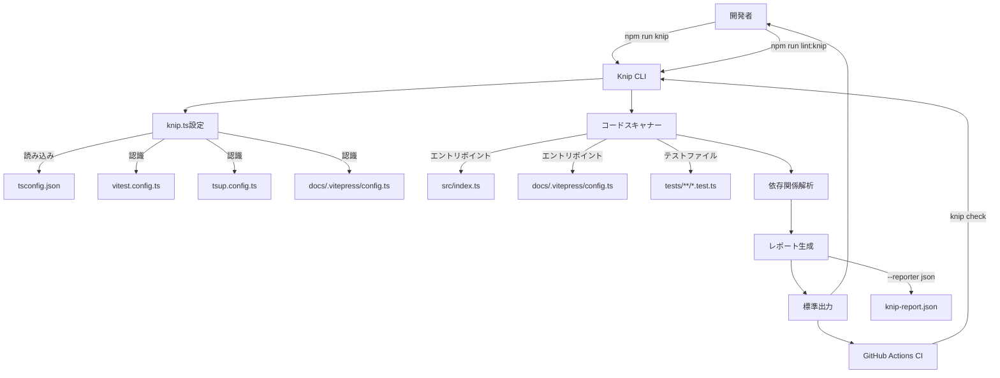
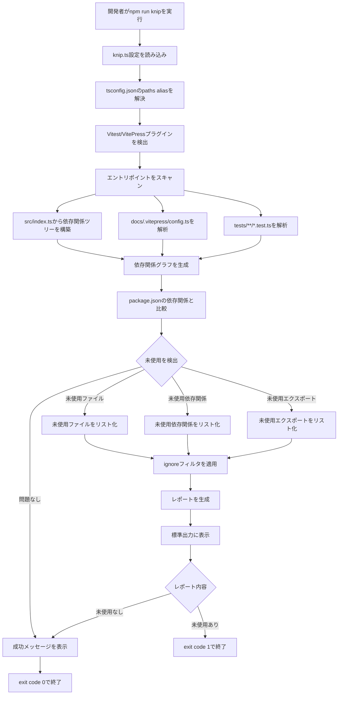
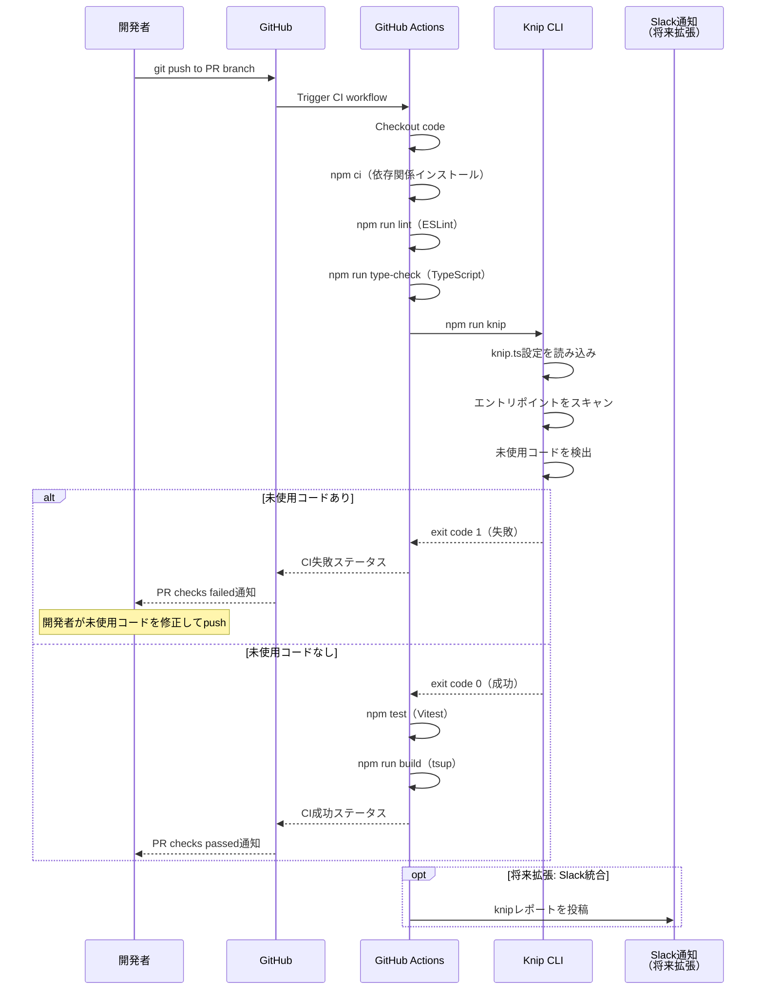
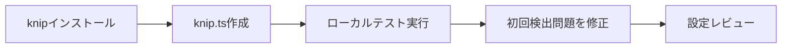

# Technical Design: kirox-knip

## Overview

Kiroxプロジェクトにknipを統合し、未使用のファイル、依存関係、エクスポートを自動検出する仕組みを構築します。knipはTypeScript/JavaScriptプロジェクト向けの静的解析ツールで、エントリポイントから依存関係ツリーを計算し、未使用コードを報告します。

**Purpose**: 開発者が定期的にコードベースの健全性を確認し、不要なコードや依存関係を削減することで、バンドルサイズの最適化、ビルド時間の短縮、保守コストの削減を実現します。

**Users**: Kirox開発者、コントリビューター、CI/CDパイプライン

**Impact**: 既存のlintワークフローに新しい品質チェックレイヤーを追加します。現在の`npm run lint`、`npm test`、GitHub Actionsワークフローを拡張し、未使用コード検出を自動化します。

### Goals

- Kiroxプロジェクトの複数エントリポイント（CLI、VitePress docs、テスト）に対応したknip設定を確立
- 開発ワークフロー（ローカルlint、CI/CD）にknip検査を統合
- 誤検出を防ぐための例外処理とホワイトリスト設定を実装
- 理解しやすいレポート出力と、チーム共有可能なドキュメントを提供

### Non-Goals

- 検出された未使用コードの自動削除（手動レビューと判断が必要）
- レガシーコードの大規模リファクタリング（段階的に対応）
- VitePressやVitestなど外部ツールのknip設定変更（公式プラグインに準拠）

## Architecture

### Existing Architecture Analysis

Kiroxは4層アーキテクチャ（CLI、GitHub、FileSystem、Reporting）を持つTypeScript ESMプロジェクトです。既存のビルド・テスト・lint構成は以下の通り：

- **ビルド**: tsup（ESMバンドル、minify有効）
- **テスト**: Vitest（単体・統合・E2E）
- **Lint**: ESLint（TypeScript推奨ルール）
- **型チェック**: TypeScript 5.x（strict mode）
- **ドキュメント**: VitePress（`docs/.vitepress/`）

knipはこれらの既存ツールと並行して動作し、既存の`package.json`スクリプトやCI/CDワークフローに新しいチェックステップを追加します。既存アーキテクチャへの変更は最小限に抑え、設定ファイルとnpmスクリプトの追加のみで実現します。

### High-Level Architecture



### Technology Alignment

Kiroxは既存の技術スタックを維持し、knipを追加の開発依存関係として導入します：

**既存技術スタックとの整合性**:
- **TypeScript 5.x**: knipはTypeScriptのコンパイラAPIを使用してコード解析を実行（完全互換）
- **ESM (ES Modules)**: knipはESMプロジェクトをネイティブサポート
- **Vitest**: knipは公式Vitestプラグインを提供（`vitest.config.ts`を自動認識）
- **VitePress**: knipのViteプラグインがVitePress設定を認識

**新規導入依存関係**:
- `knip`（devDependency）: 最新版（v5.x推奨、2025年時点で活発にメンテナンス）

**既存パターンの維持**:
- path alias（`@/*`）の解決: knipは`tsconfig.json`の`compilerOptions.paths`を自動認識
- 4層アーキテクチャ: knipはアーキテクチャに影響を与えず、静的解析のみを実行
- ケバブケースファイル命名: knip設定ファイルも`knip.ts`として命名規則に準拠

### Key Design Decisions

#### 決定1: knip.ts（TypeScript）vs knip.json（JSON）設定ファイル

**Context**: knipは`knip.json`または`knip.ts`（TypeScript）の設定ファイルをサポートします。Kiroxプロジェクトではどちらを選択するか決定する必要があります。

**Alternatives**:
1. **knip.json**: 静的JSON設定、シンプルで可読性が高い
2. **knip.ts**: TypeScript設定、型安全性と動的設定が可能
3. **knip.config.js**: JavaScript設定、動的設定可能だが型安全性なし

**Selected Approach**: **knip.ts（TypeScript設定）**

Kiroxプロジェクトは既にTypeScript中心のプロジェクトであり、以下の設定を動的に生成できます：
- `tsconfig.json`のpaths aliasを読み込んで検証
- package.jsonのbinフィールドを読み込んで除外パターンを生成
- 環境変数（CI環境など）に応じた設定の切り替え

**Rationale**:
- **型安全性**: TypeScriptの型チェックにより設定ミスを防止
- **保守性**: tsconfig.jsonやpackage.jsonとの一貫性を保ちやすい
- **拡張性**: 将来的にカスタムルールや動的パターンを追加しやすい

**Trade-offs**:
- **獲得**: 型安全性、IntelliSense補完、動的設定の柔軟性
- **犠牲**: JSONと比較してわずかに設定ファイルが複雑化（ただしTypeScript開発者には慣れた形式）

#### 決定2: CI/CDでのknip失敗時の挙動（エラー vs 警告）

**Context**: GitHub Actions CIでknipチェックを実行する際、未使用コードが検出された場合にCIを失敗させるか、警告のみで継続するかを決定する必要があります。

**Alternatives**:
1. **エラーとしてCI失敗**: knipで未使用コードが検出された場合、CIを即座に失敗させる
2. **警告として継続**: 未使用コード検出をログに記録するが、CIは継続
3. **段階的導入**: 初期は警告モード、一定期間後にエラーモードに切り替え

**Selected Approach**: **エラーとしてCI失敗（exit code 1）**

Kiroxは小規模プロジェクト（100ファイル未満）であり、コードベースのクリーンさを維持することが重要です。未使用コードの放置は技術的負債を蓄積させるため、CIでの厳格なチェックを採用します。

**Rationale**:
- **品質保証**: 未使用コードがmainブランチにマージされるのを防止
- **早期発見**: PRレビュー段階で問題を検出し、修正コストを最小化
- **一貫性**: 既存のlint（ESLint）やテスト（Vitest）と同様に、品質ゲートとして機能

**Trade-offs**:
- **獲得**: コードベースの継続的なクリーンさ、技術的負債の抑制
- **犠牲**: 開発者がPRを作成する際に追加の修正作業が発生（ただし自動検出により効率化）

#### 決定3: knip除外パターンの管理方法（ignoreDependenciesの活用）

**Context**: Kiroxには特殊な依存関係（tsup、vitepress-plugin-llms等）やディレクトリ（`.kiro/`、`.claude/`、`demo/`）が存在し、これらをknipの検査対象外にする必要があります。

**Alternatives**:
1. **ignore配列のみ**: `ignore`配列にファイルパスを列挙
2. **ignoreDependencies + ignoreFiles**: 依存関係とファイルを別々に管理
3. **コメントベース除外**: ファイル内に`// knip-ignore`コメントを追加

**Selected Approach**: **ignoreDependencies + ignoreFiles + ignoreWorkspaces**

knipの設定オプションを適切に分類し、以下のように管理します：
- **ignoreDependencies**: ビルド時専用の依存関係（tsup、esbuild-plugin-*）
- **ignore**: 検査対象外のファイルパターン（`.kiro/**/*`、`.claude/**/*`、`demo/**/*`）
- **ignoreWorkspaces**: モノレポ構成でない場合は使用しない

**Rationale**:
- **可読性**: 設定ファイルで除外理由を明確に分類
- **保守性**: 新しい依存関係やディレクトリを追加する際に適切なセクションに追記
- **精度**: ファイルと依存関係を別々に管理することで誤検出を防止

**Trade-offs**:
- **獲得**: 構造化された設定、保守性の向上、誤検出の最小化
- **犠牲**: 設定ファイルが若干長くなる（ただしコメントで説明可能）

## System Flows

### knip実行フロー



### CI/CDでのknip統合フロー



## Requirements Traceability

| Requirement | Requirement Summary | Components | Interfaces | Flows |
|-------------|---------------------|------------|------------|-------|
| 1.1 | knipパッケージのdevDependency追加 | package.json | npm install | - |
| 1.2 | npm run knipスクリプト追加 | package.json scripts | CLI | knip実行フロー |
| 1.3 | knip.ts設定ファイル配置 | knip.ts | KnipConfig | knip実行フロー |
| 1.4 | 未使用コード検出とレポート | Knip Scanner, Reporter | CLI標準出力 | knip実行フロー |
| 2.1 | src/index.tsエントリポイント設定 | knip.ts entry配列 | entry: ["src/index.ts"] | knip実行フロー |
| 2.2 | tests/**/*.test.tsパターン設定 | knip.ts project配列 | project: ["tests/**/*.test.ts"] | knip実行フロー |
| 2.3 | VitePress設定認識 | knip.ts entry配列 | entry: ["docs/.vitepress/config.ts"] | knip実行フロー |
| 2.4 | 複数ビルドターゲット対応 | knip.ts entry配列 | 複数エントリポイント | knip実行フロー |
| 2.5 | 除外パターン設定 | knip.ts ignore配列 | ignore: ["dist/**/*", ".kiro/**/*"] | knip実行フロー |
| 3.1 | lint:knipスクリプト追加 | package.json scripts | npm run lint:knip | - |
| 3.2 | Vitest設定認識 | Knip Vitestプラグイン | vitest.config.ts | knip実行フロー |
| 3.3 | tsconfig paths alias解決 | Knip TypeScript統合 | tsconfig.json paths | knip実行フロー |
| 3.4 | GitHub Actions knipチェック | .github/workflows/ci.yml | knip step | CI/CDフロー |
| 3.5 | コードレビュー前通知 | GitHub Actions | PR checks | CI/CDフロー |
| 4.1 | ignoreパターン設定 | knip.ts ignore配列 | ignore patterns | knip実行フロー |
| 4.2 | ビルド専用依存関係除外 | knip.ts ignoreDependencies | ignoreDependencies配列 | knip実行フロー |
| 4.3 | CLIバイナリ除外 | knip.ts ignore配列 | package.json bin | knip実行フロー |
| 4.4 | 特殊ディレクトリ除外 | knip.ts ignore配列 | .claude/, .kiro/パターン | knip実行フロー |
| 5.1 | 標準出力レポート | Knip Reporter | Console output | knip実行フロー |
| 5.2 | --reporter jsonオプション | Knip CLI | JSON形式 | - |
| 5.3 | README/CONTRIBUTINGドキュメント | CONTRIBUTING.md | マークダウン | - |
| 5.4 | 詳細レポート情報 | Knip Reporter | ファイルパス、理由、推奨 | knip実行フロー |
| 5.5 | 成功メッセージ（空レポート） | Knip Reporter | exit code 0 | knip実行フロー |

## Components and Interfaces

### Configuration Layer

#### knip.ts設定ファイル

**Responsibility & Boundaries**
- **Primary Responsibility**: Kiroxプロジェクトのknip解析ルールを定義し、エントリポイント、除外パターン、プラグイン設定を一元管理
- **Domain Boundary**: 静的解析設定層（ビルド・テストと並行する品質チェック層）
- **Data Ownership**: knip実行時の設定情報（エントリポイントリスト、除外パターン、依存関係ホワイトリスト）
- **Transaction Boundary**: 設定ファイルは読み取り専用、knip実行時に解析されるだけで副作用なし

**Dependencies**
- **Inbound**: Knip CLIが設定を読み込む
- **Outbound**: tsconfig.json（paths alias解決）、package.json（bin確認）、vitest.config.ts/tsup.config.ts（プラグイン検出）
- **External**: knipパッケージ（devDependency）

**Contract Definition**

**設定インターフェース**（TypeScript型定義）:
```typescript
// knip.tsの型定義（knipパッケージから提供）
interface KnipConfig {
  entry: string[];              // エントリポイント（必須）
  project: string[];            // 解析対象ファイルパターン（必須）
  ignore: string[];             // 除外ファイルパターン
  ignoreDependencies: string[]; // 除外依存関係パターン
  ignoreBinaries: string[];     // 除外バイナリパターン
  vitepress?: {                 // VitePressプラグイン設定
    entry: string[];
  };
  vitest?: boolean;             // Vitestプラグイン有効化
}
```

**Preconditions**:
- tsconfig.jsonにpaths aliasが正しく設定されている
- package.jsonのbinフィールドにCLIバイナリが定義されている
- VitePress設定が`docs/.vitepress/config.ts`に存在する

**Postconditions**:
- Knip CLIが設定を正常に読み込み、エントリポイントと除外パターンを認識
- tsconfig.jsonのpaths aliasが解決され、`@/*`インポートが正しく追跡される

**Invariants**:
- entry配列には必ず1つ以上のエントリポイントが含まれる
- ignoreパターンはglobパターンに準拠（例: `"dist/**/*"`, `".kiro/**/*"`）

**Integration Strategy**:
- **Modification Approach**: 新規作成（既存設定ファイルなし）
- **Backward Compatibility**: N/A（新規機能）
- **Migration Path**: N/A（新規機能）

### Execution Layer

#### Knip CLI実行

**Responsibility & Boundaries**
- **Primary Responsibility**: コマンドライン経由でknip解析を実行し、未使用コードレポートを生成
- **Domain Boundary**: 開発者ツール層（npm scripts経由で実行）
- **Data Ownership**: 解析結果（未使用ファイル、依存関係、エクスポートのリスト）
- **Transaction Boundary**: 読み取り専用解析（ファイル変更なし、レポート生成のみ）

**Dependencies**
- **Inbound**: 開発者（`npm run knip`）、GitHub Actions（CI/CD）
- **Outbound**: knip.ts設定、ソースコード（src/、tests/、docs/）
- **External**: knipパッケージ（Node.jsプロセスとして実行）

**External Dependencies Investigation**:
- **公式ドキュメント**: https://knip.dev/
- **npm package**: https://www.npmjs.com/package/knip
- **GitHub Repository**: https://github.com/webpro-nl/knip
- **API Capabilities**:
  - エントリポイントから依存関係ツリーを構築
  - TypeScript Compiler APIを使用してAST解析
  - package.jsonの依存関係と実際のimport文を照合
  - 100+プラグイン対応（Vitest、VitePress/Vite等）
- **Version Compatibility**: knip v5.x（Node.js 18+対応）、Kiroxの既存依存関係と互換性あり
- **Configuration Requirements**: knip.ts設定ファイル必須
- **Rate Limits**: なし（ローカル実行ツール）
- **Authentication**: 不要（ローカルファイルシステムのみアクセス）
- **Assumptions/Risks**: VitePressプラグインが正式サポートされていない可能性（Viteプラグインで代替可能）

**Contract Definition**

**CLIインターフェース**:
| Command | Options | Output | Exit Code |
|---------|---------|--------|-----------|
| `npx knip` | なし | 標準出力（未使用コードリスト） | 0（問題なし）/ 1（問題あり） |
| `npx knip --reporter json` | `--reporter json` | JSON形式レポート | 0 / 1 |
| `npx knip --config knip.ts` | `--config knip.ts` | 標準出力 | 0 / 1 |

**Preconditions**:
- knipがdevDependencyとしてインストール済み
- knip.ts設定ファイルが存在し、有効な設定を含む
- Node.js 18+環境

**Postconditions**:
- 未使用コードのリストが標準出力またはJSONファイルに出力される
- exit code 0（未使用コードなし）またはexit code 1（未使用コードあり）で終了

**Invariants**:
- ソースコードファイルは変更されない（読み取り専用解析）
- 設定ファイルで除外されたパターンは常にレポートから除外される

### Integration Layer

#### GitHub Actions CI統合

**Responsibility & Boundaries**
- **Primary Responsibility**: PR作成時とmainブランチへのpush時にknipチェックを自動実行し、未使用コードの混入を防止
- **Domain Boundary**: CI/CDパイプライン層
- **Data Ownership**: CI実行結果（成功/失敗ステータス、knipレポートログ）
- **Transaction Boundary**: CI実行ごとに独立（ステートレス）

**Dependencies**
- **Inbound**: GitHub push/PR event
- **Outbound**: Knip CLI、GitHub Checks API
- **External**: GitHub Actions runner、knipパッケージ

**Contract Definition**

**GitHub Actions Workflow**:
```yaml
# .github/workflows/ci.ymlの一部
steps:
  - name: Run knip
    run: npm run knip
```

**Preconditions**:
- npm ciで依存関係がインストール済み
- package.jsonに`"knip"`スクリプトが定義済み

**Postconditions**:
- knip実行結果がGitHub Checks APIに報告される
- 未使用コードがある場合、CIステータスが失敗（赤X）
- 未使用コードがない場合、CIステータスが成功（緑チェック）

**Invariants**:
- knipステップはlintとtype-checkの後、testの前に実行される
- knip失敗時は後続のビルド・デプロイステップは実行されない

## Data Models

### knip.ts設定データモデル

Kiroxプロジェクト固有のknip設定構造を定義します。

**設定構造**:
```typescript
// knip.ts
import type { KnipConfig } from 'knip';

const config: KnipConfig = {
  // エントリポイント（複数ターゲット対応）
  entry: [
    'src/index.ts',                  // CLIエントリポイント
    'docs/.vitepress/config.ts',     // VitePressドキュメント
  ],

  // 解析対象ファイル
  project: [
    'src/**/*.ts',                   // ソースコード
    'tests/**/*.test.ts',            // テストファイル
    'docs/.vitepress/**/*.ts',       // VitePress設定
  ],

  // 除外パターン
  ignore: [
    'dist/**/*',                     // ビルド成果物
    '.kiro/**/*',                    // Kiro仕様書・ステアリング
    '.claude/**/*',                  // Claude Code設定
    'demo/**/*',                     // デモファイル
    'node_modules/**/*',             // 依存関係（デフォルトで除外）
  ],

  // 除外依存関係（ビルド時専用ツール）
  ignoreDependencies: [
    'tsup',                          // ビルドツール（package.jsonのscriptsで使用）
    'esbuild-plugin-tsconfig-paths', // tsup内部で使用
    'vitepress-plugin-llms',         // VitePress内部で使用
  ],

  // 除外バイナリ
  ignoreBinaries: [
    'kirox',                         // package.jsonのbinで定義されたCLIバイナリ
  ],

  // Vitestプラグイン有効化
  vitest: true,
};

export default config;
```

**データ整合性ルール**:
- `entry`配列は空であってはならない（最低1つのエントリポイント必須）
- `ignore`パターンはglobパターンに準拠
- `ignoreDependencies`に含まれるパッケージ名はpackage.jsonの依存関係に存在する必要がある

### knipレポートデータモデル

knipが出力するレポートの構造（JSON形式）。

**レポート構造**:
```typescript
interface KnipReport {
  files: UnusedFile[];
  dependencies: UnusedDependency[];
  devDependencies: UnusedDependency[];
  unlisted: UnlistedDependency[];
  exports: UnusedExport[];
  types: UnusedType[];
  enumMembers: UnusedEnumMember[];
}

interface UnusedFile {
  file: string;              // ファイルパス（例: "src/utils/unused.ts"）
  owners: string[];          // 所有者（空配列の場合あり）
}

interface UnusedDependency {
  name: string;              // パッケージ名（例: "lodash"）
  location: {                // package.json内の位置
    file: string;
    line: number;
    column: number;
  };
}

interface UnusedExport {
  file: string;              // ファイルパス
  symbol: string;            // エクスポート名（例: "unusedFunction"）
  line: number;
  col: number;
}

// 他のインターフェースも同様の構造
```

**使用例（JSON出力）**:
```json
{
  "files": [
    {
      "file": "src/utils/legacy-helper.ts",
      "owners": []
    }
  ],
  "dependencies": [
    {
      "name": "unused-package",
      "location": {
        "file": "package.json",
        "line": 25,
        "column": 5
      }
    }
  ],
  "exports": [],
  "types": []
}
```

## Error Handling

### Error Strategy

knipは静的解析ツールであり、実行時エラーではなく**検出結果の報告**が主な出力です。エラーハンドリング戦略は以下の通り：

**検出結果の分類**:
1. **未使用ファイル**: 警告レベル（削除検討）
2. **未使用依存関係**: 警告レベル（package.jsonから削除検討）
3. **未使用エクスポート**: 情報レベル（内部API整理）
4. **設定エラー**: エラーレベル（knip.ts構文エラー、無効なパターン等）

**開発者への通知方法**:
- **ローカル実行**: 標準出力にカラー付きレポート表示（Chalkと同様の視覚化）
- **CI実行**: GitHub Checks APIにレポート投稿、PR画面で確認可能

### Error Categories and Responses

**設定エラー（4xx相当）**:
- **Invalid Configuration**: knip.ts構文エラー → エラーメッセージ表示、設定ファイルの修正を促す
- **Entry Point Not Found**: 指定されたエントリポイントが存在しない → ファイルパス確認を促す
- **Invalid Glob Pattern**: 無効なglobパターン → 正しいパターン例を提示

**検出結果（情報/警告）**:
- **Unused Files**: ファイルリスト表示 → 手動レビューと削除判断
- **Unused Dependencies**: パッケージ名とpackage.json位置表示 → `npm uninstall`コマンドを提示
- **Unused Exports**: エクスポート名と行番号表示 → export文削除を検討

**システムエラー（5xx相当）**:
- **TypeScript Compilation Error**: tsconfig.json不正 → TypeScript型チェック（`npm run type-check`）を先に実行するよう促す
- **Out of Memory**: 大規模プロジェクト解析時 → Node.jsメモリ上限を増やす（`NODE_OPTIONS=--max-old-space-size=4096`）

### Monitoring

**ローカル開発**:
- `npm run knip`実行時に標準出力にレポート表示
- `--reporter json`オプションでJSON形式レポートを`knip-report.json`に保存（任意）

**CI/CD監視**:
- GitHub Actions実行ログにknipレポートを記録
- knip失敗時はGitHub Checks APIにエラーステータスを報告
- （将来拡張）Slackチャンネルにknipレポートサマリーを投稿

**メトリクス収集**:
- 未使用ファイル数の推移（CI実行ごとに記録）
- 未使用依存関係数の推移
- knip実行時間（大規模化した場合のパフォーマンス監視）

## Testing Strategy

### Unit Tests

knipは外部ツールであり、knip自体の単体テストは不要です。ただし、knip.ts設定ファイルの妥当性を検証するテストを作成します。

**テスト項目**:
1. **knip.ts設定ファイルのバリデーション**: TypeScriptコンパイラでknip.tsが正しく型チェックされることを確認
2. **エントリポイント存在確認**: knip.tsで指定されたエントリポイント（`src/index.ts`、`docs/.vitepress/config.ts`）が実際に存在することを確認
3. **除外パターンの妥当性**: `ignore`配列のglobパターンが正しく動作することを確認（minimatchライブラリでテスト）

### Integration Tests

knip実行と既存ワークフローの統合テスト。

**テスト項目**:
1. **npm run knip実行テスト**: knipが正常に実行され、exit code 0または1を返すことを確認
2. **Vitest設定認識テスト**: knipがvitest.config.tsを認識し、テストファイルを正しく解析することを確認
3. **tsconfig paths alias解決テスト**: `@/*`エイリアスが正しく解決され、未使用コード検出に影響しないことを確認
4. **VitePress設定認識テスト**: `docs/.vitepress/config.ts`がエントリポイントとして認識されることを確認

### E2E Tests（CI/CD）

GitHub Actions CI環境でのknip実行テスト。

**テスト項目**:
1. **CI knipステップ成功テスト**: knipチェックが成功し、CI全体が成功することを確認
2. **CI knipステップ失敗テスト**: 意図的に未使用ファイルを追加し、knipがCI失敗を引き起こすことを確認
3. **GitHub Checksレポート確認**: PR画面でknipレポートが表示されることを確認
4. **lint・type-check・knip順序テスト**: lintとtype-checkの後にknipが実行されることを確認

### Performance Tests

knipのパフォーマンステスト（将来的な大規模化に備える）。

**テスト項目**:
1. **小規模プロジェクト（100ファイル）**: knip実行時間が5秒以内であることを確認
2. **中規模プロジェクト（500ファイル）**: knip実行時間が30秒以内であることを確認
3. **メモリ使用量**: knip実行中のメモリ使用量が100MB以内であることを確認

## Migration Strategy

### Phase 1: 初期導入（Week 1）



**アクション**:
1. `npm install --save-dev knip`でknipをインストール
2. knip.ts設定ファイルを作成（エントリポイント、除外パターン設定）
3. `npm run knip`をローカルで実行し、初回検出された未使用コードを確認
4. 誤検出を`ignore`/`ignoreDependencies`で除外
5. 正当な未使用コードを削除（または将来使用予定の場合はコメント追加）

**検証基準**:
- knipが正常に実行され、誤検出が0件
- 初回クリーンアップ完了（未使用コード0件）

### Phase 2: npmスクリプト統合（Week 1）

**アクション**:
1. package.jsonに以下のスクリプトを追加:
   ```json
   {
     "scripts": {
       "knip": "knip",
       "lint:knip": "knip"
     }
   }
   ```
2. `npm run lint:knip`を実行し、lintワークフローとの統合を確認

**検証基準**:
- `npm run lint:knip`が成功
- 開発者が手動でknipチェックを実行可能

### Phase 3: CI/CD統合（Week 2）


**アクション**:
1. `.github/workflows/ci.yml`にknipステップを追加（lint・type-checkの後）
2. テストPRを作成し、knipが正常に動作することを確認
3. 意図的に未使用ファイルを追加し、CI失敗を確認
4. 未使用ファイルを削除し、CI成功を確認
5. mainブランチにマージ

**Rollback Triggers**:
- knipがCI全体の実行時間を30秒以上遅延させる場合
- 誤検出により正当なコードが未使用と報告される場合
- チーム開発者からのフィードバックで大きな混乱が生じた場合

**Validation Checkpoints**:
- CI実行時間がknip追加前と比較して10秒以内の増加
- 誤検出が0件（ignore設定で解決可能）
- 開発者がknipレポートを理解し、対応可能

### Phase 4: ドキュメント化と定着（Week 2）

**アクション**:
1. CONTRIBUTING.mdにknipセクションを追加（使用方法、設定説明）
2. README.mdのDevelopmentセクションにknipコマンドを追記
3. チームミーティングでknip導入を共有

**ドキュメント例**:
```markdown
## Code Quality: knip

Kiroxはknipを使用して未使用のファイル、依存関係、エクスポートを検出します。

### ローカルでknipを実行
\`\`\`bash
npm run knip
\`\`\`

### CI/CDでの動作
PR作成時にknipチェックが自動実行され、未使用コードが検出された場合はCIが失敗します。

### knip設定
knip.tsで以下を設定しています：
- エントリポイント: src/index.ts, docs/.vitepress/config.ts
- 除外パターン: dist/, .kiro/, .claude/, demo/
- 除外依存関係: tsup, esbuild-plugin-tsconfig-paths, vitepress-plugin-llms
```

**検証基準**:
- CONTRIBUTING.mdとREADME.mdにknip説明が追加済み
- 新規コントリビューターがknipの使用方法を理解可能
