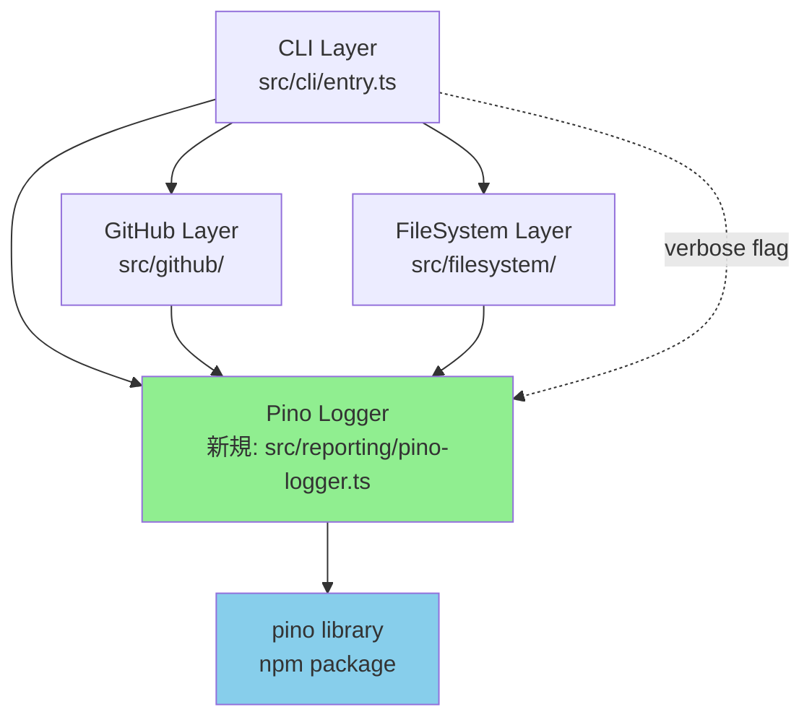
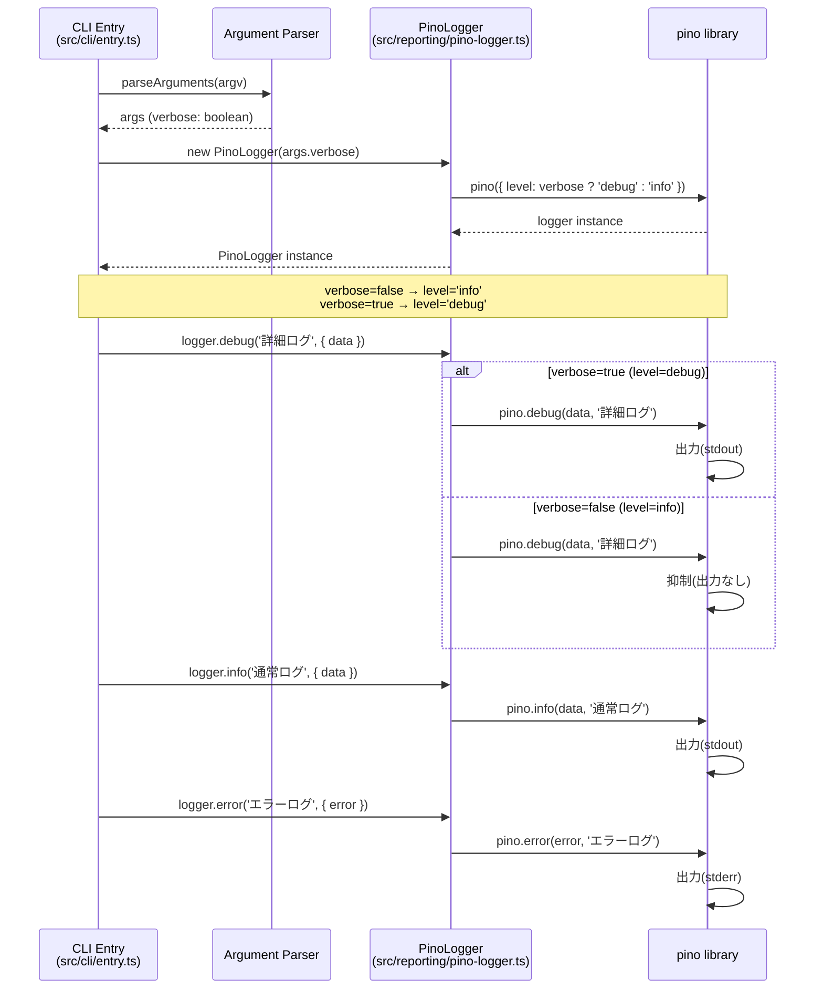
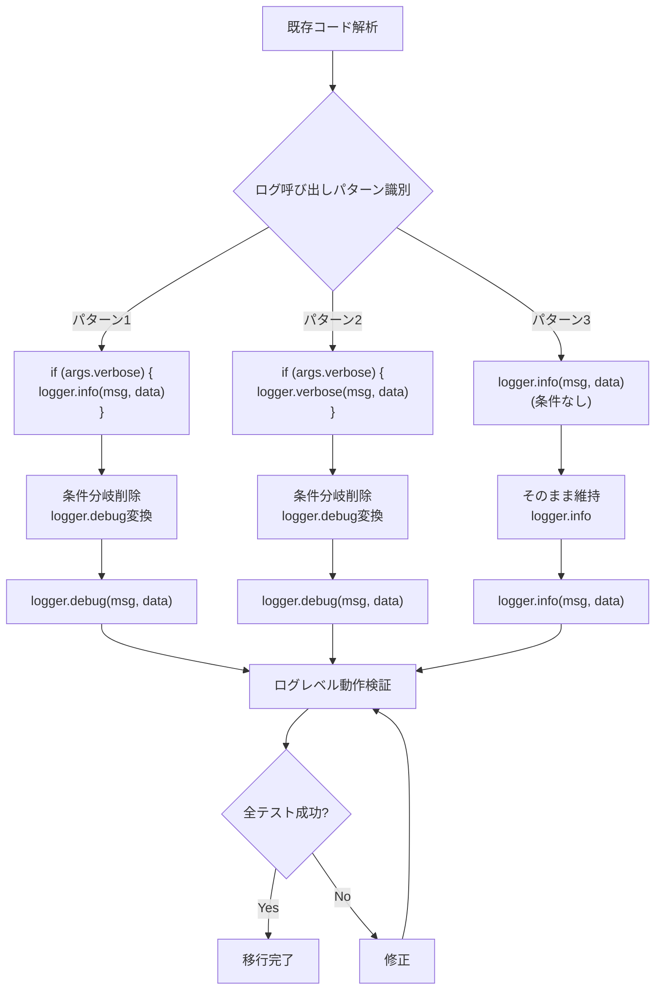
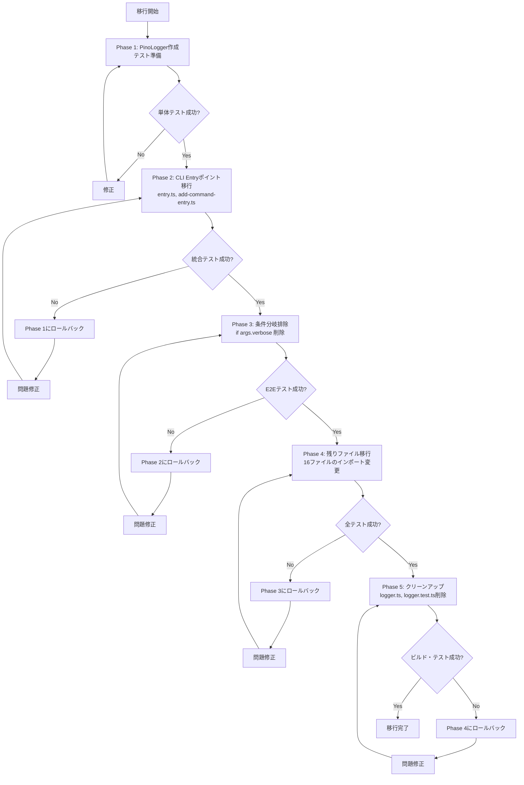

# 技術設計書

## 概要

**目的**: この機能は、Kirox CLIにおけるログ機能を、カスタム実装(`src/reporting/logger.ts`)から業界標準の軽量ログライブラリ(Pino)へ移行することで、コードの保守性、パフォーマンス、標準化を実現します。

**ユーザー**: CLI利用者は、デフォルトではinfoレベル以上のログのみを確認し、必要に応じて`--verbose`フラグでdebugレベルの詳細ログを取得できます。開発者は、`if (args.verbose)`の条件分岐を排除し、ログライブラリのレベル制御機能に委譲することで、よりクリーンで保守性の高いコードを維持できます。

**影響**: 現在のカスタムLogger実装(`src/reporting/logger.ts`)と、18ファイルに及ぶLogger/loggerインポートを削除し、Pinoライブラリに完全移行します。既存の28箇所のログ呼び出し(entry.tsのみ)と、複数ファイルに散在する`if (args.verbose)`条件分岐を、Pinoのログレベル制御機能に置き換えます。

### ゴール

- カスタムLogger実装の完全削除とPinoライブラリへの移行
- `if (args.verbose)`条件分岐の排除によるコードの簡潔化
- デフォルトinfoレベル、`--verbose`時debugレベルのログ出力制御
- ビルド後のバンドルサイズ増加を100KB以内に抑制(Pinoは3.46KB gzipped)
- 全テスト(npm run build && npm run test)の成功

### 対象外(Non-Goals)

- ログの永続化やログ集約サービスとの統合(将来的な拡張として検討)
- ログフォーマットの大幅な変更(既存の構造化ログ形式を維持)
- 環境変数や設定ファイルによるログレベル制御(--verboseフラグのみで制御)
- ログローテーションやファイル出力機能(CLIツールとしてstdout/stderrのみ使用)

## アーキテクチャ

### 既存アーキテクチャの分析

現在のKirox CLIは、4層アーキテクチャを採用しており、Reporting Layer(`src/reporting/`)が横断的関心事として全レイヤーで利用されています:

```
CLI Layer (src/cli/) → GitHub Layer (src/github/) → FileSystem Layer (src/filesystem/)
                              ↓
                    Reporting Layer (src/reporting/)
                    - Logger (カスタム実装)
                    - ProgressReporter
                    - ErrorHandler
```

**既存の制約**:
- `Logger`クラスは全レイヤーから依存注入により利用される
- `logger.info()`, `logger.warn()`, `logger.error()`, `logger.verbose()`の4つのログレベルを提供
- ログレベル制御機能が存在せず、全てのログが常に出力される
- `if (args.verbose)`条件分岐が各所に散在(8ファイル、複数箇所)

**統合ポイント**:
- `src/cli/entry.ts`: メインエントリポイントでLoggerインスタンス生成(`new Logger()`)
- `src/reporting/progress-reporter.ts`: ProgressReporterがverboseフラグを直接参照
- その他6ファイル: Loggerインポートと使用

### 高レベルアーキテクチャ

移行後のアーキテクチャは、既存の4層構造を維持しつつ、Reporting LayerのLoggerをPinoに置き換えます:



**アーキテクチャ統合**:
- **既存パターン維持**: 4層アーキテクチャとReporting Layerの横断的関心事パターンを維持
- **新規コンポーネントの根拠**: `src/reporting/pino-logger.ts`を新設し、Pinoラッパーとして既存のLogger APIとの互換性を提供
- **技術スタック整合**: 既存のTypeScript、ESM、Node.js 18+環境と完全互換
- **Steering準拠**: `structure.md`のLayer-Based Architecture原則と`tech.md`のTypeScript厳格型チェックに準拠

### 技術整合性

**既存技術スタックとの整合**:
- **TypeScript 5.x**: Pinoはネイティブ型定義(`pino.d.ts`)を提供し、厳格な型チェックに対応
- **ESM (ES Modules)**: Pinoは`import pino from 'pino'`でESMをサポート
- **Node.js 18+**: Pino v10.xはNode.js 18+を完全サポート
- **Vitest**: Pinoはモック化が容易で、既存のテスト戦略と互換性あり

**新規依存関係**:
- `pino`: v10.x系最新版(週次DL 50M+、バンドルサイズ 3.46KB gzipped)

**既存パターンからの逸脱なし**:
- 既存のLogger APIパターンを維持し、段階的移行を実現
- 依存注入パターンを継続し、テスタビリティを維持

### 重要な設計判断

#### 判断1: Pinoライブラリの選定

- **判断内容**: Pino v10.xを軽量ログライブラリとして採用
- **背景**: 要件1.1で定義されたバンドルサイズ50KB以下、TypeScript完全サポート、週次DL 100万以上、Node.js 18+対応の全条件を満たす必要がある
- **検討した代替案**:
  1. **Winston**: 週次DL 12M+、最も人気があるが、バンドルサイズが大きい(約100KB以上)、Pinoの5-10倍遅い
  2. **Consola**: 軽量でTypeScript対応だが、週次DL 100万未満でエコシステムが小さい
  3. **カスタム実装の継続**: バンドルサイズゼロだが、メンテナンスコスト、機能不足(ログレベル制御なし)、業界標準でない
- **選定アプローチ**: Pino
  - バンドルサイズ: 3.46KB gzipped(要件50KB以下を大幅にクリア)
  - 週次DL: 50M+(要件100万以上を大幅に超過)
  - TypeScript: ネイティブ型定義提供
  - ログレベル: trace/debug/info/warn/error/fatalの6段階対応
  - パフォーマンス: Winstonの5-10倍高速
- **根拠**: 全ての要件を満たし、パフォーマンスとバンドルサイズのバランスが最も優れている。Fastifyなどのフレームワークでもデフォルト採用されており、Node.jsエコシステムでの信頼性が高い
- **トレードオフ**:
  - **獲得**: 軽量性(3.46KB)、高速性(5-10倍)、標準化、ログレベル制御
  - **犠牲**: Winstonのマルチトランスポート機能(ファイル、データベース、クラウドサービスへの出力)は不要と判断(CLIツールはstdout/stderrのみ使用)

#### 判断2: ログレベルのマッピング戦略

- **判断内容**: 既存の4レベル(INFO/WARN/ERROR/VERBOSE)をPinoの6レベル(trace/debug/info/warn/error/fatal)にマッピング
- **背景**: 既存コードとの互換性を維持しつつ、Pinoのログレベル制御機能を活用する必要がある
- **検討した代替案**:
  1. **完全置き換え**: 既存の全ログ呼び出しをPinoの6レベルに変更(移行コストが高く、レビューが困難)
  2. **カスタムレベル定義**: Pinoのカスタムレベル機能を使用(複雑性が増し、標準から逸脱)
  3. **段階的マッピング**: 既存レベルをPino標準レベルにマッピング
- **選定アプローチ**: 段階的マッピング
  - `logger.info()` → `pino.info()`
  - `logger.warn()` → `pino.warn()`
  - `logger.error()` → `pino.error()`
  - `logger.verbose()` → `pino.debug()`(VERBOSEをdebugにマッピング)
  - `if (args.verbose) { logger.info() }` → `pino.debug()`(条件分岐を削除)
- **根拠**: 最小限の変更で移行でき、Pinoの標準レベルを活用できる。verboseフラグの有無で`info`と`debug`を切り替えるPinoの標準パターンに適合
- **トレードオフ**:
  - **獲得**: 移行の簡潔性、標準パターンの活用、条件分岐の排除
  - **犠牲**: Pinoのtraceとfatalレベルは当面未使用(将来的に必要に応じて追加可能)

#### 判断3: ラッパークラスの導入

- **判断内容**: Pinoを直接使用せず、`src/reporting/pino-logger.ts`ラッパーを導入
- **背景**: 既存の18ファイルのインポートを一度に変更するリスクを軽減し、段階的移行を可能にする必要がある
- **検討した代替案**:
  1. **直接置き換え**: 全てのインポートを`import pino from 'pino'`に変更(リスクが高く、レビューが困難)
  2. **型エイリアス**: 型のみをラップし、実装は直接Pinoを使用(型安全性が低下)
  3. **薄いラッパークラス**: Pinoインスタンスをラップし、既存のLogger APIと互換性を維持
- **選定アプローチ**: 薄いラッパークラス
  ```typescript
  // src/reporting/pino-logger.ts
  export class PinoLogger {
    private pino: pino.Logger;

    constructor(verbose: boolean) {
      this.pino = pino({ level: verbose ? 'debug' : 'info' });
    }

    info(message: string, details?: unknown): void {
      this.pino.info(details, message);
    }
    // warn, error, debugメソッドも同様
  }
  ```
- **根拠**: 既存の`new Logger()`パターンを`new PinoLogger(args.verbose)`に最小限の変更で移行でき、Pinoのログレベル制御を活用できる。テストのモック化も容易
- **トレードオフ**:
  - **獲得**: 段階的移行の容易性、既存APIとの互換性、テスタビリティ
  - **犠牲**: 薄いラッパー層の追加(パフォーマンス影響は無視できるレベル、Pinoの高速性で相殺)

## システムフロー

### ログ初期化とレベル制御フロー



### 条件分岐排除の変換フロー



## 要件トレーサビリティ

| 要件 | 要件概要 | コンポーネント | インターフェース | フロー |
|------|---------|--------------|--------------|--------|
| 1.1 | 軽量ログライブラリ選定基準 | PinoLogger | `constructor(verbose: boolean)` | ログ初期化フロー |
| 1.2 | ログレベル対応(debug/info/warn/error) | PinoLogger | `info()`, `warn()`, `error()`, `debug()` | ログ初期化フロー |
| 1.3 | バンドルサイズ100KB以内 | pino npm package | - | - |
| 2.1 | デフォルトinfoレベル出力 | PinoLogger | `constructor(verbose: false)` | ログ初期化フロー |
| 2.2 | --verbose時debugレベル出力 | PinoLogger | `constructor(verbose: true)` | ログ初期化フロー |
| 2.3 | --verboseフラグのみで制御 | CLI Entry, PinoLogger | `new PinoLogger(args.verbose)` | ログ初期化フロー |
| 2.4 | infoレベル時debugログ抑制 | pino library | Pinoのログレベル制御 | ログ初期化フロー |
| 3.1-3.4 | 条件分岐の排除 | 全ログ使用箇所 | `logger.debug()` | 条件分岐排除の変換フロー |
| 4.1 | logger.tsファイル削除 | - | - | 移行戦略 |
| 4.2 | インポート文削除・置き換え | 18ファイル | `import { PinoLogger }` | 移行戦略 |
| 4.3 | テストファイル対応 | logger.test.ts | - | テスト戦略 |
| 4.4 | ビルド・テスト成功 | - | - | テスト戦略 |
| 5.1 | ログ出力形式維持 | PinoLogger | カスタムフォーマット | ログ初期化フロー |
| 5.2 | errorログstderr出力 | pino library | Pinoのデフォルト動作 | ログ初期化フロー |
| 5.3 | info/warn/debugログstdout出力 | pino library | Pinoのデフォルト動作 | ログ初期化フロー |
| 5.4 | タイムスタンプ設定可能性 | PinoLogger | `constructor`オプション | ログ初期化フロー |

## コンポーネントとインターフェース

### Reporting Layer

#### PinoLogger (新規作成)

**責任と境界**
- **主要責任**: Pinoライブラリをラップし、既存のLogger APIと互換性のあるインターフェースを提供。verboseフラグに基づくログレベル制御を実現
- **ドメイン境界**: Reporting Layer(横断的関心事)に属し、全レイヤーから利用可能
- **データ所有権**: ログメッセージと詳細情報(details)を受け取り、Pinoに委譲。状態は保持しない
- **トランザクション境界**: ログ出力は非同期だが、アプリケーションのトランザクション外で実行される

**依存関係**
- **インバウンド**: CLI Layer(`entry.ts`, `add-command-entry.ts`)、GitHub Layer、FileSystem Layer、Reporting Layer(ProgressReporter, ErrorHandler)
- **アウトバウンド**: pino npm package(外部ライブラリ)
- **外部**: pino v10.x系(npm package)

**外部依存関係の調査**:
- **Pino公式ドキュメント**: https://getpino.io/ (基本的な使い方、ログレベル、カスタマイズ)
- **npm package**: pino v10.x系、週次DL 50M+、バンドルサイズ 3.46KB gzipped
- **API署名**: `pino(options)` → Logger instance、`logger.info(obj, msg)`, `logger.debug(obj, msg)` 等
- **認証**: 不要(ローカルログ出力のみ)
- **レート制限**: なし
- **バージョン互換性**: v10.x系はNode.js 18+を完全サポート、破壊的変更なし
- **一般的な問題**: PinoはJSON形式でログを出力するため、開発時に読みづらい場合がある → `pino-pretty`を開発依存として追加可能(本設計では対象外)
- **ベストプラクティス**: ログレベルは初期化時に設定し、動的変更は`logger.level = 'debug'`で可能(本設計では不要)
- **パフォーマンス考慮事項**: Pinoは非同期ログ出力でパフォーマンス最適化済み、CLIツールでは影響なし

**契約定義**

**サービスインターフェース**:
```typescript
/**
 * PinoLogger: Pinoライブラリをラップしたロガー
 */
export class PinoLogger {
  /**
   * PinoLoggerインスタンスを生成
   *
   * @param verbose - trueの場合debugレベル、falseの場合infoレベル
   * @param options - Pinoオプション(タイムスタンプ表示など)
   */
  constructor(verbose: boolean, options?: PinoLoggerOptions);

  /**
   * infoレベルログを出力
   *
   * @param message - ログメッセージ
   * @param details - オプション詳細情報(構造化データ)
   *
   * 事前条件: なし
   * 事後条件: verboseフラグに関わらず、stdoutに出力される
   * 不変条件: ログレベルhierarchyが維持される(info >= info)
   */
  info(message: string, details?: Record<string, unknown>): void;

  /**
   * warnレベルログを出力
   *
   * @param message - 警告メッセージ
   * @param details - オプション詳細情報(構造化データ)
   *
   * 事前条件: なし
   * 事後条件: verboseフラグに関わらず、stdoutに出力される
   * 不変条件: ログレベルhierarchyが維持される(warn >= info)
   */
  warn(message: string, details?: Record<string, unknown>): void;

  /**
   * errorレベルログを出力
   *
   * @param message - エラーメッセージ
   * @param details - オプション詳細情報(構造化データ)
   *
   * 事前条件: なし
   * 事後条件: verboseフラグに関わらず、stderrに出力される
   * 不変条件: ログレベルhierarchyが維持される(error >= info)
   */
  error(message: string, details?: Record<string, unknown>): void;

  /**
   * debugレベルログを出力(verbose相当)
   *
   * @param message - デバッグメッセージ
   * @param details - オプション詳細情報(構造化データ)
   *
   * 事前条件: なし
   * 事後条件: verbose=trueの場合stdoutに出力、verbose=falseの場合抑制
   * 不変条件: ログレベルhierarchyが維持される(debug < info)
   */
  debug(message: string, details?: Record<string, unknown>): void;

  /**
   * ErrorResultをログ出力(既存のlogErrorメソッド互換)
   *
   * @param errorResult - ErrorHandlerからのエラー結果
   *
   * 事前条件: errorResultが有効なErrorResult型
   * 事後条件: recoverable=trueの場合warn、falseの場合errorで出力
   */
  logError(errorResult: ErrorResult): void;
}

/**
 * PinoLoggerオプション
 */
export interface PinoLoggerOptions {
  timestamp?: boolean; // タイムスタンプ表示(デフォルト: true)
  formatMessage?: boolean; // 既存形式でフォーマット(デフォルト: true)
}
```

**統合戦略** (既存システムの変更):
- **変更アプローチ**: 既存の`Logger`クラスを`PinoLogger`に置き換え
- **後方互換性**: メソッド署名を維持し、既存コードの変更を最小化
- **移行パス**:
  1. `src/reporting/pino-logger.ts`を新規作成
  2. `src/cli/entry.ts`の`new Logger()`を`new PinoLogger(args.verbose)`に変更
  3. その他17ファイルのインポートを`import { PinoLogger }`に変更
  4. `if (args.verbose)`条件分岐を削除し、`logger.debug()`に変換
  5. `src/reporting/logger.ts`と`tests/unit/reporting/logger.test.ts`を削除

#### Logger (既存、削除対象)

**変更内容**: 完全削除

**影響を受けるファイル**:
- `src/reporting/logger.ts`: 削除
- `tests/unit/reporting/logger.test.ts`: 削除または`pino-logger.test.ts`に置き換え
- `src/reporting/types.ts`: `LogLevel`型を削除(Pinoのみで使用される場合)

**移行前の依存関係**: 18ファイルがLoggerをインポート
**移行後の依存関係**: 18ファイルがPinoLoggerをインポート

## データモデル

### ログメッセージの構造

Pinoはデフォルトで構造化ログ(JSON)を出力しますが、既存のログ形式との互換性を維持するため、PinoLoggerでカスタムフォーマットを適用します。

**既存のログ形式**:
```
[INFO] 2025-11-01T18:00:00 Operation started {"repository":"owner/repo"}
[WARN] 2025-11-01T18:00:01 File skipped {"file":"large.md","size":2000000}
[ERROR] 2025-11-01T18:00:02 Operation failed {"code":"ERR_001"}
```

**Pinoのデフォルト形式**:
```json
{"level":30,"time":1698854400000,"msg":"Operation started","repository":"owner/repo"}
{"level":40,"time":1698854401000,"msg":"File skipped","file":"large.md","size":2000000}
{"level":50,"time":1698854402000,"msg":"Operation failed","code":"ERR_001"}
```

**PinoLoggerのカスタムフォーマット**:
PinoLoggerは、Pinoの`formatters`オプションを使用して、既存形式に近いログ出力を実現します:

```typescript
const pino = require('pino')({
  level: verbose ? 'debug' : 'info',
  formatters: {
    level: (label) => {
      return { level: label.toUpperCase() }; // INFO, WARN, ERROR, DEBUG
    },
  },
  timestamp: () => `,"time":"${new Date().toISOString().split('.')[0]}"`,
});
```

**データ契約**:
- **ログレベル**: `INFO` | `WARN` | `ERROR` | `DEBUG` (文字列、大文字)
- **タイムスタンプ**: ISO 8601形式(ミリ秒なし): `2025-11-01T18:00:00`
- **メッセージ**: 文字列、必須
- **詳細情報**: オプション、Record<string, unknown>型の構造化データ

**スキーマバージョニング**: 不要(ログ形式は内部的なもので、外部APIではない)

## エラーハンドリング

### エラー戦略

PinoLoggerは、ログ出力の失敗を許容し、アプリケーションの実行を継続します。Pinoライブラリ自体が非同期ログ出力でエラーハンドリングを行うため、PinoLoggerではPinoのエラーをキャッチせず、Pinoに委譲します。

### エラーカテゴリと対応

**Pinoライブラリのエラー**(システムエラー):
- **ファイルシステムエラー**(stdout/stderrへの書き込み失敗): Pinoが内部でハンドリング、アプリケーションは継続
- **メモリ不足**: Node.jsプロセスがクラッシュ、ログ機能の責任外

**PinoLoggerの使用エラー**(ユーザーエラー):
- **不正な引数型**(detailsがオブジェクトでない): TypeScriptの型チェックで防止、実行時は無視
- **undefinedまたはnullのmessage**: 空文字列として扱う(Pinoが処理)

**対応方針**:
- Pinoのエラーは全てPinoライブラリに委譲し、PinoLoggerでは追加のエラーハンドリングを行わない
- TypeScriptの厳格な型チェックで、PinoLoggerの使用エラーを事前に防止
- ログ出力の失敗がアプリケーションの実行を妨げないことを優先

### モニタリング

**エラー追跡**: 不要(Pinoライブラリがエラーを処理)
**ログレベル監視**: 開発時に`--verbose`フラグの動作を手動テストで確認
**ヘルスモニタリング**: CLIツールのため、ログ機能のヘルスモニタリングは対象外

## テスト戦略

### 単体テスト

1. **PinoLoggerのログレベル制御**:
   - `verbose=false`時、`logger.debug()`が出力されないことを検証
   - `verbose=true`時、`logger.debug()`が出力されることを検証
   - `logger.info()`, `logger.warn()`, `logger.error()`がverboseフラグに関わらず出力されることを検証

2. **PinoLoggerのメソッド呼び出し**:
   - `logger.info(message, details)`がPinoの`pino.info(details, message)`を呼び出すことを検証
   - `logger.warn()`, `logger.error()`, `logger.debug()`も同様

3. **PinoLoggerのlogErrorメソッド**:
   - `errorResult.recoverable=true`時、`logger.warn()`が呼び出されることを検証
   - `errorResult.recoverable=false`時、`logger.error()`が呼び出されることを検証

4. **カスタムフォーマット**:
   - ログ出力形式が既存形式に近いことを検証(レベル、タイムスタンプ、メッセージ、詳細情報)

5. **stdout/stderr出力先**:
   - `logger.error()`がstderrに出力されることを検証
   - `logger.info()`, `logger.warn()`, `logger.debug()`がstdoutに出力されることを検証

### 統合テスト

1. **CLI EntryとPinoLoggerの統合**:
   - `--verbose`フラグなしで実行時、debugログが抑制されることをE2Eテストで検証
   - `--verbose`フラグありで実行時、debugログが出力されることをE2Eテストで検証

2. **条件分岐排除後の動作**:
   - 既存の`if (args.verbose)`を削除した箇所で、ログレベル制御が正しく機能することを検証
   - `entry.ts`の28箇所のログ呼び出しが全て正しく動作することを検証

3. **既存テストの継続成功**:
   - `npm run test`で全ての既存テストが成功することを検証(685テスト)
   - ログ関連のモックが正しく動作することを検証

### E2Eテスト

1. **通常実行(--verboseなし)**:
   - `npx kirox owner/repo -p project`実行時、infoレベル以上のログのみが表示されることを検証
   - debugレベルのログが表示されないことを検証

2. **verbose実行(--verboseあり)**:
   - `npx kirox owner/repo -p project --verbose`実行時、debugレベルのログが表示されることを検証
   - 既存のverboseログが全て表示されることを検証

3. **エラー発生時のログ出力**:
   - ネットワークエラー発生時、errorレベルログがstderrに出力されることを検証
   - リカバー可能なエラー時、warnレベルログがstdoutに出力されることを検証

### パフォーマンステスト

1. **ビルド後のバンドルサイズ**:
   - `npm run build`後、dist/ディレクトリのサイズ増加が100KB以内であることを検証
   - Pinoの追加によるバンドルサイズへの影響を測定

2. **ログ出力のオーバーヘッド**:
   - 100ファイル取得時のログ出力オーバーヘッドが無視できるレベルであることを検証(Pinoの高速性により影響なし)

## 移行戦略

移行は、段階的かつリスクを最小化するため、以下のフェーズで実施します:



### Phase 1: PinoLogger作成とテスト準備
**目標**: PinoLoggerクラスを作成し、単体テストで動作を検証

**作業内容**:
1. `npm install pino`でPinoをインストール
2. `src/reporting/pino-logger.ts`を新規作成
3. `tests/unit/reporting/pino-logger.test.ts`を作成
4. 単体テスト実行(`npm run test`)で動作確認

**検証チェックポイント**:
- [ ] Pinoがpackage.jsonのdependenciesに追加されている
- [ ] PinoLoggerの全メソッド(info, warn, error, debug, logError)が正しく動作する
- [ ] ログレベル制御(verbose=true/false)が正しく機能する
- [ ] 単体テストが全て成功する

**ロールバックトリガー**: 単体テストが失敗し、24時間以内に修正できない場合

### Phase 2: CLI Entryポイント移行
**目標**: entry.tsとadd-command-entry.tsでPinoLoggerを使用開始

**作業内容**:
1. `src/cli/entry.ts`の`import { Logger }`を`import { PinoLogger }`に変更
2. `new Logger()`を`new PinoLogger(args.verbose)`に変更
3. `src/cli/add-command-entry.ts`も同様に変更
4. 統合テスト実行で動作確認

**検証チェックポイント**:
- [ ] entry.tsとadd-command-entry.tsでPinoLoggerが正しく動作する
- [ ] 既存の統合テストが全て成功する
- [ ] ログ出力形式が既存形式に近い

**ロールバックトリガー**: 統合テストが失敗し、修正に24時間以上かかる場合

### Phase 3: 条件分岐排除
**目標**: `if (args.verbose)`条件分岐を削除し、`logger.debug()`に置き換え

**作業内容**:
1. entry.tsの全ての`if (args.verbose) { logger.info() }`を`logger.debug()`に変換
2. progress-reporter.tsの`if (this.options.verbose)`を`logger.debug()`に変換
3. その他6ファイルの条件分岐を削除
4. E2Eテストで`--verbose`フラグの動作確認

**検証チェックポイント**:
- [ ] 全ての`if (args.verbose)`条件分岐が削除されている
- [ ] `--verbose`なしでdebugログが抑制される
- [ ] `--verbose`ありでdebugログが出力される
- [ ] E2Eテストが全て成功する

**ロールバックトリガー**: E2Eテストが失敗し、ログ動作が期待通りでない場合

### Phase 4: 残りファイル移行
**目標**: 残り16ファイルのLoggerインポートをPinoLoggerに変更

**作業内容**:
1. `src/github/tree-based-project-scanner.ts`等、残り16ファイルのインポート変更
2. `new Logger()`を`new PinoLogger(args.verbose)`に変更(verboseフラグをコンストラクタに渡す)
3. 全テスト実行で動作確認

**検証チェックポイント**:
- [ ] 全18ファイルがPinoLoggerを使用している
- [ ] `npm run build`が成功する
- [ ] `npm run test`で全テスト(685+新規テスト)が成功する

**ロールバックトリガー**: ビルドまたはテストが失敗し、修正に48時間以上かかる場合

### Phase 5: クリーンアップ
**目標**: 既存のLogger実装とテストを削除

**作業内容**:
1. `src/reporting/logger.ts`を削除
2. `tests/unit/reporting/logger.test.ts`を削除
3. `src/reporting/types.ts`から`LogLevel`型を削除(使用されていない場合)
4. 最終ビルド・テスト実行

**検証チェックポイント**:
- [ ] logger.tsとlogger.test.tsが削除されている
- [ ] LogLevel型が不要な場合は削除されている
- [ ] `npm run build && npm run test`が全て成功する
- [ ] バンドルサイズ増加が100KB以内(Pinoは3.46KB gzipped)

**ロールバックトリガー**: ビルドまたはテストが失敗し、クリーンアップが原因の場合

### 後方互換性の維持
- **メソッド署名**: 既存のLogger APIと互換性を維持し、`info(message, details)`形式を継続
- **ログ出力形式**: カスタムフォーマットで既存形式に近い出力を実現
- **既存テスト**: モック化により既存テストが継続して成功することを保証

### 移行完了条件
- [ ] 全18ファイルがPinoLoggerを使用
- [ ] 全ての`if (args.verbose)`条件分岐が削除
- [ ] logger.tsとlogger.test.tsが削除
- [ ] `npm run build && npm run test`が全て成功
- [ ] バンドルサイズ増加が100KB以内
- [ ] `--verbose`フラグの動作が期待通り
