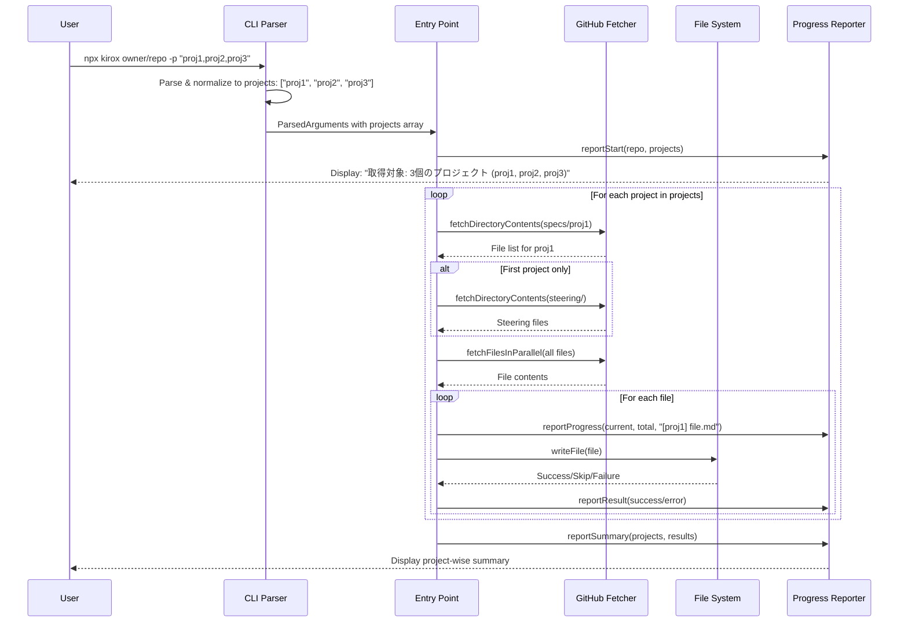
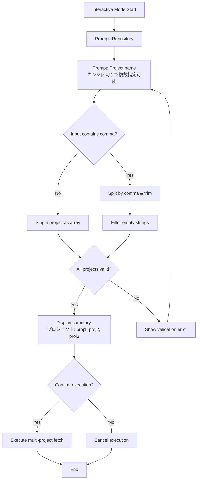
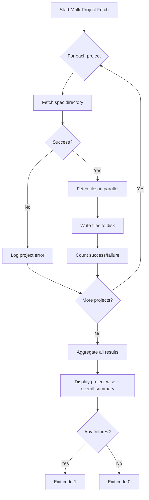
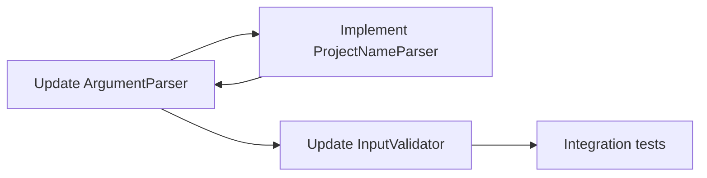
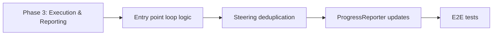

# Technical Design Document

## Overview

本機能は、Kirox CLIに複数プロジェクトを同時に取得する機能を追加する。現在の単一プロジェクト指定（`-p project-name`）を拡張し、カンマ区切りで複数のプロジェクト名を指定可能にする。これにより、関連する複数プロジェクトの仕様書を一度の操作で取得でき、開発者の作業効率が向上する。

**Purpose**: 開発者が関連する複数プロジェクトの`.kiro`仕様書を一度に取得できるようにし、セットアップ時間を削減する。

**Users**: Kirox CLIを使用する開発者、特にモノレポやマルチプロジェクト構成のリポジトリを扱うチーム。

**Impact**: 既存の単一プロジェクト指定の動作は完全に維持される。新たに複数プロジェクト指定の構文（カンマ区切り）が追加される。

### Goals

- 単一コマンドで複数プロジェクトの`.kiro`ファイルを取得可能にする
- Non-interactiveモードとInteractiveモードの両方で複数プロジェクト指定をサポートする
- 部分的な失敗を許容し、成功したプロジェクトのファイルは確実に保存する
- 既存の単一プロジェクト指定の動作を完全に維持する（下位互換性）
- プロジェクト別の進捗とサマリーを明確に表示する

### Non-Goals

- 異なるサブディレクトリをまたいだ複数プロジェクト取得（将来の拡張として検討）
- プロジェクト間の依存関係解決や順序制御
- 複数リポジトリからの同時取得
- プロジェクトのグループ管理機能

## Architecture

### Existing Architecture Analysis

Kirox CLIは4層アーキテクチャを採用している：

**現在のアーキテクチャパターン**:
- **CLI Layer** (`src/cli/`): 引数パース、バリデーション、対話モード
- **GitHub Integration Layer** (`src/github/`): GitHub API通信、ファイル取得
- **File System Layer** (`src/filesystem/`): ローカルファイル書き込み
- **Reporting Layer** (`src/reporting/`): 進捗表示、エラーハンドリング

**既存のドメイン境界**:
- `ParsedArguments.project`は現在`string`型で単一プロジェクト名を保持
- `entry.ts`の実行フローは単一プロジェクトを前提に設計
- 設定ファイル（`.kiroxrc.json`）の`project`フィールドは文字列型

**統合ポイント**:
- CLI Layerでプロジェクト名パース処理を拡張
- Entry pointで複数プロジェクトのループ処理を追加
- Progress Reporterでプロジェクト別表示を実装

### High-Level Architecture

```mermaid
graph TB
    CLI[CLI Layer<br/>parser.ts, validator.ts,<br/>interactive-prompt.ts]
    Entry[Entry Point<br/>entry.ts]
    GitHub[GitHub Layer<br/>fetcher.ts, parallel-fetcher.ts]
    FS[File System Layer<br/>writer.ts]
    Report[Reporting Layer<br/>progress-reporter.ts]

    CLI -->|ParsedArguments<br/>projects: string[]| Entry
    Entry -->|For each project| GitHub
    GitHub -->|Files| FS
    Entry --> Report

    style Entry fill:#e1f5ff
    style CLI fill:#fff4e1
```

**Architecture Integration**:
- **既存パターン保持**: 4層アーキテクチャと単方向データフローを維持
- **新規コンポーネント**: プロジェクト名パーサー、複数プロジェクトループ処理
- **Technology Alignment**: 既存のTypeScript、Commander.js、Octokitを継続使用
- **Steering Compliance**: `structure.md`の層分離原則、`tech.md`の技術スタック選定に準拠

### Technology Alignment

本機能は既存システムの拡張であり、新たなテクノロジースタックは導入しない。

**既存技術スタックとの整合性**:
- **TypeScript 5.x**: 型定義を拡張し、`project: string`から`project: string | string[]`への対応
- **Commander.js**: 既存のオプションパース機構を継続使用
- **Octokit**: GitHub API呼び出しロジックは変更なし
- **Chalk**: プロジェクト別表示のための色付けに使用

**新規導入ライブラリ**: なし

### Key Design Decisions

#### Decision 1: プロジェクト名の内部表現を配列に統一

**Context**: 単一プロジェクトと複数プロジェクトの両方をサポートする必要がある。

**Alternatives**:
1. `project: string | string[]`の型で保持し、処理時に分岐
2. 常に`projects: string[]`で保持し、単一の場合も1要素の配列として扱う
3. 別フィールド`projects?: string[]`を追加し、どちらかが存在

**Selected Approach**: オプション2を採用。`ParsedArguments`の`project`フィールドを`string`から`string[]`に変更し、パース時に必ず配列に正規化する。

**Rationale**:
- 実行フローのロジックが単純化され、常にループ処理で統一できる
- 条件分岐が減り、バグの混入リスクが低下
- 型安全性が向上し、TypeScriptの型チェックが効果的に機能

**Trade-offs**:
- 単一プロジェクトの場合も配列として扱うため、若干のメモリオーバーヘッド
- 既存コードの`args.project`アクセス箇所をすべて`args.projects[0]`または`args.projects`へ変更が必要

#### Decision 2: ステアリングファイルの重複排除戦略

**Context**: 複数プロジェクト取得時、`.kiro/steering/`配下のファイルは全プロジェクト共通であり、重複取得を避ける必要がある。

**Alternatives**:
1. 各プロジェクトごとにステアリングファイルを取得し、書き込み時に上書き確認でスキップ
2. 最初のプロジェクト取得時のみステアリングファイルを取得
3. 全プロジェクトのファイルリストを収集後、パスの重複を排除してから取得

**Selected Approach**: オプション2を採用。最初のプロジェクト処理時のみ`.kiro/steering/`を取得し、2つ目以降はスキップ。

**Rationale**:
- GitHub API呼び出し回数が最小化され、レート制限への影響が少ない
- 実装がシンプルで、既存のディレクトリ取得ロジックを再利用できる
- ユーザーへの進捗表示が直感的（「ステアリングファイルは1回のみ取得」）

**Trade-offs**:
- 将来的にプロジェクトごとに異なるステアリングファイルをサポートする場合、変更が必要
- ステアリングファイル取得失敗時に全プロジェクトで利用不可（ただし現状も同様）

#### Decision 3: 部分的失敗の許容とエラーレポート

**Context**: 複数プロジェクトのうち一部が存在しない、または取得失敗する可能性がある。

**Alternatives**:
1. 1つでも失敗したら全体を中断し、ロールバック
2. 失敗したプロジェクトをスキップし、成功したプロジェクトは保存して継続
3. ドライランモードで事前検証してから実行

**Selected Approach**: オプション2を採用。部分的な失敗を許容し、成功したファイルは保存する。

**Rationale**:
- 既存のKirox CLIのFail-Safe設計原則と一致（`Promise.allSettled`使用）
- ユーザーは取得可能なファイルを即座に利用でき、失敗したプロジェクトのみ個別に対応可能
- エラーメッセージで失敗したプロジェクトが明確に表示される

**Trade-offs**:
- 部分的に成功した状態になるため、ユーザーがエラーメッセージを見落とすリスク
- プロジェクト間の整合性が必要な場合、手動での確認が必要

## System Flows

### Multi-Project Fetch Flow



### Interactive Mode Multi-Project Input Flow



## Requirements Traceability

| Requirement | Component | Interface | Flow |
|-------------|-----------|-----------|------|
| 1.1-1.3 | ProjectNameParser | `parseProjects(input: string): string[]` | Multi-Project Fetch Flow |
| 1.4-1.5 | Entry Point Loop | Project iteration with steering deduplication | Multi-Project Fetch Flow |
| 1.6-1.7 | ErrorHandler | `handleProjectFailure()` | Multi-Project Fetch Flow |
| 2.1-2.5 | Interactive Prompt | `promptProject()` with comma hint | Interactive Mode Flow |
| 3.1-3.4 | Entry Point | Subdir constraint validation | Multi-Project Fetch Flow |
| 4.1-4.5 | ProgressReporter | `reportProjectProgress()`, `reportProjectSummary()` | Both flows |
| 5.1-5.4 | Config Merger | Parse `project` as string or array | Config loading |
| 6.1-6.5 | Validator | `validateProjects()` | Multi-Project Fetch Flow |
| 7.1-7.4 | Metadata Manager | `upsertProject()` for each project | Multi-Project Fetch Flow |
| 8.1-8.4 | All components | Backward compatibility checks | Both flows |

## Components and Interfaces

### CLI Layer

#### ProjectNameParser

**Responsibility & Boundaries**
- **Primary Responsibility**: プロジェクト名の文字列をパースし、配列に正規化する
- **Domain Boundary**: CLI Layer内のユーティリティ
- **Data Ownership**: 入力文字列の解釈結果

**Dependencies**
- **Inbound**: `parser.ts`, `interactive-prompt.ts`
- **Outbound**: なし
- **External**: なし

**Contract Definition**

```typescript
/**
 * Parse project name(s) from input string
 *
 * Supports both single and comma-separated multiple project names.
 * Trims whitespace and filters out empty strings.
 *
 * @param input - Project name(s) as string
 * @returns Array of project names
 *
 * @example
 * parseProjects("project1") // ["project1"]
 * parseProjects("project1,project2,project3") // ["project1", "project2", "project3"]
 * parseProjects("proj1, proj2 , proj3") // ["proj1", "proj2", "proj3"]
 * parseProjects("proj1,,proj3") // ["proj1", "proj3"]
 */
export function parseProjects(input: string): string[];
```

- **Preconditions**: 入力文字列が`undefined`または`null`でないこと
- **Postconditions**: 空文字列が除外された配列を返す。空配列の可能性あり
- **Invariants**: 配列要素は全てトリム済み、空文字列なし

#### ArgumentParser (Modification)

**Responsibility & Boundaries**
- **Primary Responsibility**: コマンドライン引数をパースし、`ParsedArguments`に変換
- **Domain Boundary**: CLI Layer
- **Data Ownership**: コマンドライン引数の解釈結果

**Dependencies**
- **Inbound**: `entry.ts`
- **Outbound**: `ProjectNameParser`
- **External**: Commander.js

**Contract Definition**

既存の`parseArguments()`関数を修正し、`project`オプションを配列として処理：

```typescript
export interface ParsedArguments {
  repository: string;
  projects: string[];  // Changed from: project: string
  output: string;
  force: boolean;
  dryRun: boolean;
  verbose: boolean;
  config?: string;
  track: boolean;
  checkUpdates: boolean;
  update: boolean;
  subdir?: string;
}

export function parseArguments(argv: string[]): ParsedArguments;
```

**Implementation Strategy**:
- `-p`オプションの値を`parseProjects()`でパース
- 空配列の場合は空文字列の1要素配列として扱う（Interactive Mode用）

#### InputValidator (Modification)

**Responsibility & Boundaries**
- **Primary Responsibility**: `ParsedArguments`の妥当性検証
- **Domain Boundary**: CLI Layer
- **Data Ownership**: バリデーション結果

**Dependencies**
- **Inbound**: `entry.ts`
- **Outbound**: なし
- **External**: なし

**Contract Definition**

複数プロジェクト名のバリデーションを追加：

```typescript
/**
 * Validate project names
 *
 * Checks each project name for invalid characters (/, .., etc.)
 *
 * @param projects - Array of project names
 * @returns Array of validation errors
 */
export function validateProjects(projects: string[]): ValidationError[];
```

- **Preconditions**: `projects`配列が空でないこと
- **Postconditions**: 各プロジェクト名が検証され、エラー配列を返す
- **Invariants**: 不正な文字（`/`, `..`, 絶対パス）を検出

#### InteractivePrompt (Modification)

**Responsibility & Boundaries**
- **Primary Responsibility**: 対話モードでユーザー入力を収集
- **Domain Boundary**: CLI Layer
- **Data Ownership**: 対話入力結果

**Dependencies**
- **Inbound**: `entry.ts`
- **Outbound**: `ProjectNameParser`, `InputValidator`
- **External**: `@inquirer/prompts`

**Contract Definition**

プロジェクト名プロンプトのメッセージを更新：

```typescript
/**
 * Prompt for project name(s) input
 *
 * Displays hint about comma-separated input for multiple projects.
 * Validates input using validateProjects().
 *
 * @param currentValue - Current project name(s) value (may be empty)
 * @param config - Configuration file for defaults
 * @returns Validated project name(s) string
 */
export async function promptProject(
  currentValue: string,
  config?: KiroxConfig
): Promise<string>;
```

**Prompt Message**:
```
プロジェクト名を入力してください (カンマ区切りで複数指定可能)
```

**Confirmation Summary**:
```
プロジェクト: project1, project2, project3
```

### Entry Point Layer

#### Entry Point (Modification)

**Responsibility & Boundaries**
- **Primary Responsibility**: 複数プロジェクトの実行フローをオーケストレート
- **Domain Boundary**: Entry Point Layer
- **Data Ownership**: 実行結果の集約

**Dependencies**
- **Inbound**: `index.ts`
- **Outbound**: CLI Layer, GitHub Layer, FileSystem Layer, Reporting Layer
- **External**: なし

**Contract Definition**

複数プロジェクトのループ処理を実装：

```typescript
/**
 * Execute multi-project fetch
 *
 * Orchestrates the complete flow for multiple projects:
 * 1. Parse arguments and normalize projects array
 * 2. Validate input
 * 3. For each project:
 *    a. Fetch spec files
 *    b. Fetch steering files (first project only)
 *    c. Write files to filesystem
 * 4. Report summary
 *
 * @param argv - Command-line arguments
 * @returns Execution result with aggregated counts
 */
export async function execute(argv: string[]): Promise<ExecutionResult>;
```

**Modified Execution Flow**:

```typescript
// Pseudo-code for modified entry.ts
const projects = args.projects; // Now an array
let totalDownloaded = 0;
let totalFailed = 0;

// Report start with multiple projects
reporter.reportStart(args.repository, projects, subdir, branch);

for (const [index, projectName] of projects.entries()) {
  const isFirstProject = index === 0;

  try {
    // Fetch spec files for current project
    const specPath = buildRemotePath(subdir, projectName, 'specs');
    const specContents = await fetchDirectoryContents(octokit, owner, repo, specPath, branch);

    // Fetch steering files only for first project
    let steeringContents: ContentItem[] = [];
    if (isFirstProject) {
      const steeringPath = buildRemotePath(subdir, '', 'steering');
      steeringContents = await fetchDirectoryContents(octokit, owner, repo, steeringPath, branch);
    }

    // Fetch and write files
    const allFiles = [...specContents, ...steeringContents];
    const fetchResult = await fetchFilesInParallel(/* ... */);

    // Write files with project-specific progress
    for (const file of fetchResult.success) {
      reporter.reportProjectProgress(projectName, currentIndex, totalFiles, file.path);
      await writeFile(/* ... */);
      totalDownloaded++;
    }

    totalFailed += fetchResult.failed.length;

    // Report project summary
    reporter.reportProjectSummary(projectName, filesDownloaded, filesFailed);

  } catch (error) {
    // Handle project-specific failure
    reporter.reportProjectError(projectName, error);
    totalFailed++;
  }
}

// Report overall summary
reporter.reportOverallSummary(projects.length, totalDownloaded, totalFailed);
```

**State Management**:
- `isFirstProject`フラグでステアリングファイル取得を制御
- プロジェクトごとのファイル数カウント
- 全体の成功/失敗カウントを集約

### Configuration Layer

#### ConfigMerger (Modification)

**Responsibility & Boundaries**
- **Primary Responsibility**: 設定ファイルとCLI引数をマージ
- **Domain Boundary**: Configuration Layer
- **Data Ownership**: マージ済み設定

**Dependencies**
- **Inbound**: `entry.ts`
- **Outbound**: `ProjectNameParser`
- **External**: なし

**Contract Definition**

設定ファイルの`project`フィールドを配列または文字列として処理：

```typescript
export interface KiroxConfig {
  // ... existing fields
  project?: string | string[];  // Added array support
}

/**
 * Merge configuration from file and CLI arguments
 *
 * Handles project field as both string and array:
 * - String: "proj1,proj2" -> parsed to ["proj1", "proj2"]
 * - Array: ["proj1", "proj2"] -> used directly
 *
 * CLI arguments take precedence over config file.
 *
 * @param args - Parsed CLI arguments
 * @param config - Configuration from file
 * @returns Merged configuration
 */
export function mergeConfig(
  args: ParsedArguments,
  config?: KiroxConfig
): MergedConfig;
```

**Parsing Strategy**:
```typescript
// Config file project field parsing
if (typeof config.project === 'string') {
  projects = parseProjects(config.project);
} else if (Array.isArray(config.project)) {
  projects = config.project;
}
```

### Reporting Layer

#### ProgressReporter (Modification)

**Responsibility & Boundaries**
- **Primary Responsibility**: プロジェクト別の進捗とサマリーを表示
- **Domain Boundary**: Reporting Layer
- **Data Ownership**: 表示フォーマット

**Dependencies**
- **Inbound**: `entry.ts`
- **Outbound**: なし
- **External**: Chalk

**Contract Definition**

プロジェクト別表示メソッドを追加：

```typescript
/**
 * Report start of multi-project operation
 *
 * @param repository - GitHub repository
 * @param projects - Array of project names
 * @param subdir - Optional subdirectory
 * @param branch - Optional branch name
 *
 * @example
 * reporter.reportStart('owner/repo', ['proj1', 'proj2', 'proj3'], 'lib/a', 'main');
 * // Output:
 * // Fetching files from owner/repo/lib/a/.kiro
 * // 取得対象: 3個のプロジェクト (proj1, proj2, proj3)
 * // Source: owner/repo (branch: main)
 */
reportStart(
  repository: string,
  projects: string[],
  subdir?: string,
  branch?: string
): void;

/**
 * Report progress for current file in specific project
 *
 * @param projectName - Current project name
 * @param current - Current file number
 * @param total - Total files for this project
 * @param fileName - File name
 *
 * @example
 * reporter.reportProjectProgress('proj1', 3, 10, 'requirements.md');
 * // Output: [proj1] [3/10] Fetching requirements.md...
 */
reportProjectProgress(
  projectName: string,
  current: number,
  total: number,
  fileName: string
): void;

/**
 * Report summary for completed project
 *
 * @param projectName - Project name
 * @param filesDownloaded - Number of successful downloads
 * @param filesFailed - Number of failures
 *
 * @example
 * reporter.reportProjectSummary('proj1', 8, 2);
 * // Output: [proj1] 完了: 8ファイル成功, 2ファイル失敗
 */
reportProjectSummary(
  projectName: string,
  filesDownloaded: number,
  filesFailed: number
): void;

/**
 * Report overall summary for all projects
 *
 * @param totalProjects - Total number of projects
 * @param totalDownloaded - Total successful downloads
 * @param totalFailed - Total failures
 *
 * @example
 * reporter.reportOverallSummary(3, 24, 3);
 * // Output:
 * // === 全体サマリー ===
 * // プロジェクト数: 3
 * // 合計ファイル数: 27
 * // 成功: 24ファイル
 * // 失敗: 3ファイル
 */
reportOverallSummary(
  totalProjects: number,
  totalDownloaded: number,
  totalFailed: number
): void;
```

### Tracking Layer

#### MetadataManager (Modification)

**Responsibility & Boundaries**
- **Primary Responsibility**: 複数プロジェクトのメタデータを個別に記録
- **Domain Boundary**: Tracking Layer
- **Data Ownership**: `.kirox-meta.json`ファイル

**Dependencies**
- **Inbound**: `entry.ts`
- **Outbound**: `hash-calculator.ts`
- **External**: Node.js fs/promises

**Contract Definition**

既存の`upsertProject()`をプロジェクトごとに呼び出す：

```typescript
/**
 * Upsert project metadata
 *
 * Creates or updates project entry in metadata file.
 * Multiple projects are stored as separate entries.
 *
 * @param projectData - Project metadata
 * @param metadataPath - Path to metadata file
 */
export async function upsertProject(
  projectData: ProjectMetadata,
  metadataPath: string
): Promise<void>;
```

**Integration Strategy**:
- 各プロジェクトを独立したエントリとして記録
- `--check-updates`および`--update`コマンドは全プロジェクトをチェック
- メタデータ構造は変更なし（既存のループで対応可能）

## Data Models

### Domain Model

複数プロジェクトサポートのための型定義変更：

```typescript
/**
 * Parsed command-line arguments
 */
export interface ParsedArguments {
  repository: string;
  projects: string[];  // Changed from: project: string
  output: string;
  force: boolean;
  dryRun: boolean;
  verbose: boolean;
  config?: string;
  track: boolean;
  checkUpdates: boolean;
  update: boolean;
  subdir?: string;
}

/**
 * Configuration file structure
 */
export interface KiroxConfig {
  githubToken?: string;
  defaultConcurrency?: number;
  outputDirectory?: string;
  verbose?: boolean;
  force?: boolean;
  subdir?: string;
  branch?: string;
  project?: string | string[];  // Added array support
}

/**
 * Project fetch result
 */
export interface ProjectFetchResult {
  projectName: string;
  filesDownloaded: number;
  filesFailed: number;
  errors: ErrorResult[];
}

/**
 * Execution result for multi-project operation
 */
export interface ExecutionResult {
  success: boolean;
  filesDownloaded: number;
  filesFailed: number;
  exitCode: number;
  projectResults?: ProjectFetchResult[];  // Added for multi-project details
}
```

**Business Rules & Invariants**:
- `projects`配列は常に1要素以上を含む（空配列はバリデーションエラー）
- ステアリングファイルは最初のプロジェクトでのみ取得
- 各プロジェクト名は`/`, `..`等の不正文字を含まない
- 同一サブディレクトリ内のプロジェクトのみ指定可能

## Error Handling

### Error Strategy

複数プロジェクト処理における部分的失敗を許容し、エラー情報を明確に伝達する。

### Error Categories and Responses

**User Errors (Exit Code 1)**:
- **全プロジェクト存在しない**: `指定されたプロジェクトがいずれも見つかりません`
- **不正なプロジェクト名**: `無効なプロジェクト名です: <name> (不正な文字: /)`
- **空のプロジェクト名リスト**: `プロジェクト名は必須です`

**System Errors (Exit Code 2)**:
- **GitHub API呼び出し失敗**: プロジェクトごとにエラーログを記録し、他のプロジェクトは継続
- **ファイル書き込み失敗**: ファイルごとにエラーを記録し、プロジェクト処理を継続

**Partial Failure Handling**:



### Monitoring

**Error Tracking**:
- プロジェクトごとのエラー数をカウント
- 失敗したプロジェクト名とエラー詳細をログ出力
- `--verbose`オプションでスタックトレース表示

**Logging**:
```typescript
// Example error log structure
logger.error('Project fetch failed', {
  project: 'project-name',
  error: error.message,
  repository: 'owner/repo',
  subdir: 'lib/a',
});
```

## Testing Strategy

### Unit Tests

**ProjectNameParser**:
- 単一プロジェクト名のパース
- カンマ区切り複数プロジェクト名のパース
- 空白のトリム処理
- 空要素のフィルタリング
- 空文字列入力時の動作

**InputValidator**:
- 複数プロジェクト名の検証
- 不正文字検出（`/`, `..`）
- 空配列のエラー
- 有効なプロジェクト名配列の検証成功

**ConfigMerger**:
- 配列形式の`project`フィールドのマージ
- 文字列形式の`project`フィールドのパースとマージ
- CLI引数の優先順位

### Integration Tests

**CLI to Entry Point**:
- 複数プロジェクト指定のパースと実行フロー
- Interactive modeでのカンマ区切り入力
- 設定ファイルの複数プロジェクト設定読み込み

**Entry Point to GitHub/FileSystem**:
- 複数プロジェクトのループ処理
- ステアリングファイルの1回のみ取得
- プロジェクトごとのファイル書き込み

**Error Handling**:
- 一部プロジェクト存在しないケースでの部分的成功
- 全プロジェクト存在しないケースでの完全失敗
- ファイル取得失敗時の継続処理

### E2E Tests

**Multi-Project Fetch (Non-Interactive)**:
- `npx kirox owner/repo -p "proj1,proj2,proj3"`で3プロジェクト取得
- ステアリングファイルが重複なく取得されることを確認
- プロジェクト別サマリーと全体サマリーの表示確認

**Multi-Project Fetch (Interactive)**:
- Interactive modeでカンマ区切り入力
- 確認サマリーでの複数プロジェクト表示
- 実行後のファイル確認

**Partial Failure Scenarios**:
- 3プロジェクト中1プロジェクトが存在しない
- 2プロジェクトのファイルが正常に取得されることを確認
- エラーメッセージで失敗プロジェクトが表示されることを確認

**Backward Compatibility**:
- 単一プロジェクト指定（`-p single-project`）の動作確認
- 既存の設定ファイル（単一プロジェクト）での動作確認
- Interactive modeで単一プロジェクト入力時の動作確認

### Performance Tests

**Large-Scale Multi-Project Fetch**:
- 10プロジェクトの同時取得でのメモリ使用量
- GitHub API呼び出し回数の確認（レート制限考慮）
- 並列ファイル取得のパフォーマンス（既存のセマフォ制御維持）

## Security Considerations

本機能は既存のKirox CLIのセキュリティモデルを継承し、新たなセキュリティリスクは導入しない。

**Input Validation**:
- プロジェクト名の不正文字検証（パストラバーサル攻撃防止）
- カンマ区切りパース時のインジェクション防止（単純な`split(',')`使用）

**Authentication & Authorization**:
- 既存のGitHub Personal Access Token認証を継続使用
- 複数プロジェクトでも同一リポジトリ内のみアクセス（認可レベル変更なし）

**Data Protection**:
- ローカルファイルシステムへの書き込みは既存の上書き確認機構を使用
- メタデータファイルには機密情報を含まない（ファイルパスとSHAのみ）

## Migration Strategy

本機能は既存システムの拡張であり、段階的な移行戦略を採用する。

### Phase 1: Internal Type Changes (Week 1)

```mermaid
flowchart LR
    P1[Phase 1: Type Changes] --> T1[ParsedArguments.projects: string[]]
    T1 --> T2[Update all references to projects array]
    T2 --> T3[Unit tests for type changes]
```

**Tasks**:
1. `ParsedArguments`の`project`を`projects: string[]`に変更
2. 全ファイルの`args.project`を`args.projects`に更新
3. 単一プロジェクトは`args.projects[0]`でアクセス
4. ユニットテスト更新

**Validation**: 既存の全E2Eテストがパスすること

### Phase 2: Parser and Validator Updates (Week 1)



**Tasks**:
1. `ProjectNameParser`実装
2. `parseArguments()`の`-p`オプションパース更新
3. `validateProjects()`実装
4. Interactive promptのメッセージ更新
5. 統合テスト実施

**Validation**: 複数プロジェクト指定がパース・検証されること

### Phase 3: Execution Flow and Reporting (Week 2)



**Tasks**:
1. `entry.ts`に複数プロジェクトループ実装
2. ステアリングファイル重複排除ロジック
3. `ProgressReporter`のプロジェクト別表示メソッド追加
4. E2Eテスト実施
5. パフォーマンステスト

**Validation**: 複数プロジェクトが正常に取得され、適切に表示されること

### Rollback Triggers

- **Type 1**: 既存の単一プロジェクト取得が動作しない
- **Type 2**: メモリ使用量が基準値（100MB/100ファイル）を超過
- **Type 3**: GitHub APIレート制限に頻繁に抵触

**Rollback Procedure**:
1. Type changesをrevert（`projects[]`から`project: string`へ戻す）
2. Parser/Validator変更をrevert
3. 既存のE2Eテストスイートを実行して安定性確認
