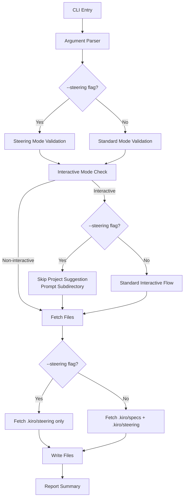

# 技術設計ドキュメント

## 概要

`--steering`オプションは、`.kiro/steering`ディレクトリのみを取得する専用モードを提供します。この機能は、プロジェクト固有の仕様書(`specs`)ではなく、プロジェクト全体のガイドラインやルール(`steering`)のみを共有・更新したいユースケースに対応します。

**目的**: チーム全体で共有するステアリングドキュメント（開発ガイドライン、技術スタック、構造など）を効率的に同期し、プロジェクト仕様書のダウンロードをスキップすることで、実行時間とネットワーク負荷を削減します。

**ユーザー**: 開発者は、新規プロジェクトへのステアリング適用、既存プロジェクトのステアリング更新、複数プロジェクト間でのステアリング統一のために、この機能を使用します。

**影響**: 既存のファイル取得フロー、インタラクティブモードのプロンプトフロー、バリデーションロジックを変更し、`--steering`オプション指定時には異なる動作を提供します。

### ゴール
- `.kiro/steering`ディレクトリのみを取得する専用モードの実装
- 非インタラクティブモードでの`<project>`引数省略のサポート
- インタラクティブモードでのプロジェクト選択スキップとサブディレクトリ入力の提供
- 既存の全てのオプション(`--force`, `--dry-run`, `--verbose`, `--track`等)との互換性維持

### 非ゴール
- `.kiro/specs`ディレクトリへのアクセス制御（セキュリティ機能ではない）
- ステアリングファイルの差分更新（既存の`--update`オプションで対応）
- ステアリング専用の設定ファイルサポート（既存の`.kiroxrc.json`を使用）

## アーキテクチャ

### 既存アーキテクチャ分析

Kirox CLIは4層アーキテクチャを採用しており、`--steering`オプションは以下のレイヤーに影響します:

**CLI Layer** (`src/cli/`):
- `parser.ts`: 新しい`--steering`オプションの定義と解析
- `validator.ts`: `--steering`指定時のバリデーションルール変更（`<project>`を任意に）
- `interactive-prompt.ts`: インタラクティブフロー変更（プロジェクトサジェストスキップ、サブディレクトリプロンプト追加）
- `types.ts`: `ParsedArguments`インターフェースに`steering`フラグを追加

**Entry Point** (`src/cli/entry.ts`):
- ファイル取得ロジックの条件分岐（`steering`フラグに基づいて`.kiro/steering`のみ取得）

**変更対象外**:
- GitHub Integration Layer: ディレクトリコンテンツ取得APIは変更不要
- File System Layer: ファイル書き込みロジックは変更不要
- Reporting Layer: 進捗表示とエラーハンドリングは変更不要

### 高レベルアーキテクチャ



### 技術スタック整合性

この機能は既存の技術スタックに完全に準拠し、新しい依存関係を追加しません:
- **Commander.js**: 新しいオプションフラグの定義に使用（既存パターン）
- **Inquirer.js**: インタラクティブモードのプロンプト表示に使用（既存パターン）
- **Octokit**: GitHub APIからのディレクトリコンテンツ取得に使用（既存パターン）
- **TypeScript**: 既存の型システムに`steering: boolean`フラグを追加

### 主要設計決定

#### 決定1: バリデーション戦略

**決定**: `--steering`フラグ指定時、バリデーション関数`validateInput`内で`<project>`引数を任意フィールドとして扱う条件分岐を追加する。

**コンテキスト**: 既存のバリデーションロジックは`<project>`を必須フィールドとして扱っている。`--steering`モードでは`.kiro/specs/<project>`を取得しないため、プロジェクト名は不要。

**代替案**:
1. **別のバリデーション関数を作成**: `validateInputForSteeringMode`という専用関数を作成
2. **バリデーションをスキップ**: `--steering`時はバリデーションを完全にスキップ
3. **選択されたアプローチ**: 既存の`validateInput`関数内で条件分岐を追加

**選択されたアプローチ**:
```typescript
// validator.ts内での実装イメージ
const requiresRepositoryAndProject = !args.checkUpdates && !args.update && !args.steering;
```

**根拠**:
- 既存のバリデーションロジックとの一貫性を維持
- コード重複を避け、保守性を向上
- `--check-updates`と`--update`と同じパターンを踏襲

**トレードオフ**:
- **獲得**: 既存コードへの影響を最小化、一貫したバリデーション戦略
- **犠牲**: バリデーション関数の複雑度が若干増加（条件分岐が1つ追加）

#### 決定2: インタラクティブフロー変更戦略

**決定**: `promptMissingArguments`関数内で`--steering`フラグをチェックし、Tree APIスキャンとプロジェクトプロンプトをスキップ。代わりにサブディレクトリプロンプトを必ず表示する。

**コンテキスト**: 既存のインタラクティブフローは「リポジトリ → ブランチ → Tree API/subdir → プロジェクト → 出力 → 確認」の順序で動作。`--steering`モードではプロジェクト選択が不要。

**代替案**:
1. **別のインタラクティブ関数を作成**: `promptMissingArgumentsForSteering`という専用関数
2. **フラグベースで完全分岐**: `if (args.steering) { ... } else { ... }`で全フローを分離
3. **選択されたアプローチ**: 既存の`promptMissingArguments`内で条件分岐を追加し、Tree APIとプロジェクトプロンプトをスキップ

**選択されたアプローチ**:
```typescript
// interactive-prompt.ts内での実装イメージ
const shouldAttemptTreeAPI = logger && client &&
  (!completedArgs.projects || completedArgs.projects.length === 0) &&
  !completedArgs.subdir &&
  !completedArgs.steering; // 新しい条件追加

// プロジェクトプロンプトのスキップ
if (!treeApiSuccess && !completedArgs.steering && (!completedArgs.projects || completedArgs.projects.length === 0)) {
  // プロジェクトプロンプトを表示
}
```

**根拠**:
- 既存のプロンプトフローを最大限再利用
- インタラクティブモードの一貫性を維持（リポジトリ、ブランチ、確認プロンプトは共通）
- 最小限の変更で機能を実現

**トレードオフ**:
- **獲得**: 既存のインタラクティブフロー再利用、テストケース再利用可能
- **犠牲**: `promptMissingArguments`関数の複雑度が増加

#### 決定3: ファイル取得ロジック変更戦略

**決定**: `entry.ts`のメインループ内で`args.steering`フラグをチェックし、`specPath`の取得をスキップして`steeringPath`のみ取得する。

**コンテキスト**: 既存のファイル取得ロジックは各プロジェクトごとに`.kiro/specs/<project>`と`.kiro/steering`の両方を取得している。

**代替案**:
1. **別の実行関数を作成**: `executeSteeringMode`という専用の実行関数
2. **GitHub Fetcherレイヤーで制御**: `fetchDirectoryContents`にフィルターパラメータを追加
3. **選択されたアプローチ**: `entry.ts`内で`steering`フラグに基づいて取得パスを条件分岐

**選択されたアプローチ**:
```typescript
// entry.ts内での実装イメージ
if (!args.steering) {
  // Fetch spec directory (required)
  const specContents = await fetchDirectoryContents(octokit, owner, repo, specPath, effectiveBranch);
  specFiles = specContents.filter((item) => item.type === 'file');
}

// Fetch steering directory (always, even in steering mode)
const steeringPath = buildRemotePath(subdir, '', 'steering');
const steeringContents = await fetchDirectoryContents(octokit, owner, repo, steeringPath, effectiveBranch);
```

**根拠**:
- レイヤー分離の原則を維持（GitHub Fetcherレイヤーは変更不要）
- 既存のファイル取得ロジックを最大限再利用
- テストが容易（`steering`フラグのモックで動作検証可能）

**トレードオフ**:
- **獲得**: レイヤー分離を維持、既存コンポーネントへの影響最小化
- **犠牲**: `entry.ts`の実行フローが若干複雑化

## 要件トレーサビリティ

| 要件 | 要件概要 | コンポーネント | インターフェース | フロー |
|------|---------|------------|------------|------|
| 1.1-1.4 | `--steering`オプションの追加と認識 | `parser.ts`, `types.ts` | `parseMainCommand()`, `ParsedArguments.steering` | Architecture diagram |
| 2.1-2.4 | 非インタラクティブモードでの`<project>`引数省略 | `validator.ts` | `validateInput()` | Architecture diagram |
| 3.1-3.5 | インタラクティブモードでのプロジェクトサジェストスキップ | `interactive-prompt.ts` | `promptMissingArguments()`, `shouldEnterInteractiveMode()` | Architecture diagram |
| 4.1-4.4 | インタラクティブモードでの`<subdir>`入力サジェスト | `interactive-prompt.ts` | `promptSubdir()`, `promptMissingArguments()` | Architecture diagram |
| 5.1-5.5 | 実行フローと確認プロンプト | `interactive-prompt.ts` | `confirmExecution()` | Architecture diagram |
| 6.1-6.5 | 既存機能との整合性 | `validator.ts`, `entry.ts` | `validateInput()`, `execute()` | Architecture diagram |
| 7.1-7.5 | エラーハンドリングと境界条件 | `entry.ts`, `ErrorHandler` | `execute()`, `errorHandler.handle()` | - |
| 8.1-8.5 | ヘルプメッセージとドキュメンテーション | `parser.ts` | `parseMainCommand()` | - |

## コンポーネントとインターフェース

### CLI層

#### ArgumentParser (`src/cli/parser.ts`)

**責任と境界**
- **主要責任**: `--steering`オプションを含む全てのCLI引数を解析し、`ParsedArguments`オブジェクトを返す
- **ドメイン境界**: CLI層
- **データ所有権**: コマンドライン引数の構造化データ
- **トランザクション境界**: なし（ステートレス）

**依存関係**
- **インバウンド**: `entry.ts`から呼び出される
- **アウトバウンド**: Commander.js (外部ライブラリ)
- **外部**: なし

**契約定義**

**Service Interface**:
```typescript
interface ArgumentParser {
  parseArguments(argv: string[]): ParsedArguments;
}

interface ParsedArguments {
  // 既存フィールド
  repository: string;
  projects: string[];
  output: string;
  force: boolean;
  dryRun: boolean;
  verbose: boolean;
  config?: string;
  track: boolean;
  checkUpdates: boolean;
  update: boolean;
  subdir?: string;

  // 新規フィールド
  steering: boolean;  // --steeringオプションの状態
}
```

**変更内容**:
- `parseMainCommand`関数内で`.option('--steering', 'Fetch only .kiro/steering directory (skip project specs)', false)`を追加
- ヘルプメッセージに使用例を追加:
  - インタラクティブモード: `npx kirox --steering`
  - 非インタラクティブモード: `npx kirox owner/repo --steering`, `npx kirox owner/repo --subdir packages/api --steering`

**事前条件**: argvが有効なコマンドライン引数配列であること

**事後条件**: `ParsedArguments`オブジェクトが返され、`steering`フィールドがオプションの値を反映していること

**不変条件**: `--steering`と`--check-updates`/`--update`は相互排他的（バリデーション層で検証）

#### InputValidator (`src/cli/validator.ts`)

**責任と境界**
- **主要責任**: `--steering`フラグを考慮して引数のバリデーションを実行し、`<project>`引数の必須性を制御する
- **ドメイン境界**: CLI層
- **データ所有権**: バリデーションルールとエラーメッセージ
- **トランザクション境界**: なし（ステートレス）

**依存関係**
- **インバウンド**: `entry.ts`から呼び出される
- **アウトバウンド**: `path-utils.ts`（サブディレクトリバリデーション）
- **外部**: なし

**契約定義**

**Service Interface**:
```typescript
interface InputValidator {
  validateInput(args: ParsedArguments): ValidationResult;

  // 既存の個別バリデーション関数は変更なし
  validateRepositoryFormat(repository: string): ValidationError[];
  validateProjectName(project: string): ValidationError[];
}

interface ValidationResult {
  valid: boolean;
  errors: ValidationError[];
}
```

**変更内容**:
- `validateInput`関数内で`requiresRepositoryAndProject`の条件式を変更:
  ```typescript
  const requiresRepositoryAndProject = !args.checkUpdates && !args.update && !args.steering;
  ```
- `--steering`と`--check-updates`/`--update`の相互排他性チェックを追加:
  ```typescript
  // Check mutual exclusivity of --steering, --check-updates, and --update
  const exclusiveOptions = [args.steering, args.checkUpdates, args.update];
  const activeOptionsCount = exclusiveOptions.filter(Boolean).length;

  if (activeOptionsCount > 1) {
    errors.push({
      field: 'options',
      message: 'Options --steering, --check-updates, and --update are mutually exclusive.',
    });
  }
  ```

**事前条件**: `args`が`ParsedArguments`型のオブジェクトであること

**事後条件**: `ValidationResult`が返され、`--steering`モード時は`<project>`の欠如によるエラーが含まれないこと

**不変条件**: `--steering`、`--check-updates`、`--update`のいずれか1つのみがtrueである場合、エラーが発生しない

#### InteractivePromptService (`src/cli/interactive-prompt.ts`)

**責任と境界**
- **主要責任**: `--steering`フラグに基づいてインタラクティブフローを制御し、プロジェクト選択をスキップしてサブディレクトリプロンプトを表示する
- **ドメイン境界**: CLI層
- **データ所有権**: ユーザー入力データ
- **トランザクション境界**: なし（ユーザーインタラクション）

**依存関係**
- **インバウンド**: `entry.ts`から呼び出される
- **アウトバウンド**: `@inquirer/prompts` (外部ライブラリ), `validator.ts`, GitHub Fetcher (Tree API用)
- **外部**: Octokit (GitHub API)

**契約定義**

**Service Interface**:
```typescript
interface InteractivePromptService {
  shouldEnterInteractiveMode(args: ParsedArguments): boolean;
  promptMissingArguments(
    args: ParsedArguments,
    configFile?: KiroxConfig,
    logger?: Logger,
    verbose?: boolean,
    metadata?: Metadata
  ): Promise<ParsedArguments>;
  confirmExecution(args: ParsedArguments): Promise<boolean>;
}
```

**変更内容**:

1. **`shouldEnterInteractiveMode`関数**: 変更不要（既存ロジックで`--steering`モードを自動検出）

2. **`promptMissingArguments`関数**:
   - Tree APIスキップ条件に`!completedArgs.steering`を追加:
     ```typescript
     const shouldAttemptTreeAPI = logger && client &&
       (!completedArgs.projects || completedArgs.projects.length === 0) &&
       !completedArgs.subdir &&
       !completedArgs.steering; // 新しい条件
     ```
   - サブディレクトリプロンプト条件を変更:
     ```typescript
     // --steeringモードでは、Tree APIスキップ時に必ずサブディレクトリプロンプトを表示
     if (!treeApiSuccess && (!completedArgs.subdir || completedArgs.steering)) {
       const subdir = await promptSubdir(configFile);
       if (subdir) {
         completedArgs.subdir = subdir;
       }
     }
     ```
   - プロジェクトプロンプトスキップ条件を追加:
     ```typescript
     if (!treeApiSuccess && !completedArgs.steering && (!completedArgs.projects || completedArgs.projects.length === 0)) {
       // プロジェクトプロンプトを表示
     }
     ```

3. **`confirmExecution`関数**:
   - `--steering`モード時のプロジェクト表示を変更:
     ```typescript
     if (args.steering) {
       console.log(chalk.cyan('  Mode: ') + chalk.green('Steering only'));
     } else {
       console.log(chalk.cyan('  Project: ') + chalk.green(args.projects.join(', ')));
     }
     ```

**事前条件**: TTY環境であること（非TTY環境ではインタラクティブモードに入らない）

**事後条件**:
- `--steering`モード時、`completedArgs.steering`がtrueであり、`completedArgs.projects`が空または無視される
- `--steering`モード時、Tree APIスキャンがスキップされる

**不変条件**: ユーザーが確認プロンプトでキャンセルした場合、`Error('Operation cancelled')`がスローされる

#### CLIEntry (`src/cli/entry.ts`)

**責任と境界**
- **主要責任**: `--steering`フラグに基づいてファイル取得対象を制御し、`.kiro/steering`のみまたは`.kiro/specs + .kiro/steering`を取得する
- **ドメイン境界**: CLI層（オーケストレーター）
- **データ所有権**: 実行フローの制御
- **トランザクション境界**: ファイル取得処理全体

**依存関係**
- **インバウンド**: `index.ts`（メインエントリポイント）から呼び出される
- **アウトバウンド**: GitHub Fetcher, File Writer, Progress Reporter, Logger
- **外部**: Octokit (GitHub API)

**契約定義**

**Service Interface**:
```typescript
interface CLIEntry {
  execute(argv: string[]): Promise<ExecutionResult>;
}

interface ExecutionResult {
  success: boolean;
  filesDownloaded: number;
  filesFailed: number;
  exitCode: number;
}
```

**変更内容**:
- プロジェクトループ内で`args.steering`フラグをチェック:
  ```typescript
  // Step 5.1: Fetch directory listings for current project
  let specFiles: ContentItem[] = [];
  let steeringFiles: ContentItem[] = [];

  if (!args.steering) {
    // 通常モード: specs + steering両方を取得
    const specPath = buildRemotePath(subdir, projectName, 'specs');
    const specContents = await fetchDirectoryContents(octokit, owner, repo, specPath, effectiveBranch);
    specFiles = specContents.filter((item) => item.type === 'file');
  }

  // ステアリングディレクトリは常に取得（ただし--steeringモード時はこれのみ）
  if (isFirstProject || args.steering) {
    const steeringPath = buildRemotePath(subdir, '', 'steering');
    try {
      const steeringContents = await fetchDirectoryContents(octokit, owner, repo, steeringPath, effectiveBranch);
      steeringFiles = steeringContents.filter((item) => item.type === 'file');
    } catch (error) {
      if (args.steering) {
        // --steeringモード時はsteeringディレクトリ不在はエラー
        throw new Error(`.kiro/steering directory not found in ${args.repository}${subdir ? `/${subdir}` : ''}`);
      }
      // 通常モード時はsteeringディレクトリ不在は警告のみ
      if (args.verbose) {
        logger.warn('Steering directory not found, skipping');
      }
    }
  }

  const allFiles: ContentItem[] = [...specFiles, ...steeringFiles];
  ```

- プロジェクトループの制御:
  ```typescript
  // --steeringモード時はprojectsを['']として扱い、ループを1回のみ実行
  const projects = args.steering ? [''] : (args.projects.length > 0 ? args.projects : ['']);
  ```

**事前条件**: `args`が有効な`ParsedArguments`オブジェクトであり、バリデーション済みであること

**事後条件**:
- `--steering`モード時、`.kiro/steering`配下のファイルのみが取得される
- `--steering`モード時、`.kiro/specs/<project>`配下のファイルは取得されない

**不変条件**: ファイル取得失敗時でも、成功したファイルは書き込まれる（Fail-Safe Design）

**統合戦略**: 既存の`execute`関数を拡張し、最小限の条件分岐を追加することで、既存の全てのエラーハンドリング、進捗表示、メタデータトラッキングを再利用

## エラーハンドリング

### エラー戦略

`--steering`オプションの追加により、以下の新しいエラーシナリオが発生する可能性があります:
1. `--steering`と`--check-updates`/`--update`の同時指定
2. `.kiro/steering`ディレクトリの不在
3. `.kiro/steering`ディレクトリが空

既存のエラーハンドリングパターンを最大限再利用し、新しいエラーシナリオにのみ追加の処理を実装します。

### エラーカテゴリーと対応

**ユーザーエラー (4xx相当)**:
- **相互排他的オプション指定**: `--steering`と`--check-updates`/`--update`が同時に指定された場合
  - **検出場所**: `validator.ts`の`validateInput`関数
  - **エラーメッセージ**: `Options --steering, --check-updates, and --update are mutually exclusive.`
  - **対応**: バリデーションエラーとして処理し、exit code 1で終了

- **ステアリングディレクトリ不在**: `--steering`モード時に`.kiro/steering`ディレクトリが存在しない
  - **検出場所**: `entry.ts`の`fetchDirectoryContents`呼び出し（catchブロック）
  - **エラーメッセージ**: `.kiro/steering directory not found in <repository>/<subdir>`
  - **対応**: 明確なエラーメッセージを表示し、exit code 1で終了

**システムエラー (5xx相当)**:
- **GitHub APIエラー**: 既存のエラーハンドリングを継承（レート制限、ネットワークエラー等）
  - **検出場所**: GitHub Fetcherレイヤー
  - **対応**: 既存の`ErrorHandler`により分類とメッセージ変換

**ビジネスロジックエラー (422相当)**:
- **ステアリングディレクトリが空**: `.kiro/steering`ディレクトリは存在するがファイルが0件
  - **検出場所**: `entry.ts`のファイルカウント後
  - **エラーメッセージ**: `No files found in .kiro/steering directory`
  - **対応**: 情報メッセージとして表示し、exit code 0で正常終了（ビジネスロジック上は正常）

### モニタリング

既存のロギングインフラストラクチャを活用し、`--steering`モード特有のログを追加:
- **Info Level**: `--steering mode enabled`, `Fetching steering directory only`
- **Warn Level**: `Steering directory is empty`
- **Error Level**: `Steering directory not found`, `Mutual exclusive options specified`

`--verbose`オプション時には、以下の詳細情報をログ出力:
- ステアリングディレクトリパス
- 取得したステアリングファイル数
- スキップしたプロジェクトディレクトリ情報

## テスト戦略

### 単体テスト

**`parser.test.ts`**:
- `--steering`オプションが正しく解析されること
- `--steering`オプションのデフォルト値が`false`であること
- ヘルプメッセージに`--steering`オプションが含まれること

**`validator.test.ts`**:
- `--steering`モード時、`<project>`引数が省略されてもエラーが発生しないこと
- `--steering`と`--check-updates`の同時指定でバリデーションエラーが発生すること
- `--steering`と`--update`の同時指定でバリデーションエラーが発生すること
- `--steering`モードでないとき、既存のバリデーションロジックが維持されること

**`interactive-prompt.test.ts`**:
- `--steering`モード時、Tree APIスキャンがスキップされること
- `--steering`モード時、プロジェクトプロンプトがスキップされること
- `--steering`モード時、サブディレクトリプロンプトが表示されること
- `--steering`モード時、確認プロンプトに「Mode: Steering only」が表示されること

### 統合テスト

**`cli-to-github.test.ts`**:
- `--steering`モード時、`.kiro/steering`ディレクトリのみがGitHub APIから取得されること
- `--steering`モード時、`.kiro/specs/<project>`ディレクトリがGitHub APIから取得されないこと
- `--steering`モード + `--subdir`オプション時、正しいサブディレクトリ配下の`.kiro/steering`が取得されること

**`github-to-fs.test.ts`**:
- `--steering`モード時、取得したステアリングファイルが正しくローカルファイルシステムに書き込まれること
- `--steering`モード + `--track`オプション時、メタデータにステアリングファイルの追跡情報が記録されること

### E2Eテスト

**`steering-mode.test.ts` (新規)**:
- インタラクティブモード + `--steering`: プロジェクトプロンプトがスキップされ、サブディレクトリプロンプトが表示される
- 非インタラクティブモード + `--steering`: `<project>`引数なしで実行でき、`.kiro/steering`のみが取得される
- `--steering` + `--force`: 既存ファイルの上書き確認がスキップされる
- `--steering` + `--dry-run`: ファイルが実際に書き込まれない
- `--steering` + `--verbose`: 詳細ログが出力される

**`error-scenarios.test.ts` (追加)**:
- `--steering` + `--check-updates`: バリデーションエラーが発生し、exit code 1で終了
- `--steering` + 不在のステアリングディレクトリ: エラーメッセージが表示され、exit code 1で終了
- `--steering` + 空のステアリングディレクトリ: 情報メッセージが表示され、exit code 0で終了

### パフォーマンステスト

**必要性**: Tree APIスキャンのスキップにより、インタラクティブモードの応答時間が改善されることを検証

**テストケース**:
- 大規模リポジトリ（100+プロジェクト）での`--steering`モード実行時間測定
- 通常モードとの実行時間比較（期待: Tree APIスキップにより5-10秒短縮）
