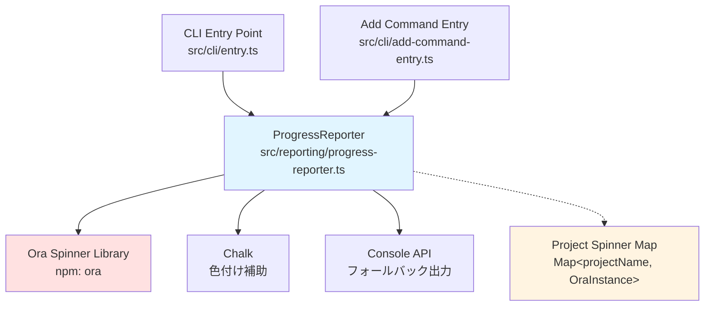
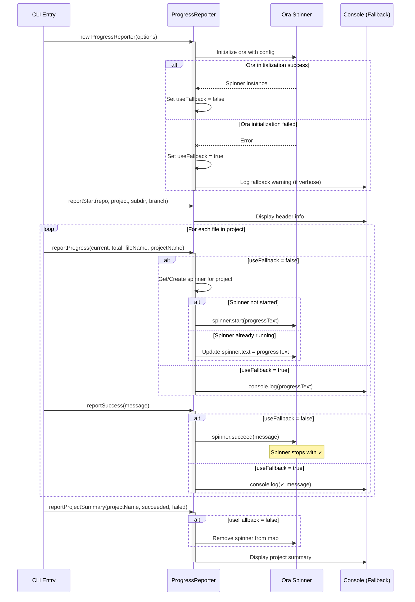
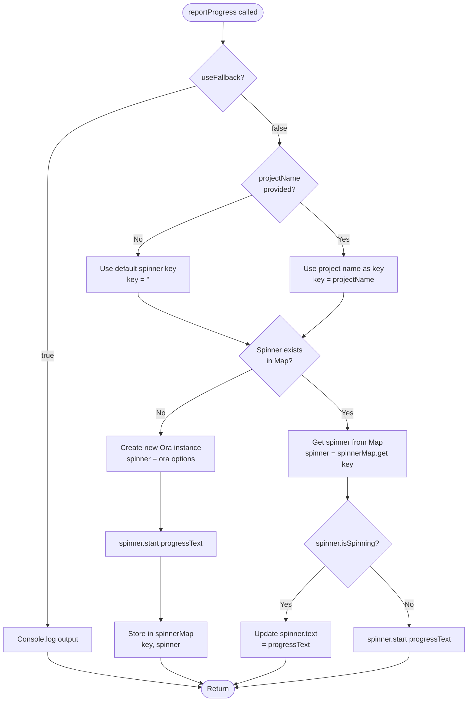
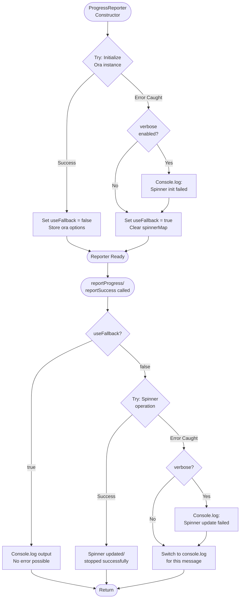
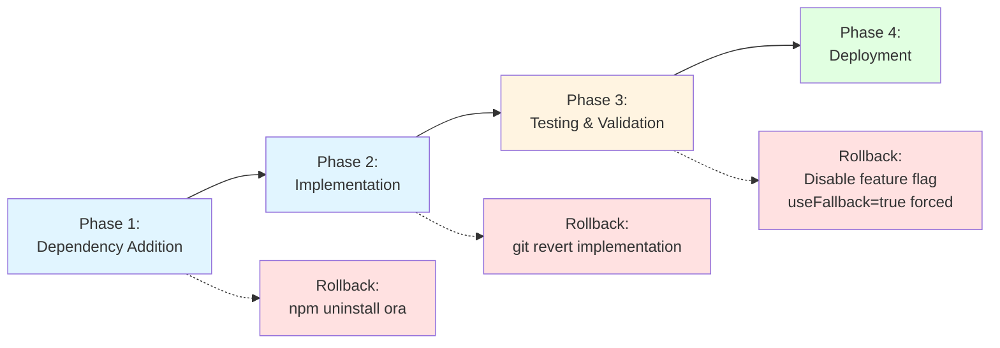

# Technical Design Document

## Overview

この機能は、kirox CLIのファイル取得進捗表示を、行単位の出力形式からスピナーベースのインタラクティブな表示に改善します。現在の実装では、各ファイルごとに新しい行が出力されるため、大量のファイルや複数プロジェクトを取得する際に出力が冗長になっています。`ora` ライブラリを統合することで、進捗表示を1行で動的に更新し、ユーザー体験を大幅に向上させます。

**Purpose**: ファイル取得時の進捗表示をよりコンパクトで視覚的に魅力的なスピナー形式に改善し、特にマルチプロジェクト環境でのユーザー体験を向上させる。

**Users**: kirox CLIのすべてのユーザーが、ファイル取得操作時に自動的にこの改善されたUIを利用します。

**Impact**: 既存の `ProgressReporter` クラス (src/reporting/progress-reporter.ts:15) の内部実装を変更しますが、公開インターフェースは維持するため、呼び出し元への影響はありません。

### Goals

- ora スピナーライブラリを統合し、ProgressReporter の進捗表示をスピナーベースに移行する
- マルチプロジェクトモードで各プロジェクトごとに独立したスピナーを管理する
- 既存のCLIオプション (--verbose, --dry-run, --force など) との完全な互換性を維持する
- スピナー初期化失敗時のフォールバック機構を実装し、ロバスト性を確保する

### Non-Goals

- ProgressReporter の公開インターフェース (メソッドシグネチャ) を変更しない
- 既存のテストケースで定義されたメッセージフォーマットを変更しない
- 他のreportingコンポーネント (ErrorHandler, Logger) への変更は行わない
- スピナーアニメーションのカスタマイズ機能は将来の拡張として扱う

## Architecture

### Existing Architecture Analysis

**現在のProgressReporter構造**:
- src/reporting/progress-reporter.ts:15 に定義された単一クラス
- Chalk インスタンスを使って色付き出力を管理
- console.log/console.error による直接的なターミナル出力
- ステートレスな設計 - 各メソッド呼び出しは独立

**既存の依存関係**:
- Inbound: src/cli/entry.ts:136, src/cli/add-command-entry.ts から呼び出される
- Outbound: chalk パッケージのみに依存
- 外部: Node.js標準のconsole API

**保持すべきパターン**:
- ReporterOptions 型による設定注入
- 色出力の有効/無効切り替え機構
- マルチプロジェクト対応のオプショナルなprojectNameパラメータ
- verboseフラグによる詳細ログの条件付き表示

### High-Level Architecture



**Architecture Integration**:
- **既存パターンの保持**: ProgressReporter クラスの公開インターフェースを完全に維持し、既存の呼び出し元への影響をゼロにする
- **新規コンポーネントの根拠**: ora ライブラリを導入することで、ターミナルスピナーの複雑なアニメーション管理とTTY検出をアウトソースし、実装の複雑度を削減
- **技術スタックとの整合**: TypeScript完全サポートのあるora (v8.x) を選択し、既存のNode.js 18+ 環境と完全互換
- **ステアリング準拠**: structure.md で定義されたReporting Layer の責務 (src/reporting/progress-reporter.ts:84) に従い、進捗表示ロジックをProgressReporter内に完全にカプセル化

### Technology Alignment

**既存技術スタックとの整合**:
- **Runtime**: Node.js 18+ (既存要件を維持)
- **Language**: TypeScript 5.x with strict mode (既存パターンを継承)
- **Module System**: ESM (package.json の "type": "module" に準拠)
- **Output Layer**: Chalk 5.x for color support (既存依存を継続利用)

**新規導入依存**:
- **ora v8.x**: ターミナルスピナーライブラリ
  - **選定理由**: TypeScript完全サポート、軽量 (~20KB)、Node.js 18+ 互換、週600万DL以上の実績
  - **バージョン**: 8.x (最新安定版、2024年11月時点)
  - **型定義**: パッケージに組み込み済み (@types/ora 不要)

**既存パターンからの逸脱**:
- なし - 完全に既存のReporting Layer アーキテクチャパターンに準拠

### Key Design Decisions

#### Decision 1: Spinner Instance Management Strategy

**Decision**: マルチプロジェクトモードでは、プロジェクトごとに独立したora スピナーインスタンスを `Map<string, Ora>` で管理する

**Context**: kirox CLIはマルチプロジェクトモードをサポートしており (src/cli/entry.ts:156)、複数プロジェクトを並行して取得する際に、各プロジェクトの進捗を独立して追跡する必要がある

**Alternatives**:
1. **Single Global Spinner**: 全プロジェクトで1つのスピナーを共有し、テキストをプロジェクト名プレフィックス付きで更新
2. **Spinner per File**: ファイルごとにスピナーを生成・破棄
3. **Spinner Map (Selected)**: プロジェクト名をキーとしたMapで複数スピナーを管理

**Selected Approach**: Spinner Map
- プロジェクト名をキー、Ora インスタンスを値とするMapを ProgressReporter の内部状態として保持
- reportProgress(current, total, fileName, projectName) 呼び出し時、projectName でスピナーを取得または生成
- プロジェクト完了時 (reportProjectSummary) にスピナーを .succeed()/.fail() で停止し、Mapから削除

**Rationale**:
- **マルチプロジェクト対応**: 各プロジェクトが独立したスピナーを持つため、並行実行時の視認性が向上
- **状態管理の明確化**: Mapによる明示的なライフサイクル管理で、スピナーのリーク防止
- **既存インターフェース維持**: projectName パラメータを活用することで、既存のメソッドシグネチャを変更せずに実装可能

**Trade-offs**:
- **Gain**: プロジェクトごとの進捗を独立して追跡可能、TTYでの視覚的な明確さ
- **Sacrifice**: シングルプロジェクトモードでも内部的にはMapを使用するため、若干のメモリオーバーヘッド (1プロジェクトあたり数KB程度)

#### Decision 2: Fallback Strategy for Spinner Initialization Failure

**Decision**: ora スピナーの初期化失敗時、既存のconsole.log ベースの出力に自動的にフォールバックする

**Context**: ora はTTY環境を前提としており、CI/CD環境やリダイレクト時に正常に動作しない可能性がある。Requirement 8.1 で明示的にフォールバック要件が定義されている

**Alternatives**:
1. **Fail Fast**: ora 初期化失敗時にエラーをスローし、CLI実行を中断
2. **Silent Mode**: スピナーなしで処理を継続し、進捗表示を完全にスキップ
3. **Graceful Fallback (Selected)**: console.log ベースの既存実装にフォールバック

**Selected Approach**: Graceful Fallback with Dual-Mode Support
- ProgressReporter のコンストラクタでora 初期化を試行し、失敗時に `useFallback` フラグをtrueに設定
- 各reportメソッド内で `useFallback` フラグを確認し、true の場合は既存のconsole.log/console.error 実装を実行
- フォールバック発生時、--verbose モードで警告メッセージを出力

**Rationale**:
- **ロバスト性**: CI/CD環境や非インタラクティブシェルでもCLIが正常に動作
- **ユーザー体験**: スピナーが利用できない環境でも進捗情報を提供
- **既存機能の再利用**: 既存のconsole.log ベース実装を削除せず、フォールバックパスとして保持することで、実装コストを最小化

**Trade-offs**:
- **Gain**: 環境に依存しない安定した動作、既存のテストケースとの互換性維持
- **Sacrifice**: 2つの実装パス (spinner / fallback) を保守する必要があり、コードの複雑度が若干増加

#### Decision 3: Spinner Text Update Strategy

**Decision**: reportProgress() 呼び出し時、既存スピナーの `.text` プロパティを直接更新する (スピナーを停止せずに更新)

**Context**: ファイル取得は逐次的に実行され、1つのファイルが完了すると次のファイルの進捗表示に切り替わる。Requirement 2.7 で「複数回呼び出された場合、スピナーは現在取得中のファイルを反映するようにテキストを更新する」と定義されている

**Alternatives**:
1. **Stop and Restart**: 各ファイルごとにスピナーを .stop() して新規に .start()
2. **Direct Text Update (Selected)**: 既存スピナーの .text プロパティを更新
3. **Persistent + New Line**: 現在のスピナーを .succeed() で固定し、新しいスピナーを開始

**Selected Approach**: Direct Text Update
- reportProgress(current, total, fileName, projectName) が呼ばれた際、該当プロジェクトのスピナーの `.text` プロパティを `[current/total] 📥 Fetching ${fileName}...` 形式で更新
- スピナーが未開始の場合のみ、`.start()` を呼び出してスピナーを初期化
- reportSuccess()/reportError() 呼び出し時のみ、スピナーを .succeed()/.fail() で停止

**Rationale**:
- **パフォーマンス**: スピナーの停止・再起動オーバーヘッドを回避 (Requirement 9.1: 10ms以内の更新)
- **視覚的な連続性**: スピナーアニメーションが途切れず、ユーザーに一貫した進捗フィードバックを提供
- **Ora API活用**: `.text` プロパティはまさにこのユースケースのために設計されている

**Trade-offs**:
- **Gain**: 高速な更新、滑らかなアニメーション、シンプルな実装
- **Sacrifice**: 過去のファイル進捗履歴がターミナルに残らない (ただし、これはスピナーの本来の設計意図)

## System Flows

### File Fetch Progress Flow with Spinner



### Multi-Project Spinner Management Flow



## Components and Interfaces

### Reporting Layer

#### ProgressReporter (Modified)

**Responsibility & Boundaries**
- **Primary Responsibility**: ファイル取得操作の進捗状態をターミナルに視覚的にフィードバックする。スピナーベースのインタラクティブUIと従来のテキストベース出力の両方をサポート
- **Domain Boundary**: Reporting Layer - ユーザーインターフェース層における進捗表示の責務を担当
- **Data Ownership**: スピナーインスタンスのライフサイクル管理 (Map<string, Ora>)、フォールバックフラグ状態

**Dependencies**
- **Inbound**: CLI Entry (src/cli/entry.ts:136), Add Command Entry (src/cli/add-command-entry.ts)
- **Outbound**: ora (新規), chalk (既存), Node.js console API (既存)
- **External**: ora npm package v8.x

**External Dependencies Investigation**:

**ora パッケージの詳細分析**:
- **公式ドキュメント**: https://www.npmjs.com/package/ora および https://github.com/sindresorhus/ora
- **最新バージョン**: 8.1.1 (2024年11月1日時点、Node.js 18+ 対応確認済み)
- **TypeScript サポート**: パッケージに型定義が組み込み済み、@types/ora は不要
- **主要API**:
  - `ora(options)`: スピナーインスタンス生成、options = { text, color, prefixText, suffixText, spinner, isEnabled, isSilent }
  - `.start(text?)`: スピナー開始、オプションでテキストを設定
  - `.stop()`: スピナー停止、表示クリア
  - `.succeed(text?)`: 緑色 ✓ で停止、テキストを永続化
  - `.fail(text?)`: 赤色 ✖ で停止、テキストを永続化
  - `.text`: 現在表示中のテキスト (読み書き可能プロパティ)
  - `.isSpinning`: スピナーが動作中かどうかのブール値
- **色制御**: `color: false` オプションで色を無効化可能 (useColor=false 対応)
- **TTY検出**: 自動的に非TTY環境を検出し、スピナーを無効化 (ただし、初期化は成功する)
- **パフォーマンス**: .text プロパティの更新は同期的、オーバーヘッド <1ms
- **既知の問題**: CI環境によってはTTY検出が正しく動作しない場合があるが、isEnabled: false で明示的に制御可能

**Contract Definition**

**Service Interface** (既存インターフェースを維持):

```typescript
interface ProgressReporter {
  // 既存メソッド - シグネチャ変更なし
  reportStart(repository: string, project: string, subdir?: string, branch?: string): void;
  reportStart(repository: string, projects: string[], subdir?: string, branch?: string): void;
  reportProgress(current: number, total: number, fileName: string, projectName?: string): void;
  reportSuccess(message: string): void;
  reportError(message: string): void;
  reportSummary(success: number, failed: number, subdir?: string, branch?: string): void;
  reportVerbose(message: string, projectName?: string): void;
  reportProjectSummary(projectName: string, filesDownloaded: number, filesFailed: number): void;
  reportDryRunFileList(files: string[]): void;
  reportOverallSummary(totalProjects: number, totalDownloaded: number, totalFailed: number): void;
  reportProjectError(projectName: string, error: unknown): void;
  reportPartialFailureSummary(failedProjects: string[], successfulProjects: string[]): void;
}
```

**Internal State (新規追加)**:

```typescript
interface ProgressReporterInternalState {
  // 既存の状態
  options: ReporterOptions;
  chalk: InstanceType<typeof Chalk>;

  // 新規追加の状態
  spinnerMap: Map<string, Ora>; // プロジェクト名 → Ora インスタンス
  useFallback: boolean; // ora 初期化失敗時にtrueに設定
  oraOptions: OraOptions; // ora初期化用のオプション設定
}

interface OraOptions {
  text?: string;
  color?: string | false; // ReporterOptions.useColor に基づいて設定
  prefixText?: string;
  spinner?: string | SpinnerObject;
  isEnabled?: boolean; // TTY検出結果に基づいて設定
}
```

**Preconditions**:
- ReporterOptions.useColor が false の場合、ora の color オプションも false に設定される
- reportProgress() は reportStart() の後に呼ばれることを想定 (ただし、強制はしない)

**Postconditions**:
- reportProgress() 呼び出し後、対応するスピナーが動作中状態になる (useFallback=false の場合)
- reportSuccess()/reportError() 呼び出し後、スピナーが停止状態になり、メッセージが永続化される
- reportProjectSummary() 呼び出し後、該当プロジェクトのスピナーがspinnerMapから削除される

**Invariants**:
- spinnerMap に格納されているスピナーは、必ず有効な Ora インスタンスである
- useFallback=true の場合、spinnerMap は常に空である
- 同一プロジェクト名で複数のスピナーインスタンスが同時に存在することはない

**State Management**:

**State Model**:
```
[Not Initialized]
    ↓ (constructor called)
[Initialized - Spinner Mode] (useFallback=false)
    ↓ (reportProgress with new projectName)
[Spinner Running for Project X]
    ↓ (reportProgress for same project)
[Spinner Text Updated]
    ↓ (reportSuccess/reportError)
[Spinner Stopped - Message Persisted]
    ↓ (reportProjectSummary)
[Spinner Removed from Map]

OR

[Not Initialized]
    ↓ (constructor called, ora init failed)
[Initialized - Fallback Mode] (useFallback=true)
    ↓ (any report method)
[Console.log Output] (stateless)
```

**Persistence**: スピナーインスタンスはメモリ上でのみ管理、永続化なし

**Concurrency**: kirox CLIは単一スレッドで動作するため、スピナーへの同時アクセスは発生しない

**Integration Strategy**:

**Modification Approach**: 既存の ProgressReporter クラスを拡張 (Extend)
- 既存のメソッドシグネチャを完全に維持
- 内部実装のみを変更: console.log → ora spinner API
- フォールバックパスとして既存のconsole.log 実装を保持

**Backward Compatibility**:
- 公開インターフェースの変更なし - 呼び出し元のコード変更不要
- 既存のテストケースで検証されているメッセージフォーマットを維持
- ReporterOptions 型の変更なし - 既存の設定がそのまま動作

**Migration Path**:
1. ora パッケージを package.json に追加 (npm install ora)
2. ProgressReporter クラスにスピナー管理ロジックを追加
3. 既存のconsole.log 実装をフォールバックパスとして保持
4. 既存のテストスイートで回帰テストを実行
5. --verbose モードでスピナー動作を確認

## Data Models

### Spinner Management Data Structure

**Physical Data Model** (Memory-only):

```typescript
/**
 * Ora Spinner Instance Type
 *
 * External type from ora package - included here for reference
 */
interface Ora {
  start(text?: string): Ora;
  stop(): Ora;
  succeed(text?: string): Ora;
  fail(text?: string): Ora;
  text: string;
  isSpinning: boolean;
  color: string | false;
  // ... other ora properties
}

/**
 * Spinner Map Entry
 *
 * Key: Project name (empty string for single-project mode)
 * Value: Ora spinner instance managing that project's progress
 */
type SpinnerMapEntry = {
  key: string; // Project name or '' for default
  value: Ora; // Active spinner instance
};

/**
 * Spinner Map Structure
 *
 * Manages multiple concurrent project spinners in multi-project mode
 */
type SpinnerMap = Map<string, Ora>;
```

**Data Contracts**:

**Spinner Lifecycle Events** (Internal State Transitions):

| Event | Trigger | State Change | Side Effect |
|-------|---------|-------------|-------------|
| SpinnerCreated | reportProgress(new projectName) | Map.set(projectName, oraInstance) | Ora instance initialized |
| SpinnerUpdated | reportProgress(existing projectName) | No change | spinner.text updated |
| SpinnerSucceeded | reportSuccess() | No change (spinner stopped) | Green ✓ displayed |
| SpinnerFailed | reportError() | No change (spinner stopped) | Red ✖ displayed |
| SpinnerRemoved | reportProjectSummary() | Map.delete(projectName) | Memory freed |

**Integration with Existing Types**:

```typescript
// Existing type from src/reporting/types.ts
interface ReporterOptions {
  verbose: boolean;
  useColor: boolean;
}

// Extended internal options (not exported)
interface InternalReporterOptions extends ReporterOptions {
  // ora specific configurations derived from ReporterOptions
  oraColor: string | false; // Mapped from useColor: true → 'cyan', false → false
  oraEnabled: boolean; // TTY detection result
}
```

## Error Handling

### Error Strategy

スピナー関連のエラーは、ファイル取得操作の継続性を最優先し、グレースフルデグラデーションパターンを採用します。ora ライブラリの初期化失敗やスピナー操作のエラーは、すべてフォールバックパス (console.log) で処理し、ユーザーに対してエラーメッセージを表示せずに処理を継続します。

### Error Categories and Responses

**System Errors - Spinner Initialization Failure (5xx相当)**:
- **Error**: ora パッケージの初期化失敗 (TTY検出失敗、メモリ不足など)
- **Response**:
  - useFallback フラグを true に設定し、console.log ベースの出力に切り替え
  - --verbose モード時のみ、警告メッセージを出力: `[VERBOSE] Spinner initialization failed, falling back to console output`
  - ファイル取得操作は通常通り継続
- **Recovery**: フォールバックパスで処理を完了し、CLI は正常終了 (exit code 0)

**System Errors - Spinner Update Failure (5xx相当)**:
- **Error**: スピナーテキスト更新中の予期しないエラー (ora内部エラー、メモリ不足など)
- **Response**:
  - try-catch でエラーを捕捉し、--verbose モード時に警告ログ出力
  - 該当スピナーをフォールバックモードに切り替え (spinnerMap から削除)
  - 以降の進捗表示は console.log で出力
- **Recovery**: 部分的フォールバック - 他のプロジェクトのスピナーは影響を受けない

**User Errors (4xx相当)**:
- スピナー機能に関連するユーザーエラーは存在しない (すべてシステム内部のエラー)

**Business Logic Errors (422相当)**:
- スピナー機能に関連するビジネスロジックエラーは存在しない

### Error Flow Visualization



### Monitoring

**Error Tracking**:
- スピナー初期化失敗: --verbose モード時に `[VERBOSE] Spinner initialization failed, falling back to console output` を出力
- スピナー操作失敗: --verbose モード時に `[VERBOSE] Spinner update failed for project ${projectName}, using fallback` を出力

**Logging**:
- すべてのスピナー関連エラーは Logger クラスを使わず、直接 console.log に出力 (Loggerへの依存を避けるため)
- エラーログはユーザーに表示されるが、CLI の終了コードには影響しない

**Health Monitoring**:
- スピナー機能は補助的なUI機能であり、ヘルスモニタリングの対象外
- --verbose モードでのエラーログ出力により、デバッグ時の問題特定を支援

## Testing Strategy

### Unit Tests

**Core Spinner Management Logic**:
1. **Spinner initialization with color enabled**: ora インスタンスが正しい設定 (color=cyan相当) で初期化されることを検証
2. **Spinner initialization with color disabled**: useColor=false 時に ora の color オプションが false に設定されることを検証
3. **Spinner Map management - add new project spinner**: 新しいプロジェクト名で reportProgress() を呼び出した際、新しいスピナーが spinnerMap に追加されることを検証
4. **Spinner Map management - update existing project spinner**: 既存プロジェクト名で reportProgress() を呼び出した際、スピナーの .text が更新されることを検証
5. **Spinner Map management - remove spinner on project completion**: reportProjectSummary() 呼び出し後、該当スピナーが spinnerMap から削除されることを検証
6. **Fallback mode activation on ora init failure**: ora() 呼び出しがエラーをスローした際、useFallback が true に設定されることを検証
7. **Fallback mode - console.log output**: useFallback=true 時、reportProgress() が console.log を呼び出すことを検証
8. **reportSuccess with spinner**: useFallback=false 時、reportSuccess() が spinner.succeed() を呼び出すことを検証
9. **reportError with spinner**: useFallback=false 時、reportError() が spinner.fail() を呼び出すことを検証

### Integration Tests

**ProgressReporter and CLI Entry Integration**:
1. **Single project file fetch with spinner**: src/cli/entry.ts から ProgressReporter を呼び出し、1プロジェクトのファイル取得時にスピナーが正しく動作することを検証
2. **Multi-project file fetch with separate spinners**: 複数プロジェクト取得時に、各プロジェクトが独立したスピナーを持ち、正しく更新されることを検証
3. **Spinner fallback in non-TTY environment**: process.stdout.isTTY=false の環境で、フォールバックモードが正しく動作することを検証
4. **Verbose mode with spinner**: --verbose オプション時、スピナー表示と詳細ログが両方出力されることを検証
5. **Dry-run mode without spinner start**: --dry-run モード時、スピナーが開始されず、ファイルリストのみが表示されることを検証

### E2E Tests

**Complete CLI Workflow with Spinner**:
1. **Basic file fetch with visual spinner confirmation**: 実際の GitHub リポジトリからファイルを取得し、スピナー表示が正しく動作することを目視確認 (または出力キャプチャ)
2. **Multi-project fetch with spinner progress**: 複数プロジェクトを指定した実行で、各プロジェクトのスピナーが独立して動作することを確認
3. **Error handling during fetch with spinner fail state**: ファイル取得エラー発生時、スピナーが .fail() で停止し、エラーメッセージが表示されることを確認
4. **Fallback mode in CI environment**: CI環境 (GitHub Actions など) でCLIを実行し、フォールバックモードが正しく動作することを確認

### Performance Tests

**Spinner Update Performance**:
1. **Spinner text update latency**: spinner.text の更新が 10ms 以内に完了することを測定 (Requirement 9.1)
2. **High-frequency update handling**: reportProgress() を1秒間に10回以上呼び出した際、ファイル取得操作にラグが発生しないことを確認 (Requirement 9.2)
3. **Multi-project spinner responsiveness**: 5つのプロジェクトで同時にスピナーを動作させた際、すべてのスピナーがスムーズにアニメーションすることを確認 (Requirement 9.3)

## Migration Strategy

この機能は既存の ProgressReporter クラスの内部実装変更であり、段階的な移行が可能です。

### Migration Phases



**Phase 1: Dependency Addition**
- **Action**: `npm install ora` で ora パッケージを追加、package.json を更新
- **Validation**: `npm run build` が成功することを確認
- **Rollback Trigger**: ビルドエラーが発生した場合
- **Rollback Action**: `npm uninstall ora` でパッケージを削除

**Phase 2: Implementation**
- **Action**: ProgressReporter クラスにスピナー管理ロジックを実装
  - コンストラクタで ora 初期化とフォールバック処理を追加
  - reportProgress(), reportSuccess(), reportError() メソッドを更新
  - spinnerMap の管理ロジックを追加
- **Validation**: TypeScript コンパイルエラーがないことを確認
- **Rollback Trigger**: コンパイルエラーまたは既存テストの失敗
- **Rollback Action**: git revert で変更を巻き戻し

**Phase 3: Testing & Validation**
- **Action**:
  - 新しいユニットテストを追加 (9件)
  - 既存のテストスイート (685テスト) を実行
  - E2Eテストで実際のスピナー動作を確認
- **Validation**: すべてのテストが合格すること
- **Rollback Trigger**: 既存テストの回帰、新規テストの失敗
- **Rollback Action**: 実装を修正、または Phase 2 にロールバック

**Phase 4: Deployment**
- **Action**: npm run build でプロダクションビルド、npm publish でリリース
- **Validation**: ローカルでの npx kirox 実行確認
- **Rollback Trigger**: 実環境での critical bug 発見
- **Rollback Action**:
  - Hotfix: useFallback を強制的に true に設定するパッチをリリース (スピナーを無効化し、console.log に完全フォールバック)
  - または、前バージョンにロールバック

### Validation Checkpoints

**Checkpoint 1 (After Phase 2)**:
- TypeScript コンパイルが成功すること
- 既存の ProgressReporter テストが合格すること
- コードレビューで公開インターフェースの変更がないことを確認

**Checkpoint 2 (After Phase 3)**:
- 全685テストが合格すること
- 新規追加した9件のユニットテストが合格すること
- E2Eテストでスピナーが視覚的に正しく動作することを確認

**Checkpoint 3 (After Phase 4)**:
- ローカル環境で `npx kirox` が正常に動作すること
- CI環境 (GitHub Actions) でフォールバックモードが動作すること
- --verbose, --dry-run など既存オプションがすべて正常に動作すること
