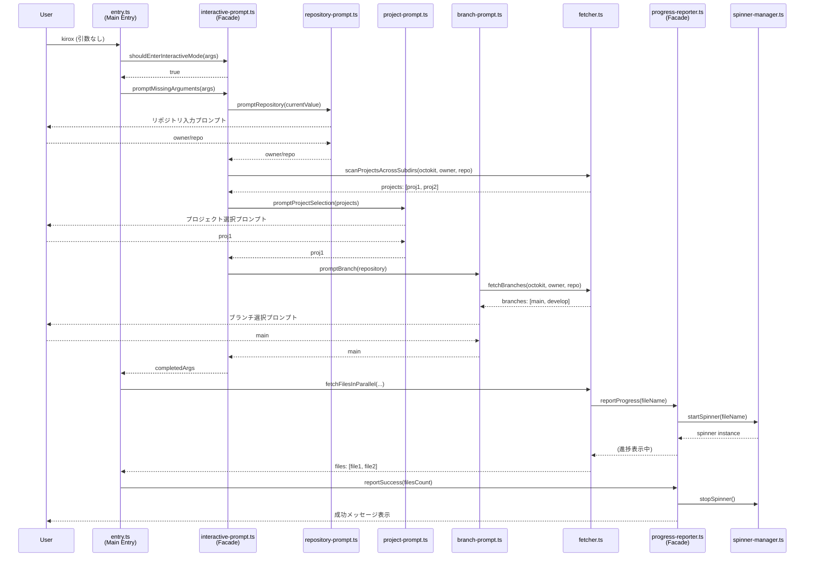

# Design Document: 大規模ファイルリファクタリング

## Overview
本設計は、Kirox CLIプロジェクトの最大規模5ファイル（合計2323行）をリファクタリングし、保守性・テスタビリティ・可読性を向上させます。対象ファイルは単一責任原則（SRP）違反、過度な依存関係、長大な関数により開発効率が低下しています。リファクタリングでは、既存の4層アーキテクチャ（CLI → GitHub → FileSystem → Reporting）を維持し、公開APIシグネチャの互換性を保ちながら、内部実装を改善します。

**Purpose**: 大規模ファイルの責任範囲を明確化し、レイヤー分離の徹底と関数の適切な分割により、長期的な開発効率を改善します。

**Users**: Kirox CLIの開発者とメンテナーがリファクタリングされたコードベースを保守・拡張します。

**Impact**: 既存の86件のテストファイルは公開APIシグネチャの維持により影響を最小化し、内部実装の改善のみを適用します。

### Goals
- 5ファイル（add-command-entry.ts、entry.ts、interactive-prompt.ts、progress-reporter.ts、parser.ts）の責任範囲を明確に分離
- 100行超の関数を30-50行以下の単一責任関数に分割
- 重複ロジックを独立したユーティリティモジュールに抽出
- 既存の公開APIシグネチャを維持し、テストスイートの合格を保証
- 自明なコメントを削除し、ビジネスロジックと設計判断を説明する有意義なコメントのみを残す

### Non-Goals
- 外部公開APIのシグネチャ変更（既存の呼び出し元コードとの互換性を保つ）
- 新機能の追加（リファクタリングのみに集中）
- アーキテクチャパターンの刷新（既存の4層アーキテクチャを維持）
- パフォーマンス最適化（既存の性能要件を維持するが、新たな最適化は実施しない）

## Architecture

### Existing Architecture Analysis
Kirox CLIは4層アーキテクチャを採用しており、以下のレイヤー分離が確立されています:

- **CLI Layer** (`src/cli/`): 引数パース、バリデーション、対話モード処理
- **GitHub Integration Layer** (`src/github/`): GitHub API統合、ファイル取得
- **File System Layer** (`src/filesystem/`): ローカルファイルシステム操作
- **Reporting Layer** (`src/reporting/`): 進捗レポート、エラーハンドリング

リファクタリング前の問題点:
- CLI Layerのエントリポイント（entry.ts、add-command-entry.ts）がGitHub統合とファイルシステム操作を直接呼び出し、オーケストレーション責任が肥大化
- 対話モード処理（interactive-prompt.ts）がGitHub API統合を内包し、レイヤー分離が不明確
- Reporting Layer（progress-reporter.ts）がスピナー管理とメッセージフォーマットを同一クラスで処理

### Architecture Pattern & Boundary Map

```mermaid
graph TB
    subgraph CLI_Layer[CLI Layer]
        Parser[parser.ts<br/>引数パース]
        Validator[validator.ts<br/>入力バリデーション]
        MainEntry[entry.ts<br/>メインエントリ]
        AddEntry[add-command-entry.ts<br/>addエントリ]
        InteractiveFacade[interactive-prompt.ts<br/>対話モードファサード]

        subgraph Prompts[Prompts Module - 新規]
            RepoPrompt[repository-prompt.ts<br/>リポジトリ入力]
            ProjectPrompt[project-prompt.ts<br/>プロジェクト選択]
            BranchPrompt[branch-prompt.ts<br/>ブランチ選択]
            SubdirPrompt[subdir-prompt.ts<br/>サブディレクトリ選択]
        end

        subgraph Utilities[Utilities - 新規]
            MetadataUtils[metadata-utils.ts<br/>メタデータ操作]
            ParserConfig[parser-config.ts<br/>パーサー設定]
        end
    end

    subgraph Reporting_Layer[Reporting Layer]
        ProgressFacade[progress-reporter.ts<br/>進捗レポートファサード]

        subgraph ReportingInternal[Internal - 新規]
            SpinnerMgr[spinner-manager.ts<br/>スピナー管理]
            Formatter[message-formatter.ts<br/>メッセージフォーマット]
        end

        ErrorHandler[error-handler.ts]
        Logger[pino-logger.ts]
    end

    subgraph GitHub_Layer[GitHub Layer]
        Fetcher[fetcher.ts]
        ParallelFetcher[parallel-fetcher.ts]
    end

    subgraph FileSystem_Layer[FileSystem Layer]
        Writer[writer.ts]
        PathUtils[path-utils.ts]
    end

    Parser --> MainEntry
    Parser --> AddEntry
    Validator --> MainEntry
    Validator --> AddEntry

    MainEntry --> InteractiveFacade
    AddEntry --> InteractiveFacade
    InteractiveFacade --> RepoPrompt
    InteractiveFacade --> ProjectPrompt
    InteractiveFacade --> BranchPrompt
    InteractiveFacade --> SubdirPrompt

    MainEntry --> MetadataUtils
    AddEntry --> MetadataUtils
    MainEntry --> Fetcher
    AddEntry --> Fetcher
    MainEntry --> Writer
    AddEntry --> Writer

    MainEntry --> ProgressFacade
    AddEntry --> ProgressFacade
    ProgressFacade --> SpinnerMgr
    ProgressFacade --> Formatter

    MainEntry --> ErrorHandler
    AddEntry --> ErrorHandler
    MainEntry --> Logger
    AddEntry --> Logger

    Fetcher --> ParallelFetcher
    Writer --> PathUtils
```



**Architecture Integration**:
- **選択パターン**: ファサードパターン — 既存の公開API関数（`shouldEnterInteractiveMode`、`promptMissingArguments`、`ProgressReporter`クラス）を維持し、内部実装を新しいモジュールに委譲
- **ドメイン境界**: CLI Layerのエントリポイント（MainEntry、AddEntry）はオーケストレーションのみに集中し、具体的な処理はPromptsモジュール、Utilitiesモジュール、GitHubレイヤー、FileSystemレイヤーに委譲
- **既存パターンの保持**: 依存注入パターン（ProgressReporter、ErrorHandler、PinoLogger）を維持し、レイヤー間の依存方向（上位層→下位層）を厳守
- **新規コンポーネント根拠**:
  - Promptsモジュール: 対話モードの各プロンプト機能を独立させ、並行開発とテストを容易化
  - Utilitiesモジュール: 重複するメタデータ操作とパーサー設定を集約し、DRY原則を適用
  - ReportingInternalモジュール: スピナー管理とメッセージフォーマットを分離し、単一責任原則を適用
- **Steering準拠**: `.kiro/steering/structure.md`で定義されたレイヤー分離原則とファイル命名規則（ケバブケース）を維持

### Technology Stack

| Layer | Choice / Version | Role in Feature | Notes |
|-------|------------------|-----------------|-------|
| CLI / Prompts | @inquirer/prompts ^9.0.0 | 対話モードのユーザー入力プロンプト | 既存依存関係を維持、新規Promptsモジュールでも継続使用 |
| CLI / Parser | commander ^12.0.0 | CLI引数パース | 既存依存関係を維持、パーサー設定オブジェクトの外部化で再利用性向上 |
| Reporting / Spinner | ora ^8.0.0 | スピナーアニメーション表示 | 既存依存関係を維持、SpinnerManagerクラスに抽出 |
| Reporting / Formatter | chalk ^5.0.0 | ターミナル出力の色付け | 既存依存関係を維持、Formatterクラスに抽出 |
| Runtime | Node.js 18+ | 実行環境 | 既存要件を維持、ESM対応 |
| Language | TypeScript 5.x | 型安全性とコンパイル | 既存要件を維持、`strict: true`と`any`型禁止を継続適用 |

## System Flows

リファクタリングは既存のシステムフローを変更せず、内部実装のみを改善します。以下の図は、リファクタリング後の対話モードフローを示します。



**Key Decisions**:
- InteractiveFacadeは既存の公開API（`shouldEnterInteractiveMode`、`promptMissingArguments`）を維持し、内部で各Promptモジュールに委譲
- GitHub APIとの統合（`scanProjectsAcrossSubdirs`、`fetchBranches`）はGitHub LayerのFetcherに委譲し、Promptsモジュールは入力処理のみに集中
- ProgressReporterはファサードパターンでSpinnerMgrに委譲し、既存の呼び出し元コードは変更不要

## Requirements Traceability

| Requirement | Summary | Components | Interfaces | Flows |
|-------------|---------|------------|------------|-------|
| 1.1 | add-command-entry.tsの重複ロジック抽出 | MetadataUtils, AddEntry | MetadataUtilsService | - |
| 1.2 | add-command-entry.tsの型定義統合 | cli/types.ts | - | - |
| 1.3 | add-command-entry.tsの関数分割 | AddEntry | ExecuteAddCommandService | - |
| 1.4, 1.5 | テストスイート維持と公開API互換性 | 全コンポーネント | 既存公開API | - |
| 2.1 | entry.tsの責任委譲 | MainEntry, MetadataUtils, GitHubFetcher, Writer | ExecuteMainCommandService | 対話モードフロー |
| 2.2 | entry.tsのエラーハンドリング統合 | MainEntry, ErrorHandler | ErrorHandlerService | - |
| 2.3 | entry.tsのモード分離 | MainEntry, InteractiveFacade | - | 対話モードフロー |
| 2.4 | entry.tsの依存注入維持 | MainEntry, ProgressReporter, ErrorHandler, Logger | - | - |
| 2.5 | entry.tsのファイルサイズ削減 | MainEntry | - | - |
| 3.1 | interactive-prompt.tsのプロンプト分離 | RepoPrompt, ProjectPrompt, BranchPrompt, SubdirPrompt | PromptService | 対話モードフロー |
| 3.2 | interactive-prompt.tsのGitHub API委譲 | InteractiveFacade, GitHubFetcher | - | 対話モードフロー |
| 3.3 | interactive-prompt.tsのバリデーション統合 | InteractiveFacade, Validator | - | - |
| 3.4 | interactive-prompt.tsの関数分割 | InteractiveFacade, Promptsモジュール | - | 対話モードフロー |
| 3.5 | interactive-prompt.tsの対話モード判定維持 | InteractiveFacade | shouldEnterInteractiveModeFunction | - |
| 4.1 | progress-reporter.tsのスピナー分離 | ProgressFacade, SpinnerMgr | SpinnerManagerService | 対話モードフロー |
| 4.2 | progress-reporter.tsのフォーマット分離 | ProgressFacade, Formatter | MessageFormatterService | - |
| 4.3 | progress-reporter.tsの状態管理パターン | SpinnerMgr | SpinnerStateModel | - |
| 4.4 | progress-reporter.tsのフォールバック分離 | ProgressFacade, SpinnerMgr | - | - |
| 4.5 | progress-reporter.tsの公開API維持 | ProgressFacade | ProgressReporterAPI | 対話モードフロー |
| 5.1 | parser.tsのサブコマンド分離 | Parser, ParserConfig | ParserService | - |
| 5.2 | parser.tsのオプション外部化 | ParserConfig | - | - |
| 5.3 | parser.tsのプロジェクト名パース連携 | Parser, ProjectNameParser | - | - |
| 5.4 | parser.tsの表示ロジック移動 | Parser, AsciiArtUtils | - | - |
| 5.5 | parser.tsの型互換性維持 | Parser, cli/types.ts | - | - |
| 6.1 | レイヤー分離維持 | 全コンポーネント | - | - |
| 6.2 | TypeScript厳格型チェック | 全コンポーネント | - | - |
| 6.3 | 明示的な戻り値型 | 全コンポーネント | - | - |
| 6.4 | インポート整理規則 | 全コンポーネント | - | - |
| 6.5 | テストスイート合格 | 全コンポーネント | - | - |
| 6.6 | 公開API互換性 | InteractiveFacade, ProgressFacade | 既存公開API | - |
| 6.7 | パフォーマンス維持 | 全コンポーネント | - | - |
| 6.8 | 自明なコメント削除 | 全コンポーネント | - | - |

## Components and Interfaces

### Summary Table

| Component | Domain/Layer | Intent | Req Coverage | Key Dependencies (P0/P1) | Contracts |
|-----------|--------------|--------|--------------|--------------------------|-----------|
| MainEntry | CLI | メインコマンドのオーケストレーション | 2.1, 2.2, 2.3, 2.4, 2.5, 6.1-6.8 | InteractiveFacade (P0), GitHubFetcher (P0), Writer (P0), ProgressFacade (P0), ErrorHandler (P0) | Service |
| AddEntry | CLI | addサブコマンドのオーケストレーション | 1.1, 1.2, 1.3, 1.4, 1.5, 6.1-6.8 | MetadataUtils (P0), GitHubFetcher (P0), Writer (P0), ProgressFacade (P0), ErrorHandler (P0) | Service |
| InteractiveFacade | CLI | 対話モードの公開APIファサード | 3.1, 3.2, 3.3, 3.4, 3.5, 6.6 | RepoPrompt (P0), ProjectPrompt (P0), BranchPrompt (P1), SubdirPrompt (P1), Validator (P0) | Service |
| RepoPrompt | CLI/Prompts | リポジトリ入力プロンプト処理 | 3.1 | @inquirer/prompts (P0), Validator (P0) | Service |
| ProjectPrompt | CLI/Prompts | プロジェクト選択プロンプト処理 | 3.1 | @inquirer/prompts (P0), GitHubFetcher (P1) | Service |
| BranchPrompt | CLI/Prompts | ブランチ選択プロンプト処理 | 3.1 | @inquirer/prompts (P0), GitHubFetcher (P1) | Service |
| SubdirPrompt | CLI/Prompts | サブディレクトリ選択プロンプト処理 | 3.1 | @inquirer/prompts (P0), GitHubFetcher (P1) | Service |
| MetadataUtils | CLI/Utilities | メタデータ操作ユーティリティ | 1.1, 2.1 | tracking/metadata-manager (P0) | Service |
| ParserConfig | CLI/Utilities | パーサー設定オブジェクト管理 | 5.2 | commander (P0) | - |
| AsciiArtUtils | CLI/Utilities | ASCII art生成ユーティリティ | 5.4 | figlet (P0) | - |
| ProgressFacade | Reporting | 進捗レポートの公開APIファサード | 4.1, 4.2, 4.3, 4.4, 4.5, 6.6 | SpinnerMgr (P0), Formatter (P0) | Service, API |
| SpinnerMgr | Reporting/Internal | スピナーライフサイクル管理 | 4.1, 4.3 | ora (P0) | Service, State |
| Formatter | Reporting/Internal | メッセージフォーマットとカラーリング | 4.2 | chalk (P0) | Service |

### CLI Layer

#### MainEntry (entry.ts)

| Field | Detail |
|-------|--------|
| Intent | メインコマンドの実行フローをオーケストレーション |
| Requirements | 2.1, 2.2, 2.3, 2.4, 2.5, 6.1-6.8 |

**Responsibilities & Constraints**
- 引数パース、バリデーション、対話モード判定、GitHub統合、ファイルシステム操作の各責任をレイヤー別モジュールに委譲
- オーケストレーション責任のみを保持し、400行以下に削減
- 既存の依存注入パターン（ProgressReporter、ErrorHandler、PinoLogger）を維持

**Dependencies**
- Inbound: なし（エントリポイント） (P0)
- Outbound: InteractiveFacade — 対話モード処理 (P0)
- Outbound: GitHubFetcher — ファイル取得 (P0)
- Outbound: Writer — ファイル書き込み (P0)
- Outbound: ProgressFacade — 進捗レポート (P0)
- Outbound: ErrorHandler — エラーハンドリング (P0)
- Outbound: MetadataUtils — メタデータ操作 (P0)

**Contracts**: Service [x]

##### Service Interface
```typescript
export async function execute(argv: string[]): Promise<ExecutionResult>;

interface ExecutionResult {
  success: boolean;
  filesDownloaded: number;
  filesFailed: number;
  exitCode: number;
}
```
- Preconditions: `argv`は有効なコマンドライン引数配列
- Postconditions: `ExecutionResult`は実行結果と終了コードを含む
- Invariants: 公開APIシグネチャは変更しない

**Implementation Notes**
- Integration: エラーハンドリングをミドルウェアパターン（統一的なtry-catchラッパー）で統合
- Validation: 引数バリデーションはValidator層に完全委譲
- Risks: 対話モード・非対話モードの分離により、条件分岐が増加する可能性

#### AddEntry (add-command-entry.ts)

| Field | Detail |
|-------|--------|
| Intent | addサブコマンドの実行フローをオーケストレーション |
| Requirements | 1.1, 1.2, 1.3, 1.4, 1.5, 6.1-6.8 |

**Responsibilities & Constraints**
- メタデータ管理、ファイル取得、進捗レポートの重複ロジックをMetadataUtils、GitHubFetcher、ProgressFacadeに委譲
- 100行超の`executeAddCommand`関数を30-50行以下の複数関数に分割
- 外部公開API（`executeAddCommand`）のシグネチャを維持

**Dependencies**
- Inbound: なし（サブコマンドエントリポイント） (P0)
- Outbound: MetadataUtils — 重複プロジェクト検出、メタデータ更新 (P0)
- Outbound: GitHubFetcher — ファイル取得 (P0)
- Outbound: Writer — ファイル書き込み (P0)
- Outbound: ProgressFacade — 進捗レポート (P0)
- Outbound: ErrorHandler — エラーハンドリング (P0)

**Contracts**: Service [x]

##### Service Interface
```typescript
export async function executeAddCommand(argv: string[]): Promise<ExecutionResult>;
```
- Preconditions: `argv`は`add`サブコマンドを含む有効な引数配列
- Postconditions: `ExecutionResult`は実行結果と終了コードを含む
- Invariants: 公開APIシグネチャは変更しない

**Implementation Notes**
- Integration: `getMetadataPath`、`isDuplicateProject`をMetadataUtilsに移動
- Validation: 長大な関数を以下のヘルパー関数に分割: `parseAndValidateArgs`、`loadAndMergeConfig`、`checkMetadataAndDuplicates`、`fetchAndWriteFiles`、`updateMetadataAndReport`
- Risks: 関数分割により関数呼び出しのオーバーヘッドが増加する可能性（性能測定で確認）

#### InteractiveFacade (interactive-prompt.ts)

| Field | Detail |
|-------|--------|
| Intent | 対話モードの公開APIを維持し、内部でPromptsモジュールに委譲 |
| Requirements | 3.1, 3.2, 3.3, 3.4, 3.5, 6.6 |

**Responsibilities & Constraints**
- 既存の公開API関数（`shouldEnterInteractiveMode`、`promptMissingArguments`）を維持
- 各プロンプト処理（リポジトリ、プロジェクト、ブランチ、サブディレクトリ）を独立したPromptsモジュールに委譲
- GitHub API統合（`suggestProjects`、`scanProjectsAcrossSubdirs`、`fetchBranches`）はGitHub LayerのFetcherに委譲

**Dependencies**
- Inbound: MainEntry, AddEntry — 対話モード起動と引数プロンプト (P0)
- Outbound: RepoPrompt — リポジトリ入力プロンプト (P0)
- Outbound: ProjectPrompt — プロジェクト選択プロンプト (P0)
- Outbound: BranchPrompt — ブランチ選択プロンプト (P1)
- Outbound: SubdirPrompt — サブディレクトリ選択プロンプト (P1)
- Outbound: Validator — 入力バリデーション (P0)

**Contracts**: Service [x]

##### Service Interface
```typescript
export function shouldEnterInteractiveMode(args: ParsedArguments): boolean;

export async function promptMissingArguments(
  args: ParsedArguments,
  config?: KiroxConfig,
  logger?: PinoLogger,
  verbose?: boolean
): Promise<ParsedArguments>;
```
- Preconditions: `args`はパース済み引数、`config`はオプショナルな設定ファイル
- Postconditions: `promptMissingArguments`は完全な引数を含む`ParsedArguments`を返す
- Invariants: 公開APIシグネチャは変更しない

**Implementation Notes**
- Integration: 既存の呼び出し元コード（MainEntry、AddEntry）は変更不要
- Validation: 各プロンプトモジュールはValidatorを使用し、重複バリデーションコードを削除
- Risks: ファサードパターンにより薄いラッパー層が追加されるが、既存コードの安定性を優先

#### RepoPrompt, ProjectPrompt, BranchPrompt, SubdirPrompt (Promptsモジュール)

| Field | Detail |
|-------|--------|
| Intent | 各プロンプト機能を独立したモジュールとして実装 |
| Requirements | 3.1 |

**Responsibilities & Constraints**
- 各プロンプトは単一責任を持ち、50行以下に収める
- GitHub API統合はGitHub LayerのFetcherに委譲し、プロンプトモジュールは入力処理のみに集中
- バリデーションはValidator層を活用

**Dependencies**
- Inbound: InteractiveFacade — 各プロンプト呼び出し (P0)
- External: @inquirer/prompts — ユーザー入力プロンプト (P0)
- Outbound: Validator — 入力バリデーション (P0)
- Outbound: GitHubFetcher — プロジェクト一覧・ブランチ一覧取得（ProjectPrompt、BranchPromptのみ） (P1)

**Contracts**: Service [x]

##### Service Interface
```typescript
// repository-prompt.ts
export async function promptRepository(
  currentValue: string,
  metadata?: Metadata
): Promise<string>;

// project-prompt.ts
export async function promptProjectSelection(
  projects: string[]
): Promise<string>;

// branch-prompt.ts
export async function promptBranch(
  repository: string,
  octokit: Octokit
): Promise<string | undefined>;

// subdir-prompt.ts
export async function promptSubdirSelection(
  subdirs: string[]
): Promise<string | undefined>;
```
- Preconditions: 各関数は現在値または選択肢リストを受け取る
- Postconditions: ユーザー入力を検証済みの値として返す
- Invariants: 各プロンプトは独立してテスト可能

**Implementation Notes**
- Integration: InteractiveFacadeから各プロンプト関数を順次呼び出し、結果を集約
- Validation: Validatorモジュールの既存関数（`validateRepositoryFormat`、`validateProjectName`）を再利用
- Risks: GitHub API統合（プロジェクト一覧・ブランチ一覧取得）の委譲により、Promptsモジュールの依存関係が増加

#### MetadataUtils (metadata-utils.ts)

| Field | Detail |
|-------|--------|
| Intent | メタデータ操作の重複ロジックを集約 |
| Requirements | 1.1, 2.1 |

**Responsibilities & Constraints**
- `getMetadataPath`、`isDuplicateProject`などのユーティリティ関数を集約
- MainEntryとAddEntryで重複していたメタデータ操作を統一
- 既存の`tracking/metadata-manager`モジュールとの連携を維持

**Dependencies**
- Inbound: MainEntry, AddEntry — メタデータパス取得、重複検出 (P0)
- Outbound: tracking/metadata-manager — メタデータ読み込み・更新 (P0)

**Contracts**: Service [x]

##### Service Interface
```typescript
export function getMetadataPath(outputDir: string): string;

export function isDuplicateProject(
  metadata: Metadata,
  repository: string,
  projectName: string,
  subdir?: string
): boolean;
```
- Preconditions: `outputDir`は有効なディレクトリパス、`metadata`は既存メタデータオブジェクト
- Postconditions: `getMetadataPath`はメタデータファイルの絶対パスを返す、`isDuplicateProject`は重複判定結果を返す
- Invariants: メタデータスキーマは変更しない

**Implementation Notes**
- Integration: MainEntryとAddEntryから重複コードを削除し、MetadataUtilsを参照
- Validation: メタデータの妥当性検証は`tracking/metadata-manager`に委譲
- Risks: なし（純粋な関数抽出）

#### ParserConfig (parser-config.ts)

| Field | Detail |
|-------|--------|
| Intent | Commander.jsのオプション定義を宣言的な設定オブジェクトとして外部化 |
| Requirements | 5.2 |

**Responsibilities & Constraints**
- メインコマンド、addサブコマンド、completionサブコマンドのオプション定義を外部化
- オプションの再利用性とメンテナンス性を向上

**Dependencies**
- Inbound: Parser — オプション定義の参照 (P0)
- External: commander — オプション定義の型 (P0)

**Contracts**: なし（設定オブジェクト）

**Implementation Notes**
- Integration: Parserから設定オブジェクトをインポートし、Commander.jsの`option()`メソッドに適用
- Validation: なし（宣言的な設定）
- Risks: なし（純粋なデータ抽出）

#### AsciiArtUtils (ascii-art-utils.ts)

| Field | Detail |
|-------|--------|
| Intent | ASCII art生成ロジックをParserから分離 |
| Requirements | 5.4 |

**Responsibilities & Constraints**
- figletを使用したASCII art生成処理を独立したユーティリティ関数として実装
- Parserのメイン処理とASCII art生成を分離

**Dependencies**
- Inbound: Parser — ASCII art生成 (P0)
- External: figlet — ASCII art生成ライブラリ (P0)

**Contracts**: Service [x]

##### Service Interface
```typescript
export function generateKiroxAsciiArt(): string;
```
- Preconditions: なし
- Postconditions: ASCII art文字列を返す（生成失敗時はフォールバック文字列）
- Invariants: figlet生成失敗時のフォールバック処理を維持

**Implementation Notes**
- Integration: Parserからインポートして使用
- Validation: なし
- Risks: なし（純粋な関数抽出）

### Reporting Layer

#### ProgressFacade (progress-reporter.ts)

| Field | Detail |
|-------|--------|
| Intent | 進捗レポートの公開APIを維持し、内部でSpinnerMgrとFormatterに委譲 |
| Requirements | 4.1, 4.2, 4.3, 4.4, 4.5, 6.6 |

**Responsibilities & Constraints**
- 既存の公開APIメソッド（`reportProgress`、`reportSuccess`、`reportError`等）のシグネチャを維持
- スピナー管理をSpinnerMgrに委譲
- メッセージフォーマットをFormatterに委譲
- フォールバックロジック（console.log使用）をSpinnerMgr内に統合

**Dependencies**
- Inbound: MainEntry, AddEntry, GitHubFetcher — 進捗レポート呼び出し (P0)
- Outbound: SpinnerMgr — スピナーライフサイクル管理 (P0)
- Outbound: Formatter — メッセージフォーマット (P0)

**Contracts**: Service [x], API [x]

##### Service Interface
```typescript
export class ProgressReporter {
  constructor(options: ReporterOptions);

  reportStart(repository: string, project: string, subdir?: string, branch?: string): void;
  reportStart(repository: string, projects: string[], subdir?: string, branch?: string): void;

  reportProgress(fileName: string, current: number, total: number): void;

  reportSuccess(filesDownloaded: number, filesFailed: number, skipped: number): void;

  reportError(message: string, error?: Error): void;

  reportUpdateCheckStart(repository: string, projects: string[], subdir?: string): void;
  reportUpdateStatus(result: ProjectUpdateCheckResult): void;
  reportNoUpdatesAvailable(): void;
  reportUpdateSummary(totalUpdates: number, totalProjects: number): void;

  reportBatchUpdateStart(updatableCount: number): void;
  reportBatchUpdateProgress(current: number, total: number, projectName: string): void;
  reportBatchUpdateComplete(successCount: number, failCount: number): void;
}
```
- Preconditions: `options`は有効なReporterOptions、各メソッドの引数は適切な型
- Postconditions: 各メソッドは進捗情報をターミナルに出力
- Invariants: 公開APIシグネチャは変更しない

##### API Contract
すべてのメソッドはHTTPリクエストではなく、CLI内部のメソッド呼び出しです。エラーはErrorHandlerに委譲されます。

**Implementation Notes**
- Integration: 既存の呼び出し元コード（MainEntry、AddEntry、GitHubFetcher）は変更不要
- Validation: SpinnerMgrとFormatterの内部実装をテストし、ProgressReporterのファサードメソッドは薄いラッパーとして機能
- Risks: ファサードパターンにより関数呼び出しのオーバーヘッドが増加する可能性（性能測定で確認）

#### SpinnerMgr (spinner-manager.ts)

| Field | Detail |
|-------|--------|
| Intent | oraスピナーのライフサイクル管理を独立したクラスとして実装 |
| Requirements | 4.1, 4.3 |

**Responsibilities & Constraints**
- スピナーの初期化、更新、停止処理を管理
- スピナーのマップ（`spinnerMap`）と状態（`useFallback`）を明示的なStateパターンで管理
- フォールバックロジック（console.log使用）をSpinnerMgr内に統合

**Dependencies**
- Inbound: ProgressFacade — スピナー操作 (P0)
- External: ora — スピナーライブラリ (P0)

**Contracts**: Service [x], State [x]

##### Service Interface
```typescript
export class SpinnerManager {
  constructor(options: OraOptions, verbose: boolean);

  startSpinner(key: string, text: string): Ora | null;
  updateSpinner(key: string, text: string): void;
  stopSpinner(key: string, symbol?: string, text?: string): void;
  clearAllSpinners(): void;
}
```
- Preconditions: `options`は有効なOraOptions、`verbose`はブール値
- Postconditions: 各メソッドはスピナーの状態を更新
- Invariants: スピナーのマップは内部状態として管理され、外部に公開しない

##### State Management
- State model: `spinnerMap: Map<string, Ora>`、`useFallback: boolean`
- Persistence & consistency: インメモリ状態のみ、永続化不要
- Concurrency strategy: 単一スレッド前提、並行アクセス制御不要

**Implementation Notes**
- Integration: ProgressFacadeから委譲され、スピナー操作の詳細を隠蔽
- Validation: スピナーの初期化失敗時（`useFallback: true`）はconsole.logにフォールバック
- Risks: スピナーの状態管理が複雑化する可能性（Stateパターンで明示化）

#### Formatter (message-formatter.ts)

| Field | Detail |
|-------|--------|
| Intent | メッセージのカラーリングとフォーマットを独立したクラスとして実装 |
| Requirements | 4.2 |

**Responsibilities & Constraints**
- chalkを使用したメッセージの色付けとフォーマット
- 成功メッセージ、エラーメッセージ、進捗メッセージの統一的なフォーマット提供
- カラー無効化オプション（`useColor: false`）への対応

**Dependencies**
- Inbound: ProgressFacade — メッセージフォーマット (P0)
- External: chalk — 色付けライブラリ (P0)

**Contracts**: Service [x]

##### Service Interface
```typescript
export class MessageFormatter {
  constructor(useColor: boolean);

  formatSuccess(message: string): string;
  formatError(message: string): string;
  formatProgress(fileName: string, current: number, total: number): string;
  formatInfo(message: string): string;
  formatWarning(message: string): string;
}
```
- Preconditions: `useColor`はブール値、各メソッドの引数は文字列または数値
- Postconditions: 各メソッドはフォーマット済みの文字列を返す
- Invariants: `useColor: false`の場合、色付けを行わずプレーンテキストを返す

**Implementation Notes**
- Integration: ProgressFacadeから委譲され、メッセージフォーマットの詳細を隠蔽
- Validation: `useColor`フラグに基づいて適切なChalkインスタンスを生成
- Risks: なし（純粋な関数抽出）

## Data Models

### Domain Model

リファクタリングは既存のドメインモデルを変更しません。以下のエンティティと型定義は維持されます:

- **ParsedArguments**: CLI引数パース結果（`src/cli/types.ts`）
- **ExecutionResult**: コマンド実行結果（`src/cli/types.ts`）
- **Metadata**: プロジェクトメタデータ（`src/tracking/types.ts`）
- **ReporterOptions**: 進捗レポーターオプション（`src/reporting/types.ts`）

新規追加される型定義:

- **OraOptions**: スピナー設定オプション（`src/reporting/spinner-manager.ts`）
- **SpinnerState**: スピナー状態モデル（`src/reporting/spinner-manager.ts`）

```typescript
// src/reporting/spinner-manager.ts
interface OraOptions {
  color?: boolean;
  isEnabled?: boolean;
}

interface SpinnerState {
  spinnerMap: Map<string, Ora>;
  useFallback: boolean;
}
```

## Error Handling

### Error Strategy

リファクタリングは既存のエラーハンドリング戦略を維持します:

- **User Errors (4xx相当)**: 入力バリデーションエラーはValidatorで検出し、ユーザーに明確なエラーメッセージを提供
- **System Errors (5xx相当)**: GitHub APIエラー、ファイルシステムエラーはErrorHandlerで統一的にハンドリング
- **Business Logic Errors (422相当)**: 重複プロジェクト検出、メタデータ整合性エラーはMetadataUtilsで検出

リファクタリングにより改善される点:

- MainEntryとAddEntryの重複するtry-catchブロックを統一的なエラーハンドリングミドルウェアに統合
- InteractiveFacadeのプロンプトエラーを各Promptsモジュールで明示的にハンドリング

### Error Categories and Responses

既存のエラーカテゴリを維持:

- **ValidationError**: 引数バリデーション失敗 → Validatorがフィールドレベルのエラーメッセージを返す
- **GitHubAPIError**: GitHub API呼び出し失敗 → ErrorHandlerが適切なHTTPステータスコードとメッセージを返す
- **FileSystemError**: ファイル書き込み失敗 → ErrorHandlerがファイルパスとエラー理由を返す
- **MetadataError**: メタデータ整合性エラー → MetadataUtilsが重複プロジェクト検出結果を返す

### Monitoring

リファクタリングは既存のロギング戦略を維持:

- PinoLoggerによる構造化ログ出力（`--verbose`フラグで詳細ログを有効化）
- ErrorHandlerによるエラー分類とユーザーフレンドリーなメッセージ生成
- ProgressReporterによる進捗状況のリアルタイム表示

## Testing Strategy

### Unit Tests

リファクタリング後の単体テストカバレッジ:

- **MetadataUtils**: `getMetadataPath`、`isDuplicateProject`の各関数をテスト
- **ParserConfig**: オプション定義オブジェクトの妥当性をテスト
- **AsciiArtUtils**: `generateKiroxAsciiArt`のASCII art生成とフォールバック処理をテスト
- **Promptsモジュール**: 各プロンプト関数（RepoPrompt、ProjectPrompt、BranchPrompt、SubdirPrompt）の入力検証と@inquirer/prompts統合をテスト
- **SpinnerMgr**: スピナーのライフサイクル管理（初期化、更新、停止）とフォールバックロジックをテスト
- **Formatter**: メッセージフォーマットとカラーリング（`useColor: true/false`）をテスト

既存テストの影響:

- 公開APIシグネチャを維持するため、`tests/unit/cli/interactive-prompt.test.ts`、`tests/unit/reporting/progress-reporter-*.test.ts`は最小限の変更で再利用可能
- 内部実装変更に伴い、`tests/unit/cli/add-command-entry.test.ts`、`tests/unit/cli/entry.test.ts`のテストケースを更新

### Integration Tests

リファクタリング後の統合テストカバレッジ:

- **InteractiveFacade統合**: 対話モードフロー全体（リポジトリ入力→プロジェクト選択→ブランチ選択）をテスト
- **ProgressFacade統合**: ProgressReporter → SpinnerMgr → Formatterの連携をテスト
- **MainEntry統合**: 引数パース → バリデーション → GitHub統合 → ファイルシステム操作の全フローをテスト

既存の統合テスト（`tests/integration/error-recovery.test.ts`、`tests/integration/parallel-fetching.test.ts`）は影響を受けない（外部API呼び出しがモック化されているため）。

### E2E Tests

リファクタリング後のE2Eテストカバレッジ:

- **対話モードE2E**: `kirox`コマンドを引数なしで実行し、対話モードで全プロンプトを完了
- **非対話モードE2E**: `kirox owner/repo -p project`コマンドを実行し、ファイル取得を完了
- **addサブコマンドE2E**: `kirox add owner/repo -p project`コマンドを実行し、メタデータ更新を完了

既存のE2Eテスト（該当なし）は影響を受けない。リファクタリング完了後、E2Eテストの追加を検討。

### Performance Tests

リファクタリング後のパフォーマンステスト:

- **50ファイル取得E2E**: 既存の性能要件（30秒以内）を維持することを確認
- **メモリ使用量測定**: 100ファイル取得時のメモリ使用量が100MB以内であることを確認
- **ファサードオーバーヘッド測定**: ProgressFacadeとInteractiveFacadeの関数呼び出しオーバーヘッドが許容範囲内（1ms以下）であることを確認

## Supporting References

### 関数分割の具体例

#### 修正前: add-command-entry.ts（抜粋）

```typescript
export async function executeAddCommand(argv: string[]): Promise<ExecutionResult> {
  // 150行超の実装...
  const args = parseArguments(argv);
  const logger = new PinoLogger(args.verbose);
  const errorHandler = new ErrorHandler();
  // ...設定読み込み、バリデーション、メタデータチェック、ファイル取得、書き込み、更新...
}
```

#### 修正後: add-command-entry.ts（抜粋）

```typescript
export async function executeAddCommand(argv: string[]): Promise<ExecutionResult> {
  const { args, logger, errorHandler } = await parseAndValidateArgs(argv);
  const config = await loadAndMergeConfig(args, logger);
  await checkMetadataAndDuplicates(args, config, logger);
  const files = await fetchAndWriteFiles(args, config, logger);
  return await updateMetadataAndReport(args, config, files, logger);
}

async function parseAndValidateArgs(argv: string[]): Promise<{ args: ParsedArguments; logger: PinoLogger; errorHandler: ErrorHandler }> {
  // 30行以下の実装
}

async function loadAndMergeConfig(args: ParsedArguments, logger: PinoLogger): Promise<KiroxConfig> {
  // 30行以下の実装
}

async function checkMetadataAndDuplicates(args: ParsedArguments, config: KiroxConfig, logger: PinoLogger): Promise<void> {
  // 30行以下の実装
}

async function fetchAndWriteFiles(args: ParsedArguments, config: KiroxConfig, logger: PinoLogger): Promise<ContentItem[]> {
  // 30行以下の実装
}

async function updateMetadataAndReport(args: ParsedArguments, config: KiroxConfig, files: ContentItem[], logger: PinoLogger): Promise<ExecutionResult> {
  // 30行以下の実装
}
```

### 自明なコメント削除の具体例

#### 削除対象の自明なコメント

```typescript
// Parse arguments
const args = parseArguments(argv);

// Initialize logger
const logger = new PinoLogger(args.verbose);

// Task 2.1: executeAddCommand function basic structure
export async function executeAddCommand(argv: string[]): Promise<ExecutionResult> {
  // ...
}
```

#### 保持すべき有意義なコメント

```typescript
// Workaround for Octokit rate limit bug #123: retry with exponential backoff
const files = await retryWithBackoff(() => fetchFiles(octokit, owner, repo));

// Business requirement: Duplicate projects are allowed in different subdirectories
if (!isDuplicateProject(metadata, repository, projectName, subdir)) {
  // ...
}
```

### TypeScript型定義の例

#### 既存型の維持

```typescript
// src/cli/types.ts（変更なし）
export interface ParsedArguments {
  repository: string;
  projects: string[];
  subdir?: string;
  branch?: string;
  // ...
}

export interface ExecutionResult {
  success: boolean;
  filesDownloaded: number;
  filesFailed: number;
  exitCode: number;
}
```

#### 新規型定義

```typescript
// src/reporting/spinner-manager.ts
interface OraOptions {
  color?: boolean;
  isEnabled?: boolean;
}

interface SpinnerState {
  spinnerMap: Map<string, Ora>;
  useFallback: boolean;
}

export class SpinnerManager {
  private state: SpinnerState;
  private readonly options: OraOptions;
  private readonly verbose: boolean;

  constructor(options: OraOptions, verbose: boolean) {
    this.options = options;
    this.verbose = verbose;
    this.state = {
      spinnerMap: new Map<string, Ora>(),
      useFallback: false,
    };
  }

  // ...メソッド定義
}
```
