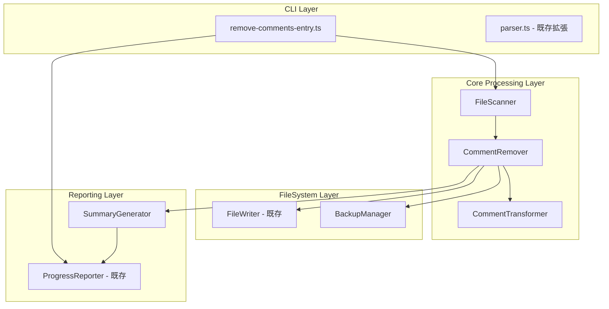
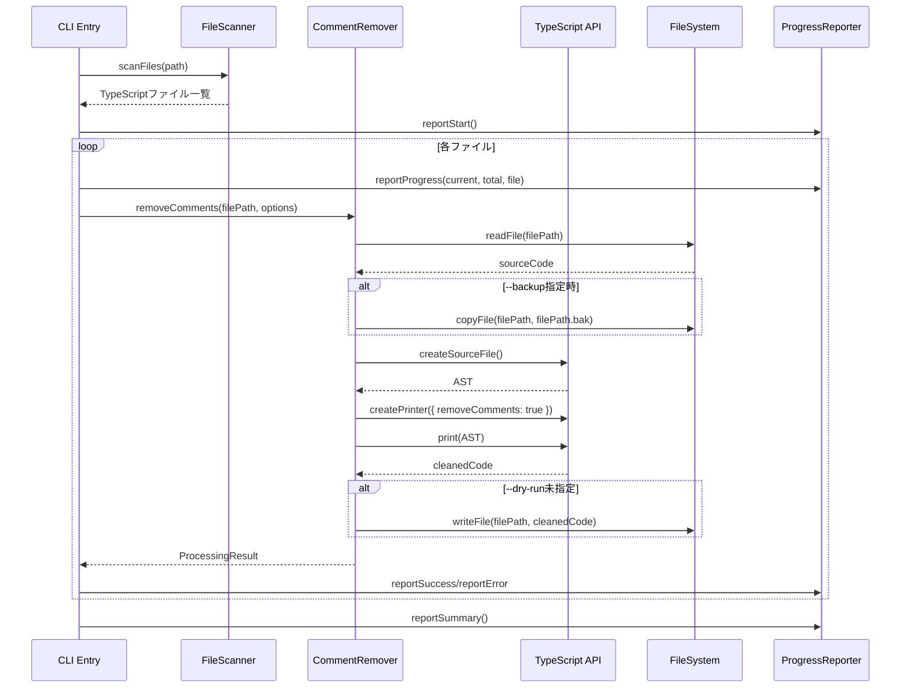

# Design Document: kirox-remove-comments

## Overview

**Purpose**: 本機能は、kiroxプロジェクトの`src/`ディレクトリ配下のTypeScriptファイルから全てのコメントを削除する開発者向けユーティリティを提供する。

**Users**: kiroxプロジェクトの開発者がコードベースのクリーンアップや配布前のコメント削除に使用する。

**Impact**: ソースコードからコメントを除去することで、コードベースのクリーンアップと可読性向上を実現する。

### Goals

- TypeScriptファイルから単一行コメント（`//`）と複数行コメント（`/* */`）を安全に削除
- JSDocコメント（`/** */`）をデフォルトで保持し、オプションで削除可能
- 文字列リテラル・テンプレートリテラル・正規表現内のコメントパターンを保護
- 進捗表示とサマリーレポートの提供

### Non-Goals

- JavaScript（`.js`）ファイルの処理（TypeScriptのみ対象）
- テストファイル（`*.test.ts`）の自動処理（手動で`--path`指定すれば可能）
- リモートリポジトリのファイル処理（ローカルファイルのみ）

## Architecture

### Architecture Pattern & Boundary Map



**Architecture Integration**:
- Selected pattern: レイヤードアーキテクチャ（既存パターンに準拠）
- Domain boundaries: CLI層 → Core処理層 → FileSystem層、Reporting層は横断的関心事
- Existing patterns preserved: ProgressReporter、FileWriter、Commander.js CLIパターン
- New components rationale:
  - `CommentRemover`: コメント削除のメインロジック
  - `CommentTransformer`: TypeScript AST変換
  - `FileScanner`: 対象ファイルの検出
  - `BackupManager`: バックアップファイル管理
  - `SummaryGenerator`: 処理結果のサマリー生成
- Steering compliance: レイヤー分離、単一責任原則を維持

### Technology Stack

| Layer | Choice / Version | Role in Feature | Notes |
|-------|------------------|-----------------|-------|
| CLI | Commander.js 12.x | CLIオプション解析 | 既存依存関係を再利用 |
| Core | TypeScript Compiler API 5.x | AST解析・コメント削除 | devDependenciesに存在、ランタイム使用 |
| FileSystem | Node.js fs/promises | ファイル読み書き | 標準ライブラリ |
| Reporting | ProgressReporter | 進捗・サマリー表示 | 既存コンポーネント再利用 |

## System Flows

### コメント削除フロー



## Requirements Traceability

| Requirement | Summary | Components | Interfaces | Flows |
|-------------|---------|------------|------------|-------|
| 1.1 | src/*.ts対象 | FileScanner | ScanOptions | scanFiles |
| 1.2 | 単一行コメント識別 | CommentTransformer | - | AST解析 |
| 1.3 | 複数行コメント識別 | CommentTransformer | - | AST解析 |
| 1.4 | JSDoc保持（デフォルト） | CommentTransformer | TransformOptions | AST変換 |
| 1.5 | --include-jsdocオプション | CLI Entry | CLIOptions | - |
| 2.1 | 単一行コメント削除 | CommentRemover | - | コメント削除フロー |
| 2.2 | 複数行コメント削除 | CommentRemover | - | コメント削除フロー |
| 2.3 | 文字列リテラル保護 | CommentTransformer | - | AST解析（自動） |
| 2.4 | テンプレートリテラル保護 | CommentTransformer | - | AST解析（自動） |
| 2.5 | 正規表現保護 | CommentTransformer | - | AST解析（自動） |
| 2.6 | フォーマット維持 | CommentRemover | PrinterOptions | createPrinter |
| 3.1 | --backupオプション | BackupManager | BackupOptions | バックアップ作成 |
| 3.2 | ファイル上書き | CommentRemover | - | writeFile |
| 3.3 | --dry-runオプション | CLI Entry | CLIOptions | - |
| 3.4 | 読み込みエラーハンドリング | CommentRemover | - | try-catch |
| 3.5 | 書き込みエラーハンドリング | CommentRemover | - | try-catch |
| 4.1-4.5 | CLIオプション | CLI Entry | CLIOptions | Commander.js |
| 5.1 | 処理前ファイル数表示 | ProgressReporter | - | reportStart |
| 5.2 | 進捗表示 | ProgressReporter | - | reportProgress |
| 5.3 | サマリー表示 | SummaryGenerator | ProcessingSummary | reportSummary |
| 5.4 | --verboseオプション | ProgressReporter | ReporterOptions | reportVerbose |

## Components and Interfaces

| Component | Domain/Layer | Intent | Req Coverage | Key Dependencies | Contracts |
|-----------|--------------|--------|--------------|------------------|-----------|
| remove-comments-entry | CLI | コメント削除のエントリポイント | 4.1-4.5 | Commander.js (P0) | Service |
| FileScanner | Core | 対象ファイルの検出 | 1.1 | fs/promises (P0) | Service |
| CommentRemover | Core | コメント削除のメインロジック | 2.1-2.6, 3.2-3.5 | TypeScript API (P0) | Service |
| CommentTransformer | Core | AST変換処理 | 1.2-1.4, 2.3-2.5 | TypeScript API (P0) | Service |
| BackupManager | FileSystem | バックアップファイル管理 | 3.1 | fs/promises (P0) | Service |
| SummaryGenerator | Reporting | サマリー生成 | 5.3 | - | Service |

### CLI Layer

#### remove-comments-entry

| Field | Detail |
|-------|--------|
| Intent | コメント削除CLIのエントリポイントを提供 |
| Requirements | 4.1, 4.2, 4.3, 4.4, 4.5 |

**Responsibilities & Constraints**
- CLIオプションの解析と検証
- 処理フロー全体の統括
- エラーハンドリングとexit code管理

**Dependencies**
- Inbound: CLI arguments - ユーザー入力 (P0)
- Outbound: FileScanner - ファイル検出 (P0)
- Outbound: CommentRemover - コメント削除 (P0)
- Outbound: ProgressReporter - 進捗表示 (P1)

**Contracts**: Service [x]

##### Service Interface

```typescript
interface RemoveCommentsOptions {
  path: string;           // 対象ディレクトリ（default: 'src/')
  dryRun: boolean;        // 変更なしでプレビュー
  backup: boolean;        // バックアップ作成
  includeJsdoc: boolean;  // JSDocコメントも削除
  verbose: boolean;       // 詳細ログ出力
}

interface RemoveCommentsResult {
  success: boolean;
  filesProcessed: number;
  commentsRemoved: number;
  errors: string[];
  exitCode: number;
}

function executeRemoveComments(options: RemoveCommentsOptions): Promise<RemoveCommentsResult>;
```

- Preconditions: pathが存在する有効なディレクトリパス
- Postconditions: 処理結果を返却、ファイル変更は--dry-run未指定時のみ
- Invariants: 元のコードの機能は変更されない

### Core Processing Layer

#### FileScanner

| Field | Detail |
|-------|--------|
| Intent | 対象ディレクトリからTypeScriptファイルを検出 |
| Requirements | 1.1 |

**Responsibilities & Constraints**
- 指定ディレクトリ配下の`.ts`ファイルを再帰的に検出
- `node_modules`、`dist`などの除外

**Dependencies**
- External: fs/promises - ファイルシステム操作 (P0)
- External: path - パス操作 (P0)

**Contracts**: Service [x]

##### Service Interface

```typescript
interface ScanOptions {
  path: string;
  extensions: string[];  // default: ['.ts']
  exclude: string[];     // default: ['node_modules', 'dist']
}

interface ScanResult {
  files: string[];
  totalCount: number;
}

function scanFiles(options: ScanOptions): Promise<ScanResult>;
```

#### CommentRemover

| Field | Detail |
|-------|--------|
| Intent | TypeScriptファイルからコメントを削除 |
| Requirements | 2.1, 2.2, 2.6, 3.2, 3.4, 3.5 |

**Responsibilities & Constraints**
- ファイル読み込み・書き込み
- コメント削除処理の実行
- エラーハンドリング

**Dependencies**
- Outbound: CommentTransformer - AST変換 (P0)
- Outbound: BackupManager - バックアップ作成 (P1)
- External: fs/promises - ファイル操作 (P0)

**Contracts**: Service [x]

##### Service Interface

```typescript
interface RemoveOptions {
  includeJsdoc: boolean;
  dryRun: boolean;
  backup: boolean;
}

interface FileProcessingResult {
  filePath: string;
  success: boolean;
  commentsRemoved: number;
  error?: string;
  originalSize: number;
  newSize: number;
}

function removeComments(
  filePath: string,
  options: RemoveOptions
): Promise<FileProcessingResult>;
```

#### CommentTransformer

| Field | Detail |
|-------|--------|
| Intent | TypeScript ASTを使用してコメントを除去 |
| Requirements | 1.2, 1.3, 1.4, 2.3, 2.4, 2.5 |

**Responsibilities & Constraints**
- TypeScript Compiler APIによるAST解析
- コメント削除とJSDoc保持ロジック
- 文字列リテラル・テンプレートリテラル・正規表現の保護（AST解析により自動）

**Dependencies**
- External: TypeScript - AST操作 (P0)

**Contracts**: Service [x]

##### Service Interface

```typescript
interface TransformOptions {
  preserveJsdoc: boolean;  // default: true
}

interface TransformResult {
  code: string;
  commentsRemoved: number;
}

function transformCode(
  sourceCode: string,
  filePath: string,
  options: TransformOptions
): TransformResult;
```

**Implementation Notes**
- Integration: `ts.createSourceFile()`でAST生成、`ts.createPrinter({ removeComments: true })`でコメント削除
- Validation: JSDoc保持時は`ts.getLeadingCommentRanges()`で判定
- Risks: TypeScript APIのバージョン互換性に注意

### FileSystem Layer

#### BackupManager

| Field | Detail |
|-------|--------|
| Intent | バックアップファイルの作成と管理 |
| Requirements | 3.1 |

**Responsibilities & Constraints**
- `.bak`拡張子でバックアップファイル作成
- 既存バックアップの上書き確認

**Dependencies**
- External: fs/promises - ファイル操作 (P0)

**Contracts**: Service [x]

##### Service Interface

```typescript
interface BackupResult {
  success: boolean;
  backupPath: string;
  error?: string;
}

function createBackup(filePath: string): Promise<BackupResult>;
```

### Reporting Layer

#### SummaryGenerator

| Field | Detail |
|-------|--------|
| Intent | 処理結果のサマリーを生成 |
| Requirements | 5.3 |

**Responsibilities & Constraints**
- 処理完了後のサマリー情報生成
- 成功/失敗ファイル数、削除コメント数の集計

**Dependencies**
- Inbound: FileProcessingResult[] - 各ファイルの処理結果 (P0)

**Contracts**: Service [x]

##### Service Interface

```typescript
interface ProcessingSummary {
  totalFiles: number;
  successFiles: number;
  failedFiles: number;
  totalCommentsRemoved: number;
  errors: Array<{ file: string; error: string }>;
}

function generateSummary(results: FileProcessingResult[]): ProcessingSummary;
```

## Data Models

### Domain Model

**Entities**:
- `SourceFile`: 処理対象のTypeScriptファイル
- `Comment`: コメント（単一行、複数行、JSDoc）

**Value Objects**:
- `FilePath`: ファイルパス
- `CommentRange`: コメントの位置情報

**Business Rules**:
- JSDocコメントはデフォルトで保持
- 文字列リテラル内のコメントパターンは削除対象外
- バックアップは元ファイルと同じディレクトリに作成

## Error Handling

### Error Strategy

| Error Type | Handling | Recovery |
|------------|----------|----------|
| ファイル読み込みエラー | エラーログ出力、次ファイルへ継続 | スキップして処理続行 |
| ファイル書き込みエラー | エラーログ出力、次ファイルへ継続 | スキップして処理続行 |
| TypeScript解析エラー | エラーログ出力、元ファイル維持 | 元のコードを保持 |
| 無効なオプション | エラーメッセージとusage表示 | exit code 1 |

### Monitoring

- 各ファイルの処理結果をログ出力
- サマリーでエラー一覧表示
- --verboseオプションで詳細ログ

## Testing Strategy

### Unit Tests

- `FileScanner.scanFiles()`: ディレクトリスキャン、除外パターン
- `CommentTransformer.transformCode()`: 各種コメント削除、JSDoc保持
- `BackupManager.createBackup()`: バックアップ作成
- `SummaryGenerator.generateSummary()`: サマリー生成

### Integration Tests

- CLI → FileScanner → CommentRemover → FileWriter
- --dry-runモードでの変更なし確認
- --backupオプションでのバックアップ作成確認

### E2E Tests

- 実際のTypeScriptファイルでのコメント削除
- 各CLIオプションの動作確認
- エラーケース（存在しないパス、権限エラー）

## Optional Sections

### Performance & Scalability

- **Target**: 100ファイル処理時に10秒以内
- **Approach**: ファイルの逐次処理（並列処理は将来検討）
- **Measurement**: 処理完了時に経過時間を表示（--verbose時）
