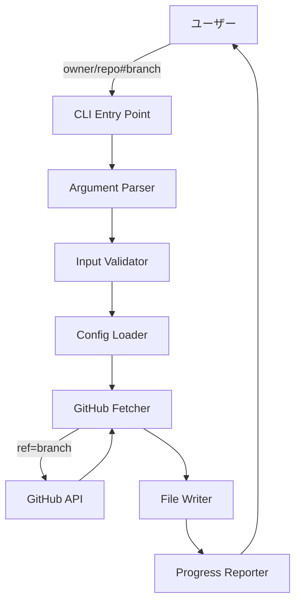
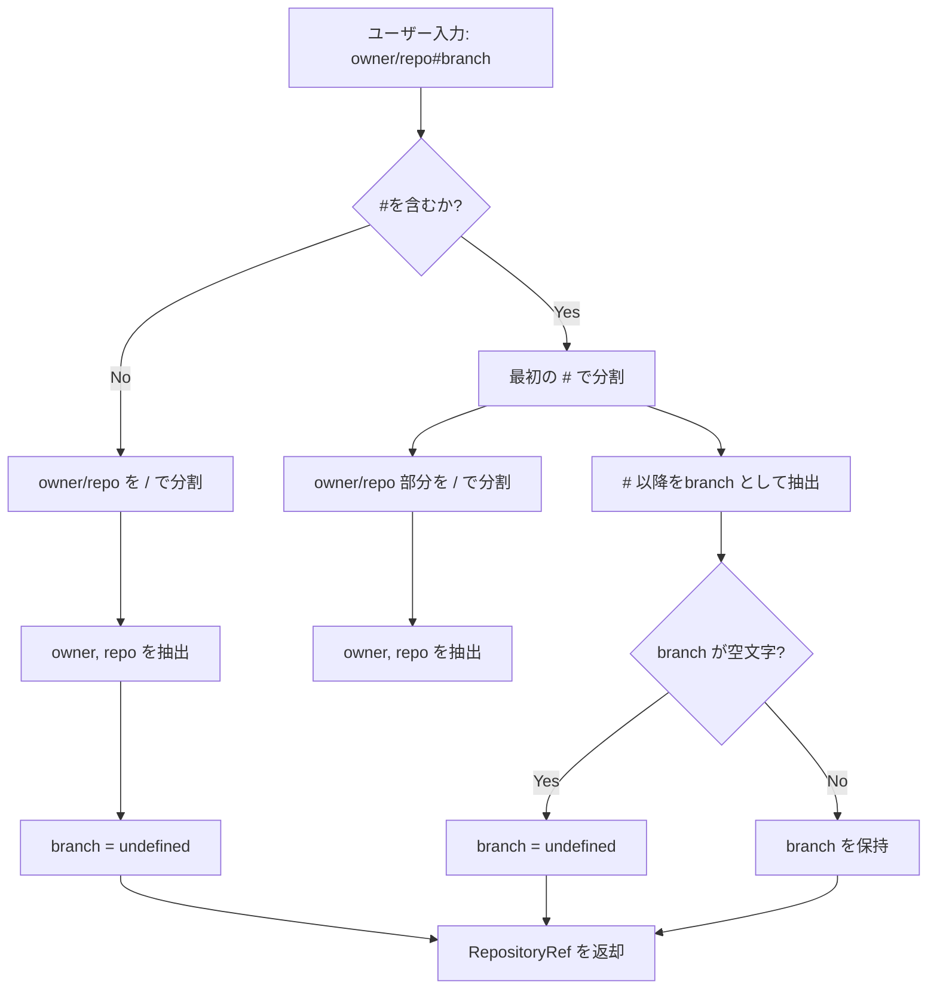
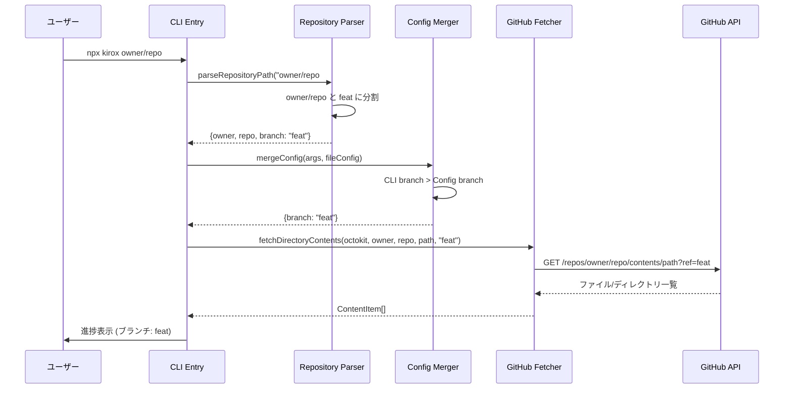
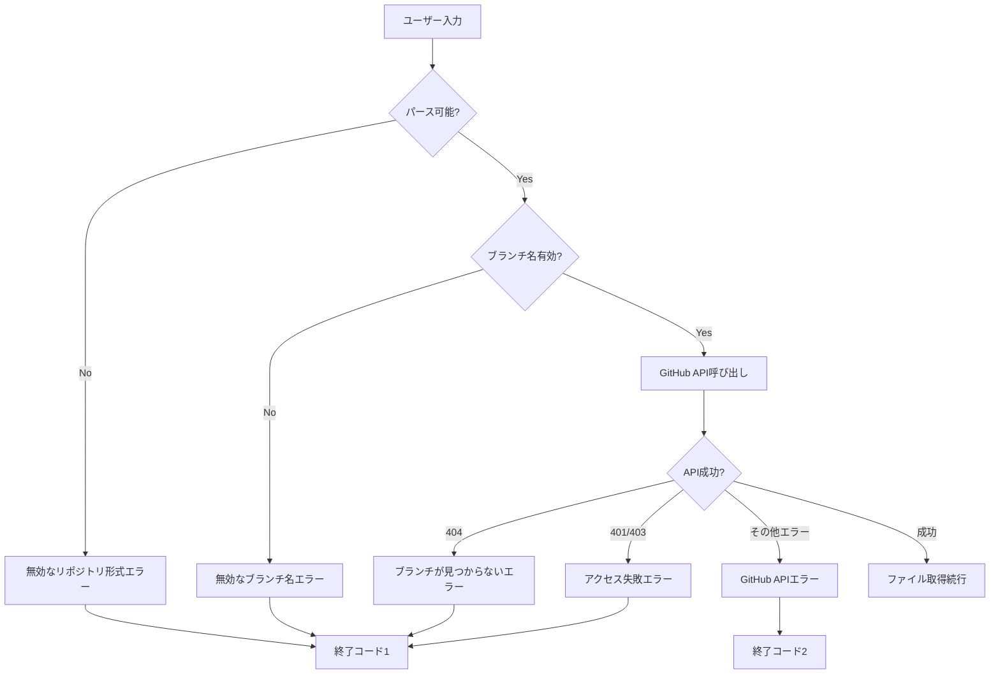

# 技術設計書

## 概要

本機能は、Kirox CLIにブランチ指定機能を追加し、`owner/repo#branch`形式でGitHubリポジトリの特定ブランチやタグから`.kiro`ファイルを取得できるようにします。

**目的**: 開発者がデフォルトブランチ以外のブランチ（開発ブランチ、リリースブランチ、タグ等）から仕様書とステアリングファイルを直接取得できるようにすることで、開発ワークフローの柔軟性を向上させます。

**ユーザー**: Kirox CLIを使用する開発者が、以下のシナリオで利用します：
- 機能開発中のブランチから最新の仕様書を取得
- 特定のリリースバージョンの仕様書を取得
- レビュー中のブランチの仕様書を確認

**影響**: 既存の`owner/repo`形式の動作はそのまま維持しつつ、新たに`owner/repo#branch`形式をサポートします。既存ユーザーへの影響はなく、下位互換性を完全に保ちます。

### ゴール

- `owner/repo#branch`形式でブランチ、タグ、コミットSHAを指定可能にする
- 既存の`owner/repo`形式との完全な下位互換性を維持する
- `.kiroxrc.json`でデフォルトブランチを設定可能にする
- ブランチ指定時の明確な進捗表示とエラーメッセージを提供する

### 非ゴール

- ブランチの自動検出や推奨ブランチの提案機能
- 複数ブランチからの同時取得
- ブランチ間の差分表示機能（将来的な拡張として検討）

## アーキテクチャ

### 既存アーキテクチャの分析

Kirox CLIは4層アーキテクチャを採用しており、本機能は以下の層に影響します：

1. **CLI層** (`src/cli/`): リポジトリパース処理とバリデーションの拡張
2. **GitHub統合層** (`src/github/`): GitHub API呼び出し時のrefパラメータ追加
3. **設定管理層** (`src/config/`): branchフィールドのサポート追加
4. **レポーティング層** (`src/reporting/`): ブランチ情報の表示

**保持される既存パターン**:
- 単方向データフロー: CLI → Parser → Validator → GitHub Fetcher → File Writer
- レイヤー分離: 各層の責任境界を維持
- エラーハンドリング: ErrorHandlerによる集中的なエラー処理

**統合ポイント**:
- `parseRepositoryPath()`: owner/repoの分割に加えてbranchの抽出を追加
- `fetchDirectoryContents()`: GitHub API呼び出しにrefパラメータを追加
- `ProgressReporter`: ブランチ情報を含む進捗メッセージ

### 高レベルアーキテクチャ



### 技術スタック連携

本機能は既存の技術スタックと完全に整合します：

**既存技術の活用**:
- **Commander.js**: リポジトリ引数のパース（変更なし）
- **Octokit v5.x**: GitHub REST API `repos.getContent()` のrefパラメータ使用
- **TypeScript 5.x**: 型安全性を保ちつつRepositoryRefインターフェースを拡張

**新規依存関係**: なし（既存のOctokit SDKのrefパラメータ機能を活用）

**ステアリング準拠**:
- `structure.md`: 既存のディレクトリ構造とファイル命名規則に従う
- `tech.md`: Node.js 18+、TypeScript 5.x、ESM仕様を維持
- `product.md`: 「上書き保護」「進捗可視化」などの既存DXを維持

### 主要な設計判断

#### 判断1: ブランチ指定の構文形式

**決定**: `owner/repo#branch`形式を採用

**コンテキスト**: ブランチ指定の方法として、以下の選択肢がありました：
- `owner/repo#branch` (GitHub URL風)
- `owner/repo@branch` (npmパッケージ風)
- `owner/repo:branch` (Docker風)
- `--branch`オプション

**検討した代替案**:
1. **`owner/repo@branch`形式**: npmパッケージ指定と整合性があるが、GitHubではメンション記号として使用される
2. **`--branch`オプション**: 明示的だがコマンドが冗長になる
3. **`owner/repo:branch`形式**: Docker風だが、GitHub URLでポート番号と混同される可能性

**選択したアプローチ**: `owner/repo#branch`形式

**理由**:
- GitHub URLで`#`がブランチ/タグ切り替えに使用される慣習と整合
- 単一引数で完結し、コマンドがシンプル（`npx kirox owner/repo#feature -p project`）
- 既存の`owner/repo`形式との視覚的な一貫性

**トレードオフ**:
- **獲得**: GitHub慣習との整合性、コマンドのシンプルさ、既存形式との互換性
- **犠牲**: ブランチ名に`#`が含まれる場合の考慮が必要（実際にはGitでは`#`は使用できないため問題なし）

#### 判断2: パース処理の実装場所

**決定**: `parseRepositoryPath()`関数を拡張し、`RepositoryRef`インターフェースに`branch?: string`を追加

**コンテキスト**: ブランチ情報の抽出と保持の方法として、新規関数の作成または既存関数の拡張が選択肢でした。

**検討した代替案**:
1. **新規関数`parseRepositoryWithBranch()`作成**: 既存コードへの影響を最小化するが、2つのパース関数が共存
2. **CLI層でブランチを分離**: 早期にブランチを抽出するが、GitHub層での利用時に再結合が必要

**選択したアプローチ**: 既存の`parseRepositoryPath()`を拡張し、戻り値の`RepositoryRef`に`branch?: string`を追加

**理由**:
- 単一責任の原則を維持（リポジトリパース処理の一元化）
- 既存のコールサイトは`branch`フィールドを無視できる（省略可能なフィールド）
- 型システムによる安全性の向上

**トレードオフ**:
- **獲得**: コード重複の回避、一元的なパース処理、型安全性
- **犠牲**: 既存関数の戻り値型が変更されるため、影響範囲の確認が必要

#### 判断3: GitHub API refパラメータの適用タイミング

**決定**: `fetchDirectoryContents()`関数にオプショナルな`ref`パラメータを追加

**コンテキスト**: GitHub APIの`ref`パラメータをどの層で適用するかの選択。

**検討した代替案**:
1. **CLI層で`owner/repo/tree/branch`形式に変換**: GitHub Web UIと同じ形式だが、API仕様と乖離
2. **Octokit client初期化時にデフォルトrefを設定**: クライアント単位での制御だが、Octokitはこの機能を提供していない

**選択したアプローチ**: `fetchDirectoryContents()`に`ref?: string`パラメータを追加し、API呼び出し時に条件付きで適用

**理由**:
- GitHub REST APIの仕様に直接対応
- refが`undefined`の場合はデフォルトブランチを使用（GitHub APIの標準動作）
- 呼び出し側で柔軟に制御可能

**トレードオフ**:
- **獲得**: APIの標準動作との整合性、シンプルな実装、柔軟性
- **犠牲**: 全ての`fetchDirectoryContents()`呼び出し箇所でrefパラメータを意識する必要

## システムフロー

### リポジトリパース処理フロー



### ブランチ指定時のファイル取得フロー



## 要件トレーサビリティ

| 要件 | 要件概要 | コンポーネント | インターフェース | フロー |
|------|---------|--------------|----------------|--------|
| 1.1-1.5 | ブランチ指定構文のサポート | Repository Parser | `parseRepositoryPath()` | リポジトリパース処理フロー |
| 2.1-2.4 | ブランチ名の検証 | Input Validator | `validateBranchName()` | - |
| 3.1-3.5 | リポジトリパース処理の拡張 | Repository Parser | `parseRepositoryPath()` | リポジトリパース処理フロー |
| 4.1-4.4 | GitHub API統合の拡張 | GitHub Fetcher | `fetchDirectoryContents(ref?)` | ブランチ指定時のファイル取得フロー |
| 5.1-5.4 | 設定ファイルでのデフォルトブランチ指定 | Config Merger | `mergeConfig()` | - |
| 6.1-6.4 | 進捗表示とログ出力 | Progress Reporter | `reportStart()`, `reportSummary()` | - |
| 7.1-7.3 | サブディレクトリオプションとの併用 | GitHub Fetcher | `fetchDirectoryContents(ref?)` | ブランチ指定時のファイル取得フロー |
| 8.1-8.4 | 下位互換性の維持 | Repository Parser | `parseRepositoryPath()` | リポジトリパース処理フロー |
| 9.1-9.3 | ヘルプとドキュメント | Argument Parser | Commander.js設定 | - |

## コンポーネントとインターフェース

### CLI層

#### Repository Parser (拡張)

**責任と境界**
- **主要責任**: リポジトリパス文字列を`owner`、`repo`、`branch`に分割
- **ドメイン境界**: CLI層の入力処理
- **データ所有権**: パース結果の`RepositoryRef`オブジェクト
- **トランザクション境界**: 該当なし（純粋関数）

**依存関係**
- **インバウンド**: CLI Entry Point、Update Checker、Update Applier
- **アウトバウンド**: なし（純粋関数）
- **外部**: なし

**契約定義**

**サービスインターフェース**:
```typescript
// 拡張された戻り値型
interface RepositoryRef {
  owner: string;
  repo: string;
  branch?: string; // 新規追加: ブランチ/タグ/コミットSHA
}

/**
 * リポジトリパス文字列をowner、repo、branchに分割
 *
 * @param repositoryPath - "owner/repo" または "owner/repo#branch" 形式
 * @returns RepositoryRef オブジェクト
 * @throws Error 無効な形式の場合
 */
function parseRepositoryPath(repositoryPath: string): RepositoryRef;
```

**事前条件**:
- `repositoryPath`は非null、非空文字列
- `owner/repo`または`owner/repo#branch`形式

**事後条件**:
- 成功時: `owner`と`repo`は必ず非空文字列
- ブランチ指定あり: `branch`は非空文字列または`undefined`（`#`のみの場合）
- ブランチ指定なし: `branch`は`undefined`

**不変条件**:
- `owner`と`repo`にスラッシュが含まれない
- 複数の`#`がある場合、最初の`#`がセパレータ

**統合戦略**:
- **変更アプローチ**: 既存関数を拡張（戻り値型に`branch?: string`を追加）
- **下位互換性**: 既存のコールサイトは`branch`フィールドを無視可能
- **移行パス**: 段階的に各コールサイトでブランチ対応を追加

#### Input Validator (拡張)

**責任と境界**
- **主要責任**: パース済み引数の妥当性検証（ブランチ名検証を追加）
- **ドメイン境界**: CLI層の入力検証
- **データ所有権**: `ValidationResult`オブジェクト

**依存関係**
- **インバウンド**: CLI Entry Point
- **アウトバウンド**: なし
- **外部**: なし

**契約定義**

**サービスインターフェース**:
```typescript
/**
 * ブランチ名の妥当性を検証
 *
 * @param branch - ブランチ名（undefined可）
 * @returns ValidationError[] エラー配列（空の場合は妥当）
 */
function validateBranchName(branch: string | undefined): ValidationError[];
```

**検証ルール**:
- `undefined`または空文字列は許可（デフォルトブランチ使用）
- 制御文字（`\0`、`\t`、`\n`等）を含む場合はエラー
- 先頭・末尾の空白は警告（トリミング推奨）

### GitHub統合層

#### GitHub Fetcher (拡張)

**責任と境界**
- **主要責任**: GitHub APIからディレクトリコンテンツとファイルを取得
- **ドメイン境界**: GitHub API統合
- **データ所有権**: `ContentItem[]`、`FileContent`
- **トランザクション境界**: 該当なし（外部API呼び出し）

**依存関係**
- **インバウンド**: CLI Entry Point、Parallel Fetcher、Update Checker
- **アウトバウンド**: Octokit Client
- **外部**: GitHub REST API v3

**外部依存関係の調査**:

**Octokit SDK**:
- **バージョン**: 5.x系（プロジェクトで使用中）
- **APIドキュメント**: https://docs.github.com/en/rest/repos/contents
- **認証**: Personal Access Token（環境変数`GITHUB_TOKEN`）
- **レート制限**: 認証あり 5,000 req/h、認証なし 60 req/h
- **refパラメータ**: `repos.getContent()`の`ref`オプションでブランチ/タグ/SHA指定可能

**GitHub API `ref`パラメータ**:
- **型**: `string`（省略可能）
- **デフォルト**: リポジトリのデフォルトブランチ
- **使用例**: `{owner, repo, path, ref: "feature-branch"}` または `ref: "v1.2.3"` または `ref: "abc123def"`
- **エラーケース**: 存在しないrefを指定した場合は404 Not Found

**契約定義**

**サービスインターフェース**:
```typescript
/**
 * ディレクトリコンテンツを取得
 *
 * @param client - Octokitクライアント
 * @param owner - リポジトリオーナー
 * @param repo - リポジトリ名
 * @param path - ディレクトリパス
 * @param ref - ブランチ/タグ/コミットSHA（省略時はデフォルトブランチ）
 * @returns ContentItem配列
 * @throws Error 404: リポジトリ/パス/refが見つからない
 * @throws Error その他のGitHub APIエラー
 */
async function fetchDirectoryContents(
  client: Octokit,
  owner: string,
  repo: string,
  path: string,
  ref?: string // 新規追加パラメータ
): Promise<ContentItem[]>;
```

**事前条件**:
- `client`は有効なOctokitインスタンス
- `owner`、`repo`、`path`は非空文字列
- `ref`は省略可能（`undefined`の場合はデフォルトブランチ使用）

**事後条件**:
- 成功時: 指定されたref（またはデフォルトブランチ）のディレクトリコンテンツを返す
- 失敗時: 明確なエラーメッセージを含む`Error`をスロー

**実装上の注意**:
- refが指定されている場合のみGitHub APIに`ref`パラメータを渡す
- エラーハンドリング時にrefの存在有無でメッセージを出し分ける

**統合戦略**:
- **変更アプローチ**: 既存関数にオプショナルパラメータ`ref?: string`を追加
- **下位互換性**: 既存のコールサイトは引数を追加しなくても動作（デフォルトブランチ使用）
- **移行パス**: CLI Entry Pointでブランチ指定がある場合にrefパラメータを渡す

### 設定管理層

#### Config Types (拡張)

**責任と境界**
- **主要責任**: 設定ファイルとマージ済み設定の型定義
- **ドメイン境界**: 設定管理
- **データ所有権**: `KiroxConfig`、`MergedConfig`型定義

**契約定義**

**型定義**:
```typescript
// 拡張された設定ファイル構造
export interface KiroxConfig {
  githubToken?: string;
  defaultConcurrency?: number;
  outputDirectory?: string;
  verbose?: boolean;
  force?: boolean;
  subdir?: string;
  branch?: string; // 新規追加: デフォルトブランチ
}

// 拡張されたマージ済み設定
export interface MergedConfig {
  githubToken?: string;
  concurrency: number;
  outputDirectory: string;
  verbose: boolean;
  force: boolean;
  dryRun: boolean;
  subdir?: string;
  branch?: string; // 新規追加: マージ後のブランチ
}
```

#### Config Merger (拡張)

**責任と境界**
- **主要責任**: CLI引数と設定ファイルの値をマージ（ブランチフィールド追加）
- **ドメイン境界**: 設定管理
- **データ所有権**: `MergedConfig`オブジェクト

**依存関係**
- **インバウンド**: CLI Entry Point
- **アウトバウンド**: Config Loader
- **外部**: なし

**契約定義**

**サービスインターフェース**:
```typescript
/**
 * CLI引数と設定ファイルをマージ（優先度: CLI > 設定ファイル > デフォルト）
 *
 * @param args - パース済みCLI引数（ParsedArguments）
 * @param fileConfig - 設定ファイル内容（KiroxConfig）
 * @returns MergedConfig マージ済み設定
 */
function mergeConfig(
  args: ParsedArguments,
  fileConfig: KiroxConfig | null
): MergedConfig;
```

**マージルール**:
- **ブランチ**: CLI引数でブランチ指定(`owner/repo#branch`) > `.kiroxrc.json`の`branch`フィールド > `undefined`（デフォルトブランチ）
- **優先順位**: CLI > 設定ファイル > デフォルト値

**事後条件**:
- `branch`は`string | undefined`（空文字列は`undefined`に正規化）

**統合戦略**:
- **変更アプローチ**: 既存の`mergeConfig()`ロジックに`branch`フィールドのマージを追加
- **下位互換性**: `.kiroxrc.json`に`branch`フィールドがない場合は`undefined`
- **移行パス**: 既存の設定ファイルは変更不要

### レポーティング層

#### Progress Reporter (拡張)

**責任と境界**
- **主要責任**: 進捗表示とサマリー出力（ブランチ情報を含む）
- **ドメイン境界**: ユーザーインターフェース（出力）
- **データ所有権**: なし（副作用のみ）

**依存関係**
- **インバウンド**: CLI Entry Point
- **アウトバウンド**: Chalk（色付け）、console（標準出力）
- **外部**: Chalk v5.x

**契約定義**

**サービスインターフェース**:
```typescript
class ProgressReporter {
  /**
   * 取得開始メッセージを表示（ブランチ情報を追加）
   *
   * @param repository - リポジトリ（owner/repo形式）
   * @param project - プロジェクト名
   * @param subdir - サブディレクトリ（省略可）
   * @param branch - ブランチ名（省略可）
   */
  reportStart(
    repository: string,
    project: string,
    subdir?: string,
    branch?: string // 新規追加パラメータ
  ): void;

  /**
   * サマリーメッセージを表示（ブランチ情報を追加）
   *
   * @param downloaded - ダウンロード成功数
   * @param failed - 失敗数
   * @param subdir - サブディレクトリ（省略可）
   * @param branch - ブランチ名（省略可）
   */
  reportSummary(
    downloaded: number,
    failed: number,
    subdir?: string,
    branch?: string // 新規追加パラメータ
  ): void;
}
```

**表示フォーマット**:
- ブランチ指定あり: `取得元: owner/repo (ブランチ: feature-branch)`
- デフォルトブランチ: `取得元: owner/repo (デフォルトブランチ)`
- サブディレクトリあり: `取得元: owner/repo/subdir (ブランチ: feature-branch)`

**統合戦略**:
- **変更アプローチ**: 既存メソッドにオプショナルパラメータ`branch?: string`を追加
- **下位互換性**: 既存のコールサイトは引数を追加しなくても動作
- **移行パス**: CLI Entry PointでRepositoryRefからbranchを抽出して渡す

## データモデル

### ドメインモデル

#### RepositoryRef (拡張)

**エンティティ定義**:
```typescript
interface RepositoryRef {
  /** リポジトリオーナー */
  owner: string;
  /** リポジトリ名 */
  repo: string;
  /** ブランチ/タグ/コミットSHA（省略可） */
  branch?: string;
}
```

**ビジネスルールと不変条件**:
- `owner`と`repo`は必須、非空文字列
- `branch`は省略可能（`undefined`の場合はデフォルトブランチを意味）
- `owner`と`repo`にスラッシュを含まない
- `branch`は空文字列の場合は`undefined`に正規化

**バリデーションルール**:
- `owner/repo`形式のチェック（既存）
- `branch`に制御文字が含まれないこと（新規）

#### ParsedArguments (拡張)

**エンティティ定義**:
```typescript
interface ParsedArguments {
  repository: string; // "owner/repo" または "owner/repo#branch" 形式
  project: string;
  output: string;
  force: boolean;
  dryRun: boolean;
  verbose: boolean;
  config?: string;
  track: boolean;
  checkUpdates: boolean;
  update: boolean;
  subdir?: string;
  // branch フィールドは追加しない（repository文字列から都度パース）
}
```

**設計判断**: `branch`フィールドを`ParsedArguments`に追加せず、`repository`文字列を保持し、必要に応じて`parseRepositoryPath()`でパースする方針。これにより、リポジトリ情報の一元管理と型の一貫性を維持。

### 論理データモデル

#### 設定ファイル (.kiroxrc.json)

**構造定義**:
```json
{
  "githubToken": "ghp_...",
  "defaultConcurrency": 5,
  "outputDirectory": ".",
  "verbose": false,
  "force": false,
  "subdir": "packages/api",
  "branch": "develop"
}
```

**整合性ルール**:
- `branch`フィールドは省略可能
- `branch`が空文字列の場合はデフォルトブランチを使用
- CLI引数でブランチ指定がある場合は設定ファイルの`branch`より優先

## エラーハンドリング

### エラー戦略

本機能では、既存のエラーハンドリング機構（`ErrorHandler`クラス）を活用し、ブランチ指定に関連する新しいエラータイプを追加します。

### エラーカテゴリと対応

#### ユーザーエラー (4xx相当)

**無効なリポジトリ形式**:
- **発生条件**: `#`のみで始まる、`/#`を含む、`owner`または`repo`が空
- **エラーメッセージ**: `無効なリポジトリ形式です: owner/repo#branch形式で指定してください`
- **終了コード**: 1
- **対応**: リポジトリパース時に検出、CLI層でバリデーション

**無効なブランチ名**:
- **発生条件**: ブランチ名に制御文字（タブ、改行等）が含まれる
- **エラーメッセージ**: `無効なブランチ名です: <branch>`
- **終了コード**: 1
- **対応**: Input Validatorで検証

**ブランチが見つからない**:
- **発生条件**: 指定されたブランチ/タグがリポジトリに存在しない
- **エラーメッセージ**: `ブランチが見つかりません: <branch>`
- **終了コード**: 1
- **対応**: GitHub API呼び出し時に404エラーを検出、エラーメッセージにrefを含める

**ブランチへのアクセス失敗**:
- **発生条件**: プライベートブランチへの権限不足、認証エラー
- **エラーメッセージ**: `ブランチへのアクセスに失敗しました: <branch>（権限不足の可能性があります）`
- **終了コード**: 1
- **対応**: GitHub API呼び出し時に401/403エラーを検出

#### システムエラー (5xx相当)

**GitHub APIエラー**:
- **発生条件**: GitHub APIのタイムアウト、レート制限超過
- **エラーメッセージ**: 既存のErrorHandlerの処理を踏襲
- **終了コード**: 2
- **対応**: ErrorHandlerクラスで処理

### エラーフロー



### モニタリング

**エラー追跡**:
- 既存のLoggerクラスでブランチ指定エラーをログ出力
- `--verbose`オプション時にブランチ情報とAPIレスポンスを詳細ログ

**ログフォーマット**:
```typescript
logger.error('Branch not found', {
  repository: 'owner/repo',
  branch: 'feature-branch',
  statusCode: 404
});
```

## テスト戦略

### 単体テスト

#### CLI層

**Repository Parser** (`tests/unit/cli/parser.test.ts`):
1. `owner/repo#branch`形式のパース成功（branch抽出）
2. `owner/repo`形式のパース成功（branch: undefined）
3. `owner/repo#`形式のパース（branch: undefined）
4. `owner/repo#feature/new-api`形式（スラッシュ含むブランチ名）
5. `owner/repo#v1.2.3`形式（タグ）
6. 無効な形式（`#only`、`owner/#repo`）のエラー

**Input Validator** (`tests/unit/cli/validator.test.ts`):
1. 有効なブランチ名のバリデーション成功
2. `undefined`ブランチのバリデーション成功（デフォルトブランチ）
3. 制御文字を含むブランチ名のバリデーション失敗
4. 先頭・末尾に空白を含むブランチ名の警告

#### GitHub層

**GitHub Fetcher** (`tests/unit/github/fetcher.test.ts`):
1. `ref`パラメータありでのディレクトリコンテンツ取得成功
2. `ref`パラメータなし（undefined）での取得成功（デフォルトブランチ）
3. 存在しないrefでの404エラーハンドリング
4. refパラメータがOctokit APIに正しく渡されることの検証（モック）

#### 設定管理層

**Config Merger** (`tests/unit/config/merger.test.ts`):
1. CLI引数のブランチが設定ファイルのbranchより優先
2. CLI引数にブランチがない場合、設定ファイルのbranchを使用
3. 両方にブランチがない場合、`undefined`を返す
4. 空文字列ブランチは`undefined`に正規化

### 統合テスト

**CLI → GitHub API統合** (`tests/integration/cli-to-github.test.ts`):
1. ブランチ指定ありでの実際のGitHub API呼び出し（テストリポジトリ）
2. 存在しないブランチでのエラーレスポンス検証
3. サブディレクトリとブランチ指定の併用

**GitHub → ファイルシステム統合** (`tests/integration/github-to-fs.test.ts`):
1. ブランチ指定でのファイル取得とローカル保存
2. 進捗表示にブランチ情報が含まれることの検証

### E2Eテスト

**基本フロー** (`tests/e2e/basic-flow.test.ts`):
1. `npx kirox owner/repo#branch -p project`の完全実行
2. デフォルトブランチ（ブランチ指定なし）の実行
3. タグ指定（`owner/repo#v1.0.0`）の実行

**オプション組み合わせ** (`tests/e2e/options.test.ts`):
1. `owner/repo#branch --subdir packages/api -p project`
2. `owner/repo#branch --verbose`でのブランチ情報表示
3. `.kiroxrc.json`の`branch`フィールドを使用したデフォルトブランチ

**エラーシナリオ** (`tests/e2e/error-scenarios.test.ts`):
1. 存在しないブランチ指定時のエラーメッセージ
2. 無効なリポジトリ形式（`#only`）のエラー
3. 無効なブランチ名（制御文字含む）のエラー

### パフォーマンステスト

**レート制限対応** (`tests/performance/rate-limit.test.ts`):
1. ブランチ指定ありでの100ファイル取得（並列度5）
2. GitHub APIレート制限内での完了確認

## セキュリティ考慮事項

### 入力検証

**ブランチ名インジェクション防止**:
- ブランチ名に制御文字、改行、タブが含まれないことを検証
- Octokit SDKがURLエンコードを自動処理するため、追加のエスケープ不要

**リポジトリパスの検証**:
- 既存の`REPOSITORY_PATTERN`正規表現を維持
- `#`より前の部分が`owner/repo`形式であることを確認

### 認証とアクセス制御

**ブランチアクセス権限**:
- GitHub APIのアクセス制御に依存
- プライベートブランチへのアクセス失敗時に明確なエラーメッセージ
- 認証トークン（`GITHUB_TOKEN`）の適切な使用

### データ保護

**ブランチ情報のログ**:
- ブランチ名は機密情報ではないため、通常ログに含めてもよい
- `--verbose`オプション時にGitHub APIレスポンスをログ（既存動作を踏襲）

## 下位互換性と移行

### 既存機能への影響

**影響なし**:
- `owner/repo`形式の既存コマンドは完全に動作（branchが`undefined`として処理される）
- 既存の`.kiroxrc.json`は`branch`フィールドがなくても動作
- GitHub API呼び出し時に`ref`パラメータが`undefined`の場合はデフォルトブランチ使用（GitHub APIの標準動作）

### 移行パス

**段階的な導入**:
1. **Phase 1**: `parseRepositoryPath()`と`RepositoryRef`型の拡張
2. **Phase 2**: `fetchDirectoryContents()`に`ref`パラメータ追加
3. **Phase 3**: CLI Entry Pointでブランチ情報の抽出と渡し
4. **Phase 4**: Progress Reporterでブランチ情報の表示
5. **Phase 5**: Config Mergerで`branch`フィールドのサポート

**ロールバック戦略**:
- 各フェーズで既存機能が影響を受けないことを確認
- 問題発生時は該当フェーズのみロールバック可能

### 非推奨化

**該当なし**: 本機能は既存機能を置き換えず、拡張のみを行います。
