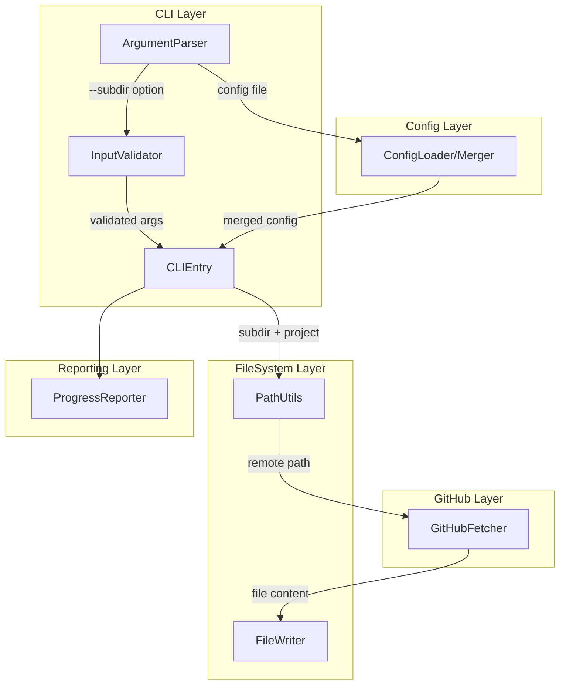
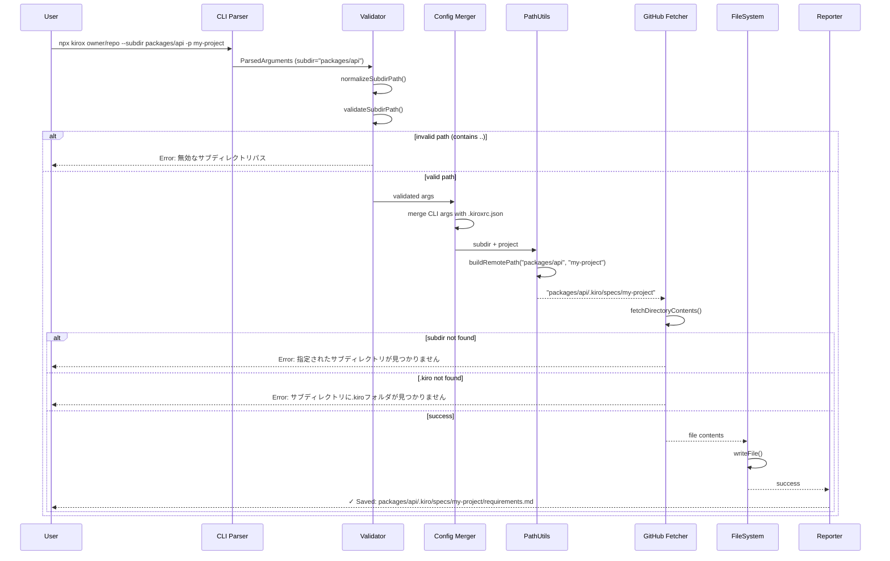
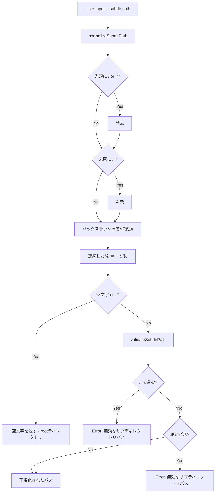
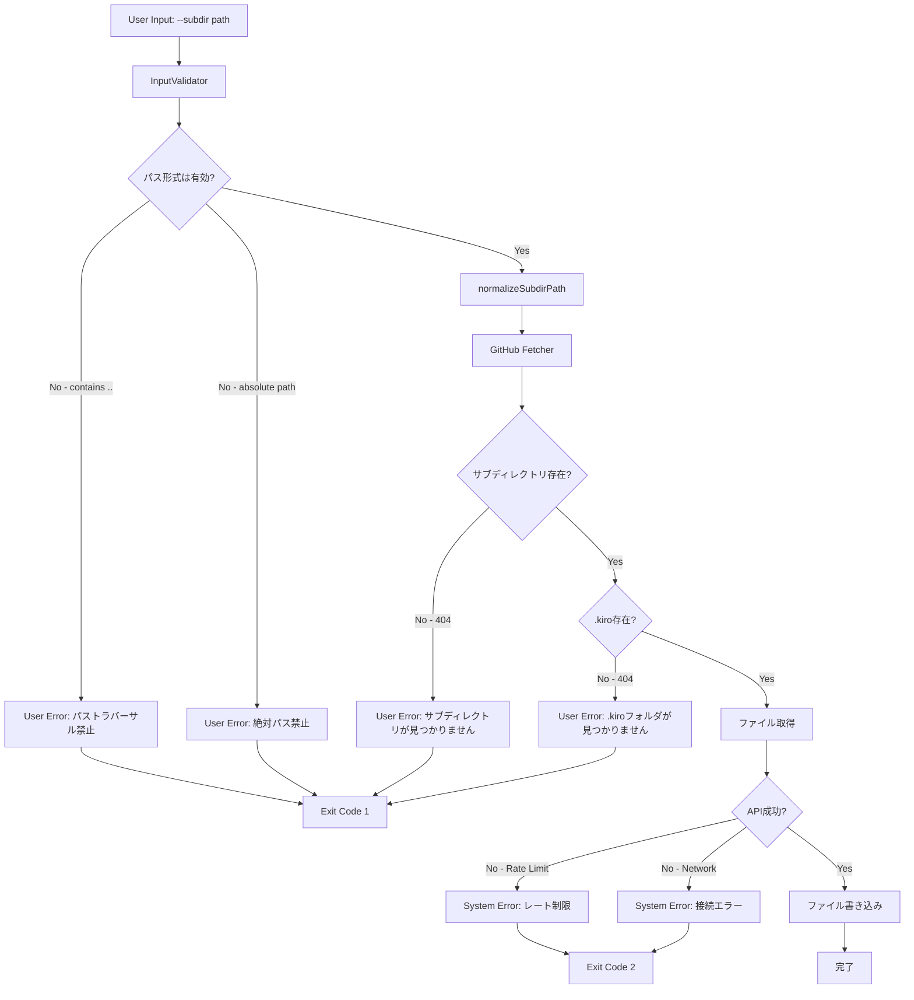
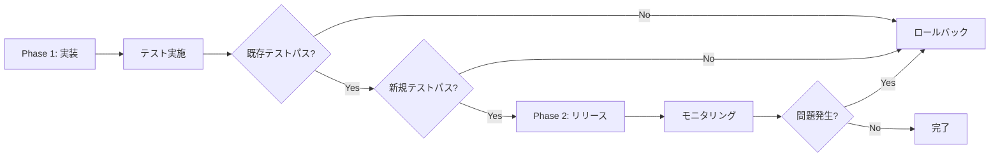

# Technical Design Document

## Overview

本機能は、Kirox CLIにサブディレクトリ指定機能を追加し、モノレポやマルチプロジェクト構成のリポジトリから`.kiro`フォルダを取得できるようにする。現在はrootディレクトリの`.kiro`のみサポートしているが、本機能により`packages/api/.kiro`や`services/auth/.kiro`などのサブディレクトリからも取得可能になる。

**Purpose:** モノレポ構成のリポジトリから特定のサブディレクトリにある.kiroフォルダを取得できるようにすることで、プロジェクト間でのSpec-Driven Developmentの成果物共有を柔軟に行えるようにする。

**Users:** Kirox CLIを使用する開発者が、`--subdir`オプションを指定してサブディレクトリから仕様書を取得するワークフローで利用する。

**Impact:** 既存のrootディレクトリからの取得機能は維持され、下位互換性を保つ。新たに`--subdir`オプションが追加され、`.kiroxrc.json`に`subdir`フィールドが追加される。

### Goals

- `--subdir`オプションによるサブディレクトリ指定機能の追加
- `.kiroxrc.json`での`subdir`デフォルト設定サポート
- パス正規化とセキュリティ検証（`..`、絶対パス禁止）
- 既存機能との下位互換性維持
- 明確なエラーメッセージによるユーザー体験向上

### Non-Goals

- 複数サブディレクトリからの同時取得（1コマンド1サブディレクトリのみ）
- サブディレクトリの自動検出やリスト表示
- `.kiro`以外のディレクトリ名のサポート

## Architecture

### Existing Architecture Analysis

Kirox CLIは4層アーキテクチャを採用している：

1. **CLI Layer** (`src/cli/`): 引数パース、バリデーション
2. **GitHub Integration Layer** (`src/github/`): GitHub APIとの通信、ファイル取得
3. **File System Layer** (`src/filesystem/`): ローカルファイルシステムへの書き込み
4. **Reporting Layer** (`src/reporting/`): 進捗表示、エラーハンドリング

現在の実装では、`.kiro/specs/<project>`と`.kiro/steering/`のパスがハードコードされており、サブディレクトリを指定する機能が存在しない。

### High-Level Architecture

本機能では、既存の4層アーキテクチャを維持しつつ、各層に最小限の変更を加える。



**既存パターンの維持**:
- Layer-Based Architecture: 各層の責任分離を維持
- Dependency Flow: 上位層が下位層に依存する単方向フロー
- Fail-Safe Design: 部分的な失敗を許容する設計

**新規コンポーネント追加の根拠**:
- サブディレクトリパスを正規化・検証するユーティリティ関数をPathUtilsに追加（セキュリティとパス整合性確保）
- CLIオプションと設定ファイルでのサブディレクトリ指定をサポート（ユーザビリティ向上）

**Technology Alignment**:
- 既存のTypeScript 5.x、Node.js 18+、Commander.js、Octokitを使用
- 新規外部ライブラリの追加なし

**Steering Compliance**:
- Single Responsibility Principle: 各コンポーネントは単一の責任を持つ
- Layer Isolation: レイヤー間の直接依存を最小化
- Fail-Safe Design: エラー時も処理を継続可能に設計

## Technology Alignment

本機能は既存のKirox CLIのテクノロジースタックに完全に準拠する：

- **Runtime**: Node.js 18+ (既存のfsモジュール、pathモジュールを使用)
- **Language**: TypeScript 5.x (厳格な型チェック、any禁止)
- **CLI Framework**: Commander.js (既存のオプション定義パターンを踏襲)
- **GitHub API**: Octokit (既存のファイル取得ロジックを再利用)

**新規依存ライブラリ**: なし

**既存パターンからの変更点**:
- `.kiroxrc.json`に`subdir`フィールドを追加（既存の設定ファイル構造を拡張）
- `ParsedArguments`型に`subdir`フィールドを追加（既存の型定義パターンを踏襲）

### Key Design Decisions

#### Decision 1: サブディレクトリパスの正規化戦略

**Context**: ユーザーが指定するサブディレクトリパスは、`/packages/api`、`packages/api/`、`./packages/api`など様々な形式が想定される。パス処理の一貫性とセキュリティを確保する必要がある。

**Alternatives**:
1. Node.jsの`path.normalize`のみ使用（シンプルだがセキュリティチェックが不十分）
2. 正規表現による厳格なホワイトリスト検証（厳密すぎて柔軟性が低い）
3. 段階的な正規化とブラックリスト検証（柔軟性とセキュリティのバランス）

**Selected Approach**: **段階的な正規化とブラックリスト検証**

パス正規化関数`normalizeSubdirPath()`を実装し、以下の順序で処理：
1. 先頭の`/`、`./`を除去
2. 末尾の`/`を除去
3. 連続した`/`を単一の`/`に変換
4. バックスラッシュ`\`を`/`に変換
5. 空文字または`.`の場合は空文字を返す（rootディレクトリとして扱う）
6. `..`や絶対パスを含む場合はエラー

**Rationale**:
- ユーザーが直感的に入力可能な様々な形式を受け入れる柔軟性
- セキュリティリスク（パストラバーサル攻撃）を防ぐブラックリスト検証
- Node.jsのpathモジュールとの整合性

**Trade-offs**:
- **Gain**: ユーザビリティ向上、セキュリティ確保、既存のpath-utilsパターンとの一貫性
- **Sacrifice**: 正規化ロジックの複雑さが若干増加（ただしテスタビリティは維持）

#### Decision 2: 設定ファイルとCLIオプションの優先順位

**Context**: `.kiroxrc.json`に`subdir`を設定しつつ、コマンドライン引数でも`--subdir`を指定可能にする必要がある。どちらを優先するかの決定が必要。

**Alternatives**:
1. 設定ファイル優先（一貫性があるが、一時的な変更が困難）
2. CLIオプション優先（柔軟性があるが、設定ファイルの意味が薄れる）
3. 両方を必須にする（厳格だがユーザビリティが低下）

**Selected Approach**: **CLIオプション優先**

既存のKirox CLIの設定マージパターンに従い、`Priority: CLI options > config file > environment variables > defaults`を維持。

**Rationale**:
- 既存のKirox CLIの設定優先順位ルールと一貫性を保つ
- 一時的なサブディレクトリ変更（テスト、デバッグ）が容易
- 設定ファイルはデフォルト値として機能し、必要に応じてCLIでオーバーライド可能

**Trade-offs**:
- **Gain**: 既存パターンとの一貫性、柔軟性、ユーザビリティ向上
- **Sacrifice**: なし（既存の設計パターンを踏襲）

#### Decision 3: サブディレクトリ存在チェックのタイミング

**Context**: 指定されたサブディレクトリがリポジトリに存在しない場合、いつエラーを検出するかを決定する必要がある。

**Alternatives**:
1. バリデーション段階でGitHub APIを呼び出して事前チェック（早期検出だが余分なAPI呼び出し）
2. ファイル取得時に初めてエラーを検出（API呼び出し削減だが遅延エラー）
3. ハイブリッド: バリデーションでパス形式チェック、取得時に存在チェック

**Selected Approach**: **ハイブリッド方式**

バリデーション段階ではパス形式のみチェック（`..`、絶対パスの禁止）し、実際のサブディレクトリ存在確認はGitHub APIでのファイル取得時に行う。

**Rationale**:
- バリデーション段階でGitHub APIを呼び出すとレート制限に影響し、パフォーマンスが低下
- ファイル取得時のエラーハンドリングで十分に対応可能（既存のエラーハンドリングパターンを再利用）
- セキュリティ関連のパス検証は早期に実施し、存在確認は取得時に委ねることで責任分離を維持

**Trade-offs**:
- **Gain**: API呼び出し削減、レート制限への配慮、既存のエラーハンドリングパターン再利用
- **Sacrifice**: エラー検出が若干遅延（ただし明確なエラーメッセージで補償）

## System Flows

### サブディレクトリ指定によるファイル取得フロー



### パス正規化とバリデーションフロー



## Requirements Traceability

| Requirement | Requirement Summary | Components | Interfaces | Flows |
|-------------|---------------------|------------|------------|-------|
| 1.1-1.9 | サブディレクトリ指定オプション | ArgumentParser, PathUtils | `parseArguments()`, `normalizeSubdirPath()` | サブディレクトリ指定フロー、パス正規化フロー |
| 2.1-2.5 | 設定ファイルでのデフォルト指定 | ConfigLoader, ConfigMerger | `loadConfig()`, `mergeConfig()` | 設定マージフロー |
| 3.1-3.4 | パス検証とエラーハンドリング | InputValidator, PathUtils, ErrorHandler | `validateSubdirPath()`, `handle()` | パス正規化フロー |
| 4.1-4.4 | プロジェクト指定との併用 | PathUtils, GitHubFetcher | `buildRemotePath()`, `fetchDirectoryContents()` | サブディレクトリ指定フロー |
| 5.1-5.4 | 進捗表示とログ出力 | ProgressReporter, Logger | `reportStart()`, `reportProgress()` | サブディレクトリ指定フロー |
| 6.1-6.3 | 下位互換性の維持 | 全コンポーネント | 既存のインターフェースを維持 | 既存フロー維持 |
| 7.1-7.3 | ヘルプとドキュメント | ArgumentParser | `parseArguments()` (Commander.js) | - |

## Components and Interfaces

### CLI Layer

#### ArgumentParser

**Responsibility & Boundaries**
- **Primary Responsibility**: コマンドライン引数のパースと`--subdir`オプションの追加
- **Domain Boundary**: CLI層（ユーザー入力の受け付け）
- **Data Ownership**: ParsedArguments型の生成

**Dependencies**
- **Inbound**: CLIEntry
- **Outbound**: Commander.js
- **External**: Commander.js (v12.x)

**Contract Definition**

型定義の拡張:
```typescript
// src/cli/types.ts
export interface ParsedArguments {
  repository: string;
  project: string;
  output: string;
  force: boolean;
  dryRun: boolean;
  verbose: boolean;
  config?: string;
  track: boolean;
  checkUpdates: boolean;
  update: boolean;
  subdir?: string; // 新規追加
}
```

パーサーの拡張:
```typescript
// src/cli/parser.ts
export function parseArguments(argv: string[]): ParsedArguments {
  const program = new Command();

  program
    .name('kirox')
    // ... 既存のオプション ...
    .option('-s, --subdir <path>', 'Subdirectory path containing .kiro folder')
    // ... 残りのオプション ...

  program.parse(argv);

  const options = program.opts<{
    // ... 既存のオプション型 ...
    subdir?: string;
  }>();

  return {
    // ... 既存のフィールド ...
    subdir: options.subdir,
  };
}
```

**Preconditions**: argv配列が有効なコマンドライン引数形式
**Postconditions**: ParsedArguments型のオブジェクトが返される
**Invariants**: 既存のオプション定義とコンフリクトしない

#### InputValidator

**Responsibility & Boundaries**
- **Primary Responsibility**: サブディレクトリパスのセキュリティ検証とプロジェクト名検証の拡張
- **Domain Boundary**: CLI層（入力バリデーション）
- **Data Ownership**: ValidationResult型の生成

**Dependencies**
- **Inbound**: CLIEntry
- **Outbound**: PathUtils (正規化関数)
- **External**: なし

**Contract Definition**

バリデーションの拡張:
```typescript
// src/cli/validator.ts
export function validateInput(args: ParsedArguments): ValidationResult {
  const errors: ValidationError[] = [];

  // 既存のバリデーション ...

  // サブディレクトリパス検証（指定されている場合のみ）
  if (args.subdir !== undefined) {
    try {
      // PathUtilsのnormalizeSubdirPathを呼び出して検証
      // validateSubdirPathで..や絶対パスをチェック
      const normalized = normalizeSubdirPath(args.subdir);
      validateSubdirPath(normalized);
    } catch (error) {
      errors.push({
        field: 'subdir',
        message: error instanceof Error ? error.message : '無効なサブディレクトリパスです',
      });
    }
  }

  return {
    valid: errors.length === 0,
    errors,
  };
}
```

**Preconditions**: ParsedArguments型の有効なオブジェクト
**Postconditions**: ValidationResult型のオブジェクトが返される
**Invariants**: エラーがある場合は`valid: false`かつ`errors`配列が空でない

### Config Layer

#### ConfigLoader / ConfigMerger

**Responsibility & Boundaries**
- **Primary Responsibility**: `.kiroxrc.json`からの`subdir`フィールド読み込みと設定マージ
- **Domain Boundary**: Config層（設定管理）
- **Data Ownership**: KiroxConfig型、MergedConfig型

**Dependencies**
- **Inbound**: CLIEntry
- **Outbound**: Node.js fs/promises
- **External**: Node.js fs/promises

**Contract Definition**

設定型の拡張:
```typescript
// src/config/types.ts
export interface KiroxConfig {
  githubToken?: string;
  defaultConcurrency?: number;
  outputDirectory?: string;
  verbose?: boolean;
  force?: boolean;
  subdir?: string; // 新規追加
}

export interface MergedConfig {
  githubToken?: string;
  concurrency: number;
  outputDirectory: string;
  verbose: boolean;
  force: boolean;
  dryRun: boolean;
  subdir?: string; // 新規追加
}
```

マージロジックの拡張:
```typescript
// src/config/merger.ts
export function mergeConfig(
  args: ParsedArguments,
  fileConfig: KiroxConfig
): MergedConfig {
  return {
    // ... 既存のフィールドマージ ...
    subdir: args.subdir ?? fileConfig.subdir, // CLIオプション優先
  };
}
```

**Preconditions**: `.kiroxrc.json`が有効なJSON形式（存在しない場合は空のconfig）
**Postconditions**: MergedConfig型のオブジェクトが返される
**Invariants**: CLIオプションが設定ファイルより優先される

### FileSystem Layer

#### PathUtils

**Responsibility & Boundaries**
- **Primary Responsibility**: サブディレクトリパスの正規化、検証、リモートパス構築
- **Domain Boundary**: FileSystem層（パス操作）
- **Data Ownership**: 正規化されたパス文字列

**Dependencies**
- **Inbound**: InputValidator, CLIEntry, GitHubFetcher
- **Outbound**: Node.js path module
- **External**: Node.js path module

**Contract Definition**

新規関数の追加:
```typescript
// src/filesystem/path-utils.ts

/**
 * サブディレクトリパスを正規化
 *
 * @param subdirPath - ユーザー入力のサブディレクトリパス
 * @returns 正規化されたパス（空文字の場合はrootディレクトリを示す）
 */
export function normalizeSubdirPath(subdirPath: string): string {
  if (!subdirPath || typeof subdirPath !== 'string') {
    return '';
  }

  let normalized = subdirPath.trim();

  // 先頭の / または ./ を除去
  normalized = normalized.replace(/^\/+/, '').replace(/^\.\//, '');

  // 末尾の / を除去
  normalized = normalized.replace(/\/+$/, '');

  // バックスラッシュをスラッシュに変換
  normalized = normalized.replace(/\\/g, '/');

  // 連続したスラッシュを単一のスラッシュに
  normalized = normalized.replace(/\/+/g, '/');

  // . または空文字の場合はrootディレクトリとして空文字を返す
  if (normalized === '.' || normalized === '') {
    return '';
  }

  return normalized;
}

/**
 * サブディレクトリパスのセキュリティ検証
 *
 * @param subdirPath - 正規化されたサブディレクトリパス
 * @throws Error パストラバーサルや絶対パスが検出された場合
 */
export function validateSubdirPath(subdirPath: string): void {
  // 空文字はrootディレクトリを示すので有効
  if (subdirPath === '') {
    return;
  }

  // .. を含むパスを禁止（パストラバーサル攻撃防止）
  if (subdirPath.includes('..')) {
    throw new Error('無効なサブディレクトリパスです: パストラバーサルは禁止されています');
  }

  // 絶対パスを禁止
  if (path.isAbsolute(subdirPath)) {
    throw new Error('無効なサブディレクトリパスです: 絶対パスは禁止されています');
  }
}

/**
 * サブディレクトリとプロジェクト名からリモートパスを構築
 *
 * @param subdir - 正規化されたサブディレクトリパス（空文字の場合はroot）
 * @param projectName - プロジェクト名
 * @param type - "specs" or "steering"
 * @returns リモートパス (例: "packages/api/.kiro/specs/my-project")
 */
export function buildRemotePath(
  subdir: string,
  projectName: string,
  type: 'specs' | 'steering'
): string {
  const kiroBase = subdir ? `${subdir}/.kiro` : '.kiro';

  if (type === 'specs') {
    if (!isValidProjectName(projectName)) {
      throw new Error(`無効なプロジェクト名です: "${projectName}"`);
    }
    return `${kiroBase}/specs/${projectName}`;
  } else {
    return `${kiroBase}/steering`;
  }
}
```

既存関数の修正:
```typescript
// getSpecDirectoryPath と getSteeringDirectoryPath を非推奨にし、
// buildRemotePath を推奨する（または内部的に移行）

/**
 * @deprecated Use buildRemotePath instead
 */
export function getSpecDirectoryPath(projectName: string): string {
  return buildRemotePath('', projectName, 'specs');
}

/**
 * @deprecated Use buildRemotePath instead
 */
export function getSteeringDirectoryPath(): string {
  return buildRemotePath('', '', 'steering');
}
```

**Preconditions**:
- `normalizeSubdirPath`: 入力が文字列型
- `validateSubdirPath`: 正規化済みのパス
- `buildRemotePath`: subdir、projectNameが有効な文字列

**Postconditions**:
- `normalizeSubdirPath`: 正規化されたパス文字列を返す
- `validateSubdirPath`: 検証成功時は何も返さない、失敗時はエラーをthrow
- `buildRemotePath`: 有効なリモートパスを返す

**Invariants**: パストラバーサルや絶対パスは常に拒否される

**Integration Strategy**:
- **Modification Approach**: 既存のpath-utilsに新規関数を追加し、既存関数は非推奨として残す
- **Backward Compatibility**: 既存の`getSpecDirectoryPath`と`getSteeringDirectoryPath`は維持し、内部的に新しい関数を呼び出すことで互換性を保つ
- **Migration Path**: 既存コードは段階的に新しい`buildRemotePath`に移行

### GitHub Layer

#### GitHubFetcher

**Responsibility & Boundaries**
- **Primary Responsibility**: サブディレクトリを考慮したリモートパスからのファイル取得
- **Domain Boundary**: GitHub統合層（API通信）
- **Data Ownership**: ContentItem型、FileContent型

**Dependencies**
- **Inbound**: CLIEntry
- **Outbound**: Octokit (GitHub REST API)
- **External**: Octokit (v5.x)

**External Dependencies Investigation**:

Octokitの`repos.getContent`エンドポイントは、リポジトリ内の任意のパスに対してコンテンツを取得できることを確認済み。既存の実装で以下が実証されている：
- パス指定: `path`パラメータで任意のディレクトリやファイルを指定可能
- エラーハンドリング: 404エラー（リポジトリまたはパスが見つからない）を適切に処理
- レート制限: 既存のセマフォパターン（最大5並列）でレート制限を回避

**Contract Definition**

既存の`fetchDirectoryContents`関数は変更不要。CLIEntryから呼び出す際に、`buildRemotePath`で構築したパスを渡すことで対応。

```typescript
// src/cli/entry.ts (既存コードの変更例)
export async function execute(argv: string[]): Promise<ExecutionResult> {
  // ... 既存の処理 ...

  // Step 5: Fetch directory listings
  const { owner, repo } = parseRepositoryPath(args.repository);

  // サブディレクトリを考慮したパス構築
  const subdir = mergedConfig.subdir || ''; // 正規化済み
  const specPath = buildRemotePath(subdir, args.project, 'specs');
  const steeringPath = buildRemotePath(subdir, '', 'steering');

  // 既存のfetchDirectoryContentsを呼び出し
  const specContents = await fetchDirectoryContents(octokit, owner, repo, specPath);

  // ... 残りの処理 ...
}
```

**Preconditions**: Octokitクライアントが初期化済み、owner/repo/pathが有効
**Postconditions**: ContentItem配列を返す、または404エラーをthrow
**Invariants**: GitHub APIのレート制限を考慮した並列度制御

**Integration Strategy**:
- **Modification Approach**: 既存のGitHubFetcherコンポーネントは変更せず、呼び出し側（CLIEntry）でパス構築ロジックを変更
- **Backward Compatibility**: 既存のAPIシグネチャは維持
- **Migration Path**: CLIEntryでのパス構築ロジックをPathUtilsの新関数に移行

### Reporting Layer

#### ProgressReporter

**Responsibility & Boundaries**
- **Primary Responsibility**: サブディレクトリパスを含む進捗表示とサマリー
- **Domain Boundary**: Reporting層（進捗表示）
- **Data Ownership**: 進捗メッセージ、サマリーメッセージ

**Dependencies**
- **Inbound**: CLIEntry
- **Outbound**: Chalk (色付け)
- **External**: Chalk (v5.x)

**Contract Definition**

既存の`reportStart`メソッドを拡張してサブディレクトリパスを表示:

```typescript
// src/reporting/progress-reporter.ts
export class ProgressReporter {
  // ... 既存のメソッド ...

  /**
   * 取得開始メッセージを表示（サブディレクトリ対応）
   *
   * @param repository - リポジトリ名 (owner/repo)
   * @param project - プロジェクト名
   * @param subdir - サブディレクトリパス（オプション）
   */
  public reportStart(repository: string, project: string, subdir?: string): void {
    const kiroPath = subdir ? `${subdir}/.kiro` : '.kiro';
    console.log(chalk.cyan(`\n取得元: ${repository}/${kiroPath}`));
    console.log(chalk.cyan(`プロジェクト: ${project}\n`));
  }

  /**
   * ファイル取得進捗を表示（サブディレクトリ対応）
   */
  public reportProgress(current: number, total: number, filePath: string): void {
    if (this.options.verbose) {
      console.log(chalk.gray(`[${current}/${total}] ${filePath}から取得中...`));
    }
  }

  /**
   * サマリー表示（サブディレクトリ情報を含める）
   */
  public reportSummary(
    filesDownloaded: number,
    filesFailed: number,
    subdir?: string
  ): void {
    console.log(chalk.green(`\n✓ 完了: ${filesDownloaded}ファイル取得`));
    if (filesFailed > 0) {
      console.log(chalk.red(`✗ 失敗: ${filesFailed}ファイル`));
    }
    if (subdir) {
      console.log(chalk.gray(`取得元サブディレクトリ: ${subdir}`));
    }
  }
}
```

**Preconditions**: ProgressReporterが初期化済み
**Postconditions**: コンソールにメッセージが出力される
**Invariants**: 色付け機能はクロスプラットフォームで動作

**Integration Strategy**:
- **Modification Approach**: 既存のProgressReporterメソッドにオプショナルパラメータを追加
- **Backward Compatibility**: 既存の呼び出しコードは変更不要（オプショナルパラメータのため）
- **Migration Path**: CLIEntryで新しいシグネチャを使用

## Data Models

### Logical Data Model

本機能では新規のデータモデルは定義せず、既存の型定義を拡張する。

**ParsedArguments型の拡張**:
```typescript
export interface ParsedArguments {
  // ... 既存のフィールド ...
  subdir?: string; // サブディレクトリパス（正規化前）
}
```

**KiroxConfig型の拡張**:
```typescript
export interface KiroxConfig {
  // ... 既存のフィールド ...
  subdir?: string; // デフォルトサブディレクトリパス
}
```

**MergedConfig型の拡張**:
```typescript
export interface MergedConfig {
  // ... 既存のフィールド ...
  subdir?: string; // マージ後のサブディレクトリパス（正規化済み）
}
```

**データフロー**:
1. ユーザー入力 → `ParsedArguments.subdir` (未正規化)
2. バリデーション → 正規化 → `MergedConfig.subdir` (正規化済み)
3. パス構築 → `buildRemotePath(subdir, project, type)` → リモートパス文字列

## Error Handling

### Error Strategy

本機能では、既存のKirox CLIのエラーハンドリングパターンを踏襲し、以下の3つのエラーカテゴリで対応する。

### Error Categories and Responses

#### User Errors (4xx - Exit Code 1)

| エラーシナリオ | エラーメッセージ | 対応アクション |
|---------------|-----------------|--------------|
| 無効なサブディレクトリパス（`..`含む） | `無効なサブディレクトリパスです: パストラバーサルは禁止されています` | InputValidatorで検証し、早期にエラーを返す |
| 絶対パス指定 | `無効なサブディレクトリパスです: 絶対パスは禁止されています` | InputValidatorで検証し、早期にエラーを返す |
| サブディレクトリが存在しない | `指定されたサブディレクトリが見つかりません: <path>` | GitHubFetcherで404エラーをキャッチし、ユーザーフレンドリーなメッセージに変換 |
| サブディレクトリに`.kiro`が存在しない | `サブディレクトリに.kiroフォルダが見つかりません: <path>/.kiro` | GitHubFetcherで404エラーをキャッチし、明確なメッセージを表示 |
| 無効なプロジェクト名（`/`, `..`含む） | `無効なプロジェクト名です: <name>` | InputValidatorで検証し、既存のバリデーションパターンを拡張 |

#### System Errors (5xx - Exit Code 2)

| エラーシナリオ | エラーメッセージ | 対応アクション |
|---------------|-----------------|--------------|
| GitHub APIレート制限超過 | `GitHub APIレート制限に達しました。しばらく待ってから再試行してください` | 既存のセマフォパターン（最大5並列）で回避、超過時はエラーハンドラーで適切なメッセージを表示 |
| GitHub API接続エラー | `GitHub APIへの接続に失敗しました: <詳細>` | ErrorHandlerで既存のシステムエラーハンドリングを適用 |
| ファイルシステム書き込みエラー | `ファイルの書き込みに失敗しました: <path>` | 既存のFileWriterエラーハンドリングを使用 |

#### Business Logic Errors (422)

本機能では特別なビジネスロジックエラーは定義しない。

### Error Flow



### Monitoring

既存のKirox CLIのモニタリング機構を使用：
- **ErrorHandler**: エラー分類とメッセージ変換
- **Logger**: `--verbose`オプション時の詳細ログ出力
- **ProgressReporter**: リアルタイム進捗表示とサマリー

新規追加のモニタリング項目：
- サブディレクトリパスの正規化結果（verboseモード）
- サブディレクトリからのファイル取得数（サマリー）

## Testing Strategy

### Unit Tests

1. **PathUtils - normalizeSubdirPath**
   - 先頭の`/`、`./`除去のテスト
   - 末尾の`/`除去のテスト
   - 連続した`/`の正規化テスト
   - バックスラッシュ`\`の`/`への変換テスト
   - 空文字、`.`のroot変換テスト

2. **PathUtils - validateSubdirPath**
   - `..`を含むパスの拒否テスト
   - 絶対パスの拒否テスト
   - 有効なパスの成功テスト
   - 空文字の成功テスト（rootディレクトリ）

3. **PathUtils - buildRemotePath**
   - サブディレクトリあり・なしの両方のテスト
   - specs/steeringタイプ別のパス構築テスト
   - 無効なプロジェクト名のエラーテスト

4. **InputValidator - validateInput**
   - サブディレクトリパス検証の統合テスト
   - 既存のバリデーションが影響を受けないことの確認

5. **ConfigMerger - mergeConfig**
   - CLIオプション優先のマージテスト
   - 設定ファイルのsubdirフィールド読み込みテスト
   - 空文字指定時のrootディレクトリ使用テスト

### Integration Tests

1. **CLI to GitHub - サブディレクトリ指定フロー**
   - `--subdir`オプション指定時のパース→検証→パス構築→GitHub API呼び出しの統合テスト
   - 設定ファイル`subdir`使用時の統合テスト
   - サブディレクトリが存在しない場合の404エラーハンドリングテスト

2. **GitHub to FileSystem - サブディレクトリファイル書き込み**
   - サブディレクトリから取得したファイルの正しい書き込み先確認
   - 進捗表示にサブディレクトリパスが含まれることの確認

3. **Error Recovery - サブディレクトリエラーシナリオ**
   - パストラバーサル検出時の適切なエラーメッセージ表示
   - サブディレクトリに`.kiro`がない場合のエラーメッセージ表示

### E2E Tests

1. **基本フロー - サブディレクトリからの取得**
   - `npx kirox owner/repo --subdir packages/api -p my-project`の完全フロー
   - 取得元表示、進捗表示、サマリー表示の確認

2. **設定ファイル使用フロー**
   - `.kiroxrc.json`に`subdir`設定、CLIオプション省略時のデフォルト使用
   - CLIオプションでのオーバーライド確認

3. **エラーシナリオ**
   - 無効なサブディレクトリパス指定時のエラーメッセージ
   - 存在しないサブディレクトリ指定時のエラーメッセージ

4. **下位互換性**
   - `--subdir`オプション未指定時の既存動作維持確認
   - 既存の`.kiroxrc.json`（`subdir`フィールドなし）での動作確認

## Security Considerations

### パストラバーサル攻撃の防止

**Threat**: ユーザーが`--subdir ../../../etc`のようなパスを指定し、意図しないディレクトリにアクセスする可能性

**Mitigation**:
- `validateSubdirPath`関数で`..`を含むパスを拒否
- 正規化前にセキュリティチェックを実施
- 絶対パスも拒否することで、ファイルシステムの外部へのアクセスを防止

### 絶対パス指定の禁止

**Threat**: ユーザーが`--subdir /etc/passwd`のような絶対パスを指定し、システムファイルへのアクセスを試みる可能性

**Mitigation**:
- `path.isAbsolute`でチェックし、絶対パスを拒否
- リポジトリ内の相対パスのみを許可

### GitHub APIトークンのセキュリティ

**既存のセキュリティ対策を維持**:
- 環境変数`GITHUB_TOKEN`からのみトークンを読み込み
- トークンをログやエラーメッセージに含めない
- トークンが指定されていない場合は匿名アクセス（レート制限あり）

## Performance & Scalability

### Target Metrics

既存のKirox CLIのパフォーマンス目標を維持：
- **大量ファイル取得**: 50ファイル取得時30秒以内
- **メモリ使用量**: 100ファイル取得時100MB以内
- **レート制限回避**: 100ファイル取得時にGitHub APIレート制限に抵触しない

### Impact Analysis

**サブディレクトリ機能追加による影響**:
- パス正規化処理: 文字列操作のみ、パフォーマンス影響は無視できる（< 1ms）
- GitHub API呼び出し回数: 変化なし（既存と同じ回数）
- メモリ使用量: 変化なし（パス文字列のみ追加）

### Scaling Approaches

既存のセマフォパターン（最大5並列）を維持し、サブディレクトリ指定時も同じ並列度でファイルを取得する。

## Migration Strategy

### Phase 1: 新機能の実装と既存機能の維持

1. PathUtilsに新関数を追加（`normalizeSubdirPath`, `validateSubdirPath`, `buildRemotePath`）
2. 既存の`getSpecDirectoryPath`、`getSteeringDirectoryPath`は非推奨マークを付けつつ維持
3. ParsedArguments、KiroxConfig、MergedConfig型に`subdir`フィールドを追加
4. ArgumentParserに`--subdir`オプションを追加
5. InputValidatorにサブディレクトリパス検証を追加
6. CLIEntryでパス構築ロジックを新しい`buildRemotePath`に移行
7. ProgressReporterにサブディレクトリ表示機能を追加

**Validation Checkpoints**:
- 既存のテストが全てパスすることを確認
- 新規のユニットテスト、統合テスト、E2Eテストを追加
- `--subdir`オプション未指定時の動作が既存と同一であることを確認

### Phase 2: ドキュメント更新とリリース

1. README.mdに`--subdir`オプションの使用例を追加
2. Commander.jsのヘルプメッセージを更新
3. `.kiroxrc.json`の例に`subdir`フィールドを追加
4. リリースノートに新機能と下位互換性を明記

**Rollback Triggers**:
- 既存機能に影響が出た場合（下位互換性の破壊）
- パフォーマンス目標を達成できない場合
- セキュリティ脆弱性が発見された場合



### Migration Validation

- **既存ユーザー**: `--subdir`オプション未指定時の動作が変わらないことをE2Eテストで確認
- **新規ユーザー**: `--subdir`オプション指定時の正しい動作をE2Eテストで確認
- **設定ファイルユーザー**: `.kiroxrc.json`に`subdir`追加時の動作を統合テストで確認
