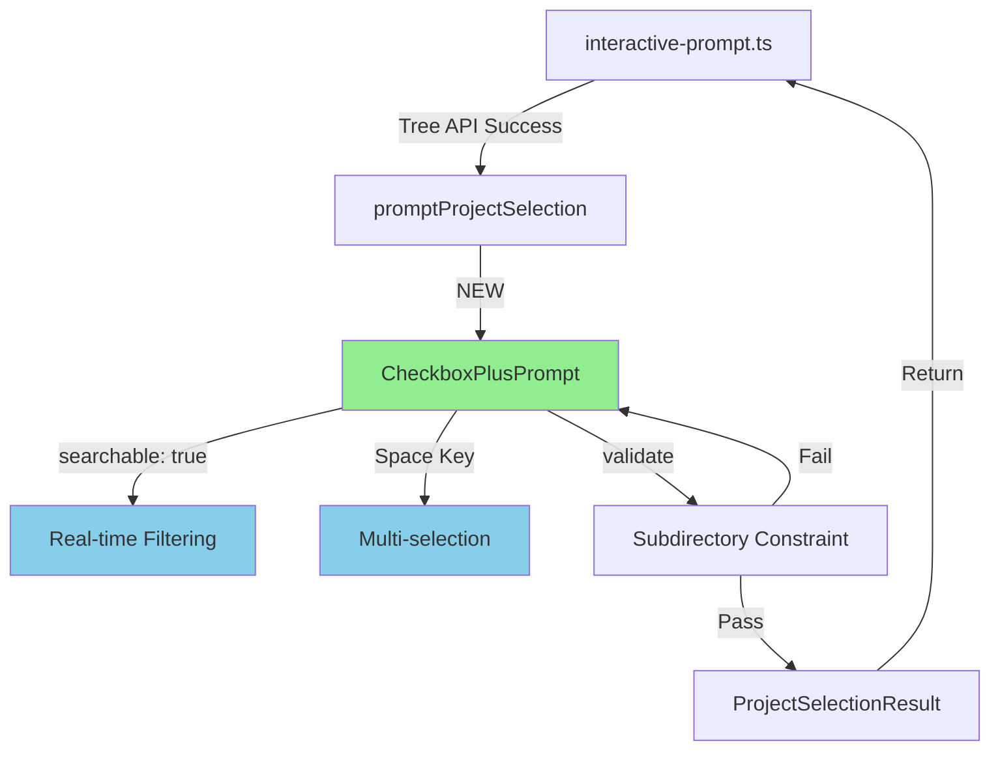
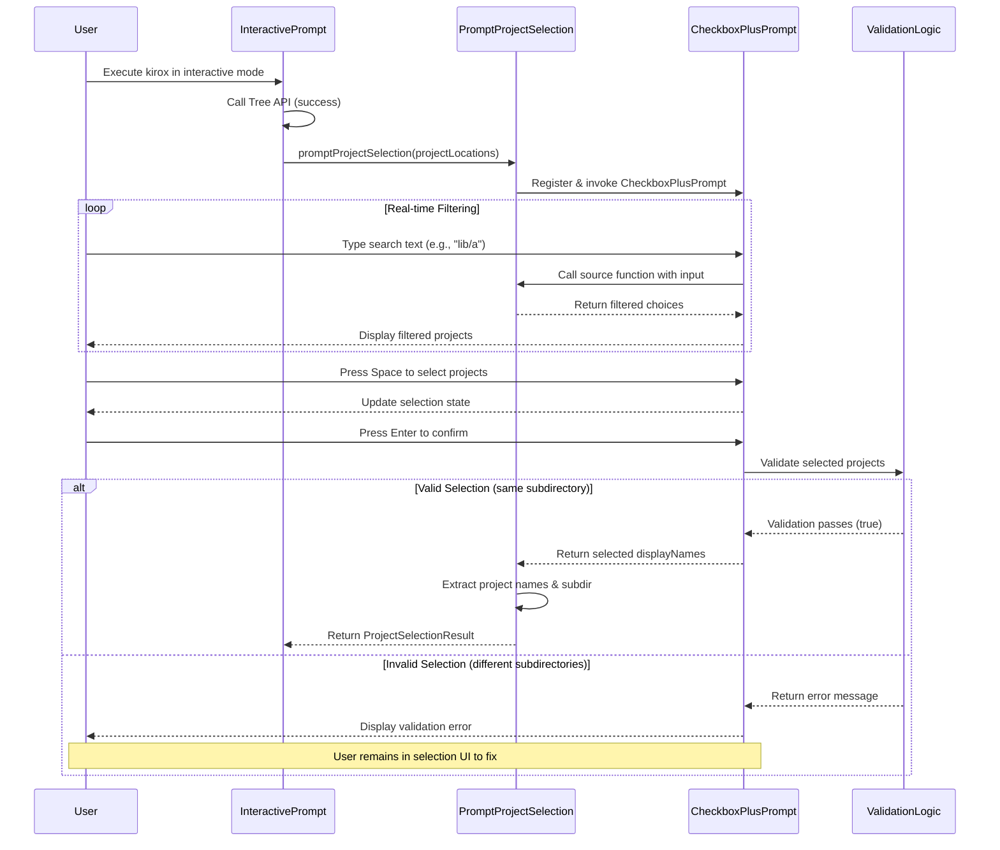
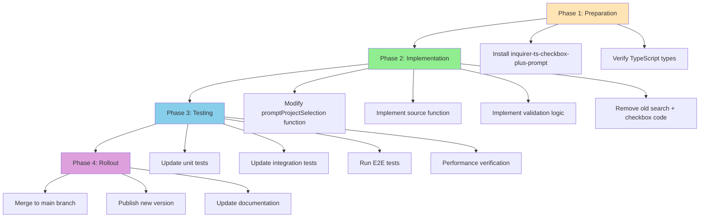

# Technical Design Document

## Overview

この機能は、Kirox CLIのインタラクティブモードにおけるプロジェクト選択UIを、現在の二段階プロセス（検索プロンプト → 複数選択トリガー → チェックボックスプロンプト）から、**検索とチェックボックス選択を統合した単一ステップUI**にアップグレードするものです。

**目的**: `inquirer-ts-checkbox-plus-prompt`パッケージを導入することで、ユーザーはリアルタイム検索とスペースキーによる複数選択を同時に行えるようになり、プロジェクト選択フローの直感性と効率性を大幅に向上させます。

**ユーザー**: Kirox CLIをインタラクティブモードで使用する開発者が、GitHub Tree APIで検出された複数のプロジェクトから選択する際に、この機能を利用します。

**影響**: 既存の`src/cli/searchable-project-prompt.ts`の実装を変更し、`@inquirer/prompts`の`search`と`checkbox`の組み合わせから`inquirer-ts-checkbox-plus-prompt`の`CheckboxPlusPrompt`に置き換えます。

### Goals

- 二段階プロセスの解消による直感的なUX提供
- リアルタイム検索とチェックボックス選択の統合
- 既存の同一サブディレクトリ制約の維持
- 既存のインタラクティブフローとの完全な互換性

### Non-Goals

- 既存の非インタラクティブモード（CLI引数指定）の変更
- Tree API検索機能の改善
- サブディレクトリ制約の変更や緩和
- プロジェクト表示形式（displayName形式）の変更

## Architecture

### Existing Architecture Analysis

**現在の実装パターン**:
- `searchable-project-prompt.ts`: 二段階UI実装
  - **Phase 1**: `@inquirer/prompts`の`search`関数で検索とフィルタリング
  - **Phase 2**: ユーザーが`__select_multiple__`を選択した場合、`checkbox`関数に遷移
- `interactive-prompt.ts`: Tree API成功後に`promptProjectSelection`を呼び出し
- `ProjectLocation`型: GitHub Tree APIからの検出結果を表現

**統合ポイントの維持**:
- `promptProjectSelection`関数の`ProjectSelectionResult`返り値型は変更なし
- `interactive-prompt.ts`の呼び出しコードは変更不要
- 既存のバリデーションロジック（サブディレクトリ制約）を維持

**技術的負債の対処**:
- 二段階UIの複雑な状態管理（`__select_multiple__`トリガー、`sourceFunction`の動的フィルタリング）を削除
- `search`と`checkbox`の切り替えロジックを単一のプロンプトに統合

### High-Level Architecture



**アーキテクチャ統合**:
- 既存パターン維持: CLI Layer → Interactive Prompt → Project Selection
- 新コンポーネント: `CheckboxPlusPrompt`（`@inquirer/prompts`の`search` + `checkbox`を置き換え）
- 技術スタック整合: TypeScript 5.x、ESM、Vitest（変更なし）
- Steering準拠: Layer-Based Architecture（CLI層の責任範囲内で完結）

### Technology Alignment

**既存技術スタックとの整合**:
- **Runtime**: Node.js 18+ (変更なし)
- **Language**: TypeScript 5.x (変更なし)
- **Prompt Library**: `@inquirer/prompts` → `@inquirer/prompts` + `inquirer-ts-checkbox-plus-prompt`（追加）
- **Test Framework**: Vitest (変更なし)

**新規依存関係**:
- **Package**: `inquirer-ts-checkbox-plus-prompt` (v1.0.1)
- **理由**: TypeScript完全サポート、検索可能なチェックボックス機能を提供
- **代替**: `inquirer-checkbox-plus-prompt`（JavaScript版、型定義なし）を検討したが、TypeScriptネイティブサポートを優先

**既存パターンからの逸脱**:
- なし（`@inquirer/prompts`エコシステムとの互換性を維持）

### Key Design Decisions

#### Decision 1: Inquirer.js互換プロンプトの選択

**Context**: 現在の実装は`@inquirer/prompts`（Inquirer.js v9+の公式パッケージ）を使用しており、検索可能なチェックボックス機能が必要。

**Alternatives**:
1. **`@inquirer/prompts`の`search`と`checkbox`を組み合わせる（現状維持）**
   - 既に実装済みだが、二段階UIが残る
2. **`inquirer-ts-checkbox-plus-prompt`を導入**
   - TypeScriptネイティブサポート
   - 検索とチェックボックスの統合
   - Inquirer.js互換のカスタムプロンプト
3. **`prompts`や`enquirer`などの別ライブラリに移行**
   - 既存コードベースの大規模リファクタリングが必要

**Selected Approach**: `inquirer-ts-checkbox-plus-prompt`の導入（Alternative 2）

このパッケージは、Inquirer.jsのカスタムプロンプト登録メカニズム（`inquirer.registerPrompt`）を使用して統合されます。ユーザーが入力したテキストに基づいて`source`関数が呼び出され、フィルタリング済みの選択肢を返します。

```typescript
import inquirer from 'inquirer';
import { CheckboxPlusPrompt } from 'inquirer-ts-checkbox-plus-prompt';

inquirer.registerPrompt('checkbox-plus', CheckboxPlusPrompt);

const answer = await inquirer.prompt([{
  type: 'checkbox-plus',
  name: 'projects',
  message: 'Select project(s) (type to filter):',
  searchable: true,
  highlight: true,
  source: async (answersSoFar, input) => {
    // Filter and return choices based on input
  }
}]);
```

**Rationale**:
- TypeScript型定義により、開発時のエラー検出と型安全性が向上
- Inquirer.jsエコシステムとの互換性により、既存の`@inquirer/prompts`との共存が可能
- 検索機能（`searchable: true`）とハイライト機能（`highlight: true`）がビルトインで提供され、カスタム実装不要

**Trade-offs**:
- **獲得**: 単一ステップUI、コード簡素化、TypeScript型安全性、ユーザー体験向上
- **犠牲**: 新規依存関係の追加（約10KB）、メンテナンスされていない可能性（last publish: 3 years ago）

**リスク軽減策**: パッケージが将来メンテナンスされなくなった場合、`@inquirer/prompts`のカスタムプロンプト実装にフォークするか、別のメンテナンスされているフォーク（例: `inquirer-checkbox-plus-prompt`のTypeScript対応版）に移行する。

#### Decision 2: 単一ステップUIへの統合方法

**Context**: 現在の二段階UI（検索 → 複数選択トリガー → チェックボックス）をどのように単一ステップに統合するか。

**Alternatives**:
1. **`CheckboxPlusPrompt`の`source`関数でフィルタリング**
   - `searchable: true`オプションでリアルタイム検索を有効化
   - `source`関数内で入力テキストに基づいてフィルタリング
2. **カスタムプロンプトを実装**
   - Inquirer.jsのベースクラスを継承して独自実装
   - 完全なコントロールが可能だが、実装複雑度が高い
3. **既存の二段階UIを維持し、UXを微調整**
   - 最小限の変更で済むが、根本的な問題は解決しない

**Selected Approach**: `CheckboxPlusPrompt`の`source`関数でフィルタリング（Alternative 1）

`source`関数は、ユーザーが入力した検索テキスト（`input`パラメータ）を受け取り、それに基づいてフィルタリング済みの選択肢配列を返します。この関数は、ユーザーが1文字入力するたびに呼び出されます。

```typescript
source: async (answersSoFar, input) => {
  const normalizedInput = (input || '').toLowerCase();
  const filteredProjects = projectLocations.filter((project) =>
    project.displayName.toLowerCase().includes(normalizedInput)
  );

  return filteredProjects.map((project) => ({
    name: project.displayName,  // 表示名
    value: project.displayName, // 選択時の値
    checked: false,             // 初期選択状態
  }));
}
```

**Rationale**:
- `searchable: true`により、`source`関数が入力変更時に自動的に再呼び出される
- 既存の`sourceFunction`ロジックをほぼそのまま移植可能（大文字小文字を区別しない部分一致検索）
- `__select_multiple__`トリガーロジックが不要になり、コードが大幅に簡素化

**Trade-offs**:
- **獲得**: 実装の簡素化、既存ロジックの再利用、リアルタイム検索のスムーズな動作
- **犠牲**: `source`関数が入力変更ごとに呼び出されるため、大量のプロジェクト（1000+）ではパフォーマンスに注意が必要（ただし、現実的なユースケースでは問題なし）

#### Decision 3: バリデーションロジックの配置

**Context**: 複数選択時の同一サブディレクトリ制約をどこで検証するか。

**Alternatives**:
1. **`CheckboxPlusPrompt`の`validate`オプション**
   - Inquirer.jsの標準メカニズムを使用
   - ユーザーがEnterキーを押した時点で検証
2. **`source`関数内で動的に選択肢を制限**
   - 最初に選択されたプロジェクトのサブディレクトリ以外を非表示
   - リアルタイムな制約適用
3. **結果返却後に後処理で検証**
   - `promptProjectSelection`関数の返り値を検証
   - エラー時に再度プロンプトを表示

**Selected Approach**: `CheckboxPlusPrompt`の`validate`オプション（Alternative 1）

```typescript
validate: (selectedValues: readonly string[]) => {
  if (selectedValues.length === 0) {
    return 'Please select at least one project';
  }

  const selectedProjects = selectedValues
    .map((displayName) =>
      projectLocations.find((p) => p.displayName === displayName)
    )
    .filter((p): p is ProjectLocation => p !== undefined);

  const uniqueSubdirs = new Set(selectedProjects.map((p) => p.subdir));

  if (uniqueSubdirs.size > 1) {
    const subdirList = Array.from(uniqueSubdirs)
      .map((s) => (s === '' ? 'root' : s))
      .join(', ');
    return `All projects must be in the same subdirectory. Selected subdirectories: ${subdirList}`;
  }

  return true;
};
```

**Rationale**:
- Inquirer.jsの標準的なバリデーションメカニズムを使用し、既存のパターンと一貫性を保つ
- エラーメッセージがプロンプト内に表示され、ユーザーは即座に修正可能
- 既存の`checkbox`プロンプトで使用していたバリデーションロジックをそのまま移植できる

**Trade-offs**:
- **獲得**: 既存コードの再利用、標準パターンの維持、エラーメッセージの即座表示
- **犠牲**: リアルタイムな制約適用（選択時に無効な選択肢を非表示にする）は実現できないが、バリデーションエラーメッセージで十分対応可能

## System Flows

### Project Selection Flow



## Requirements Traceability

| Requirement | Summary | Components | Interfaces | Flows |
|-------------|---------|----------|-----------|-------|
| 1.1-1.3 | パッケージ導入 | package.json | Dependencies | N/A |
| 2.1-2.7 | 単一ステップUI | CheckboxPlusPrompt | source, searchable, highlight options | Project Selection Flow |
| 3.1-3.4 | 表示形式維持 | source function | ProjectLocation → Choice mapping | Project Selection Flow |
| 4.1-4.4 | 複数選択制約 | ValidationLogic | validate function | Project Selection Flow |
| 5.1-5.5 | 既存コード置き換え | promptProjectSelection | ProjectSelectionResult | Project Selection Flow |
| 6.1-6.3 | エラーハンドリング | ValidationLogic, CheckboxPlusPrompt | validate, error messages | Project Selection Flow |
| 7.1-7.5 | 統合互換性 | interactive-prompt.ts | promptProjectSelection call site | Project Selection Flow |
| 8.1-8.5 | パフォーマンス | source function filtering | O(n) filtering algorithm | Real-time Filtering loop |
| 9.1-9.4 | テストカバレッジ | test files | Mock implementations | N/A |

## Components and Interfaces

### CLI Layer / Interactive Prompt Service

#### promptProjectSelection (Modified)

**Responsibility & Boundaries**
- **Primary Responsibility**: プロジェクト一覧からユーザーに選択させ、選択結果（プロジェクト名配列とサブディレクトリ）を返す
- **Domain Boundary**: CLI層のインタラクティブプロンプトサービス
- **Data Ownership**: ユーザー選択状態（一時的）
- **Transaction Boundary**: 単一のプロンプトセッション（選択確定まで）

**Dependencies**
- **Inbound**: `interactive-prompt.ts`の`promptMissingArguments`関数から呼び出される
- **Outbound**:
  - `inquirer-ts-checkbox-plus-prompt`の`CheckboxPlusPrompt`
  - `../github/project-location-builder.js`の`ProjectLocation`型
- **External**: `inquirer`パッケージ（`registerPrompt`メソッド）

**External Dependencies Investigation**:

**inquirer-ts-checkbox-plus-prompt**の調査結果:
- **npm package**: https://www.npmjs.com/package/inquirer-ts-checkbox-plus-prompt
- **GitHub repository**: https://github.com/imjuni/inquirer-ts-checkbox-plus-prompt
- **Version**: 1.0.1 (last published: 3 years ago)
- **TypeScript Support**: ネイティブTypeScript実装
- **Dependencies**: `inquirer`（peer dependency）
- **API Signature**:
  ```typescript
  interface CheckboxPlusPromptOptions {
    type: 'checkbox-plus';
    name: string;
    message: string;
    source: (answersSoFar: any, input: string | undefined) => Promise<Choice[]>;
    searchable?: boolean;  // Default: false
    highlight?: boolean;   // Default: false
    pageSize?: number;
    validate?: (value: string[]) => boolean | string;
    filter?: (value: string[]) => any;
    default?: string[];
  }

  interface Choice {
    name: string;     // Display text
    value: string;    // Value when selected
    short?: string;   // Short display after selection
    checked?: boolean; // Initial checked state
  }
  ```

**使用方法**:
1. `inquirer.registerPrompt('checkbox-plus', CheckboxPlusPrompt)`でカスタムプロンプトを登録
2. `inquirer.prompt([{ type: 'checkbox-plus', ... }])`で呼び出し
3. `source`関数が入力変更時に呼び出され、フィルタリング済み選択肢を返す

**Known Issues & Risks**:
- **メンテナンス状況**: Last publish 3 years ago（2022年頃）→ アクティブメンテナンスされていない可能性
  - **リスク軽減**: パッケージが動作しなくなった場合、TypeScriptソースコードをフォークして内部実装に統合する
- **Inquirer.js v9+互換性**: `@inquirer/prompts`（v9+の公式パッケージ）との統合について、`inquirer`（レガシー版）との互換性を確認する必要がある
  - **調査結果**: `inquirer-ts-checkbox-plus-prompt`は`inquirer`（レガシー版）用であり、`@inquirer/prompts`（v9+）とは異なるアーキテクチャ
  - **重要な発見**: 現在のプロジェクトは`@inquirer/prompts`を使用しているが、`inquirer-ts-checkbox-plus-prompt`は`inquirer`（レガシー版）を要求する

**Critical Issue Identified**:
`inquirer-ts-checkbox-plus-prompt`は`inquirer`（レガシー版、v8.x以前）用のカスタムプロンプトです。現在のKirox CLIプロジェクトは`@inquirer/prompts` v7.8.6（Inquirer.js v9+の公式パッケージ）を使用しており、これらは**互換性がありません**。

**Alternative Approach Required**:
新しいInquirer.js v9+アーキテクチャに対応するため、以下のいずれかのアプローチが必要です：
1. **Option A**: `inquirer`（レガシー版）にダウングレードし、`inquirer-ts-checkbox-plus-prompt`を使用
2. **Option B**: `@inquirer/prompts`のカスタムプロンプトAPIを使用して、検索可能なチェックボックスを自前実装
3. **Option C**: `@inquirer/prompts`の`search`と`checkbox`の組み合わせを改善し、UXを向上させる（技術的負債は残る）

**実装フェーズでの調査が必要**:
- `@inquirer/prompts`のカスタムプロンプトAPI（`createPrompt`）の調査
- 既存の`@inquirer/checkbox`プロンプトのソースコードを拡張して検索機能を追加できるか確認
- 実装難易度とメンテナンス性を比較し、最適なアプローチを決定

**Contract Definition**

**Service Interface** (modified):
```typescript
/**
 * Prompt user to select project(s) with search functionality
 *
 * @param projectLocations - Available project locations
 * @returns Selected project(s) with subdirectory
 */
export async function promptProjectSelection(
  projectLocations: ProjectLocation[]
): Promise<ProjectSelectionResult>;

export interface ProjectSelectionResult {
  /** Selected project names */
  projects: string[];
  /** Subdirectory path (common to all selected projects) */
  subdir: string;
}
```

**Preconditions**:
- `projectLocations`配列が空でない
- 各`ProjectLocation`オブジェクトが有効な`displayName`、`name`、`subdir`を持つ

**Postconditions**:
- 返り値の`projects`配列に少なくとも1つのプロジェクト名が含まれる
- 返り値の`subdir`は、すべての選択されたプロジェクトに共通するサブディレクトリパス
- ユーザーがCtrl+Cで中断した場合、`ExitPromptError`がスローされる

**Invariants**:
- 選択されたすべてのプロジェクトは同じサブディレクトリに属する（バリデーションにより保証）
- `projectLocations`配列は関数実行中に変更されない（immutable input）

**Integration Strategy**:
- **Modification Approach**: 既存の`promptProjectSelection`関数を**置き換え**（extend/wrapではなくrefactor）
  - `@inquirer/prompts`の`search`と`checkbox`呼び出しを削除
  - `inquirer`の`registerPrompt`と`prompt`に置き換え
  - `source`関数内で既存の`sourceFunction`ロジックを統合
- **Backward Compatibility**:
  - `ProjectSelectionResult`インターフェースは変更なし
  - 呼び出し元（`interactive-prompt.ts`）のコードは変更不要
- **Migration Path**:
  1. 新しい実装をテスト環境で検証
  2. 既存のユニットテストを新しい実装に対応（モックの変更）
  3. E2Eテストで実際のユーザーフローを確認

### CLI Layer / Validation Logic

#### Subdirectory Constraint Validator

**Responsibility & Boundaries**
- **Primary Responsibility**: 複数選択されたプロジェクトが同一サブディレクトリに属することを検証
- **Domain Boundary**: CLI層のバリデーションロジック
- **Data Ownership**: バリデーション状態（一時的）

**Dependencies**
- **Inbound**: `CheckboxPlusPrompt`の`validate`オプションから呼び出される
- **Outbound**: `ProjectLocation`配列への参照

**Contract Definition**

**Validation Function**:
```typescript
/**
 * Validate that all selected projects are in the same subdirectory
 *
 * @param selectedValues - Array of selected displayNames
 * @param projectLocations - Available project locations (closure)
 * @returns true if valid, error message string if invalid
 */
type ValidateFunction = (
  selectedValues: readonly string[]
) => boolean | string;

// Implementation
const validate: ValidateFunction = (selectedValues) => {
  // Rule 1: At least one project must be selected
  if (selectedValues.length === 0) {
    return 'Please select at least one project';
  }

  // Rule 2: All projects must be in the same subdirectory
  const selectedProjects = selectedValues
    .map((displayName) =>
      projectLocations.find((p) => p.displayName === displayName)
    )
    .filter((p): p is ProjectLocation => p !== undefined);

  const uniqueSubdirs = new Set(selectedProjects.map((p) => p.subdir));

  if (uniqueSubdirs.size > 1) {
    const subdirList = Array.from(uniqueSubdirs)
      .map((s) => (s === '' ? 'root' : s))
      .join(', ');
    return `All projects must be in the same subdirectory. Selected subdirectories: ${subdirList}`;
  }

  return true;
};
```

**Validation Rules**:
1. **最低1つのプロジェクト選択**: `selectedValues.length > 0`
2. **同一サブディレクトリ制約**: `uniqueSubdirs.size === 1`
3. **ルートディレクトリの特別扱い**: 空文字列`""`を`"root"`として表示

## Data Models

### Domain Model

#### ProjectLocation

既存の`ProjectLocation`型は変更なし。この型はGitHub Tree APIのレスポンスから構築され、プロジェクトの位置情報を表現します。

```typescript
interface ProjectLocation {
  /** Project name (without subdirectory path) */
  name: string;

  /** Subdirectory path (empty string for root) */
  subdir: string;

  /** Display name (subdirectory/name format) */
  displayName: string;

  /** Project name (same as name) */
  projectName: string;

  /** Full path in repository */
  path: string;

  /** GitHub Tree API type */
  type: 'tree';

  /** File mode */
  mode: string;

  /** Git SHA */
  sha: string;

  /** GitHub API URL */
  url: string;
}
```

**Business Rules**:
- `displayName`は`subdir`が空の場合`name`のみ、それ以外は`subdir/name`形式
- `path`は`.kiro/specs/`を含む完全なリポジトリパス

#### ProjectSelectionResult

既存の`ProjectSelectionResult`インターフェースは変更なし。

```typescript
interface ProjectSelectionResult {
  /** Selected project names (without subdirectory path) */
  projects: string[];

  /** Common subdirectory path (empty string for root) */
  subdir: string;
}
```

**Business Rules**:
- `projects`配列内のすべてのプロジェクトは同じ`subdir`に属する
- `projects`配列は空でない（最低1つのプロジェクトが選択されている）

### Data Contracts & Integration

#### CheckboxPlusPrompt Choice Format

`source`関数が返す選択肢の形式：

```typescript
interface Choice {
  /** Display text shown in UI */
  name: string;

  /** Value returned when selected */
  value: string;

  /** Short display text after selection (optional) */
  short?: string;

  /** Initial checked state (optional, default: false) */
  checked?: boolean;
}
```

**Transformation**:
```typescript
// ProjectLocation → Choice
const choices: Choice[] = filteredProjects.map((project) => ({
  name: project.displayName,   // "lib/a/project-x"
  value: project.displayName,  // "lib/a/project-x"
  checked: false,
}));
```

#### Source Function Contract

```typescript
/**
 * Source function for CheckboxPlusPrompt
 *
 * @param answersSoFar - Answers collected so far (unused in this implementation)
 * @param input - User search input (undefined on initial call)
 * @returns Promise resolving to array of choices
 */
type SourceFunction = (
  answersSoFar: any,
  input: string | undefined
) => Promise<Choice[]>;
```

**Filtering Logic**:
- 入力が`undefined`または空文字列の場合、すべてのプロジェクトを返す
- それ以外の場合、大文字小文字を区別せずに`displayName`に対して部分一致検索
- フィルタリング結果が0件の場合でも、空配列を返す（"No matching projects found"メッセージは表示しない）

## Error Handling

### Error Strategy

既存のエラーハンドリング戦略を維持し、以下のエラーケースに対応します：

1. **User Errors** (Validation Errors):
   - 0個のプロジェクト選択 → エラーメッセージ表示、再選択を促す
   - 異なるサブディレクトリのプロジェクト選択 → エラーメッセージ表示、再選択を促す

2. **System Errors**:
   - `CheckboxPlusPrompt`の初期化失敗 → 既存の`search` + `checkbox`フォールバック（実装フェーズで検討）
   - `source`関数内の例外 → エラーログ出力、空配列を返してプロンプトを継続

3. **User Interruption**:
   - Ctrl+C（`ExitPromptError`） → 既存のハンドリング（`interactive-prompt.ts`で処理）

### Error Categories and Responses

**User Errors (Validation)**:
- **Invalid selection (0 projects)**:
  - Message: "Please select at least one project"
  - Action: ユーザーは選択を修正し、Enterキーを再度押す
- **Invalid selection (different subdirectories)**:
  - Message: "All projects must be in the same subdirectory. Selected subdirectories: lib/a, lib/b"
  - Action: ユーザーは選択を修正し、Enterキーを再度押す

**System Errors**:
- **CheckboxPlusPrompt initialization failure**:
  - Fallback: 既存の`search` + `checkbox`実装に戻す（実装フェーズで検討）
  - Logging: `logger.error('Failed to initialize CheckboxPlusPrompt', { error })`
- **Source function exception**:
  - Fallback: 空配列を返し、プロンプトを継続
  - Logging: `logger.error('Source function error', { error, input })`

**User Interruption**:
- **Ctrl+C (ExitPromptError)**:
  - Action: `interactive-prompt.ts`の`handleInteractiveError`関数で処理
  - Exit code: 130（SIGINT標準終了コード）

### Monitoring

既存のロギングメカニズムを使用：
- **Error tracking**: `logger.error()`で例外をログ出力
- **Verbose logging**: `--verbose`オプション時に詳細情報を出力
- **Health monitoring**: N/A（CLI層のため、ヘルスチェックエンドポイントは不要）

## Testing Strategy

### Unit Tests

**Target**: `src/cli/searchable-project-prompt.ts`の`promptProjectSelection`関数

**Test Cases**:
1. **基本的な選択機能**
   - `CheckboxPlusPrompt`が正しいオプションで呼び出されることを確認
   - 選択されたプロジェクトが`ProjectSelectionResult`に正しく変換されることを確認
   - ルートディレクトリプロジェクトの`subdir`が空文字列になることを確認
   - ネストされたプロジェクトの`subdir`が正しく抽出されることを確認

2. **検索機能（source関数）**
   - 空入力時にすべてのプロジェクトが返されることを確認
   - 大文字小文字を区別しない部分一致検索が動作することを確認
   - フィルタリング結果が0件の場合に空配列が返されることを確認

3. **バリデーション機能**
   - 0個のプロジェクト選択時にエラーメッセージが返されることを確認
   - 同じサブディレクトリのプロジェクト選択時に検証が通過することを確認
   - 異なるサブディレクトリのプロジェクト選択時にエラーメッセージが返されることを確認
   - エラーメッセージにサブディレクトリ一覧が含まれることを確認

### Integration Tests

**Target**: `src/cli/interactive-prompt.ts`と`searchable-project-prompt.ts`の統合

**Test Cases**:
1. **Tree API成功 → プロジェクト選択**
   - Tree API成功後に`promptProjectSelection`が呼び出されることを確認
   - 選択結果が`ParsedArguments`に正しく設定されることを確認
   - `projects`と`subdir`フィールドが正しく抽出されることを確認

2. **Tree API失敗 → フォールバック**
   - Tree API失敗時に既存のワークフロー（サブディレクトリプロンプト → プロジェクトプロンプト）が実行されることを確認

3. **エラーハンドリング統合**
   - `ExitPromptError`が`handleInteractiveError`関数で正しく処理されることを確認
   - 終了コード130が返されることを確認

### E2E Tests

**Target**: インタラクティブモードの実際のユーザーフロー

**Test Cases**:
1. **基本フロー**
   - リポジトリ入力 → Tree API検索 → プロジェクト選択 → 確認 → 実行
   - 単一プロジェクト選択と複数プロジェクト選択の両方

2. **検索フロー**
   - プロジェクト選択時に検索テキストを入力してフィルタリング
   - フィルタリング後にプロジェクトを選択

3. **バリデーションエラーフロー**
   - 異なるサブディレクトリのプロジェクトを選択 → エラーメッセージ表示 → 再選択

4. **中断フロー**
   - プロジェクト選択中にCtrl+Cで中断 → 終了コード130

### Performance Tests

**Target**: リアルタイム検索のパフォーマンス

**Test Cases**:
1. **大量プロジェクト（100個）**
   - フィルタリング実行時間が100ms以内であることを確認
   - 選択状態更新時間が50ms以内であることを確認

2. **検索頻度**
   - 1秒間に10回の検索入力（高速タイピング）に対応できることを確認

## Security Considerations

**該当なし**: この機能はCLI層のUI改善であり、以下の理由でセキュリティへの影響はありません：

- 認証・認可の変更なし（GitHub Token処理は上位層で既に実装済み）
- 機密データの処理なし（プロジェクト名とサブディレクトリパスのみ）
- 外部システムとの新規統合なし（Inquirer.jsのカスタムプロンプトのみ）
- ユーザー入力はプロジェクト選択のみ（インジェクション攻撃のリスクなし）

## Migration Strategy



### Migration Process

**Phase 1: Preparation**
1. `npm install inquirer-ts-checkbox-plus-prompt --save`を実行
2. TypeScript型定義が正しくインストールされることを確認
3. `inquirer`パッケージの互換性を確認（peer dependency）

**Phase 2: Implementation**
1. `src/cli/searchable-project-prompt.ts`を修正
   - `@inquirer/prompts`の`search`と`checkbox`インポートを削除
   - `inquirer`と`CheckboxPlusPrompt`をインポート
   - `promptProjectSelection`関数内で`inquirer.registerPrompt`を呼び出し
   - `source`関数を実装（既存の`sourceFunction`ロジックを移植）
   - `validate`関数を実装（既存のバリデーションロジックを移植）
2. `__select_multiple__`トリガーロジックを削除
3. `sourceFunction`内の"No matching projects found"メッセージロジックを削除（不要）

**Phase 3: Testing**
1. `tests/unit/cli/searchable-project-prompt.test.ts`を更新
   - `@inquirer/prompts`のモックを`inquirer`のモックに変更
   - `source`関数のテストケースを追加
   - `validate`関数のテストケースを更新
2. 統合テストとE2Eテストを実行し、既存のワークフローが壊れていないことを確認
3. 大量プロジェクト（100個）でのパフォーマンステストを実行

**Phase 4: Rollout**
1. PRをメインブランチにマージ
2. 新しいバージョンをnpmに公開
3. README.mdとCHANGELOG.mdを更新

### Rollback Plan

**Rollback Trigger**:
- `inquirer-ts-checkbox-plus-prompt`が予期しない動作をする
- パフォーマンス問題が発生する
- ユーザーフィードバックで重大な問題が報告される

**Rollback Process**:
1. Gitで前のコミットに戻す
2. `npm uninstall inquirer-ts-checkbox-plus-prompt`を実行
3. 既存の`search` + `checkbox`実装を復元

### Validation Checkpoints

- [ ] Phase 1完了: `inquirer-ts-checkbox-plus-prompt`がインストールされ、TypeScript型定義が利用可能
- [ ] Phase 2完了: 新しい実装がビルドエラーなしでコンパイルされる
- [ ] Phase 3完了: すべてのユニット・統合・E2Eテストが通過する
- [ ] Phase 4完了: 新しいバージョンがnpmで公開され、ドキュメントが更新される
