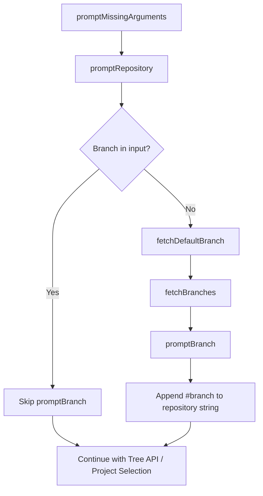
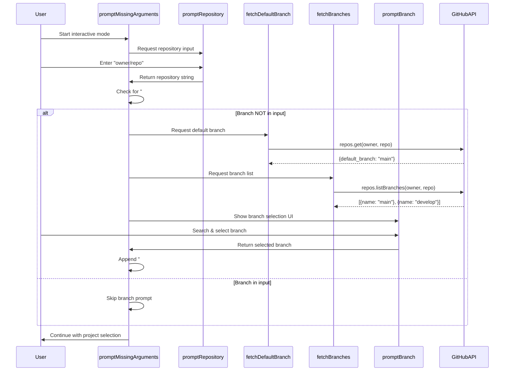
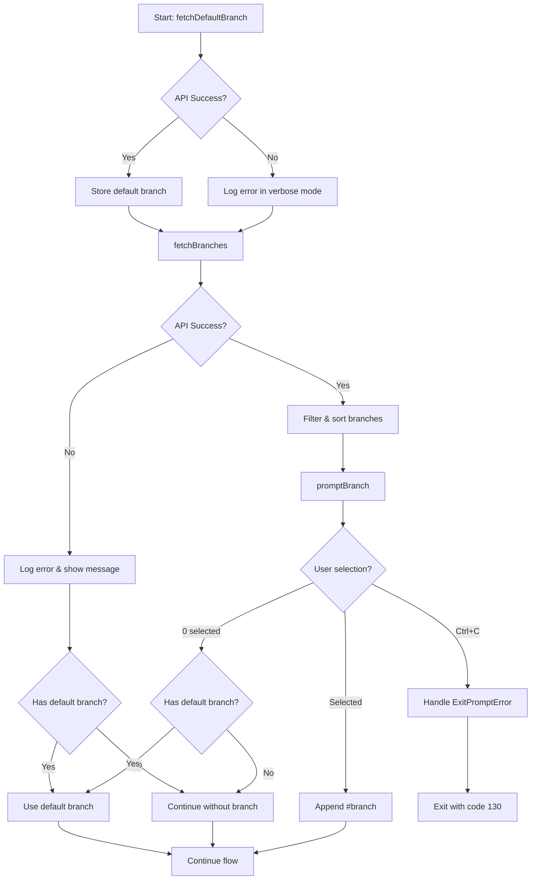

# Technical Design Document: kirox-suggest-branch

## Overview

本機能は、Kirox CLIの対話モードにおいてブランチ指定がない場合に、GitHub APIからブランチ一覧を取得し、既存のプロジェクト選択UIと同じsearchable-checkboxを使用してブランチを提案・選択できる対話的UIを提供します。これにより、ユーザーは開発ブランチやリリースブランチから直接`.kiro`ファイルを取得でき、リポジトリのデフォルトブランチを適切に認識して使用できるようになります。

**Purpose**: 対話モード利用時のブランチ選択体験を向上させ、プロジェクト選択と同じ操作感で直感的にブランチを指定できるようにします。

**Users**: Kirox CLIの対話モードを使用する開発者が、リポジトリ入力後にブランチを選択する際に利用します。

**Impact**: 現在のハードコードされた`main`ブランチへの依存を排除し、リポジトリのデフォルトブランチを自動検出することで、正確性と柔軟性を向上させます。

### Goals

- GitHub APIを使用してリポジトリの全ブランチ一覧を取得する機能を実装
- リポジトリのデフォルトブランチを自動検出する機能を実装
- 既存のsearchable-checkboxを使用した統一的なブランチ選択UIを提供
- 対話モードフローに適切に統合し、非対話モードへの影響を排除
- API失敗時のフォールバック処理により処理の継続を保証

### Non-Goals

- ブランチ作成・削除などのブランチ管理機能
- 複数ブランチの同時選択機能（単一ブランチ選択のみ）
- ブランチのコミット履歴表示
- 非対話モードでのブランチサジェスト（対話モードのみ）

## Architecture

### Existing Architecture Analysis

Kirox CLIは4層アーキテクチャを採用しており、本機能は以下の既存パターンを維持します：

- **CLI Layer**: `interactive-prompt.ts`に新しい`promptBranch`関数を追加し、既存の`promptMissingArguments`フローに統合
- **GitHub Integration Layer**: `fetcher.ts`に`fetchBranches`と`fetchDefaultBranch`関数を追加し、既存のOctokit APIパターンに従う
- **Existing Patterns**:
  - Octokitクライアントの依存注入パターン
  - エラーハンドリングとフォールバック戦略
  - Loggerを使用したverboseモード対応
  - 既存の`searchable-checkbox`プロンプトの再利用

### High-Level Architecture



### Technology Alignment

本機能は既存のKirox CLIの技術スタックと完全に整合します：

- **GitHub API統合**: 既存のOctokit v5.x SDKを使用し、`client.rest.repos.listBranches`と`client.rest.repos.get` APIを活用
- **対話的UI**: 既存の`inquirer-ts-checkbox-plus-prompt`を再利用し、プロジェクト選択UIとの一貫性を保持
- **型安全性**: TypeScript 5.xの厳格な型チェックを維持し、すべてのインターフェースを明示的に定義
- **エラーハンドリング**: 既存のtry-catchパターンとフォールバック戦略を踏襲

**新規依存**: なし（既存のOctokitとinquirer-ts-checkbox-plus-promptを使用）

### Key Design Decisions

#### Decision 1: 単一ブランチ選択の制約

**Decision**: searchable-checkboxのバリデーション機能を使用して、単一ブランチ選択のみを許可する

**Context**: プロジェクト選択では複数選択が可能だが、ブランチ選択では複数ブランチからの同時取得は不要であり、ユースケースとして想定されない

**Alternatives**:
1. 複数ブランチ選択を許可し、各ブランチから順次取得
2. ラジオボタンUIを使用して単一選択を強制
3. searchable-checkboxのバリデーションで単一選択を強制

**Selected Approach**: searchable-checkboxのバリデーション機能を使用（選択肢3）

**Rationale**:
- 既存のsearchable-checkboxを再利用でき、新しいUIコンポーネント開発が不要
- バリデーションメッセージでユーザーに明確なフィードバックを提供
- 0件選択を許可することでデフォルトブランチへのフォールバックが可能

**Trade-offs**:
- UIの視覚的な表現としてはラジオボタンが適切だが、検索機能を持つラジオボタンUIは未実装
- 複数選択UIで単一選択を強制することに若干の違和感があるが、検索機能の利便性が上回る

#### Decision 2: デフォルトブランチ取得とブランチ一覧取得の順序

**Decision**: デフォルトブランチを先に取得し、その後ブランチ一覧を取得する

**Context**: デフォルトブランチは表示順序とフォールバック処理の両方で必要

**Alternatives**:
1. デフォルトブランチ取得 → ブランチ一覧取得（直列）
2. ブランチ一覧取得のみ（最初のブランチをデフォルトと仮定）
3. 両方を並列で取得（Promise.all）

**Selected Approach**: 直列取得（選択肢1）

**Rationale**:
- デフォルトブランチ情報はブランチ一覧のソートと`(default)`ラベル表示に必要
- デフォルトブランチ取得失敗時は早期にフォールバックでき、不要なブランチ一覧取得を回避
- 2つのAPI呼び出しの合計時間は3秒以内の目標を満たす

**Trade-offs**: 並列取得より若干遅いが、エラーハンドリングと表示ロジックがシンプルになる

#### Decision 3: 0件選択時のデフォルトブランチへのフォールバック

**Decision**: ユーザーがブランチを選択せずにEnterを押した場合、デフォルトブランチを自動適用する

**Context**: ブランチ選択をスキップしたいユーザーのための簡便な操作方法が必要

**Alternatives**:
1. 0件選択を許可し、デフォルトブランチに自動フォールバック
2. 0件選択をエラーとして扱い、再選択を要求
3. ESCキーで明示的にスキップする専用操作を追加

**Selected Approach**: 0件選択でデフォルトブランチに自動フォールバック（選択肢1）

**Rationale**:
- 最小限の操作でデフォルトブランチを選択できる（検索なしでEnter）
- プロジェクト選択の「少なくとも1つ選択」という制約と一貫性を保つ
- フォールバック動作はverboseモードでログ記録され、トレーサビリティを確保

**Trade-offs**: 0件選択の意図が「キャンセル」か「デフォルト選択」か曖昧だが、デフォルトブランチが最も一般的な選択であることから許容

## System Flows

### ブランチ選択フロー



### エラーハンドリングフロー



## Components and Interfaces

### GitHub Integration Layer

#### fetchBranches 関数

**Responsibility & Boundaries**
- **Primary Responsibility**: GitHub APIを使用してリポジトリの全ブランチ一覧を取得する
- **Domain Boundary**: GitHub統合層（`src/github/fetcher.ts`）
- **Data Ownership**: ブランチ名の配列を生成・管理

**Dependencies**
- **Inbound**: `promptMissingArguments`から呼び出される
- **Outbound**: Octokit `client.rest.repos.listBranches` API
- **External**: GitHub REST API v3

**Contract Definition**

```typescript
interface BranchInfo {
  name: string;
}

/**
 * Fetch all branches from a GitHub repository
 *
 * @param client - Octokit client instance
 * @param owner - Repository owner
 * @param repo - Repository name
 * @returns Array of branch names
 * @throws Error if API request fails or repository not found
 */
async function fetchBranches(
  client: Octokit,
  owner: string,
  repo: string
): Promise<string[]>;
```

- **Preconditions**:
  - Octokitクライアントが初期化されている
  - owner/repoが有効な文字列
- **Postconditions**:
  - 成功時: ブランチ名の配列を返す（空配列の可能性あり）
  - 失敗時: Errorをスローする
- **Invariants**:
  - 返却されるブランチ名は空文字列を含まない
  - 重複するブランチ名は含まれない

**External Dependencies Investigation**:
- **API**: `octokit.rest.repos.listBranches({ owner, repo, per_page, page })`
- **Pagination**: GitHub APIのデフォルトは30件/ページ、最大100件/ページ
- **Rate Limits**: 認証済み: 5000リクエスト/時、未認証: 60リクエスト/時
- **Error Responses**: 404 (Not Found), 403 (Forbidden), 401 (Unauthorized)

#### fetchDefaultBranch 関数

**Responsibility & Boundaries**
- **Primary Responsibility**: GitHub APIを使用してリポジトリのデフォルトブランチを取得する
- **Domain Boundary**: GitHub統合層（`src/github/fetcher.ts`）
- **Data Ownership**: デフォルトブランチ名を取得・管理

**Dependencies**
- **Inbound**: `promptMissingArguments`から呼び出される
- **Outbound**: Octokit `client.rest.repos.get` API
- **External**: GitHub REST API v3

**Contract Definition**

```typescript
/**
 * Fetch default branch from a GitHub repository
 *
 * @param client - Octokit client instance
 * @param owner - Repository owner
 * @param repo - Repository name
 * @returns Default branch name
 * @throws Error if API request fails or repository not found
 */
async function fetchDefaultBranch(
  client: Octokit,
  owner: string,
  repo: string
): Promise<string>;
```

- **Preconditions**:
  - Octokitクライアントが初期化されている
  - owner/repoが有効な文字列
- **Postconditions**:
  - 成功時: デフォルトブランチ名（例: `main`, `master`, `develop`）を返す
  - 失敗時: Errorをスローする
- **Invariants**:
  - 返却されるブランチ名は必ず非空文字列
  - リポジトリが存在する限り、デフォルトブランチは必ず存在する

**External Dependencies Investigation**:
- **API**: `octokit.rest.repos.get({ owner, repo })`
- **Response**: `{ default_branch: string, ... }` - デフォルトブランチ名を含むリポジトリ情報
- **Rate Limits**: fetchBranchesと同じレート制限を共有
- **Error Responses**: 404 (Not Found), 403 (Forbidden), 401 (Unauthorized)

### CLI Layer

#### promptBranch 関数

**Responsibility & Boundaries**
- **Primary Responsibility**: searchable-checkboxを使用してブランチ選択UIを表示し、ユーザー選択を取得する
- **Domain Boundary**: CLI層（`src/cli/interactive-prompt.ts`）
- **Data Ownership**: ユーザーが選択したブランチ名

**Dependencies**
- **Inbound**: `promptMissingArguments`から呼び出される
- **Outbound**: `searchableCheckbox`プロンプト関数
- **External**: `inquirer-ts-checkbox-plus-prompt`パッケージ

**Contract Definition**

```typescript
interface BranchPromptOptions {
  branches: string[];
  defaultBranch: string | undefined;
}

/**
 * Prompt user to select a branch using searchable checkbox UI
 *
 * @param options - Branch prompt configuration
 * @returns Selected branch name, or undefined if 0 selected (fallback to default)
 * @throws ExitPromptError if user cancels with Ctrl+C
 */
async function promptBranch(
  options: BranchPromptOptions
): Promise<string | undefined>;
```

- **Preconditions**:
  - `branches`配列が少なくとも1つのブランチを含む
  - TTY環境で実行されている
- **Postconditions**:
  - 成功時: 選択されたブランチ名、または`undefined`（0件選択）
  - キャンセル時: `ExitPromptError`をスロー
- **Invariants**:
  - 返却されるブランチ名は`branches`配列に含まれる
  - 複数選択は許可されない（バリデーションでエラー）

**Integration Strategy**:
- **Modification Approach**: `interactive-prompt.ts`に新しい`promptBranch`関数を追加（既存関数を拡張）
- **Backward Compatibility**: 非対話モードでは`promptBranch`は呼び出されず、既存の動作を維持
- **Migration Path**:
  1. `promptBranch`関数を実装
  2. `promptMissingArguments`にブランチ選択ステップを挿入
  3. 既存のリポジトリ文字列に`#branch`を追加するロジックを実装

#### promptMissingArguments 統合ロジック

**Responsibility & Boundaries**
- **Primary Responsibility**: ブランチ選択プロンプトを対話モードフローに統合する
- **Domain Boundary**: CLI層（`src/cli/interactive-prompt.ts`）
- **Data Ownership**: 完成した`repository`文字列（`owner/repo#branch`形式）

**Dependencies**
- **Inbound**: `entry.ts`から呼び出される
- **Outbound**: `promptRepository`, `fetchDefaultBranch`, `fetchBranches`, `promptBranch`
- **External**: なし

**Contract Definition**

統合ロジックのフローを`promptMissingArguments`関数に追加：

```typescript
// 1. Repository input (existing)
completedArgs.repository = await promptRepository(completedArgs.repository);

// 2. Branch selection (new logic)
if (!completedArgs.repository.includes('#') && logger && client && process.stdin.isTTY) {
  try {
    // 2.1 Fetch default branch
    let defaultBranch: string | undefined;
    try {
      const repositoryRef = parseRepositoryPath(completedArgs.repository);
      defaultBranch = await fetchDefaultBranch(client, repositoryRef.owner, repositoryRef.repo);
      if (verbose) {
        logger.verbose('Default branch detected', { defaultBranch });
      }
    } catch (error) {
      // Log error but continue without default branch
      if (verbose) {
        logger.warn('Failed to fetch default branch', { error: error instanceof Error ? error.message : String(error) });
      }
    }

    // 2.2 Fetch branches
    try {
      console.log('\nFetching branches...');
      const repositoryRef = parseRepositoryPath(completedArgs.repository);
      const branches = await fetchBranches(client, repositoryRef.owner, repositoryRef.repo);

      if (branches.length === 0) {
        console.error('No branches found in repository');
        // Continue without branch selection
      } else {
        // 2.3 Prompt for branch selection
        const selectedBranch = await promptBranch({ branches, defaultBranch });

        // 2.4 Append branch to repository string
        const branchToUse = selectedBranch || defaultBranch;
        if (branchToUse) {
          completedArgs.repository = `${completedArgs.repository}#${branchToUse}`;
          if (verbose) {
            logger.verbose('Branch selected', { branch: branchToUse });
          }
        }
      }
    } catch (error) {
      // Log error and continue without branch selection
      if (verbose) {
        logger.warn('Failed to fetch branches', { error: error instanceof Error ? error.message : String(error) });
      }
      console.error('\n✗ Failed to fetch branches. Continuing with default branch...');

      // Fallback to default branch if available
      if (defaultBranch) {
        completedArgs.repository = `${completedArgs.repository}#${defaultBranch}`;
      }
    }
  } catch (error) {
    // Catch-all for unexpected errors - continue without branch
    if (verbose && logger) {
      logger.error('Unexpected error in branch selection', { error: error instanceof Error ? error.message : String(error) });
    }
  }
}

// 3. Continue with Tree API / Project selection (existing)
```

**State Management**:
- **State Model**: ステートレス - すべての状態は`completedArgs`オブジェクトに保持
- **Persistence**: メモリ内のみ（永続化不要）
- **Concurrency**: 単一スレッド実行、並行性の考慮不要

## Data Models

### Domain Model

本機能で扱うドメインモデルは以下の通り：

**Core Concepts**:
- **Branch**: GitHubリポジトリのブランチを表す値オブジェクト（ブランチ名のみ）
- **DefaultBranch**: リポジトリのデフォルトブランチを示す特別なBranch
- **RepositoryRef**: owner/repo/branchを含むリポジトリ参照（既存のインターフェースを拡張）

**Business Rules & Invariants**:
- ブランチ名は非空文字列でなければならない
- デフォルトブランチは常に存在する（リポジトリが存在する限り）
- ユーザーは単一のブランチのみを選択できる
- 0件選択時は自動的にデフォルトブランチにフォールバック

### Logical Data Model

```typescript
/**
 * Branch information from GitHub API
 *
 * Represents a single branch in a repository
 */
interface BranchInfo {
  /** Branch name (e.g., "main", "develop", "feature/new-api") */
  name: string;
}

/**
 * Repository information from GitHub API
 *
 * Subset of full repository data, focused on default branch
 */
interface RepositoryInfo {
  /** Default branch name for the repository */
  default_branch: string;
}

/**
 * Branch prompt options
 *
 * Configuration for branch selection UI
 */
interface BranchPromptOptions {
  /** Available branches to select from */
  branches: string[];
  /** Default branch name (optional, used for labeling and fallback) */
  defaultBranch: string | undefined;
}

/**
 * Branch choice for searchable checkbox
 *
 * Internal structure for rendering branch options
 */
interface BranchChoice {
  /** Branch name value */
  value: string;
  /** Display name with optional (default) label */
  name: string;
}
```

**Consistency & Integrity**:
- **Transaction boundaries**: 各API呼び出しは独立したトランザクション
- **Referential integrity**: ブランチ名はGitHub APIから取得した信頼できるデータ
- **Temporal aspects**: ブランチ一覧は取得時点のスナップショット（リアルタイム更新なし）

## Error Handling

### Error Strategy

本機能では、**段階的フォールバック戦略**を採用し、各API呼び出しの失敗を個別にハンドリングして処理の継続を保証します。

### Error Categories and Responses

#### User Errors (4xx)

**404 Not Found - リポジトリ未発見**:
- **Error**: `Repository not found: ${owner}/${repo}`
- **Recovery**: ブランチ選択をスキップし、ブランチ指定なしで継続
- **User Guidance**: エラーメッセージを表示し、リポジトリ名の確認を促す

**401/403 Unauthorized/Forbidden - 認証エラー**:
- **Error**: `Access denied to repository ${owner}/${repo}. Please set GITHUB_TOKEN for private repositories.`
- **Recovery**: ブランチ選択をスキップ、デフォルトブランチを使用（取得済みの場合）
- **User Guidance**: `GITHUB_TOKEN`環境変数の設定方法を表示

#### System Errors (5xx)

**GitHub API Rate Limit**:
- **Error**: `GitHub API rate limit exceeded. Please try again later or set GITHUB_TOKEN`
- **Recovery**: ブランチ選択をスキップ、デフォルトブランチを使用
- **User Guidance**: 認証トークンの設定またはリトライを促す

**Network Errors**:
- **Error**: `Network error occurred. Please check your connection`
- **Recovery**: ブランチ選択をスキップ、デフォルトブランチを使用
- **User Guidance**: ネットワーク接続の確認を促す

**Timeout**:
- **Error**: `Request timeout. Please try again`
- **Recovery**: ブランチ選択をスキップ、デフォルトブランチを使用
- **User Guidance**: リトライを促す

#### Business Logic Errors (422)

**No Branches Found**:
- **Error**: `No branches found in repository`
- **Recovery**: ブランチ選択をスキップ、ブランチ指定なしで継続
- **User Guidance**: リポジトリの状態確認を促す

**Multiple Selection Attempt**:
- **Error**: `Please select only one branch`
- **Recovery**: 再選択を促す（プロンプト継続）
- **User Guidance**: バリデーションメッセージを表示

### Error Handling Flow

```mermaid
flowchart TD
    A[fetchDefaultBranch] --> B{Success?}
    B -->|No| C[Log warn + Continue]
    B -->|Yes| D[Store defaultBranch]

    C --> E[fetchBranches]
    D --> E

    E --> F{Success?}
    F -->|No| G[Show error message]
    F -->|Yes| H{branches.length > 0?}

    G --> I{defaultBranch exists?}
    H -->|No| J[Show "No branches found"]
    H -->|Yes| K[promptBranch]

    I -->|Yes| L[Use defaultBranch]
    I -->|No| M[Continue without branch]

    J --> I

    K --> N{User selection?}
    N -->|Selected| O[Use selected branch]
    N -->|0 selected| P{defaultBranch exists?}
    N -->|Ctrl+C| Q[ExitPromptError]

    P -->|Yes| L
    P -->|No| M

    L --> R[Append #branch to repository]
    M --> S[Continue without #branch]
    O --> R
    Q --> T[Handle ExitPromptError in entry.ts]

    R --> U[Continue flow]
    S --> U
```

### Monitoring

**Error Tracking**:
- すべてのAPI エラーは`logger.warn`または`logger.error`で記録
- `--verbose`モード時に詳細なスタックトレースとエラー情報をログ出力

**Logging Strategy**:
```typescript
// Success case
logger.verbose('Branches fetched', { count: branches.length });
logger.verbose('Default branch detected', { defaultBranch });
logger.verbose('Branch selected', { branch: selectedBranch });

// Error case
logger.warn('Failed to fetch default branch', { error: error.message });
logger.warn('Failed to fetch branches', { error: error.message });
logger.error('Unexpected error in branch selection', { error: error.message, stack: error.stack });
```

**Health Monitoring**:
- GitHub APIのレート制限状況は既存の`rate-limit.ts`モジュールで監視（変更不要）
- ブランチ取得のパフォーマンス（3秒以内の目標）は実装後にE2Eテストで検証

## Testing Strategy

### Unit Tests

**fetchBranches関数**:
- ✅ 正常系: ブランチ一覧を正しく取得できる
- ✅ ページネーション: 100件以上のブランチを全て取得できる
- ✅ 空配列: ブランチが0件の場合に空配列を返す
- ✅ 404エラー: リポジトリ未発見時に適切なエラーをスロー
- ✅ 401/403エラー: 認証エラー時に適切なエラーをスロー

**fetchDefaultBranch関数**:
- ✅ 正常系: デフォルトブランチを正しく取得できる
- ✅ 404エラー: リポジトリ未発見時に適切なエラーをスロー
- ✅ レスポンス形式: `default_branch`フィールドを正しく抽出できる

**promptBranch関数**:
- ✅ 正常系: ユーザーがブランチを選択すると選択されたブランチを返す
- ✅ デフォルトラベル: デフォルトブランチに`(default)`ラベルが付く
- ✅ ソート順: デフォルトブランチが最上位、その他がアルファベット順
- ✅ 0件選択: 0件選択時に`undefined`を返す
- ✅ 複数選択: 複数選択時にバリデーションエラーを表示

### Integration Tests

**promptMissingArguments統合テスト**:
- ✅ ブランチ選択フロー: リポジトリ入力→デフォルトブランチ取得→ブランチ一覧取得→ブランチ選択→リポジトリ文字列更新
- ✅ スキップロジック: `#branch`を含むリポジトリ入力時にブランチ選択をスキップ
- ✅ フォールバック: API失敗時にデフォルトブランチにフォールバック
- ✅ Tree API連携: ブランチが適用されたリポジトリ文字列でTree API検索が実行される

**fetchBranches + fetchDefaultBranch統合**:
- ✅ 直列実行: デフォルトブランチ取得後にブランチ一覧を取得
- ✅ エラー独立性: デフォルトブランチ取得失敗時もブランチ一覧取得は実行される

### E2E Tests

**対話モード完全フロー**:
- ✅ 正常フロー: リポジトリ入力→ブランチ選択→プロジェクト選択→確認→ファイル取得
- ✅ ブランチ指定済み: `owner/repo#branch`形式での入力時にブランチ選択をスキップ
- ✅ Ctrl+C中断: ブランチ選択中のCtrl+Cで適切に終了（exitCode=130）
- ✅ 0件選択: 0件選択時にデフォルトブランチで処理が継続される

**非対話モード動作保証**:
- ✅ 引数指定: リポジトリが引数指定されている場合、ブランチ選択プロンプトが表示されない
- ✅ 非TTY環境: TTY環境でない場合、ブランチ選択プロンプトが表示されない

### Performance Tests

- ✅ ブランチ一覧取得: 通常のネットワーク環境下で3秒以内に完了
- ✅ 検索フィルタリング: 100個以上のブランチに対して100ms以内でフィルタリング

## Performance & Scalability

### Target Metrics

- **ブランチ一覧取得時間**: 3秒以内（通常のネットワーク環境下）
- **検索フィルタリング時間**: 100ms以内（100個以上のブランチ）
- **メモリ使用量**: 追加で10MB以内（ブランチ一覧を保持）

### Scaling Approaches

**Horizontal Scaling**: 不要（クライアントサイドツールのため）

**Vertical Scaling**:
- GitHub APIのページネーション処理により、大量のブランチ（1000+）でもメモリ効率的に取得
- searchable-checkboxの仮想スクロールにより、大量のブランチでも表示パフォーマンスを維持

### Caching Strategies

**No Caching**: ブランチ一覧はセッション毎に最新情報を取得（キャッシュなし）

**Rationale**:
- ブランチ情報は頻繁に変更される可能性がある
- 対話モードは短時間のセッションであり、キャッシュの恩恵が少ない
- APIレート制限は既存の`rate-limit.ts`で管理済み
