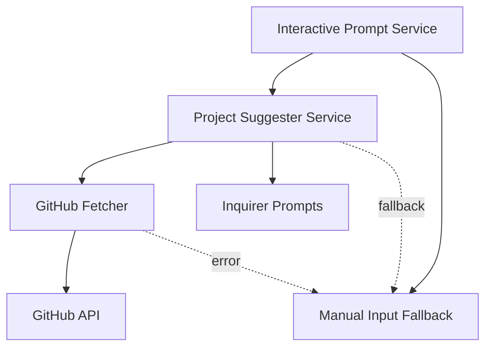
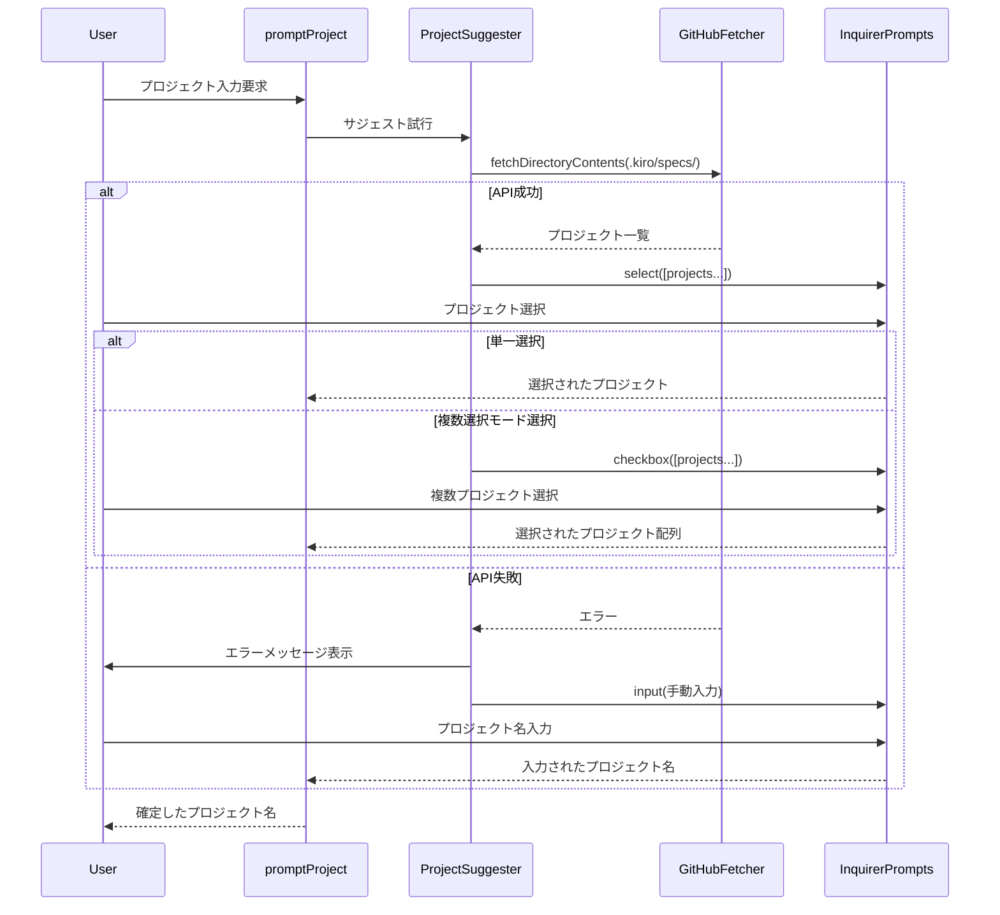
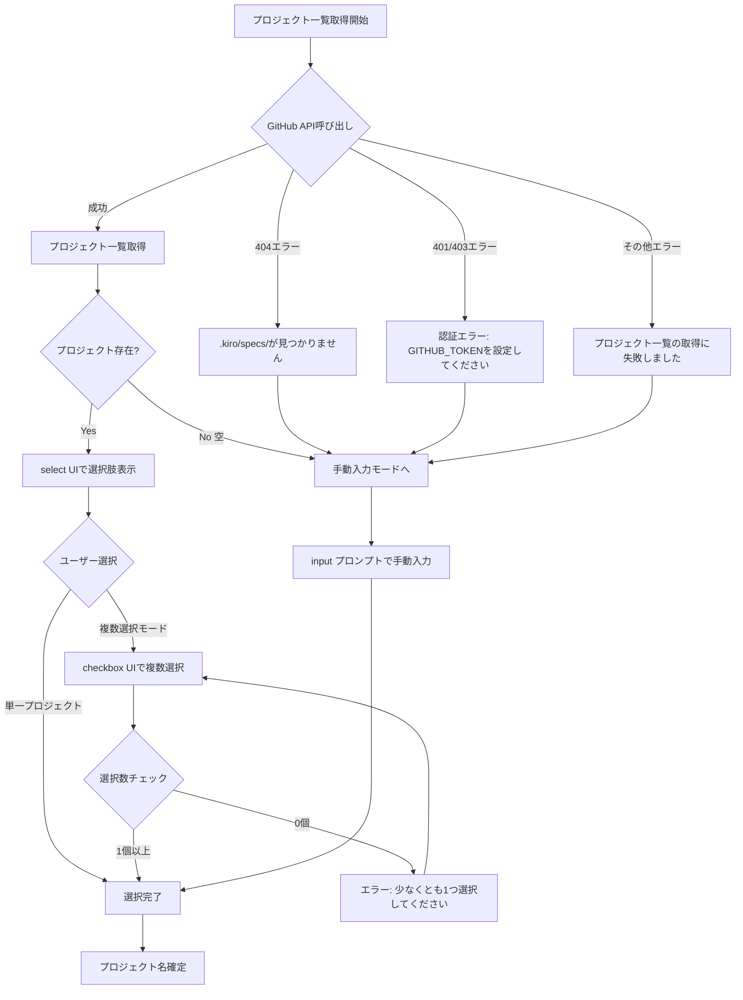

# 技術設計ドキュメント

## 概要

プロジェクトサジェスト機能は、Kirox CLIのインタラクティブモードにおいて、ユーザーがプロジェクト名を手動入力する代わりに、GitHub APIから利用可能なプロジェクト一覧を自動取得し、視覚的な選択UIで選ぶことを可能にする機能です。この機能により、タイプミスの防止、利用可能なプロジェクトの発見性向上、複数プロジェクト選択の効率化を実現します。

**目的**: インタラクティブモードのUXを向上させ、プロジェクト名入力の利便性を高める

**ユーザー**: Kirox CLIのインタラクティブモードを使用する全てのユーザー（新規ユーザー、既存ユーザー共に）が、リポジトリとサブディレクトリを指定した後のプロジェクト選択フローで利用します。

**影響**: 既存の`promptProject`関数を拡張し、手動入力モードからプロジェクトサジェスト機能への段階的な進化を実現します。既存の非インタラクティブモードとの完全な互換性を維持します。

### ゴール

- GitHub APIから`.kiro/specs/`配下のプロジェクト一覧を自動取得
- ラジオボタン（単一選択）とチェックボックス（複数選択）の両方に対応
- API失敗時の手動入力モードへの自動フォールバック
- 既存のインタラクティブモードワークフローとのシームレスな統合
- 非インタラクティブモードとの完全な互換性維持

### 非ゴール

- プロジェクト一覧のキャッシング（毎回GitHub APIから最新データを取得）
- プロジェクト名の自動補完機能（suggestはあくまで選択UI）
- `.kiro/specs/`以外のディレクトリからのプロジェクト検索
- プロジェクトのメタデータ表示（spec.jsonの内容など）

## アーキテクチャ

### 既存アーキテクチャの分析

Kirox CLIは4層アーキテクチャを採用しており、本機能は以下の既存パターンを尊重します：

- **CLI層の責務**: `src/cli/interactive-prompt.ts`がユーザー対話を統括
- **GitHub層の独立性**: `src/github/fetcher.ts`がAPI通信を担当し、CLI層から依存注入される
- **レイヤー間の単方向依存**: CLI → GitHub、レポーティング層は横断的に利用
- **既存のプロンプトパターン**: `@inquirer/prompts`を使用した対話的入力

### ハイレベルアーキテクチャ



**統合ポイント**:
- `promptProject`関数を拡張して、プロジェクトサジェスト機能を統合
- 既存の`fetchDirectoryContents`関数を再利用してプロジェクト一覧を取得
- エラー発生時は既存の手動入力モード（`input`プロンプト）にフォールバック

### 技術スタック整合性

本機能は既存の技術スタックと完全に整合しており、新しい外部依存を追加しません：

**既存技術の再利用**:
- **Octokit (v5.x)**: GitHub API通信（既存の`fetchDirectoryContents`を再利用）
- **@inquirer/prompts**: 既存の`input`, `confirm`に加えて、`select`, `checkbox`を追加
- **TypeScript 5.x**: 既存の型安全性パターンを継承

**新規導入ライブラリ**: なし（`@inquirer/prompts`は既存依存）

**アーキテクチャパターン**: 既存の4層アーキテクチャを維持し、CLI層とGitHub層の責任分離を尊重

### 主要設計決定

#### 決定1: promptProject関数の拡張アプローチ

**決定**: 既存の`promptProject`関数を段階的に拡張し、プロジェクトサジェスト機能を統合する

**コンテキスト**: 既存のインタラクティブモードワークフローを維持しつつ、新機能を追加する必要がある

**代替案**:
1. **新しい関数を作成**: `promptProjectWithSuggestion`として別関数を作成
2. **promptProject関数を置き換え**: 既存関数を完全に書き換え
3. **promptProject関数を拡張**: 既存関数内部でサジェスト機能を追加（選択）

**選択したアプローチ**: promptProject関数を拡張し、内部でサジェスト機能を呼び出す

**根拠**:
- 既存の`promptMissingArguments`フローを変更せずに済む
- 関数シグネチャの互換性を完全に維持できる
- サジェスト機能の有効/無効を内部で制御可能（エラー時のフォールバック）

**トレードオフ**:
- **得られるもの**: 既存コードとの完全な互換性、シームレスな統合
- **失うもの**: 関数の複雑度がやや増加（ただし、適切な関数分割で緩和）

#### 決定2: 単一選択と複数選択のUI設計

**決定**: 単一選択（select）をデフォルトとし、複数選択モードは「選択肢の1つ」として提供

**コンテキスト**: ユーザーは単一プロジェクトを選択するケースが多いが、複数プロジェクトの一括選択も必要

**代替案**:
1. **常にcheckboxで複数選択**: 全ユーザーがチェックボックス形式で選択
2. **事前質問で選択モードを決定**: 「単一/複数どちらを選択しますか？」と先に聞く
3. **selectの選択肢に「複数選択モード」を含める**: select UIに特別な選択肢を追加（選択）

**選択したアプローチ**: selectの選択肢に「[Select multiple projects...]」を含める

**根拠**:
- 単一選択が大多数のユースケース（README例でも単一プロジェクトがメイン）
- 事前質問は不要なステップを増やし、UXを悪化させる
- 複数選択が必要なユーザーのみが追加アクションを取る形式が効率的

**トレードオフ**:
- **得られるもの**: シンプルで直感的なUI、多数派ユーザーの効率化
- **失うもの**: 複数選択ユーザーは1ステップ多くなる（許容範囲内）

#### 決定3: エラーハンドリングとフォールバック戦略

**決定**: API失敗時は自動的に手動入力モードにフォールバックし、エラーメッセージで理由を説明

**コンテキスト**: GitHub APIは様々な理由で失敗する可能性がある（404, 401/403, ネットワークエラー）

**代替案**:
1. **エラー時にプロセスを中断**: エラーメッセージを表示して終了
2. **リトライ機構を実装**: 失敗時に数回リトライしてから諦める
3. **即座に手動入力にフォールバック**: エラー時は説明付きで手動入力モードへ（選択）

**選択したアプローチ**: エラー分類に応じた適切なメッセージと共に手動入力モードにフォールバック

**根拠**:
- Fail-Safe設計原則に従い、部分的な失敗でも処理を継続
- プロジェクトサジェストは「便利機能」であり、必須ではない
- ユーザーは常に手動入力で目的を達成できる必要がある

**トレードオフ**:
- **得られるもの**: 高い可用性、ユーザーの作業中断を防止
- **失うもの**: APIエラーの根本原因の調査がやや困難（verboseログで対応）

## システムフロー

### プロジェクト選択フロー（シーケンス図）



### エラーハンドリングフロー



## 要件トレーサビリティ

| 要件ID | 要件概要 | コンポーネント | インターフェース | フロー |
|--------|----------|----------------|------------------|--------|
| 1.1-1.5 | プロジェクト一覧の自動取得 | ProjectSuggester | fetchAvailableProjects() | シーケンス図 |
| 2.1-2.4 | ラジオボタン形式での選択UI | ProjectSuggester | promptSingleProject() | シーケンス図 |
| 3.1-3.5 | 複数プロジェクト選択のサポート | ProjectSuggester | promptMultipleProjects() | シーケンス図 |
| 4.1-4.6 | エラーハンドリングとフォールバック | ProjectSuggester | handleFetchError() | エラーフロー図 |
| 5.1-5.4 | 既存機能との互換性維持 | promptProject (拡張版) | promptProject() | シーケンス図 |
| 6.1-6.4 | パフォーマンスとユーザーフィードバック | ProjectSuggester | showLoadingMessage() | シーケンス図 |

## コンポーネントとインターフェース

### CLI層

#### ProjectSuggester（新規作成）

**責任とドメイン境界**
- **主要責任**: GitHub APIからプロジェクト一覧を取得し、ユーザーに選択UIを提供する
- **ドメイン境界**: CLI層のプロンプトサービスとして、インタラクティブモードのプロジェクト選択を担当
- **データ所有権**: プロジェクト一覧（一時的）、選択されたプロジェクト名
- **トランザクション境界**: 単一のプロジェクト選択フロー（取得→表示→選択）

**依存関係**
- **インバウンド**: `promptProject`関数から呼び出される
- **アウトバウンド**:
  - `fetchDirectoryContents` (GitHub層)
  - `select`, `checkbox` (@inquirer/prompts)
  - `Logger` (レポーティング層)
- **外部依存**: `@inquirer/prompts` (既存依存)

**サービスインターフェース**

```typescript
/**
 * Project suggestion result
 */
interface ProjectSuggestionResult {
  /** Selected project names */
  projects: string[];
  /** Whether suggestion was successful (true) or fallback to manual (false) */
  success: boolean;
}

/**
 * Project suggestion options
 */
interface ProjectSuggestionOptions {
  /** GitHub repository reference (owner, repo, branch) */
  repository: RepositoryRef;
  /** Optional subdirectory path */
  subdir?: string;
  /** GitHub client instance */
  client: Octokit;
  /** Logger instance for verbose output */
  logger: Logger;
  /** Enable verbose logging */
  verbose: boolean;
}

/**
 * Project Suggester Service
 *
 * Fetches available projects from GitHub and provides selection UI
 */
interface ProjectSuggesterService {
  /**
   * Suggest projects from GitHub repository
   *
   * @param options - Suggestion options
   * @returns Project suggestion result with selected projects
   */
  suggestProjects(options: ProjectSuggestionOptions): Promise<ProjectSuggestionResult>;
}
```

**事前条件**:
- GitHubクライアントが初期化済み
- リポジトリ参照が有効な形式
- TTY環境で実行中

**事後条件**:
- 成功時: 1つ以上のプロジェクト名が選択されている
- 失敗時: フォールバックフラグが設定され、空配列が返される

**不変条件**:
- 選択されたプロジェクト名は空文字列を含まない
- プロジェクト名は`.kiro/specs/`配下に実際に存在する

**状態管理**
- **状態モデル**: ステートレス（各呼び出しで完結）
- **永続化**: なし（一時的なプロジェクト一覧のみメモリに保持）

#### promptProject関数（拡張）

**統合戦略**
- **変更アプローチ**: 既存関数を拡張し、内部でProjectSuggesterを呼び出す
- **後方互換性**:
  - 関数シグネチャは変更なし
  - 既存の`currentValue`チェックロジックを維持
  - フォールバック時は既存の`input`プロンプトと同じ動作
- **移行パス**: 段階的統合（既存コードは影響を受けない）

**拡張後のインターフェース**

```typescript
/**
 * Prompt for project name input (extended with suggestion feature)
 *
 * Enhanced version that attempts to suggest projects from GitHub API.
 * Falls back to manual input on API failure.
 *
 * @param currentValue - Current project name value (may be empty or whitespace)
 * @param repository - Repository reference (for suggestion feature)
 * @param subdir - Optional subdirectory path (for suggestion feature)
 * @param client - GitHub client instance (for suggestion feature)
 * @param logger - Logger instance (for suggestion feature)
 * @param verbose - Enable verbose logging (for suggestion feature)
 * @returns Validated project name string (single or comma-separated multiple)
 */
export async function promptProject(
  currentValue: string,
  repository?: string,
  subdir?: string,
  client?: Octokit,
  logger?: Logger,
  verbose?: boolean
): Promise<string>;
```

**実装フロー**:
1. 既存の`currentValue`チェック（空でなければそのまま返す）
2. サジェスト機能の前提条件チェック（repository, client存在チェック）
3. `ProjectSuggester.suggestProjects()`を呼び出し
4. 成功時: 選択されたプロジェクト名を返す
5. 失敗時: 既存の`input`プロンプトにフォールバック

### GitHub層

#### fetchDirectoryContents（既存関数の再利用）

**既存実装の活用**
- **再利用戦略**: `src/github/fetcher.ts`の既存関数をそのまま使用
- **変更不要**: プロジェクト一覧取得は既存のディレクトリコンテンツ取得と同じ
- **パス指定**: `{subdir}/.kiro/specs/` または `.kiro/specs/` をパスとして渡す

**使用例**:

```typescript
// サブディレクトリ指定あり
const contents = await fetchDirectoryContents(
  client,
  owner,
  repo,
  'lib/a/.kiro/specs/',
  branch
);

// サブディレクトリ指定なし
const contents = await fetchDirectoryContents(
  client,
  owner,
  repo,
  '.kiro/specs/',
  branch
);

// ディレクトリのみ抽出
const projects = contents
  .filter(item => item.type === 'dir')
  .map(item => item.name);
```

### Inquirer Prompts層

#### select プロンプト

**外部依存調査**:
- **ライブラリ**: `@inquirer/prompts` (既存依存、追加インストール不要)
- **バージョン**: 現在のプロジェクトで使用中のバージョンと互換
- **API署名**: `select<T>(config: SelectConfig<T>): Promise<T>`
- **TypeScript型定義**: 完全サポート

**使用パターン**:

```typescript
import { select } from '@inquirer/prompts';

const projectName = await select({
  message: 'Select a project',
  choices: [
    { name: 'project-a', value: 'project-a' },
    { name: 'project-b', value: 'project-b' },
    { name: '[Select multiple projects...]', value: '__MULTIPLE__' }
  ],
  pageSize: 10,
  loop: true
});
```

**設定オプション**:
- `message`: 表示メッセージ
- `choices`: 選択肢配列（`{ name: string; value: T }`形式）
- `pageSize`: 一度に表示する選択肢数（デフォルト7、10に設定推奨）
- `loop`: 選択肢の循環を許可（デフォルトtrue）

#### checkbox プロンプト

**外部依存調査**:
- **ライブラリ**: `@inquirer/prompts` (既存依存)
- **API署名**: `checkbox<T>(config: CheckboxConfig<T>): Promise<T[]>`
- **バリデーション**: `validate`オプションで選択数チェック可能

**使用パターン**:

```typescript
import { checkbox } from '@inquirer/prompts';

const projectNames = await checkbox({
  message: 'Select projects (space to select, enter to confirm)',
  choices: [
    { name: 'project-a', value: 'project-a' },
    { name: 'project-b', value: 'project-b' },
    { name: 'project-c', value: 'project-c' }
  ],
  validate: (selected: string[]) => {
    if (selected.length === 0) {
      return 'Please select at least one project';
    }
    return true;
  },
  pageSize: 10,
  loop: true
});
```

**設定オプション**:
- `message`: 表示メッセージ
- `choices`: 選択肢配列
- `validate`: バリデーション関数（選択数チェック）
- `pageSize`: 一度に表示する選択肢数
- `loop`: 選択肢の循環を許可

## データモデル

### ドメインモデル

#### ProjectSuggestion（バリューオブジェクト）

プロジェクトサジェストの結果を表す不変オブジェクト。

**属性**:
- `projects: string[]` - 選択されたプロジェクト名の配列
- `success: boolean` - サジェストの成功フラグ（失敗時はフォールバック）

**ビジネスルール**:
- `success === true`の場合、`projects`は1つ以上の要素を持つ
- `success === false`の場合、`projects`は空配列
- プロジェクト名は空文字列を含まない

#### RepositoryRef（既存エンティティの再利用）

```typescript
interface RepositoryRef {
  owner: string;
  repo: string;
  branch?: string;
}
```

既存の`src/github/fetcher.ts`で定義済み。変更不要。

### データコントラクト

#### GitHub API レスポンス

**ContentItem型（既存）**:

```typescript
interface ContentItem {
  name: string;         // ディレクトリ名（プロジェクト名）
  path: string;         // フルパス（例: .kiro/specs/project-a）
  type: 'file' | 'dir'; // タイプ（'dir'のみ使用）
  sha: string;          // Git SHA
  size?: number;        // サイズ（ディレクトリの場合は未使用）
  download_url?: string | null; // ダウンロードURL（ディレクトリの場合はnull）
}
```

**プロジェクト一覧への変換**:

```typescript
const projects = contentItems
  .filter(item => item.type === 'dir')
  .map(item => item.name);
```

## エラーハンドリング

### エラー戦略

プロジェクトサジェスト機能は「ベストエフォート」で動作し、失敗時は常に手動入力モードにフォールバックします。これにより、ユーザーの作業フローが中断されることを防ぎます。

### エラーカテゴリと対応

#### ユーザーエラー（不要）

プロジェクトサジェスト機能では、ユーザー起因のエラーは発生しません（リポジトリとサブディレクトリは既に入力済み）。

#### システムエラー（5xx系、ネットワークエラー）

**404エラー（Not Found）**:
- **シナリオ**: `.kiro/specs/`ディレクトリが存在しない、またはブランチが存在しない
- **対応**:
  - エラーメッセージ: ".kiro/specs/ directory not found in repository"
  - 手動入力モードにフォールバック
- **ログ（--verbose）**: リポジトリ、ブランチ、パス情報を記録

**401/403エラー（Unauthorized/Forbidden）**:
- **シナリオ**: プライベートリポジトリへのアクセス権限がない、またはGITHUB_TOKENが無効
- **対応**:
  - エラーメッセージ: "Authentication error: Please set GITHUB_TOKEN environment variable"
  - 手動入力モードにフォールバック
- **ログ（--verbose）**: 認証エラーの詳細を記録

**その他のエラー（ネットワークエラー、タイムアウトなど）**:
- **シナリオ**: ネットワーク接続失敗、GitHub APIのタイムアウト
- **対応**:
  - エラーメッセージ: "Failed to fetch project list from GitHub"
  - 手動入力モードにフォールバック
- **ログ（--verbose）**: エラーの詳細（メッセージ、スタックトレース）を記録

#### ビジネスロジックエラー（422系）

**プロジェクトが存在しない（空ディレクトリ）**:
- **シナリオ**: `.kiro/specs/`は存在するが、配下にディレクトリが1つもない
- **対応**:
  - エラーメッセージ: "No projects found in .kiro/specs/"
  - 手動入力モードにフォールバック
- **ログ（--verbose）**: ディレクトリが空であることを記録

**複数選択で0個選択**:
- **シナリオ**: checkboxプロンプトで何も選択せずにEnterを押す
- **対応**:
  - バリデーションメッセージ: "Please select at least one project"
  - checkboxプロンプトを再表示（Inquirer.jsの標準動作）

### モニタリング

**エラートラッキング**:
- 全てのエラーはLogger経由で記録
- `--verbose`オプション時は詳細情報（リポジトリ、ブランチ、パス、エラーメッセージ）を出力

**ログ出力例**:

```typescript
// API呼び出し前
logger.info('Fetching available projects from GitHub', {
  repository: 'owner/repo',
  branch: 'main',
  path: '.kiro/specs/',
});

// API成功
logger.info('Successfully fetched projects', {
  count: 3,
  projects: ['project-a', 'project-b', 'project-c'],
});

// API失敗
logger.error('Failed to fetch projects from GitHub', {
  error: error.message,
  statusCode: 404,
  repository: 'owner/repo',
});
```

## テスト戦略

### 単体テスト

**ProjectSuggesterサービス** (`src/cli/project-suggester.test.ts`):
1. **プロジェクト一覧取得成功**: GitHub APIから正しくプロジェクト一覧を取得
2. **空ディレクトリ処理**: `.kiro/specs/`が空の場合、フォールバックフラグを設定
3. **404エラー処理**: 404エラー時、適切なエラーメッセージと共にフォールバック
4. **401/403エラー処理**: 認証エラー時、GITHUB_TOKEN設定を促すメッセージと共にフォールバック
5. **サブディレクトリパス構築**: サブディレクトリ指定時、正しいパスを構築
6. **ブランチ指定**: ブランチ指定時、GitHub APIに正しく渡される

**promptProject関数拡張** (`src/cli/interactive-prompt.test.ts`):
1. **既存の動作維持**: `currentValue`が空でない場合、既存と同じ動作
2. **サジェスト成功時**: ProjectSuggesterが成功した場合、選択されたプロジェクト名を返す
3. **サジェスト失敗時**: ProjectSuggesterが失敗した場合、手動入力プロンプトにフォールバック
4. **依存注入の検証**: repository, client, loggerがnullの場合、手動入力にフォールバック

### 統合テスト

**CLI → GitHub API** (`tests/integration/project-suggestion.test.ts`):
1. **実際のリポジトリからプロジェクト取得**: モックではなく、テスト用リポジトリから実際にプロジェクト一覧を取得
2. **ブランチ指定でのプロジェクト取得**: 特定ブランチを指定してプロジェクト一覧を取得
3. **サブディレクトリ指定でのプロジェクト取得**: サブディレクトリを指定してプロジェクト一覧を取得
4. **エラーリカバリーフロー**: 存在しないリポジトリを指定した場合のフォールバック動作を検証

### E2Eテスト

**インタラクティブモードの完全フロー** (`tests/e2e/interactive-project-suggestion.test.ts`):
1. **単一プロジェクト選択フロー**: リポジトリ入力 → サブディレクトリ入力 → プロジェクト選択（単一） → 確認
2. **複数プロジェクト選択フロー**: リポジトリ入力 → サブディレクトリ入力 → 複数選択モード選択 → プロジェクト複数選択 → 確認
3. **フォールバックフロー**: リポジトリ入力 → サブディレクトリ入力 → API失敗 → 手動入力 → 確認

**非インタラクティブモードとの互換性** (`tests/e2e/compatibility.test.ts`):
1. **既存の非インタラクティブモード**: `npx kirox owner/repo -p project`が正常動作
2. **プロジェクト事前指定**: インタラクティブモードで`-p`オプション指定時、サジェストをスキップ

## セキュリティ考慮事項

### 認証とアクセス制御

**GitHub Token管理**:
- 既存の`GITHUB_TOKEN`環境変数を使用（新しいトークン要件なし）
- トークンは`createGitHubClient`関数で安全に処理
- トークンがない場合は、パブリックリポジトリのみアクセス可能（既存と同じ制約）

**プライベートリポジトリアクセス**:
- プライベートリポジトリの場合、適切な権限を持つGITHUB_TOKENが必要
- 401/403エラー時は、明確なエラーメッセージでトークン設定を促す

### データ保護

**機密情報の非保持**:
- プロジェクト一覧は一時的にメモリに保持されるのみ
- ローカルストレージやログファイルには書き込まれない
- `--verbose`オプション時もプロジェクト名のみ記録（機密情報は含まれない前提）

### 脅威モデリング

**考慮する脅威**:
- **GitHub API応答の改ざん**: HTTPSによる通信暗号化で対策済み（Octokitの標準動作）
- **悪意のあるプロジェクト名**: プロジェクト名のバリデーションは既存の`validateProjectName`で実施
- **DoS攻撃（大量のプロジェクト）**: `.kiro/specs/`配下のプロジェクト数は現実的に数十程度、問題なし

## パフォーマンスとスケーラビリティ

### ターゲットメトリクス

- **API呼び出し時間**: `.kiro/specs/`ディレクトリ一覧取得は1秒以内（通常500ms以下）
- **UI応答性**: selectプロンプト表示までの遅延は1秒以内
- **プロジェクト数上限**: 100プロジェクトまで快適に表示（Inquirer.jsのpageSize設定で対応）

### パフォーマンス最適化

**ローディングフィードバック**:
- GitHub API呼び出し前に「Fetching available projects...」メッセージを表示
- 3秒以上かかる場合は「Please wait...」追加メッセージを表示

**キャッシングの意図的な非採用**:
- プロジェクト一覧は毎回最新データを取得（非ゴールに明記）
- キャッシュは古いデータを表示するリスクがあり、インタラクティブモードには不適切

### スケーラビリティ考慮事項

**大量プロジェクトへの対応**:
- Inquirer.jsの`pageSize`オプションで一度に表示する数を制限（10件推奨）
- `loop: true`オプションで上下キーでの循環を許可

**GitHub APIレート制限**:
- `.kiro/specs/`ディレクトリ一覧取得は1回のAPI呼び出しのみ（レート制限への影響は最小限）
- 既存のレート制限モニタリング（`getRateLimit`）をそのまま活用
