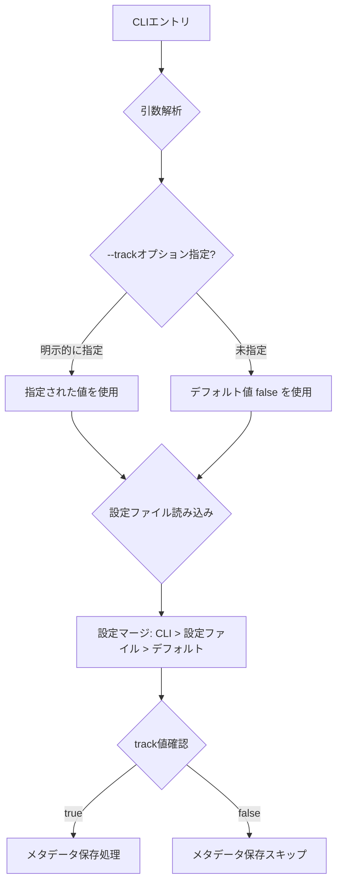
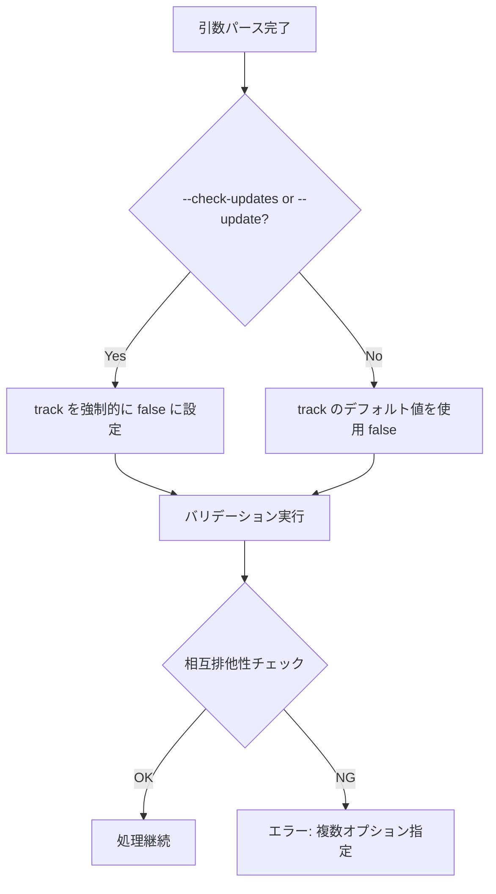
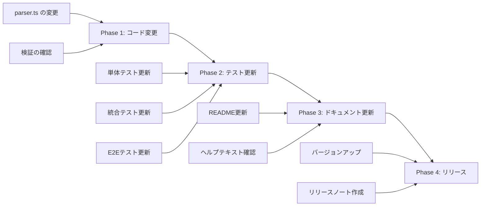

# 技術設計ドキュメント

## Overview

この機能は、Kirox CLIの`--track`オプションのデフォルト値を`true`から`false`に変更します。これにより、ユーザーが明示的にトラッキング機能を有効化した場合のみ、取得したファイルのメタデータを記録するようになり、不要なメタデータファイル生成を防ぎます。

**目的**: 更新追跡機能をオプトイン方式に変更し、より直感的で軽量なデフォルト動作を提供する

**ユーザー**: kirox CLIを使用する開発者全員が影響を受けます。既存のワークフローでは明示的に`--track`を指定する必要がありますが、新規ユーザーはデフォルトでシンプルな動作を体験できます。

**影響**:
- 現在のデフォルト動作が変更されます（`--track=true` → `--track=false`）
- 既存のテストケースの期待値を更新する必要があります
- ヘルプメッセージとドキュメントを新しいデフォルト値に合わせて更新します

### Goals

- `--track`オプションのデフォルト値を`false`に変更する
- 既存のテストスイートを新しいデフォルト値に合わせて更新し、100%の成功率を維持する
- 明示的な`--track`指定による既存のワークフローとの後方互換性を確保する

### Non-Goals

- `--track`オプションの機能自体の変更（機能はそのまま維持）
- メタデータファイルのフォーマット変更
- 更新追跡機能の動作変更（有効化時の挙動は変わらない）

## Architecture

### 既存アーキテクチャの分析

Kirox CLIは4層アーキテクチャを採用しています：

- **CLI Layer** (`src/cli/`): Commander.jsを使用した引数パースとバリデーション
- **GitHub Integration Layer** (`src/github/`): Octokitを使用したファイル取得
- **File System Layer** (`src/filesystem/`): ローカルファイル書き込み
- **Reporting Layer** (`src/reporting/`): 進捗表示とエラーハンドリング

**現在の実装状況**:
- `src/cli/parser.ts:33` で`--track`オプションがデフォルト値`true`で定義されている
- `src/cli/entry.ts:268-275` でtrackオプションがtrueの場合にメタデータを保存する
- バリデーション層（`src/cli/validator.ts:36-50`）で`--track`、`--check-updates`、`--update`の相互排他性を検証している

**保持すべき既存パターン**:
- Commander.jsによる宣言的なオプション定義
- 設定ファイル（`.kiroxrc.json`）による設定マージ
- 相互排他的オプションのバリデーション

**統合ポイント**:
- 設定マージ処理（`src/config/merger.ts`）では、CLI引数 > 設定ファイル > デフォルト値の優先順位を維持
- インタラクティブモードでもデフォルト値が一貫して適用されること

### 技術スタックの整合性

この機能は既存の技術スタックに完全に整合しています：

**既存の依存関係**:
- Commander.js v12.x: CLIオプションのデフォルト値定義機能を使用
- TypeScript 5.x: 既存の型定義（`ParsedArguments`）をそのまま使用

**新しい依存関係**: なし（既存のライブラリのみで実装可能）

### 主要な設計決定

#### 決定1: Commander.jsのデフォルト値機能を使用

**決定**: `.option('--track', 'description', true)` の第3引数を `false` に変更

**コンテキスト**: Commander.jsは宣言的なデフォルト値定義をサポートしており、現在`true`が指定されている

**代替案**:
1. **カスタムデフォルト値処理**: パース後に手動でデフォルト値を設定
2. **設定ファイルでの制御**: `.kiroxrc.json`でのみデフォルト値を変更
3. **Commander.jsのデフォルト値変更**（選択）: `.option()`の第3引数を変更

**選択されたアプローチ**: Commander.jsのデフォルト値機能を直接使用

**理由**:
- Commander.jsの標準機能を活用することで、コードの明確性と保守性が向上
- ヘルプメッセージの自動生成がデフォルト値を反映
- 既存のパターンと一貫性を保つ（他のオプションも同様の方法で定義）

**トレードオフ**:
- **利点**: シンプルで明確、既存パターンとの一貫性、自動ヘルプ生成
- **犠牲**: なし（この変更による負の影響はない）

## System Flows

### デフォルト値適用フロー



### オプション相互排他性フロー



## Requirements Traceability

| Requirement | 要件概要 | コンポーネント | インターフェース | フロー |
|-------------|---------|-------------|-------------|-------|
| 1.1 | デフォルト値をfalseに設定 | ArgumentParser | `.option('--track', '...', false)` | デフォルト値適用フロー |
| 1.2 | 明示的指定時にtrueを設定 | ArgumentParser | Commander.js標準パース | デフォルト値適用フロー |
| 1.3 | 他オプション指定時にfalseを強制 | ArgumentParser | `track = (options.checkUpdates \|\| options.update) ? false : options.track` | オプション相互排他性フロー |
| 2.1-2.3 | テストケース更新 | Test Suite | 各テストファイル内の期待値 | - |
| 3.1-3.3 | 後方互換性確保 | ConfigMerger, MetadataManager | 既存インターフェース維持 | デフォルト値適用フロー |
| 4.1-4.3 | ドキュメント更新 | ArgumentParser, README | ヘルプテキスト、ドキュメント | - |
| 5.1-5.3 | インタラクティブモード | InteractivePrompt | プロンプトデフォルト値 | デフォルト値適用フロー |

## Components and Interfaces

### CLI層 / ArgumentParser

#### 責任と境界

**主要責任**: コマンドライン引数のパースとデフォルト値の適用

**ドメイン境界**: CLI層に属し、ユーザー入力の受け付けと初期変換を担当

**データ所有権**: `ParsedArguments`オブジェクトの生成と初期値設定

**依存関係**:
- **内向き**: CLIEntry、InteractivePromptから呼び出される
- **外向き**: Commander.js（外部ライブラリ）に依存
- **外部**: なし

#### コントラクト定義

**サービスインターフェース**:

```typescript
interface ArgumentParserService {
  parseArguments(argv: string[]): ParsedArguments;
}
```

既存の`parseArguments`関数の型定義:

```typescript
export function parseArguments(argv: string[]): ParsedArguments {
  // Commander.jsを使用して引数をパース
  // --trackオプションのデフォルト値を false に変更
  const program = new Command();
  program.option('--track', 'Track fetched files for update detection', false); // true → false に変更
  // ...
}
```

**事前条件**:
- `argv`は有効な文字列配列である
- `argv[0]`と`argv[1]`はNode.jsの標準形式（実行ファイルパス、スクリプトパス）

**事後条件**:
- `ParsedArguments`オブジェクトが返される
- `track`フィールドは`false`（デフォルト）または明示的な指定値
- 無効な引数の場合はCommander.jsがエラーをスロー

**不変条件**:
- `--check-updates`または`--update`が指定された場合、`track`は常に`false`

### CLI層 / TestSuite

#### 責任と境界

**主要責任**: 新しいデフォルト値に対するテストケースの検証

**ドメイン境界**: テスト層に属し、全コンポーネントの動作を検証

**データ所有権**: テストデータとアサーション

**依存関係**:
- **外向き**: Vitest（テストフレームワーク）、モックされたArgumentParser

#### コントラクト定義

**テスト対象**:

主要なテストファイル（100件以上のテストケース）:
- `tests/unit/cli/parser.test.ts`: ArgumentParserの単体テスト
- `tests/e2e/*.test.ts`: E2Eテストスイート
- `tests/integration/*.test.ts`: 統合テストスイート

**テスト戦略**:

```typescript
describe('ArgumentParser - track option default', () => {
  it('デフォルト値がfalseであることを検証', () => {
    const result = parseArguments(['node', 'kirox', 'owner/repo', '-p', 'project']);
    expect(result.track).toBe(false); // 変更: true → false
  });

  it('明示的な--track指定でtrueになることを検証', () => {
    const result = parseArguments(['node', 'kirox', 'owner/repo', '-p', 'project', '--track']);
    expect(result.track).toBe(true);
  });

  it('--check-updates指定時にtrackがfalseになることを検証', () => {
    const result = parseArguments(['node', 'kirox', '--check-updates']);
    expect(result.track).toBe(false);
  });
});
```

### 設定管理層 / ConfigMerger

#### 責任と境界

**主要責任**: CLI引数、設定ファイル、デフォルト値のマージ

**ドメイン境界**: 設定管理層に属し、設定の優先順位制御を担当

**データ所有権**: マージされた最終設定（`MergedConfig`）

**統合戦略**:
- **変更なし**: 既存の`mergeConfig`関数はそのまま使用
- **後方互換性**: `.kiroxrc.json`に`"track": true`が設定されている場合は、その設定を尊重
- **優先順位**: CLI引数 > 設定ファイル > デフォルト値（変更なし）

## Error Handling

### エラー戦略

この機能変更では、新しいエラーケースは導入されません。既存のエラーハンドリングパターンを維持します。

### エラーカテゴリと対応

**ユーザーエラー（4xx相当）**:
- 相互排他的オプションの同時指定 → バリデーションエラーメッセージ表示
- 無効な引数形式 → Commander.jsの自動エラーハンドリング

**システムエラー（5xx相当）**:
- メタデータ保存失敗 → 警告ログ出力、ファイル取得処理は継続（既存動作を維持）

### モニタリング

既存のロギング機構を使用:
- `logger.info()`: デフォルト値の適用をverboseモードで記録
- `logger.warn()`: メタデータ保存失敗時の警告（既存）

## Testing Strategy

### 単体テスト

**対象**: ArgumentParser (`src/cli/parser.ts`)

1. **デフォルト値検証**: `--track`未指定時に`track`が`false`であることを確認
2. **明示的指定検証**: `--track`指定時に`track`が`true`であることを確認
3. **相互排他性検証**: `--check-updates`または`--update`指定時に`track`が`false`であることを確認
4. **設定マージ検証**: `.kiroxrc.json`の`track`設定が優先されることを確認

### 統合テスト

**対象**: CLI → Config Merger → MetadataManager

1. **デフォルト動作フロー**: 引数なし実行時にメタデータファイルが作成されないことを確認
2. **明示的track有効化フロー**: `--track`指定時にメタデータファイルが作成されることを確認
3. **設定ファイル統合**: `.kiroxrc.json`の`track`設定が正しく適用されることを確認

### E2Eテスト

**対象**: 実際のCLI実行シナリオ

1. **基本フロー**: `npx kirox owner/repo -p project` 実行時にメタデータファイルが作成されない
2. **track有効化フロー**: `npx kirox owner/repo -p project --track` 実行時にメタデータファイルが作成される
3. **インタラクティブモード**: インタラクティブモードでデフォルトがfalseになることを確認
4. **後方互換性**: 既存の`--track`使用パターンが継続動作することを確認

### テストケース更新戦略

**影響を受けるテストファイル**:
- `tests/unit/cli/parser.test.ts`: デフォルト値のアサーションを`false`に更新
- `tests/e2e/*.test.ts`: 暗黙的に`track: true`を期待しているテストケースに明示的な`track: false`を追加
- `tests/integration/*.test.ts`: メタデータ生成を期待しているテストケースを見直し

**更新方針**:
1. デフォルト値をテストしているケース: `expect(result.track).toBe(false)` に変更
2. メタデータ生成を期待しているケース: テストデータに `track: false` を明示的に追加
3. 新しいテストケース追加は不要（デフォルト値変更のみ）

## Migration Strategy

### 移行フェーズ



### プロセス

**Phase 1: コード変更**
- `src/cli/parser.ts:33` のデフォルト値を`false`に変更
- 既存のバリデーション処理の動作確認（`validator.ts`の変更は不要）

**Phase 2: テスト更新**
- 全テストを実行し、失敗するテストケースを特定
- デフォルト値のアサーションを更新
- 暗黙的な`track: true`期待値を明示的な`track: false`に修正
- テストスイートの100%成功を確認

**Phase 3: ドキュメント更新**
- `README.md`の`--track`オプション説明を更新
- ヘルプテキストが自動的に更新されることを確認
- 使用例のコマンドラインを見直し（必要に応じて`--track`を追加）

**Phase 4: リリース**
- バージョンを0.2.0にアップ（マイナーバージョンアップ）
- リリースノートに破壊的変更（Breaking Change）として記載
- 移行ガイド: 既存ユーザーは明示的に`--track`を指定するよう案内

### バリデーションチェックポイント

1. **コード変更後**: `npm run type-check` でTypeScriptエラーがないことを確認
2. **テスト更新後**: `npm test` で全テストが通ることを確認（100%成功率）
3. **ドキュメント更新後**: `npm run lint` でドキュメントの整合性を確認
4. **リリース前**: E2Eテストを実行し、実際のCLI動作を確認

### ロールバックトリガー

以下の場合、変更をロールバック:
- テストスイートの成功率が100%に達しない
- 重大なバグが発見される（メタデータ保存の不具合など）
- ユーザーからの重大な互換性問題の報告
