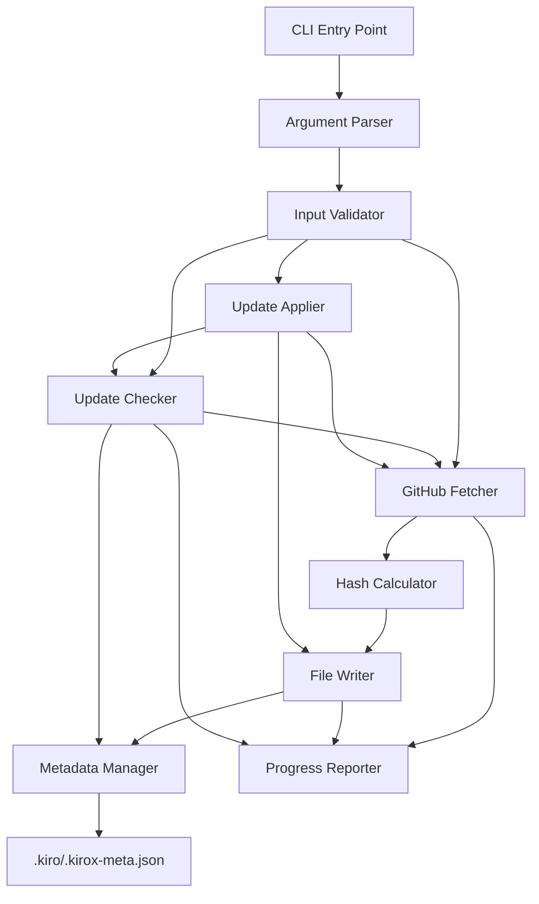
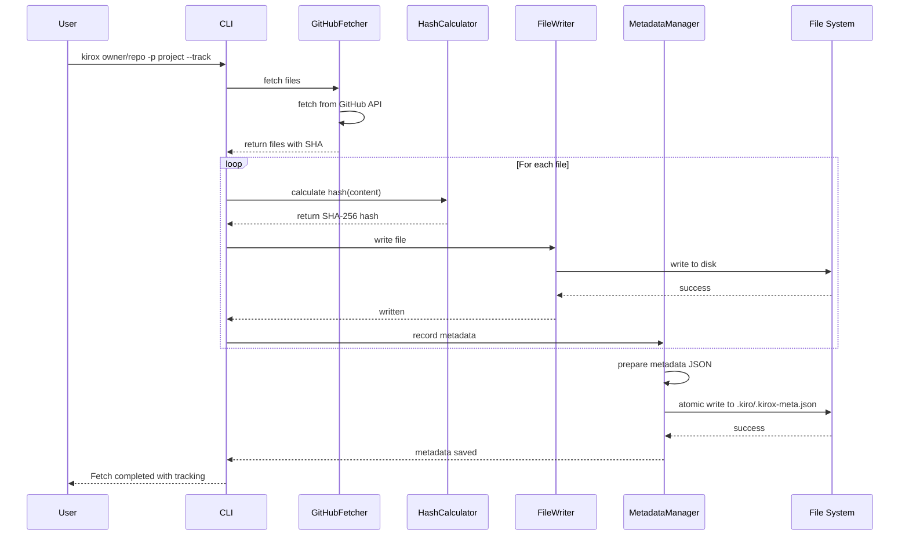
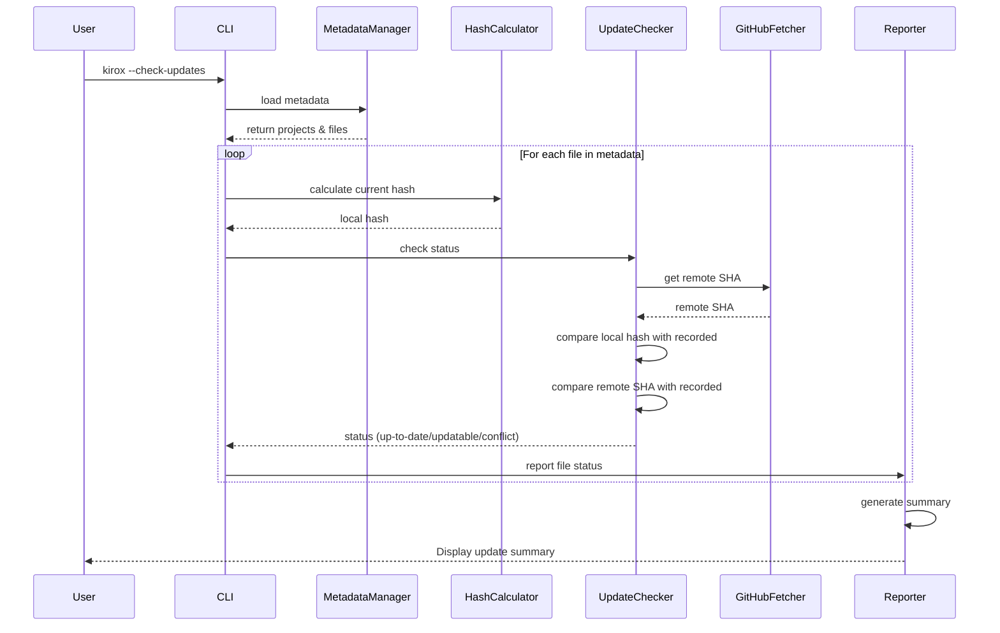
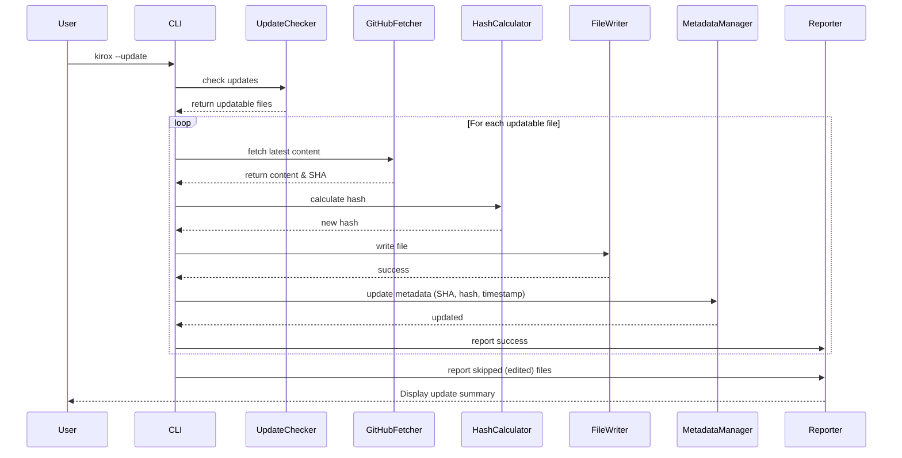
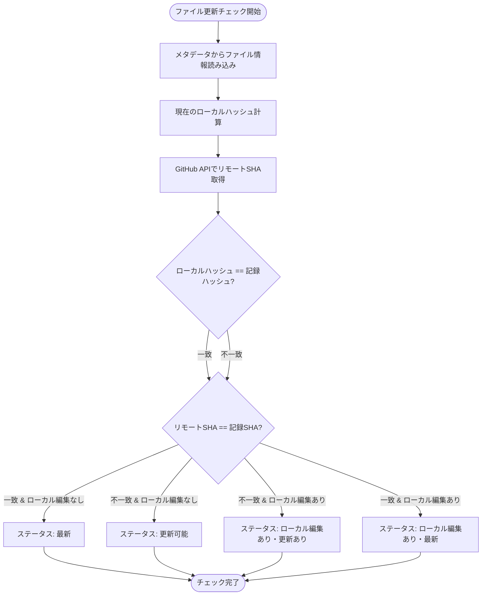

# 技術設計書

## 概要

この機能は、Kirox CLIユーザーに対して、リモートGitHubリポジトリから取得したKiro仕様ファイルの更新を追跡・管理する機能を提供する。テンプレートとして取得した仕様をローカルで編集しつつ、オリジナルの改善も安全に取り込むことを可能にする。

**ユーザー:** Kirox CLIを使用してKiro仕様ファイルを管理する開発者

**影響:** 既存のKirox CLI機能を拡張し、ファイル取得時に追跡メタデータを保存し、更新チェックと安全な更新取得を可能にする。ローカル編集されたファイルは保護される。

### ゴール
- リモートリポジトリから取得したファイルの追跡メタデータを自動保存
- ローカル編集の自動検出によりファイルの誤上書きを防止
- リモート更新のチェック機能により、どのファイルが更新可能か事前把握
- ローカル編集していないファイルのみを安全に更新

### 非ゴール
- マージツール機能の提供（3-way mergeなど）
- バージョン履歴の完全な追跡
- 複数リポジトリ間の同期機能
- GitベースのVCS機能の再実装

## アーキテクチャ

### 既存アーキテクチャの分析

Kirox CLIは4層アーキテクチャを採用している:
- **CLI Layer** (`src/cli/`): 引数パース、バリデーション
- **GitHub Integration Layer** (`src/github/`): GitHub API通信、ファイル取得
- **File System Layer** (`src/filesystem/`): ローカルファイル書き込み
- **Reporting Layer** (`src/reporting/`): 進捗表示、エラーハンドリング

既存の実行フロー:
```
CLI Entry → Parser → Validator → GitHub Fetcher → File Writer → Progress Reporter
```

### ハイレベルアーキテクチャ



### アーキテクチャ統合

**既存パターンの保持:**
- 4層アーキテクチャの維持（CLI、GitHub、FileSystem、Reporting）
- 単方向データフロー
- 依存注入によるReporting層の利用
- エラーハンドリングの一貫性

**新規コンポーネントの根拠:**
- **Metadata Manager**: メタデータの読み書き、整合性管理の責任分離
- **Hash Calculator**: ファイルハッシュ計算の単一責任
- **Update Checker**: 更新チェックロジックの独立性
- **Update Applier**: 更新適用フローの統合

**技術スタックとの整合性:**
- TypeScript 5.x + ESM形式
- Node.js 18+ 組み込みcrypto APIを使用（SHA-256ハッシュ）
- 既存のOctokit、Commander、Chalkライブラリを活用

**ステアリングコンプライアンス:**
- Layer Isolation: 新規コンポーネントも層分離を遵守
- Fail-Safe Design: 部分的な失敗を許容
- Testability: 各コンポーネントを単体テスト可能に設計

### 技術アライメント

既存のKirox CLI技術スタックとの整合性を維持:

**既存パターンの踏襲:**
- TypeScript 5.x + strict型チェック
- ESM (ES Modules) 形式
- 既存のOctokit、Commander、Chalk依存を活用
- Vitestテストフレームワーク継続使用

**新規導入ライブラリ:**
なし（Node.js 18+組み込みcrypto APIのみ使用）

**既存パターンからの逸脱:**
なし

### 主要設計決定

#### 決定1: SHA-256ハッシュによるローカル編集検出

**決定:** ファイル内容のSHA-256ハッシュを計算しメタデータに記録し、ローカル編集を検出する

**コンテキト:** ローカルで編集されたファイルを自動検出し、誤上書きを防ぐ必要がある。タイムスタンプベースの検出は、ファイルコピーやgit操作で不正確になる可能性がある。

**検討した代替案:**
1. **タイムスタンプ比較**: mtime（更新日時）を記録し比較
2. **ファイルサイズ比較**: ファイルサイズのみで変更を検出
3. **Git diffベース**: .gitディレクトリに依存し、git diffで変更を検出

**選択したアプローチ:** SHA-256ハッシュ

Node.js組み込みcrypto APIを使用してファイル内容のSHA-256ハッシュを計算:
```typescript
import crypto from 'crypto';

function calculateHash(content: string): string {
  return crypto.createHash('sha256').update(content, 'utf-8').digest('hex');
}
```

メタデータに記録:
```json
{
  "files": [
    {
      "path": ".kiro/specs/project/spec.json",
      "sha": "abc123...",
      "localHash": "def456...",
      "fetchedAt": "2025-10-06T10:00:00Z"
    }
  ]
}
```

**根拠:**
- **正確性**: ファイル内容が1バイトでも変更されればハッシュが変わる
- **ファイルシステム非依存**: タイムスタンプに依存せず、コピーやgit操作の影響を受けない
- **パフォーマンス**: SHA-256は高速で、1MBファイルでも数ミリ秒で計算可能
- **既存技術との整合**: GitHub APIもSHA-1を使用しており、ハッシュベースの変更検出は一般的

**トレードオフ:**
- **獲得:** 高精度な変更検出、ファイルシステム非依存、確実性
- **犠牲:** 小規模な計算オーバーヘッド（無視できるレベル）、メタデータサイズの増加（64バイト/ファイル）

#### 決定2: `.kiro/.kirox-meta.json`による集中メタデータ管理

**決定:** すべての追跡情報を単一のJSONファイル`.kiro/.kirox-meta.json`に集中管理

**コンテキスト:** 追跡メタデータを効率的に管理し、複数プロジェクトの情報を扱う必要がある。

**検討した代替案:**
1. **ファイルごとのメタデータ**: 各ファイルに`.meta`ファイルを作成（例: `spec.json.meta`）
2. **SQLiteデータベース**: ローカルDBで追跡情報を管理
3. **Git attributesベース**: .gitattributesに依存してメタデータを管理

**選択したアプローチ:** 単一JSONファイル

構造:
```json
{
  "version": "1.0",
  "projects": [
    {
      "repository": "owner/repo",
      "projectName": "simple-kanban-board",
      "fetchedAt": "2025-10-06T10:00:00Z",
      "files": [
        {
          "path": ".kiro/specs/simple-kanban-board/spec.json",
          "sha": "abc123...",
          "localHash": "def456...",
          "size": 1024,
          "fetchedAt": "2025-10-06T10:00:00Z"
        }
      ]
    }
  ]
}
```

**根拠:**
- **シンプル性**: 単一ファイルで全情報を管理、複雑なDB不要
- **可読性**: JSONは人間が読みやすく、デバッグが容易
- **既存パターン踏襲**: npmのpackage-lock.json、Yarnのyarn.lockと同様の設計
- **パフォーマンス**: 100ファイルでも数百KB程度、読み書きは1秒以内

**トレードオフ:**
- **獲得:** シンプルな実装、依存なし、可読性、デバッグ容易性
- **犠牲:** 大規模プロジェクト（1000+ファイル）での若干のパフォーマンス低下（許容範囲内）

#### 決定3: 原子的書き込み（一時ファイル→リネーム）によるメタデータ整合性保証

**決定:** メタデータファイルの書き込みは一時ファイル→リネームパターンを使用し、破損を防止

**コンテキスト:** メタデータ書き込み中にプロセスが中断された場合、ファイルが破損し追跡機能が使用不能になるリスクがある。

**検討した代替案:**
1. **直接書き込み**: fs.writeFileで直接上書き
2. **バックアップ作成**: 書き込み前に`.bak`ファイルを作成
3. **データベーストランザクション**: SQLiteのトランザクション機能を使用

**選択したアプローチ:** 原子的書き込み

実装パターン:
```typescript
async function writeMetadataAtomic(metadata: Metadata): Promise<void> {
  const metadataPath = '.kiro/.kirox-meta.json';
  const tempPath = `${metadataPath}.tmp`;

  // 一時ファイルに書き込み
  await fs.writeFile(tempPath, JSON.stringify(metadata, null, 2), 'utf-8');

  // 原子的リネーム（OSレベルで保証）
  await fs.rename(tempPath, metadataPath);
}
```

**根拠:**
- **原子性**: OSレベルのrenameは原子的操作で、途中で中断されない
- **信頼性**: 書き込み失敗時も元のメタデータファイルは無傷
- **シンプル性**: 複雑なトランザクション機構不要
- **業界標準**: npmやYarnも同様のパターンを使用

**トレードオフ:**
- **獲得:** データ破損リスクゼロ、高信頼性、シンプル実装
- **犠牲:** 微小な一時ディスク使用量増加（数百KB程度）

## システムフロー

### シーケンス図: fetchコマンド（--trackオプション付き）



### シーケンス図: --check-updatesコマンド



### シーケンス図: --updateコマンド（ローカル編集なしファイル）



### フローチャート: ファイル更新判定ロジック



## 要求トレーサビリティ

| 要求 | 要求概要 | コンポーネント | インターフェース | フロー |
|------|----------|----------------|------------------|--------|
| 1.1 | --trackオプション付きfetch時のメタデータ作成 | CLI Parser, Metadata Manager | `parseArguments()`, `saveMetadata()` | fetchコマンドフロー |
| 1.2 | リポジトリ情報の記録 | Metadata Manager | `ProjectMetadata` interface | fetchコマンドフロー |
| 1.3 | ファイルパス、SHA、取得日時の記録 | Metadata Manager, GitHub Fetcher | `FileMetadata` interface | fetchコマンドフロー |
| 1.4 | 既存メタデータへの追加 | Metadata Manager | `mergeMetadata()` | fetchコマンドフロー |
| 2.1 | ファイルハッシュの計算と記録 | Hash Calculator | `calculateFileHash()` | fetchコマンドフロー |
| 2.2 | ハッシュ比較による編集検出 | Update Checker | `detectLocalEdits()` | check-updatesフロー |
| 3.1 | --check-updatesコマンド | CLI Parser, Update Checker | `parseArguments()`, `checkUpdates()` | check-updatesフロー |
| 3.3 | GitHub APIで最新SHA取得 | GitHub Fetcher | `fetchFileMetadata()` | check-updatesフロー |
| 3.4-3.7 | SHA比較と更新判定 | Update Checker | `compareVersions()` | 更新判定フローチャート |
| 4.1 | --updateコマンド | CLI Parser, Update Applier | `parseArguments()`, `applyUpdates()` | updateフロー |
| 4.4 | 更新可能ファイルの再取得 | Update Applier, GitHub Fetcher | `applyUpdates()`, `fetchFileContent()` | updateフロー |
| 4.5 | ローカル編集ありファイルのスキップ | Update Applier | `shouldSkipFile()` | updateフロー |
| 4.7 | メタデータの更新 | Metadata Manager | `updateFileMetadata()` | updateフロー |
| 5.1-5.3 | メタデータJSON検証と原子的書き込み | Metadata Manager | `validateMetadata()`, `writeMetadataAtomic()` | 全フロー |

## コンポーネントとインターフェース

### Metadata Layer

#### Metadata Manager

**責任と境界**
- **主要責任**: メタデータファイル(`.kiro/.kirox-meta.json`)の読み書き、バリデーション、整合性管理
- **ドメイン境界**: メタデータ管理ドメイン
- **データ所有権**: プロジェクト追跡情報、ファイルメタデータ
- **トランザクション境界**: メタデータファイルの原子的更新

**依存関係**
- **インバウンド**: CLI Entry、Update Checker、Update Applier
- **アウトバウンド**: Node.js fs/promises、crypto
- **外部**: なし

**契約定義**

サービスインターフェース:
```typescript
interface MetadataManagerService {
  // メタデータの読み込み
  loadMetadata(): Promise<Result<Metadata, MetadataError>>;

  // メタデータの保存（原子的書き込み）
  saveMetadata(metadata: Metadata): Promise<Result<void, MetadataError>>;

  // プロジェクトメタデータの追加・更新
  upsertProject(project: ProjectMetadata): Promise<Result<void, MetadataError>>;

  // ファイルメタデータの追加・更新
  upsertFile(projectKey: string, file: FileMetadata): Promise<Result<void, MetadataError>>;

  // プロジェクトメタデータの取得
  getProject(repository: string, projectName: string): Promise<Result<ProjectMetadata, MetadataError>>;

  // メタデータの検証
  validateMetadata(metadata: unknown): Result<Metadata, ValidationError>;
}

type Result<T, E> = { success: true; value: T } | { success: false; error: E };

enum MetadataError {
  NOT_FOUND = 'METADATA_NOT_FOUND',
  INVALID_FORMAT = 'INVALID_FORMAT',
  WRITE_FAILED = 'WRITE_FAILED',
  READ_FAILED = 'READ_FAILED',
}
```

**事前条件:**
- メタデータファイルが存在する場合、有効なJSON形式である
- プロジェクトキーは`repository/projectName`形式である

**事後条件:**
- `saveMetadata()`成功後、メタデータファイルは有効なJSON形式で書き込まれている
- 原子的書き込みにより、部分的な書き込み失敗は発生しない

**不変条件:**
- メタデータのバージョン番号は常に存在する
- 各プロジェクトは一意のrepository + projectName組み合わせを持つ

**状態管理**

状態モデル:
```
[存在しない] → [初期化済み] → [更新済み]
                      ↓
                  [検証エラー]
```

有効な状態遷移:
- 存在しない → 初期化済み: 初回fetch --track実行時
- 初期化済み → 更新済み: メタデータ更新時
- 更新済み → 検証エラー: 不正な手動編集により破損

**永続化:** `.kiro/.kirox-meta.json`（JSONファイル）
**整合性モデル:** 原子的書き込み（一時ファイル→リネーム）
**並行制御:** なし（単一プロセス前提）

### Tracking Layer

#### Hash Calculator

**責任と境界**
- **主要責任**: ファイル内容のSHA-256ハッシュ計算
- **ドメイン境界**: ローカル編集検出サブドメイン
- **データ所有権**: なし（純粋関数）
- **トランザクション境界:** なし

**依存関係**
- **インバウンド**: CLI Entry、Update Checker
- **アウトバウンド**: Node.js crypto
- **外部**: なし

**契約定義**

サービスインターフェース:
```typescript
interface HashCalculatorService {
  // ファイル内容からSHA-256ハッシュを計算
  calculateHash(content: string): string;

  // ファイルパスから読み込んでハッシュを計算
  calculateFileHash(filePath: string): Promise<Result<string, HashError>>;
}

enum HashError {
  FILE_NOT_FOUND = 'FILE_NOT_FOUND',
  READ_ERROR = 'READ_ERROR',
}
```

**事前条件:**
- `calculateHash()`: contentは有効なUTF-8文字列
- `calculateFileHash()`: filePathは存在する有効なファイルパス

**事後条件:**
- 返却されるハッシュは64文字の16進数文字列
- 同一内容に対して常に同一ハッシュを返す（冪等性）

**不変条件:**
- ハッシュアルゴリズムはSHA-256固定

#### Update Checker

**責任と境界**
- **主要責任**: リモート更新チェック、ローカル編集検出、ファイル状態判定
- **ドメイン境界**: 更新管理サブドメイン
- **データ所有権**: 更新ステータス情報
- **トランザクション境界**: なし（読み取り専用操作）

**依存関係**
- **インバウンド**: CLI Entry、Update Applier
- **アウトバウンド**: Metadata Manager、GitHub Fetcher、Hash Calculator
- **外部**: GitHub API（Octokit経由）

**契約定義**

サービスインターフェース:
```typescript
interface UpdateCheckerService {
  // すべての追跡ファイルの更新をチェック
  checkAllUpdates(): Promise<UpdateCheckResult>;

  // 特定ファイルの更新をチェック
  checkFileUpdate(filePath: string): Promise<Result<FileUpdateStatus, UpdateCheckError>>;

  // ローカル編集を検出
  detectLocalEdit(filePath: string, recordedHash: string): Promise<boolean>;
}

interface UpdateCheckResult {
  upToDate: FileUpdateStatus[];
  updatable: FileUpdateStatus[];
  conflicts: FileUpdateStatus[]; // ローカル編集あり & リモート更新あり
  editedLatest: FileUpdateStatus[]; // ローカル編集あり & リモート最新
  summary: UpdateSummary;
}

interface FileUpdateStatus {
  path: string;
  localEdited: boolean;
  remoteUpdated: boolean;
  currentLocalHash: string;
  recordedHash: string;
  currentRemoteSHA: string;
  recordedSHA: string;
}

interface UpdateSummary {
  total: number;
  upToDate: number;
  updatable: number;
  conflicts: number;
  editedLatest: number;
}

enum UpdateCheckError {
  METADATA_NOT_FOUND = 'METADATA_NOT_FOUND',
  FILE_NOT_FOUND = 'FILE_NOT_FOUND',
  GITHUB_API_ERROR = 'GITHUB_API_ERROR',
}
```

**事前条件:**
- メタデータファイルが存在し、有効である
- GitHub APIアクセス可能

**事後条件:**
- 返却されるステータスは各ファイルの現在状態を正確に反映
- summary内の数値合計はtotalと一致

**不変条件:**
- `localEdited = (currentLocalHash != recordedHash)`
- `remoteUpdated = (currentRemoteSHA != recordedSHA)`

#### Update Applier

**責任と境界**
- **主要責任**: 更新可能ファイルの更新適用、ローカル編集ファイルのスキップ、メタデータ更新
- **ドメイン境界**: 更新管理サブドメイン
- **データ所有権**: 更新実行結果
- **トランザクション境界**: ファイル単位（各ファイル更新は独立）

**依存関係**
- **インバウンド**: CLI Entry
- **アウトバウンド**: Update Checker、GitHub Fetcher、Hash Calculator、File Writer、Metadata Manager
- **外部**: GitHub API（Octokit経由）

**契約定義**

サービスインターフェース:
```typescript
interface UpdateApplierService {
  // すべての更新可能ファイルを更新
  applyAllUpdates(): Promise<UpdateApplyResult>;

  // 特定ファイルのみ更新（--force使用時）
  applyFileUpdate(filePath: string, force: boolean): Promise<Result<void, UpdateApplyError>>;
}

interface UpdateApplyResult {
  updated: FileUpdateRecord[];
  skipped: FileSkipRecord[];
  failed: FileFailureRecord[];
  summary: UpdateApplySummary;
}

interface FileUpdateRecord {
  path: string;
  previousSHA: string;
  newSHA: string;
  size: number;
}

interface FileSkipRecord {
  path: string;
  reason: 'local_edited' | 'already_latest';
}

interface FileFailureRecord {
  path: string;
  error: string;
}

interface UpdateApplySummary {
  total: number;
  updated: number;
  skipped: number;
  failed: number;
}

enum UpdateApplyError {
  METADATA_NOT_FOUND = 'METADATA_NOT_FOUND',
  GITHUB_API_ERROR = 'GITHUB_API_ERROR',
  FILE_WRITE_ERROR = 'FILE_WRITE_ERROR',
  METADATA_UPDATE_ERROR = 'METADATA_UPDATE_ERROR',
}
```

**事前条件:**
- メタデータファイルが存在し、有効である
- Update Checkerにより更新チェック済み

**事後条件:**
- 更新成功ファイルのメタデータは最新SHAとハッシュに更新済み
- ローカル編集ありファイルは変更されていない
- summary内の数値合計はtotalと一致

**不変条件:**
- `localEdited = true`のファイルは`force = true`でない限りスキップ

**統合戦略**

既存システムへの統合:
- **変更アプローチ**: 既存のCLI Entry（`src/cli/entry.ts`）を拡張し、新規コマンドオプション処理を追加
- **後方互換性**: `--track`、`--check-updates`、`--update`オプションは任意。既存の`fetch`コマンドはそのまま動作
- **移行パス**: 段階的移行。既存ユーザーは移行不要、新機能は明示的なオプション指定で有効化

### GitHub Integration Layer

#### GitHub Fetcher（拡張）

**責任と境界**
- **主要責任**: GitHub APIからのファイル取得（既存）+ ファイルメタデータ取得（新規）
- **ドメイン境界**: GitHub統合ドメイン
- **データ所有権**: リモートファイル情報
- **トランザクション境界**: API呼び出し単位

**依存関係**
- **インバウンド**: CLI Entry、Update Checker、Update Applier
- **アウトバウンド**: Octokit
- **外部**: GitHub REST API

**契約定義**

既存インターフェースに追加:
```typescript
interface GitHubFetcherService {
  // 既存: ファイルコンテンツ取得
  fetchFileContent(owner: string, repo: string, path: string): Promise<FileContent>;

  // 新規: ファイルメタデータのみ取得（SHA、サイズ）
  fetchFileMetadata(owner: string, repo: string, path: string): Promise<Result<RemoteFileMetadata, GitHubError>>;

  // 新規: 複数ファイルのメタデータを並列取得
  fetchFilesMetadata(owner: string, repo: string, paths: string[]): Promise<FetchMetadataResult>;
}

interface RemoteFileMetadata {
  path: string;
  sha: string;
  size: number;
}

interface FetchMetadataResult {
  success: RemoteFileMetadata[];
  failed: { path: string; error: string }[];
}

enum GitHubError {
  NOT_FOUND = 'NOT_FOUND',
  RATE_LIMIT = 'RATE_LIMIT',
  NETWORK_ERROR = 'NETWORK_ERROR',
  UNAUTHORIZED = 'UNAUTHORIZED',
}
```

**事前条件:**
- GitHub APIアクセストークンが有効（環境変数GITHUB_TOKEN）
- owner/repo/pathが有効な形式

**事後条件:**
- 成功時、返却されるSHAはGitHub上の最新コミットのSHA-1
- レート制限に達した場合、適切なエラーを返却

**不変条件:**
- 同一パス・同一コミットに対して常に同一SHAを返す

**統合戦略**

既存GitHub Fetcherへの機能追加:
- **変更アプローチ**: `src/github/fetcher.ts`に新規メソッド追加（既存メソッドは変更なし）
- **後方互換性**: 既存の`fetchFileContent()`は影響なし
- **移行パス**: 新規メソッドは新機能でのみ使用、既存コードは変更不要

### CLI Layer

#### Argument Parser（拡張）

**責任と境界**
- **主要責任**: コマンドライン引数パース（既存）+ 新規オプション追加
- **ドメイン境界**: CLI入力処理
- **データ所有権**: パース済み引数
- **トランザクション境界**: なし

**依存関係**
- **インバウンド**: CLI Entry
- **アウトバウンド**: Commander.js
- **外部**: なし

**契約定義**

既存インターフェースに追加:
```typescript
interface ParsedArguments {
  // 既存フィールド
  repository: string;
  project: string;
  output: string;
  force: boolean;
  dryRun: boolean;
  verbose: boolean;
  config?: string;

  // 新規フィールド
  track?: boolean;           // --track: 追跡メタデータを保存
  checkUpdates?: boolean;    // --check-updates: 更新チェックのみ
  update?: boolean;          // --update: 更新を適用
}
```

**事前条件:**
- Commander.jsが正常に初期化されている

**事後条件:**
- `--track`、`--check-updates`、`--update`は相互排他的（同時指定不可）
- バリデーションエラー時は明確なエラーメッセージを返す

**不変条件:**
- `checkUpdates = true`または`update = true`の場合、repositoryとprojectの指定は不要（メタデータから読み込み）

**統合戦略**

既存Argument Parserへの機能追加:
- **変更アプローチ**: `src/cli/parser.ts`に新規オプション定義を追加
- **後方互換性**: 既存オプションは変更なし、新規オプションは任意
- **移行パス**: 既存ユーザーは影響なし

## データモデル

### 物理データモデル

#### メタデータファイル構造（`.kiro/.kirox-meta.json`）

**ファイルパス:** `.kiro/.kirox-meta.json`

**スキーマ定義:**

```typescript
interface Metadata {
  version: string;              // メタデータフォーマットバージョン（例: "1.0"）
  projects: ProjectMetadata[];  // 追跡中のプロジェクト一覧
}

interface ProjectMetadata {
  repository: string;           // リポジトリ（"owner/repo"形式）
  projectName: string;          // プロジェクト名
  fetchedAt: string;            // 最終取得日時（ISO 8601形式）
  files: FileMetadata[];        // 追跡中のファイル一覧
}

interface FileMetadata {
  path: string;                 // ファイルパス（".kiro/specs/..."）
  sha: string;                  // GitHub API取得時のSHA-1（40文字16進数）
  localHash: string;            // ローカル保存時のSHA-256ハッシュ（64文字16進数）
  size: number;                 // ファイルサイズ（バイト）
  fetchedAt: string;            // 取得日時（ISO 8601形式）
}
```

**JSON例:**

```json
{
  "version": "1.0",
  "projects": [
    {
      "repository": "yukihirop/eg-kanban",
      "projectName": "simple-kanban-board",
      "fetchedAt": "2025-10-06T10:00:00Z",
      "files": [
        {
          "path": ".kiro/specs/simple-kanban-board/spec.json",
          "sha": "a1b2c3d4e5f6789012345678901234567890abcd",
          "localHash": "def456789abcdef0123456789abcdef0123456789abcdef0123456789abcdef0",
          "size": 1024,
          "fetchedAt": "2025-10-06T10:00:00Z"
        },
        {
          "path": ".kiro/specs/simple-kanban-board/requirements.md",
          "sha": "b2c3d4e5f67890123456789012345678901abcde",
          "localHash": "abc123456789def0123456789abcdef0123456789abcdef0123456789abcdef1",
          "size": 2048,
          "fetchedAt": "2025-10-06T10:00:00Z"
        }
      ]
    },
    {
      "repository": "team-repo/template-project",
      "projectName": "api-spec",
      "fetchedAt": "2025-10-05T15:30:00Z",
      "files": [
        {
          "path": ".kiro/specs/api-spec/spec.json",
          "sha": "c3d4e5f678901234567890123456789012abcdef",
          "localHash": "789abcdef0123456789abcdef0123456789abcdef0123456789abcdef012345",
          "size": 512,
          "fetchedAt": "2025-10-05T15:30:00Z"
        }
      ]
    }
  ]
}
```

**主キー:** `(repository, projectName, path)`の組み合わせで一意
**インデックス:** なし（JSON形式のためインデックス不要）
**制約:**
- `version`は必須、セマンティックバージョニング形式
- `projects`は配列、空配列可
- `files`内の`path`は同一プロジェクト内で一意
- `sha`は40文字16進数、`localHash`は64文字16進数
- `fetchedAt`はISO 8601形式のタイムスタンプ

**データ整合性:**
- **トランザクション境界**: ファイル全体（原子的書き込み）
- **整合性保証**: 一時ファイル→リネームパターンにより破損を防止
- **バックアップ戦略**: なし（Gitでバージョン管理推奨）

### データコントラクトと統合

#### GitHub API レスポンススキーマ

**ファイルメタデータ取得API:**

エンドポイント: `GET /repos/{owner}/{repo}/contents/{path}`

レスポンススキーマ:
```typescript
interface GitHubFileResponse {
  name: string;
  path: string;
  sha: string;        // SHA-1ハッシュ（40文字）
  size: number;
  url: string;
  html_url: string;
  git_url: string;
  download_url: string | null;
  type: "file" | "dir";
  content?: string;   // base64エンコード済み（ファイルの場合）
  encoding?: string;  // "base64"
}
```

**バリデーションルール:**
- `sha`は40文字16進数
- `size`は0以上の整数
- `type = "file"`の場合、`content`と`encoding`が存在

**シリアライゼーション形式:** JSON（GitHub REST API標準）

#### イベントスキーマ

イベント駆動アーキテクチャは採用しない（CLIツールのため）

#### クロスサービスデータ管理

**分散トランザクションパターン:** なし（単一プロセス、単一メタデータファイル）

**データ同期戦略:**
- GitHub APIから取得したSHAとローカルハッシュを両方記録
- 更新チェック時に両方を比較し、不整合を検出

**結果整合性の扱い:**
- GitHub APIの結果とローカルファイルは独立
- `--check-updates`で不整合を検出し、`--update`で解消

## エラーハンドリング

### エラー戦略

既存のKirox CLIエラーハンドリングパターンを踏襲し、拡張する。

**エラー分類と回復機構:**

1. **メタデータエラー**
   - **原因:** メタデータファイルの破損、不正なJSON、パーミッションエラー
   - **検出:** JSON.parse()失敗、fs.access()失敗、バリデーションエラー
   - **回復:** エラーメッセージ表示、メタデータを使用しない、fetch --trackで再作成推奨

2. **ローカルファイルシステムエラー**
   - **原因:** ファイル読み込み失敗、ディスク容量不足、パーミッションエラー
   - **検出:** fs.readFile()、fs.writeFile()失敗
   - **回復:** エラーメッセージ表示、該当ファイルをスキップ、他ファイルは継続処理

3. **GitHub APIエラー**
   - **原因:** レート制限、ネットワークエラー、ファイル不存在
   - **検出:** Octokit APIレスポンスのHTTPステータスコード
   - **回復:** レート制限時はリセット時刻表示、ネットワークエラー時はリトライ推奨、ファイル不存在時はスキップ

### エラーカテゴリと応答

#### ユーザーエラー（4xx相当）

**メタデータ不存在エラー（--check-updates、--update実行時）**
```
Error: Tracking metadata not found.
Please run 'kirox owner/repo -p project --track' first to enable update tracking.
File: .kiro/.kirox-meta.json
```
- **HTTPコード相当**: 404 Not Found
- **終了コード**: 1
- **回復手順**: `kirox owner/repo -p project --track`でメタデータ作成

**不正なメタデータフォーマット**
```
Error: Invalid metadata format.
File: .kiro/.kirox-meta.json
Reason: JSON parse error at line 5
Suggestion: Delete .kiro/.kirox-meta.json and run 'kirox owner/repo -p project --track' to recreate.
```
- **HTTPコード相当**: 422 Unprocessable Entity
- **終了コード**: 1
- **回復手順**: メタデータファイル削除→再作成

#### システムエラー（5xx相当）

**GitHub APIレート制限エラー**
```
Error: GitHub API rate limit exceeded.
Limit: 5000 requests/hour
Remaining: 0
Resets at: 2025-10-06 11:00:00 UTC (in 45 minutes)
Suggestion: Wait until rate limit resets, or use a different GitHub token.
```
- **HTTPコード相当**: 429 Too Many Requests
- **終了コード**: 2
- **回復手順**: レート制限リセットまで待機、または別トークン使用

**ファイルシステムパーミッションエラー**
```
Error: Permission denied.
File: .kiro/.kirox-meta.json
Reason: EACCES (Permission denied)
Suggestion: Check file permissions or run with appropriate user permissions.
```
- **HTTPコード相当**: 503 Service Unavailable
- **終了コード**: 2
- **回復手順**: ファイルパーミッション修正、または適切なユーザーで実行

**ネットワークエラー**
```
Error: Network error occurred.
Reason: ECONNRESET (Connection reset)
Suggestion: Check network connection and retry.
```
- **HTTPコード相当**: 503 Service Unavailable
- **終了コード**: 2
- **回復手順**: ネットワーク確認後リトライ

#### ビジネスロジックエラー（422相当）

**ローカル編集ありファイルの更新スキップ**
```
Warning: File has local edits and will not be updated.
File: .kiro/specs/simple-kanban-board/spec.json
Remote: Updated (SHA: abc123... → def456...)
Local: Edited (hash mismatch)
Suggestion: Manually merge changes or use 'kirox --update --force' to overwrite.
```
- **HTTPコード相当**: 422 Unprocessable Entity
- **終了コード**: 0（警告のみ、処理は成功）
- **回復手順**: 手動マージ、または`--force`で上書き

### モニタリング

**エラー追跡:**
- 既存のLogger（`src/reporting/logger.ts`）を使用し、構造化ログ出力
- `--verbose`オプション時に詳細なエラースタックトレースを出力

**ロギング:**
```typescript
logger.error('Metadata validation failed', {
  file: '.kiro/.kirox-meta.json',
  error: error.message,
  stack: error.stack,
});
```

**ヘルスモニタリング:**
- CLIツールのため、ヘルスエンドポイント不要
- GitHub APIレート制限情報は`--check-updates`実行時に表示

## テスト戦略

### 単体テスト

**Metadata Manager:**
- `loadMetadata()`: メタデータ読み込み（正常系、ファイル不存在、不正JSON）
- `saveMetadata()`: 原子的書き込み（正常系、書き込み失敗、ディスク容量不足シミュレーション）
- `validateMetadata()`: スキーマバリデーション（有効、無効な各フィールド、バージョン不一致）
- `upsertProject()`: プロジェクト追加・更新（新規、既存更新、重複チェック）
- `upsertFile()`: ファイルメタデータ追加・更新（新規、既存更新、パス重複）

**Hash Calculator:**
- `calculateHash()`: SHA-256ハッシュ計算（空文字列、通常テキスト、マルチバイト文字、大容量テキスト）
- `calculateFileHash()`: ファイルからハッシュ計算（存在ファイル、不存在ファイル、読み込みエラー）
- 冪等性テスト（同一入力で同一ハッシュ）

**Update Checker:**
- `checkFileUpdate()`: ファイル更新チェック（最新、更新可能、ローカル編集あり、競合）
- `detectLocalEdit()`: ローカル編集検出（編集なし、編集あり、ファイル削除）
- `checkAllUpdates()`: 全ファイルチェック（複数ファイル、一部失敗、GitHub APIエラー）

**Update Applier:**
- `applyFileUpdate()`: ファイル更新適用（正常、ローカル編集によるスキップ、書き込み失敗）
- `applyAllUpdates()`: 全ファイル更新（成功、一部失敗、メタデータ更新）
- `--force`フラグテスト（ローカル編集ありでも強制更新）

**GitHub Fetcher（拡張）:**
- `fetchFileMetadata()`: メタデータ取得（正常、404エラー、レート制限）
- `fetchFilesMetadata()`: 並列メタデータ取得（全成功、一部失敗、セマフォ制御）

### 統合テスト

**fetch --trackフロー:**
- CLI Entry → GitHub Fetcher → Hash Calculator → File Writer → Metadata Manager
- メタデータファイル作成確認、正しいSHAとハッシュ記録

**--check-updatesフロー:**
- CLI Entry → Metadata Manager → Update Checker → GitHub Fetcher
- 正しい更新ステータス判定、サマリー表示確認

**--updateフロー:**
- CLI Entry → Update Checker → Update Applier → GitHub Fetcher → File Writer → Metadata Manager
- 更新可能ファイル更新、ローカル編集ファイルスキップ、メタデータ更新確認

**エラーリカバリー:**
- GitHub APIエラー発生時の部分的な処理継続
- メタデータ破損時のエラーハンドリング
- ネットワークエラー時のリトライ推奨メッセージ

### E2E/UIテスト

**シナリオ1: 初回fetch --track**
1. `kirox owner/repo -p project --track`実行
2. ファイル取得成功確認
3. `.kiro/.kirox-meta.json`作成確認
4. メタデータ内容検証（repository、projectName、ファイル情報）

**シナリオ2: --check-updates（更新なし）**
1. 初回fetch --track実行
2. `kirox --check-updates`実行
3. すべてのファイルが「最新」と表示されることを確認

**シナリオ3: --check-updates（リモート更新あり）**
1. 初回fetch --track実行
2. リモートでファイル変更（テスト用リポジトリ）
3. `kirox --check-updates`実行
4. 「更新可能」ファイルが表示されることを確認

**シナリオ4: --check-updates（ローカル編集あり）**
1. 初回fetch --track実行
2. ローカルでファイル編集
3. `kirox --check-updates`実行
4. 「ローカル編集あり」と表示されることを確認

**シナリオ5: --update（更新適用）**
1. 初回fetch --track実行
2. リモートでファイル変更
3. `kirox --update`実行
4. ファイル更新確認、メタデータ更新確認

**シナリオ6: --update（ローカル編集スキップ）**
1. 初回fetch --track実行
2. ローカルでファイル編集
3. リモートでファイル変更
4. `kirox --update`実行
5. ローカル編集ファイルがスキップされることを確認

**シナリオ7: --verboseオプション**
1. `kirox owner/repo -p project --track --verbose`実行
2. 詳細ログ出力確認（ハッシュ計算、メタデータ書き込み）

### パフォーマンステスト

**大量ファイル更新チェック:**
- 100ファイルの更新チェックを30秒以内に完了（要求7.1）
- 並列GitHub API呼び出し（セマフォ制御）により高速化

**メタデータ読み書き:**
- 100ファイル分のメタデータ読み書きを1秒以内に完了（要求7.2）
- 原子的書き込みのパフォーマンス影響を測定

**ハッシュ計算:**
- 1MBファイルのSHA-256計算を100ms以内に完了
- 大容量ファイル（10MB）でのパフォーマンス測定

## セキュリティ考慮事項

### 脅威モデリング

**脅威1: メタデータファイルの不正な手動編集**
- **影響:** メタデータ破損により追跡機能が使用不能
- **対策:** 厳格なJSONバリデーション、エラー時は再作成推奨

**脅威2: GitHub認証トークンの漏洩**
- **影響:** 不正アクセス、プライベートリポジトリの情報漏洩
- **対策:** 環境変数のみでトークン管理、メタデータファイルには記録しない（要求7.3）

**脅威3: パストラバーサル攻撃**
- **影響:** `.kiro`ディレクトリ外へのファイル書き込み
- **対策:** ファイルパスの正規化とバリデーション（既存のpath-utilsを使用）

### セキュリティコントロール

**認証と認可:**
- GitHub APIアクセスは環境変数`GITHUB_TOKEN`を使用
- トークンスコープは最小限（`public_repo`のみ推奨）

**データ保護:**
- メタデータファイルパーミッション: 644（要求7.3）
- ユーザー: rw、グループ: r、その他: r
- GitHub認証トークンはメタデータに記録しない

**入力検証:**
- メタデータJSONスキーマバリデーション
- ファイルパスのパストラバーサル防止
- リポジトリ名・プロジェクト名の正規表現検証（既存）

**監査ログ:**
- `--verbose`オプション時に詳細ログ出力
- メタデータ操作（作成、更新）のログ記録

## パフォーマンスとスケーラビリティ

### ターゲットメトリクス

**要求仕様からのメトリクス:**
- 100ファイルの更新チェック: 30秒以内（要求非機能1）
- メタデータ読み書き: 1秒以内（要求非機能2）

**追加メトリクス:**
- SHA-256ハッシュ計算: 1MBファイルで100ms以内
- GitHub APIメタデータ取得: 並列度5で100ファイル20秒以内

### スケーリングアプローチ

**水平スケーリング:**
- 不要（CLIツールは単一プロセス）

**垂直スケーリング:**
- メモリ使用量: 100ファイルで100MB以内（既存パフォーマンス目標を踏襲）
- CPU使用率: ハッシュ計算は軽量、ボトルネックはGitHub API呼び出し

**並列処理:**
- GitHub APIメタデータ取得: セマフォ制御で最大5並列（既存パターン踏襲）
- ハッシュ計算: 並列化不要（高速）

### キャッシング戦略

**メタデータキャッシュ:**
- `.kiro/.kirox-meta.json`がキャッシュとして機能
- 更新チェック時にリモートSHAと比較

**GitHub APIレスポンスキャッシュ:**
- なし（CLIツールは都度実行、セッションキャッシュ不要）

### 最適化手法

**GitHub API呼び出し最適化:**
- HEAD リクエストでメタデータのみ取得（コンテンツ不要時）
- セマフォパターンでレート制限回避

**ファイルI/O最適化:**
- 原子的書き込み（一時ファイル→リネーム）でディスクI/O最小化
- ストリーム処理は不要（ファイルサイズ小さい）

**ハッシュ計算最適化:**
- Node.js組み込みcrypto APIは最適化済み、追加最適化不要
