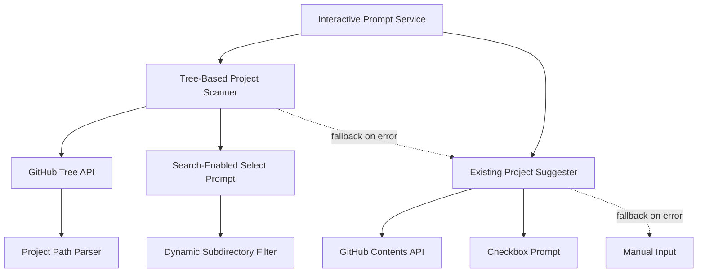
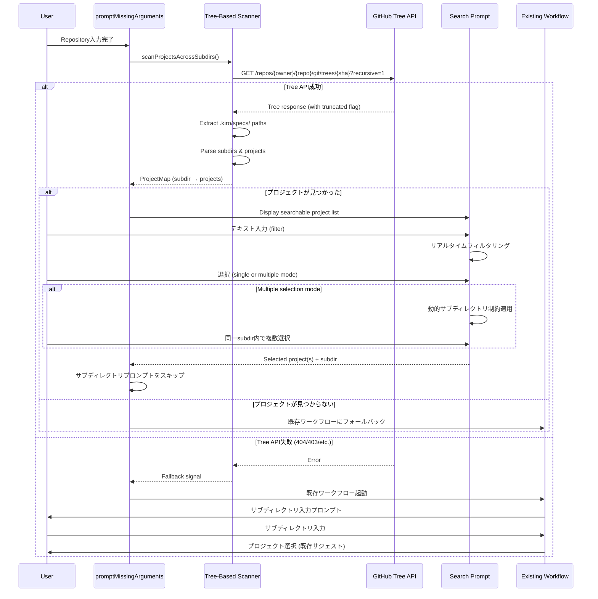
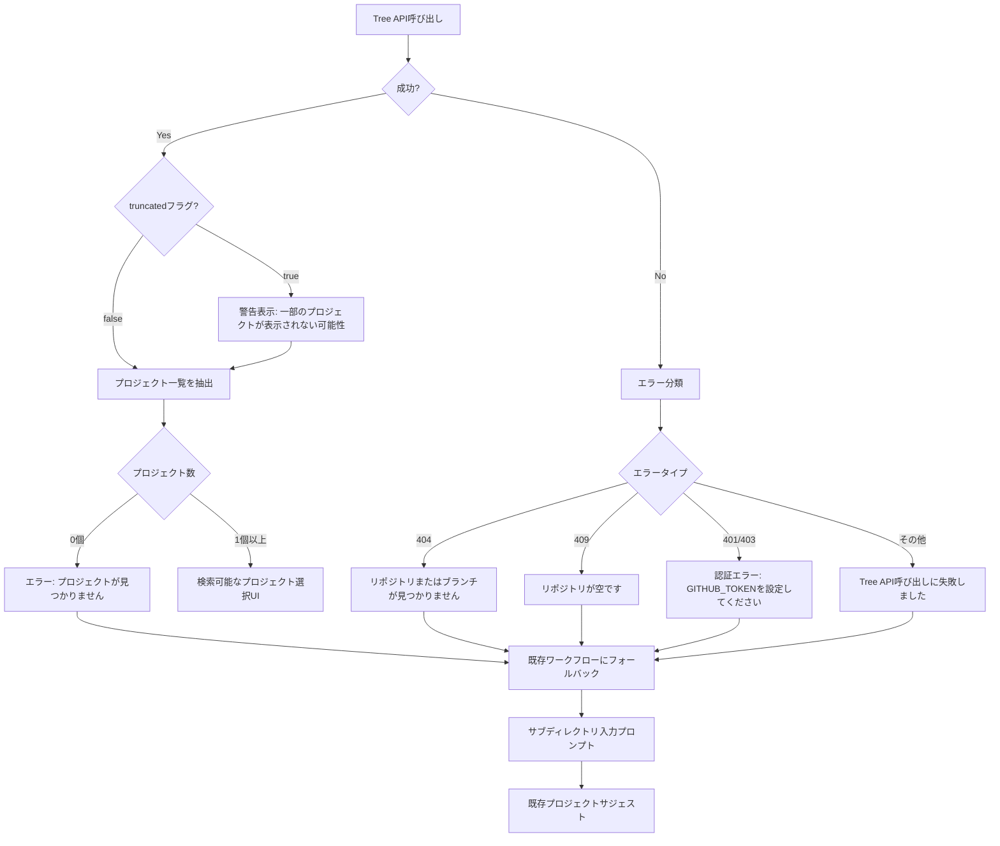
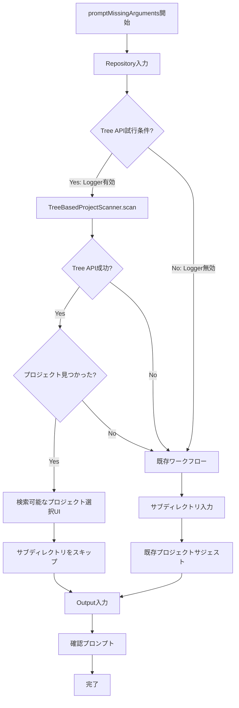

# 技術設計ドキュメント

## 概要

本機能は、Kirox CLIのインタラクティブモードにおけるプロジェクト選択UXを大幅に向上させる機能です。現在の`kirox-suggest-project`は、ユーザーが「Repository → Subdirectory → Project」の順に入力する必要がありますが、本機能により **GitHub Tree APIを使用してリポジトリ全体を横断的に検索**し、すべてのサブディレクトリ配下のプロジェクトを自動検出・一覧表示することで、**サブディレクトリ入力ステップを完全に省略**できます。

**目的**: モノレポ構造を持つリポジトリでも、ユーザーがサブディレクトリパスを覚える必要をなくし、プロジェクト選択だけに集中できるようにする

**ユーザー**: Kirox CLIのインタラクティブモードを使用するすべてのユーザー（特にモノレポを扱う開発者）が、リポジトリ入力後のプロジェクト選択フローで利用します。

**影響**: 既存の`kirox-suggest-project`機能を拡張し、サブディレクトリ入力プロンプトを条件付きでスキップする新しいワークフローを追加します。既存の非インタラクティブモードとの完全な互換性を維持します。

### ゴール

- GitHub Tree APIによる横断的プロジェクト検出（`.kiro/specs/`をリポジトリ全体から検索）
- サブディレクトリパスと統合した構造化表示（`lib/a/project-x`形式）
- リアルタイム検索フィルタリング機能（テキスト入力による絞り込み）
- 同一サブディレクトリ内の複数プロジェクト選択（動的制約付き）
- API失敗時の既存ワークフローへのシームレスなフォールバック

### 非ゴール

- プロジェクト一覧のキャッシング（毎回GitHub APIから最新データを取得）
- `.kiro/specs/`以外のディレクトリからのプロジェクト検索
- プロジェクトのメタデータ表示（spec.jsonの内容など）
- 異なるサブディレクトリのプロジェクトを同時に選択する機能

## アーキテクチャ

### 既存アーキテクチャの分析

Kirox CLIは4層アーキテクチャを採用しており、本機能は以下の既存パターンを尊重します：

- **CLI層の責務**: `src/cli/interactive-prompt.ts`がユーザー対話を統括
- **GitHub層の独立性**: `src/github/fetcher.ts`がAPI通信を担当し、CLI層から依存注入される
- **レイヤー間の単方向依存**: CLI → GitHub、レポーティング層は横断的に利用
- **既存のプロンプトパターン**: `@inquirer/prompts`を使用した対話的入力

**既存の`kirox-suggest-project`との統合**:
- `promptProject`関数を拡張（新しい関数を作成せず、既存関数内部で分岐）
- `suggestProjects`関数をサブディレクトリ指定時のサジェスト機能として維持
- 新しい`suggestProjectsAcrossSubdirs`関数をTree API横断検索用に追加

### ハイレベルアーキテクチャ



**統合ポイント**:
- `promptMissingArguments`関数内で、Tree API検索を最初に試行
- Tree API成功 → サブディレクトリプロンプトをスキップ → 検索可能なプロジェクト選択UI
- Tree API失敗 → 既存ワークフロー（サブディレクトリプロンプト → 既存プロジェクトサジェスト）

### 技術整合性

本機能は既存の技術スタックと完全に整合しており、新しい外部依存を追加しません：

**既存技術の再利用**:
- **Octokit (v5.x)**: GitHub APIとの通信（新しくTree APIエンドポイントを追加）
- **@inquirer/prompts**: `search`プロンプトを新規追加（既存の`select`, `checkbox`に加えて）
- **TypeScript 5.x**: 既存の型安全性パターンを継承

**新規導入ライブラリ**: なし

**アーキテクチャパターン**: 既存の4層アーキテクチャを維持し、CLI層とGitHub層の責任分離を尊重

### 主要設計決定

#### 決定1: Tree APIベースの横断検索アプローチ

**決定**: GitHub Tree API (`GET /repos/{owner}/{repo}/git/trees/{tree_sha}?recursive=1`) を使用してリポジトリ全体を一度に検索

**コンテキスト**: モノレポ構造では`.kiro/specs/`が複数のサブディレクトリに分散しており、ユーザーがサブディレクトリパスを覚えるのは困難

**代替案**:
1. **Contents APIで段階的検索**: 一般的なサブディレクトリパターン（`lib/`, `packages/`）を順次検索
2. **設定ファイルでサブディレクトリリスト管理**: `.kiroxrc.json`にサブディレクトリを事前定義
3. **Tree API再帰検索**: リポジトリ全体を1回のAPI呼び出しで取得（選択）

**選択したアプローチ**: Tree API再帰検索

**根拠**:
- **自動検出**: ユーザーがサブディレクトリ構造を事前に知る必要がない
- **効率的**: 1回のAPI呼び出しで完結（Contents APIの場合は複数回必要）
- **100,000エントリまで対応**: GitHub APIの制限内で大規模リポジトリにも対応可能
- **7MB上限**: `truncated`フラグで切り詰めを検出し、警告を表示

**トレードオフ**:
- **得られるもの**: ユーザーの認知負荷削減、モノレポ対応、1回のAPI呼び出し
- **失うもの**: 超大規模リポジトリ（100,000エントリ超）では一部プロジェクトが表示されない可能性（警告で明示）

#### 決定2: 検索可能なプロジェクト選択UIの設計

**決定**: `@inquirer/prompts`の`search`プロンプトを使用し、リアルタイムフィルタリングと選択を統合

**コンテキスト**: プロジェクト数が多い場合、目的のプロジェクトを素早く見つけるためのフィルタリング機能が必要

**代替案**:
1. **selectプロンプト + 外部フィルタリング**: 選択肢を事前にフィルタリングしてからselectを表示
2. **inquirer-autocomplete-prompt**: 外部プラグインを使用
3. **@inquirer/prompts の search**: 組み込みの検索プロンプトを使用（選択）

**選択したアプローチ**: `@inquirer/prompts`の`search`プロンプト

**根拠**:
- **既存依存**: 新しい依存関係を追加せず、既存の`@inquirer/prompts`で実現
- **リアルタイムフィルタリング**: ユーザー入力に応じて即座に選択肢をフィルタリング
- **TypeScript完全サポート**: 型安全性を維持
- **メンテナンス**: 公式パッケージのため、長期的なサポートが期待できる

**トレードオフ**:
- **得られるもの**: 依存関係の最小化、型安全性、公式サポート
- **失うもの**: プラグイン特有の高度なカスタマイズ機能（現時点では不要）

#### 決定3: 複数選択時の同一サブディレクトリ制約

**決定**: ユーザーが最初のプロジェクトを選択した時点で、異なるサブディレクトリのプロジェクトを非表示にする動的フィルタリング

**コンテキスト**: 異なるサブディレクトリのプロジェクトを同時選択すると、実装が複雑化し、ユーザーが意図しない組み合わせを選択するリスクがある

**代替案**:
1. **異なるサブディレクトリも選択可能**: 実装複雑化、実行時に各プロジェクトを個別処理
2. **同一サブディレクトリのみ選択可能（動的フィルタリング）**: 選択後に選択肢を絞り込み（選択）
3. **事前質問**: 「複数選択しますか？同じサブディレクトリ内ですか？」と聞く

**選択したアプローチ**: 同一サブディレクトリのみ選択可能（動的フィルタリング）

**根拠**:
- **意図しない組み合わせ防止**: ユーザーエラーを減らす
- **実装の簡素化**: サブディレクトリパスが1つに確定するため、後続処理がシンプル
- **UX向上**: 事前質問を避け、選択操作だけでフローを完結

**トレードオフ**:
- **得られるもの**: ユーザーエラー削減、実装のシンプルさ、明確なUX
- **失うもの**: 異なるサブディレクトリのプロジェクトを一度に取得する柔軟性（ユースケースが限定的）

## システムフロー

### プロジェクト選択フロー（Tree API統合版）



### エラーハンドリングフロー



## 要件トレーサビリティ

| 要件ID | 要件概要 | コンポーネント | インターフェース | フロー |
|--------|----------|----------------|------------------|--------|
| 1.1-1.6 | GitHub Tree APIによる横断的検索 | TreeBasedProjectScanner | scanProjectsAcrossSubdirs() | シーケンス図 |
| 2.1-2.8 | 構造化表示と検索機能 | SearchableProjectPrompt | promptWithSearch() | シーケンス図 |
| 3.1-3.4 | サブディレクトリプロンプトスキップ | promptMissingArguments | 統合ロジック | シーケンス図 |
| 4.1-4.8 | 複数選択（同一subdir制約） | DynamicSubdirFilter | filterBySubdir() | シーケンス図 |
| 5.1-5.6 | エラーハンドリング | TreeBasedProjectScanner | handleTreeAPIError() | エラーフロー図 |
| 6.1-6.4 | 既存機能との互換性 | promptMissingArguments | 条件分岐ロジック | - |
| 7.1-7.4 | パフォーマンスとフィードバック | LoadingMessageService | showLoadingMessage() | シーケンス図 |
| 8.1-8.4 | Tree APIレスポンス効率化 | TreeResponseParser | parseTreeResponse() | - |

## コンポーネントとインターフェース

### CLI層

#### TreeBasedProjectScanner（新規作成）

**責任と境界**
- **主要責任**: GitHub Tree APIを使用してリポジトリ全体から`.kiro/specs/`配下のプロジェクトを検出
- **ドメイン境界**: GitHub APIとの通信層（`src/github/`）とCLI対話層（`src/cli/`）の橋渡し
- **データ所有権**: プロジェクトマップ（サブディレクトリ → プロジェクト名の配列）
- **トランザクション境界**: 単一のTree API呼び出し

**依存関係**
- **インバウンド**: `promptMissingArguments`から呼び出される
- **アウトバウンド**:
  - `client.rest.git.getTree()` (Octokit GitHub Tree API)
  - `Logger` (レポーティング層)
- **外部依存**: `octokit` (既存依存)

**外部依存調査**:
GitHub Tree APIについて調査済み：
- **エンドポイント**: `GET /repos/{owner}/{repo}/git/trees/{tree_sha}?recursive=1`
- **レスポンス制限**: 最大100,000エントリ、7MB上限
- **truncatedフラグ**: レスポンスが切り詰められた場合にtrueを返す
- **認証**: GITHUB_TOKENが必要（プライベートリポジトリの場合）
- **レート制限**: 既存のOctokit設定により自動的に処理

**サービスインターフェース**

```typescript
/**
 * Project location information
 */
interface ProjectLocation {
  /** Project name */
  name: string;
  /** Subdirectory path (empty string for root) */
  subdir: string;
  /** Display name (subdir/name or name for root) */
  displayName: string;
}

/**
 * Tree scan result
 */
interface TreeScanResult {
  /** List of project locations */
  projects: ProjectLocation[];
  /** Whether scan was successful */
  success: boolean;
  /** Whether response was truncated (partial results) */
  truncated: boolean;
  /** Error message if failed */
  errorMessage?: string;
}

/**
 * Tree scan options
 */
interface TreeScanOptions {
  /** Repository reference */
  repository: RepositoryRef;
  /** GitHub client */
  client: Octokit;
  /** Logger instance */
  logger: Logger;
  /** Enable verbose logging */
  verbose: boolean;
}

/**
 * Tree-Based Project Scanner
 *
 * Scans entire repository using GitHub Tree API to detect all projects
 * across subdirectories.
 */
interface TreeBasedProjectScanner {
  /**
   * Scan repository for all projects using Tree API
   *
   * @param options - Scan options
   * @returns Tree scan result with project locations
   */
  scanProjectsAcrossSubdirs(options: TreeScanOptions): Promise<TreeScanResult>;
}
```

**事前条件**:
- GitHubクライアントが初期化済み
- リポジトリ参照が有効な形式

**事後条件**:
- 成功時: プロジェクト一覧（0個以上）が返される
- 失敗時: `success: false`とエラーメッセージが返される

**不変条件**:
- プロジェクト名は空文字列を含まない
- サブディレクトリパスは末尾の`/`を含まない

**状態管理**
- **状態モデル**: ステートレス（各呼び出しで完結）
- **永続化**: なし（Tree APIレスポンスを一時的にメモリに保持）

#### SearchableProjectPrompt（新規作成）

**責任と境界**
- **主要責任**: 検索可能なプロジェクト選択UIを提供し、ユーザー選択を取得
- **ドメイン境界**: ユーザーとの対話インターフェース
- **データ所有権**: 選択されたプロジェクト情報（プロジェクト名 + サブディレクトリ）
- **トランザクション境界**: 単一のプロジェクト選択フロー

**依存関係**
- **インバウンド**: `promptMissingArguments`から呼び出される
- **アウトバウンド**:
  - `search` (@inquirer/prompts)
  - `checkbox` (@inquirer/prompts)
- **外部依存**: `@inquirer/prompts` (既存依存)

**外部依存調査**:
`@inquirer/prompts`の`search`プロンプトについて調査済み：
- **パッケージバージョン**: 既存の`@inquirer/prompts@7.8.6`に含まれる
- **機能**: リアルタイムフィルタリング、選択、TypeScript型定義完全サポート
- **source関数**: ユーザー入力に応じて選択肢を動的に生成する関数を提供
- **validate関数**: 選択値のバリデーション
- **大文字小文字**: フィルタリングロジックで`.toLowerCase()`を使用して大文字小文字を区別しない検索を実装

**サービスインターフェース**

```typescript
/**
 * Project selection result
 */
interface ProjectSelectionResult {
  /** Selected project names */
  projects: string[];
  /** Subdirectory path (common to all selected projects) */
  subdir: string;
}

/**
 * Searchable Project Prompt Service
 *
 * Provides search-enabled project selection UI
 */
interface SearchableProjectPrompt {
  /**
   * Prompt user to select project(s) with search functionality
   *
   * @param projectLocations - Available project locations
   * @returns Selected project(s) with subdirectory
   */
  promptWithSearch(
    projectLocations: ProjectLocation[]
  ): Promise<ProjectSelectionResult>;
}
```

**事前条件**:
- プロジェクト一覧が1つ以上存在する
- TTY環境で実行中

**事後条件**:
- 成功時: 1つ以上のプロジェクト名とサブディレクトリパスが返される
- ユーザーキャンセル時: ExitPromptErrorを投げる

**不変条件**:
- 選択されたプロジェクトは同じサブディレクトリに属する
- プロジェクト名は空文字列を含まない

**状態管理**
- **状態モデル**: ステートフル（選択状態を保持）
- **永続化**: なし（選択完了後は破棄）

#### promptMissingArguments関数（拡張）

**統合戦略**
- **変更アプローチ**: 既存のワークフローを維持しつつ、Tree API検索を最初に試行する分岐を追加
- **後方互換性**:
  - 関数シグネチャは変更なし
  - Tree API失敗時は既存のワークフロー（サブディレクトリプロンプト → 既存プロジェクトサジェスト）にフォールバック
  - 非インタラクティブモードは影響を受けない

**拡張後のフロー**



### GitHub層

#### GitHub Tree APIクライアント（Octokit既存機能を使用）

**既存実装の活用**
- **再利用戦略**: Octokitの`client.rest.git.getTree()`をそのまま使用
- **変更不要**: Tree APIは既存のOctokitクライアントで利用可能
- **Tree SHAの取得**: `client.rest.repos.getBranch()`または`client.rest.repos.get()`を使用

**使用例**:

```typescript
// デフォルトブランチのTree SHA取得
const repoInfo = await client.rest.repos.get({
  owner,
  repo,
});
const defaultBranch = repoInfo.data.default_branch;
const branchInfo = await client.rest.repos.getBranch({
  owner,
  repo,
  branch: defaultBranch,
});
const treeSha = branchInfo.data.commit.sha;

// Tree API呼び出し（再帰的）
const treeResponse = await client.rest.git.getTree({
  owner,
  repo,
  tree_sha: treeSha,
  recursive: '1', // 再帰的に全ツリーを取得
});

// レスポンス構造
interface TreeResponse {
  data: {
    sha: string;
    url: string;
    tree: Array<{
      path: string; // "lib/a/.kiro/specs/project-x"
      mode: string;
      type: 'blob' | 'tree';
      sha: string;
      size?: number;
      url: string;
    }>;
    truncated: boolean; // 切り詰められた場合はtrue
  };
}
```

**Tree APIレスポンスの処理**:

```typescript
// .kiro/specs/ を含むパスのみをフィルタリング
const kiroSpecsPaths = treeResponse.data.tree
  .filter(item => item.path.includes('.kiro/specs/'))
  .filter(item => item.type === 'tree'); // ディレクトリのみ

// プロジェクト名とサブディレクトリパスを抽出
const projectLocations = kiroSpecsPaths
  .map(item => {
    // 正規表現: (任意のパス/)?\.kiro/specs/([^/]+)
    const match = item.path.match(/^(?:(.+?)\/)?\.kiro\/specs\/([^/]+)$/);
    if (!match) return null;

    const subdir = match[1] || ''; // サブディレクトリ（ルートの場合は空文字列）
    const projectName = match[2]; // プロジェクト名

    return {
      name: projectName,
      subdir,
      displayName: subdir ? `${subdir}/${projectName}` : projectName,
    };
  })
  .filter((item): item is ProjectLocation => item !== null);
```

## データモデル

### ドメインモデル

#### ProjectLocation（バリューオブジェクト）

プロジェクトの位置情報を表す不変オブジェクト。

**属性**:
- `name: string` - プロジェクト名（`.kiro/specs/`配下のディレクトリ名）
- `subdir: string` - サブディレクトリパス（ルートの場合は空文字列）
- `displayName: string` - 表示用名前（`subdir/name`または`name`）

**ビジネスルール**:
- `name`は空文字列を含まない
- `subdir`は末尾の`/`を含まない
- ルートディレクトリの場合、`subdir`は空文字列、`displayName`は`name`のみ

#### TreeScanResult（バリューオブジェクト）

Tree API検索結果を表す不変オブジェクト。

**属性**:
- `projects: ProjectLocation[]` - プロジェクト一覧（0個以上）
- `success: boolean` - 成功フラグ
- `truncated: boolean` - 切り詰めフラグ（GitHub APIの制限）
- `errorMessage?: string` - エラーメッセージ（失敗時）

**ビジネスルール**:
- `success === true`の場合、`projects`は0個以上の要素を持つ
- `success === false`の場合、`errorMessage`が存在する
- `truncated === true`の場合、一部のプロジェクトが表示されない可能性があることを警告

### データコントラクト

#### GitHub Tree APIレスポンス

**TreeItem型**:

```typescript
interface TreeItem {
  path: string;         // ファイルパス（例: "lib/a/.kiro/specs/project-x"）
  mode: string;         // ファイルモード（例: "040000" for directory）
  type: 'blob' | 'tree'; // タイプ（blob=ファイル、tree=ディレクトリ）
  sha: string;          // Git SHA
  size?: number;        // サイズ（ディレクトリの場合は未定義）
  url: string;          // APIのURL
}

interface TreeResponse {
  sha: string;
  url: string;
  tree: TreeItem[];
  truncated: boolean;  // 切り詰められた場合はtrue
}
```

**プロジェクト一覧への変換**:

```typescript
// .kiro/specs/ を含むディレクトリのみを抽出
const projectPaths = treeResponse.tree
  .filter(item => item.type === 'tree')
  .filter(item => /\.kiro\/specs\/[^/]+$/.test(item.path));

// ProjectLocationに変換
const projectLocations = projectPaths.map(item => {
  const match = item.path.match(/^(?:(.+?)\/)?\.kiro\/specs\/([^/]+)$/);
  return {
    name: match![2],
    subdir: match![1] || '',
    displayName: match![1] ? `${match![1]}/${match![2]}` : match![2],
  };
});
```

## エラーハンドリング

### エラー戦略

Tree API検索機能は「ベストエフォート」で動作し、失敗時は常に既存のワークフロー（サブディレクトリプロンプト → 既存プロジェクトサジェスト）にフォールバックします。これにより、ユーザーの作業フローが中断されることを防ぎます。

### エラーカテゴリと対応

#### システムエラー（5xx系、ネットワークエラー）

**404エラー（Not Found）**:
- **シナリオ**: リポジトリが存在しない、またはブランチが存在しない
- **対応**:
  - エラーメッセージ: "Repository or branch not found"
  - 既存ワークフローにフォールバック
- **ログ（--verbose）**: リポジトリ、ブランチ、エラー詳細を記録

**409エラー（Conflict - Empty Repository）**:
- **シナリオ**: リポジトリが空（コミットが存在しない）
- **対応**:
  - エラーメッセージ: "Repository is empty"
  - 既存ワークフローにフォールバック
- **ログ（--verbose）**: リポジトリ情報を記録

**401/403エラー（Unauthorized/Forbidden）**:
- **シナリオ**: プライベートリポジトリへのアクセス権限がない
- **対応**:
  - エラーメッセージ: "Authentication error: Please set GITHUB_TOKEN environment variable"
  - 既存ワークフローにフォールバック
- **ログ（--verbose）**: 認証エラーの詳細を記録

**その他のエラー（ネットワークエラー、タイムアウトなど）**:
- **シナリオ**: ネットワーク接続失敗、GitHub APIのタイムアウト
- **対応**:
  - エラーメッセージ: "Failed to fetch project list using Tree API"
  - 既存ワークフローにフォールバック
- **ログ（--verbose）**: エラーの詳細（メッセージ、スタックトレース）を記録

#### ビジネスロジックエラー（422系）

**プロジェクトが存在しない**:
- **シナリオ**: Tree APIは成功したが、`.kiro/specs/`配下にプロジェクトが1つもない
- **対応**:
  - エラーメッセージ: "No projects found in .kiro/specs/"
  - 既存ワークフローにフォールバック
- **ログ（--verbose）**: Tree APIレスポンスのエントリ数を記録

**Tree APIレスポンスが切り詰められた（truncated: true）**:
- **シナリオ**: リポジトリが大きすぎて、100,000エントリを超えた
- **対応**:
  - 警告メッセージ: "Large repository: Some projects may not be displayed"
  - 取得できたプロジェクト一覧を表示（エラーではなく警告）
- **ログ（--verbose）**: `truncated`フラグとエントリ数を記録

**複数選択で0個選択**:
- **シナリオ**: checkboxプロンプトで何も選択せずにEnterを押す
- **対応**:
  - バリデーションメッセージ: "Please select at least one project"
  - checkboxプロンプトを再表示（`@inquirer/prompts`の標準動作）

### モニタリング

**エラートラッキング**:
- すべてのエラーはLogger経由で記録
- `--verbose`オプション時は詳細情報（リポジトリ、ブランチ、Tree SHA、エントリ数、エラーメッセージ）を出力

**ログ出力例**:

```typescript
// API呼び出し前
logger.info('Scanning repository for projects using Tree API', {
  repository: 'owner/repo',
  branch: 'main',
  treeSha: 'abc123...',
});

// API成功
logger.info('Successfully scanned repository', {
  projectCount: 15,
  truncated: false,
  subdirectories: ['lib/a', 'lib/b', ''],
});

// API失敗
logger.error('Failed to scan repository using Tree API', {
  error: error.message,
  statusCode: 404,
  repository: 'owner/repo',
  branch: 'main',
});
```

## テスト戦略

### 単体テスト

**TreeBasedProjectScanner** (`src/cli/tree-based-project-scanner.test.ts`):
1. **Tree API成功**: 正しくプロジェクト一覧を抽出
2. **正規表現マッチング**: `.kiro/specs/`配下のパスを正しく識別
3. **サブディレクトリパース**: ルートとサブディレクトリを区別
4. **truncatedフラグ処理**: 切り詰めフラグを正しく伝播
5. **404エラー処理**: 適切なエラーメッセージと共にフォールバック
6. **409エラー処理**: 空リポジトリエラーを正しく処理
7. **プロジェクト0件**: 空のプロジェクト一覧を正しく処理

**SearchableProjectPrompt** (`src/cli/searchable-project-prompt.test.ts`):
1. **検索フィルタリング**: テキスト入力による絞り込みが正しく動作
2. **大文字小文字**: 大文字小文字を区別しない検索
3. **単一選択**: 1つのプロジェクトを選択
4. **複数選択モード**: 複数選択モードへの切り替え
5. **動的サブディレクトリ制約**: 選択後に異なるサブディレクトリを非表示
6. **選択解除**: すべて解除時にすべてのプロジェクトを再表示

**promptMissingArguments拡張** (`src/cli/interactive-prompt.test.ts`):
1. **Tree API成功時**: サブディレクトリプロンプトをスキップ
2. **Tree API失敗時**: 既存ワークフローにフォールバック
3. **Logger未提供時**: Tree API検索をスキップし、既存ワークフローを使用
4. **非TTY環境**: Tree API機能を起動しない

### 統合テスト

**CLI → GitHub Tree API** (`tests/integration/tree-api-project-scan.test.ts`):
1. **実際のリポジトリからプロジェクト取得**: モックではなく、テスト用リポジトリから実際にTree APIでプロジェクト一覧を取得
2. **ブランチ指定でのTree API**: 特定ブランチを指定してTree API呼び出し
3. **大規模リポジトリ**: truncatedフラグが正しく処理されることを検証
4. **エラーリカバリーフロー**: 存在しないリポジトリを指定した場合のフォールバック動作を検証

### E2Eテスト

**インタラクティブモードの完全フロー** (`tests/e2e/tree-based-project-selection.test.ts`):
1. **Tree API成功フロー**: リポジトリ入力 → Tree API検索 → 検索可能なプロジェクト選択 → 確認
2. **複数選択フロー**: Tree API検索 → 複数選択モード → 同一サブディレクトリ内で複数選択 → 確認
3. **フォールバックフロー**: リポジトリ入力 → Tree API失敗 → サブディレクトリ入力 → 既存プロジェクトサジェスト → 確認

**既存機能との互換性** (`tests/e2e/backward-compatibility.test.ts`):
1. **非インタラクティブモード**: `npx kirox owner/repo -s lib/a -p project`が正常動作（Tree API機能は起動しない）
2. **既存プロジェクトサジェスト機能**: サブディレクトリ指定時の既存サジェスト機能が正常動作

## パフォーマンスとスケーラビリティ

### ターゲットメトリクス

- **Tree API呼び出し時間**: 通常1-2秒以内（GitHub API応答時間に依存）
- **UI応答性**: 検索フィルタリングはリアルタイム（100ms以内）
- **プロジェクト数上限**: 100,000エントリまで対応（GitHub API制限）
- **表示上限**: 検索プロンプトのpageSizeは10件（スクロール可能）

### パフォーマンス最適化

**ローディングフィードバック**:
- Tree API呼び出し前に「Scanning repository for projects...」メッセージを表示
- 5秒以上かかる場合は「Large repository detected. This may take a moment...」追加メッセージを表示
- 完了時に「Found X projects across Y subdirectories」サマリーメッセージを表示

**Tree APIレスポンスの効率的な処理**:
- `.kiro/specs/`を含むパスのみを早期にフィルタリング
- 正規表現を1回のパスで適用（`/^(?:(.+?)\/)?\.kiro\/specs\/([^/]+)$/`）
- 不要なファイルエントリ（`type === 'blob'`）を早期にスキップ

**キャッシングの意図的な非採用**:
- Tree APIレスポンスは毎回最新データを取得（非ゴールに明記）
- キャッシュは古いデータを表示するリスクがあり、インタラクティブモードには不適切

### スケーラビリティ考慮事項

**大量プロジェクトへの対応**:
- 検索プロンプトの`pageSize`オプションで一度に表示する数を制限（10件推奨）
- `loop: true`オプションで上下キーでの循環を許可
- リアルタイム検索により、ユーザーは目的のプロジェクトを素早く絞り込める

**GitHub APIレート制限**:
- Tree API呼び出しは1回のみ（Contents APIの複数回呼び出しと比較して効率的）
- 既存のレート制限モニタリング（Octokitの自動処理）をそのまま活用
- truncatedフラグにより、制限を超えたリポジトリを適切に処理

**超大規模リポジトリへの対応**:
- `truncated: true`の場合、警告メッセージを表示し、既存ワークフローへのフォールバックをユーザーに推奨
- `--verbose`オプションで詳細情報（エントリ数、切り詰められたエントリ数）を提供
