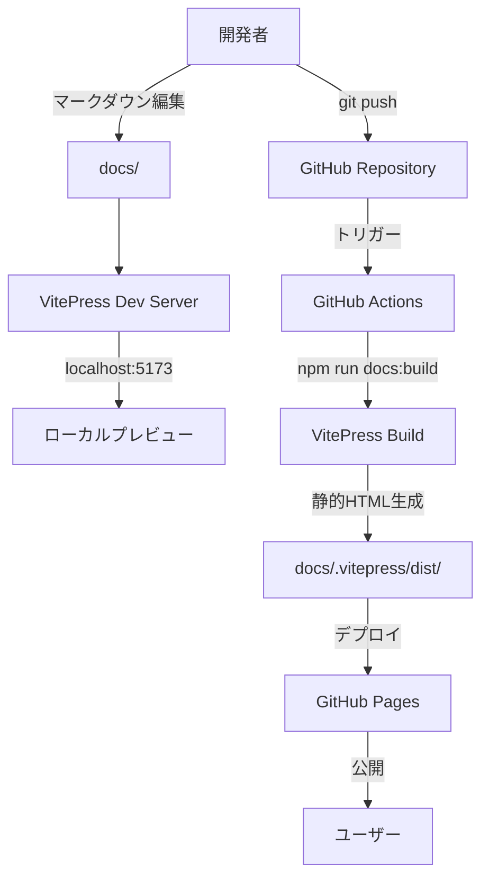
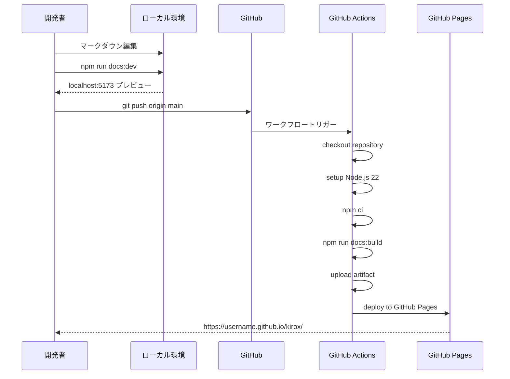

# 技術設計書

## 概要

本機能は、KiroxプロジェクトのドキュメントをVitePressを使用して作成し、GitHub Pagesにデプロイ可能な状態にするものです。VitePressは、Vue.jsをベースとした高速で軽量な静的サイトジェネレーターであり、マークダウンベースのドキュメント作成に最適化されています。

**目的**: プロジェクトのユーザーガイド、CLIリファレンス、API仕様を効果的に公開し、ユーザーと開発者がプロジェクトを理解しやすくする。

**ユーザー**: Kiroxプロジェクトの利用者、コントリビューター、ドキュメント作成者がこの機能を利用して、プロジェクト情報にアクセスおよび更新を行う。

### ゴール
- VitePressベースのドキュメントサイトを構築し、ローカル開発環境でプレビュー可能にする
- GitHub Pagesへの自動デプロイメントを実現し、ドキュメントの公開を簡素化する
- 論理的なドキュメント構造とナビゲーションを提供し、情報アクセスを最適化する
- プロジェクトブランディングに合致したテーマとデザインを適用する

### 非ゴール
- 既存のREADME.mdファイルの完全な置き換え（両者は補完的に機能する）
- API仕様の自動生成（初期リリースでは手動作成）
- 多言語対応（将来的な拡張として検討）
- ドキュメントのバージョニング機能（初期リリースでは最新版のみ提供）

## アーキテクチャ

### 既存アーキテクチャ分析

Kiroxプロジェクトは、TypeScript + Node.js 18+をベースとしたCLIツールであり、以下の既存パターンを維持する：
- **モジュールシステム**: ESM (ES Modules) を採用
- **ビルドツール**: tsup を使用した TypeScript コンパイル
- **テストフレームワーク**: Vitest を使用
- **設定ファイル形式**: TypeScript config (.ts) を優先

ドキュメント機能は既存のプロジェクト構造に以下のディレクトリを追加する：
- `docs/` - VitePressドキュメントソース
- `docs/.vitepress/` - VitePress設定とテーマカスタマイズ
- `.github/workflows/deploy-docs.yml` - GitHub Actionsデプロイワークフロー

### 高レベルアーキテクチャ



**アーキテクチャ統合**:
- 既存パターンの保持: TypeScript設定、ESM、npm scriptsパターンを維持
- 新規コンポーネントの根拠: VitePressはマークダウンベースのドキュメント生成に特化したツールであり、Vue.jsエコシステムとの親和性が高い
- 技術スタック整合性: Node.js 18+、TypeScript、Viteを活用し、既存の開発ツールチェーンと統合
- ステアリング準拠: tech.mdで定義されたNode.js 18+、TypeScript 5.x、ESMの原則に準拠

### 技術スタック

#### ドキュメント生成
- **VitePress v1.x**
  - **選定理由**: Vue.js公式推奨の静的サイトジェネレーター、マークダウンベースのドキュメント作成に最適化、高速なHMR (Hot Module Replacement)、SEO最適化された静的HTML出力
  - **代替案**: Docusaurus (React)、MkDocs (Python)、Nextra (Next.js)
  - **VitePress選定根拠**: Node.js環境との統合が容易、TypeScript完全サポート、軽量で高速、シンプルな設定

#### ビルド＆デプロイメント
- **GitHub Actions**
  - **選定理由**: GitHubネイティブCI/CD、既存のGitHubワークフロー（CI/CD）との統合、無料枠での利用可能性
  - **代替案**: Netlify、Vercel、GitLab CI/CD
- **GitHub Pages**
  - **選定理由**: 追加コストなし、GitHub Actions との統合、カスタムドメイン対応
  - **代替案**: Netlify、Vercel、AWS S3 + CloudFront

### 主要な設計決定

#### 決定1: VitePress Default Themeの採用

**決定**: VitePress公式のDefault Themeをベースとし、カスタマイズは最小限に留める。

**コンテキスト**: ドキュメントサイトのデザインとUIコンポーネントをゼロから構築するのは、開発コストとメンテナンスコストが高い。

**代替案**:
1. カスタムVueコンポーネントでゼロから構築
2. サードパーティのVitePressテーマを使用
3. Default Themeを採用し、CSS変数でブランディング調整

**選択アプローチ**: Default ThemeをベースにCSS変数（`--vp-c-brand-*`）でプライマリカラー、アクセントカラーを調整し、ロゴとファビコンをカスタマイズする。

**根拠**:
- VitePress Default Themeは、ドキュメントサイトに必要な機能（検索、ナビゲーション、ダークモード）を標準で提供
- CSS変数による調整は、テーマアップデート時の互換性リスクを最小化
- 開発者がマークダウン編集に集中でき、UIコンポーネントのメンテナンスが不要

**トレードオフ**:
- 得られるもの: 高速な初期セットアップ、公式サポート、将来的なアップデート対応
- 犠牲にするもの: 完全にカスタマイズされたUIデザイン、独自のインタラクション

#### 決定2: GitHub Actionsによる自動デプロイメント

**決定**: mainブランチへのプッシュ時にGitHub Actionsでドキュメントを自動ビルド・デプロイする。

**コンテキスト**: ドキュメント更新のたびに手動でビルド・デプロイを実行するのは、効率が悪くヒューマンエラーのリスクがある。

**代替案**:
1. 手動ビルド + 手動デプロイ（gh-pagesブランチへのプッシュ）
2. GitHub Actionsによる自動デプロイ
3. Netlify/Vercelの自動デプロイ連携

**選択アプローチ**: GitHub Actionsワークフローを`.github/workflows/deploy-docs.yml`として作成し、mainブランチへのプッシュをトリガーに自動デプロイを実行する。

**根拠**:
- GitHub Actions は既存のCI/CDワークフロー（kirox-github-workflow仕様）と統合可能
- GitHub Pages との連携がネイティブサポート
- 追加のサードパーティサービス不要、コスト削減

**トレードオフ**:
- 得られるもの: 完全自動化、一貫性のあるビルド環境、GitHub Actionsの無料枠利用
- 犠牲にするもの: Netlify/Vercelの高度なプレビュー機能、エッジデプロイメント最適化

#### 決定3: マークダウンファイルベースのドキュメント構造

**決定**: ドキュメントは全てマークダウンファイル（.md）で管理し、ファイルシステム構造がそのままURLルーティングに対応する。

**コンテキスト**: ドキュメントの保守性と編集の容易さを確保する必要がある。

**代替案**:
1. VueコンポーネントベースのページDSL
2. マークダウン + フロントマター（メタデータ）
3. ヘッドレスCMS連携

**選択アプローチ**: `docs/` ディレクトリ配下にマークダウンファイルを配置し、フロントマター（frontmatter）でページメタデータを管理する。

**根拠**:
- マークダウンはGit管理に適しており、差分レビューが容易
- フロントマターでタイトル、説明、レイアウトを柔軟に設定可能
- VitePressのファイルベースルーティングにより、URL構造が直感的

**トレードオフ**:
- 得られるもの: シンプルな編集ワークフロー、Git履歴管理、コラボレーション容易性
- 犠牲にするもの: 動的コンテンツ生成、CMSベースのGUI編集体験

## システムフロー

### ドキュメント作成・公開フロー



## 要件トレーサビリティ

| 要件 | 要件概要 | コンポーネント | インターフェース | フロー |
|------|----------|---------------|-----------------|--------|
| 1.1 | npm run docs:dev でプレビュー | VitePress Dev Server | package.json scripts | ドキュメント作成フロー |
| 1.2 | .vitepress/config.ts 設定 | VitePress Config | config.ts | - |
| 1.3 | docs/ ディレクトリ構造 | Documentation Structure | ファイルシステム | - |
| 2.1-2.5 | ドキュメント構造設計 | Markdown Files, Sidebar Config | config.ts themeConfig.sidebar | - |
| 3.1-3.5 | テーマ・デザイン | VitePress Theme | CSS Variables, config.ts | - |
| 4.1-4.5 | コンテンツ作成支援 | VitePress Features | Frontmatter, Custom Containers | - |
| 5.1-5.5 | ビルド・デプロイ | GitHub Actions, GitHub Pages | deploy-docs.yml | ドキュメント作成・公開フロー |
| 6.1-6.5 | 継続的ドキュメント更新 | Documentation Process | Git Workflow, CI/CD | ドキュメント作成・公開フロー |

## コンポーネントとインターフェース

### ドキュメント管理層

#### VitePress設定コンポーネント

**責任と境界**
- **主要責任**: VitePressサイトの全体設定、テーマカスタマイズ、ナビゲーション構造の定義
- **ドメイン境界**: ドキュメント生成・レンダリング層
- **データ所有権**: サイトメタデータ（title、description）、ナビゲーション構造、テーマ設定
- **トランザクション境界**: ビルド時の静的サイト生成プロセス

**依存関係**
- **インバウンド**: VitePress CLIツール（開発サーバー、ビルドコマンド）
- **アウトバウンド**: マークダウンファイル（docs/配下）、カスタムVueコンポーネント（必要に応じて）
- **外部**: VitePress npm パッケージ（v1.x）

**外部依存関係の調査結果**:
- **VitePress バージョン**: 1.x系（最新安定版を使用）
- **主要API**: `defineConfig` 関数でTypeScript型安全な設定を提供
- **設定オプション**: `title`, `description`, `base`, `themeConfig`, `markdown`, `vite` など
- **互換性**: Node.js 18+ 必須、Vue 3ベース
- **制限事項**: base pathは開始・終了共に `/` が必須

**サービスインターフェース**

```typescript
// docs/.vitepress/config.ts
interface SiteConfig {
  title: string;
  description: string;
  base: string;
  lang: string;
  head: HeadConfig[];
  themeConfig: DefaultTheme.Config;
  markdown: MarkdownOptions;
  vite: ViteConfig;
}

interface DefaultTheme.Config {
  logo: string;
  nav: NavItem[];
  sidebar: SidebarConfig;
  socialLinks: SocialLink[];
  footer: FooterConfig;
  search: SearchOptions;
}

interface MarkdownOptions {
  lineNumbers: boolean;
  anchor: AnchorOptions;
  toc: TocOptions;
}
```

**前提条件**: VitePressがnpm依存関係としてインストールされている
**事後条件**: 設定ファイルが正常にロードされ、開発サーバーまたはビルドプロセスが実行可能
**不変条件**: `base` 設定は常に `/` で開始・終了する

#### ドキュメントコンテンツ構造

**責任と境界**
- **主要責任**: マークダウンファイルの論理的な配置、ナビゲーション階層の定義、コンテンツの整理
- **ドメイン境界**: ドキュメントコンテンツ管理層
- **データ所有権**: マークダウンファイル、フロントマター（メタデータ）、画像・アセットファイル

**依存関係**
- **インバウンド**: VitePress設定、ビルドプロセス
- **アウトバウンド**: なし（リーフコンポーネント）
- **外部**: なし

**ディレクトリ構造設計**:
```
docs/
├── index.md                    # トップページ（ホーム）
├── guide/
│   ├── index.md               # ガイド概要
│   ├── getting-started.md     # インストール・初期設定
│   ├── basic-usage.md         # 基本的な使い方
│   ├── advanced-usage.md      # 高度な使い方
│   └── troubleshooting.md     # トラブルシューティング
├── cli/
│   ├── index.md               # CLIリファレンス概要
│   ├── kirox.md               # kiroxコマンド
│   ├── add.md                 # addサブコマンド
│   └── completion.md          # completionサブコマンド
├── api/
│   ├── index.md               # API仕様概要
│   ├── github-fetcher.md      # GitHub Fetcher API
│   └── filesystem-writer.md   # FileSystem Writer API
├── config/
│   ├── index.md               # 設定ガイド
│   └── kiroxrc.md             # .kiroxrc.json設定リファレンス
└── .vitepress/
    ├── config.ts              # VitePress設定
    └── theme/
        └── custom.css         # カスタムスタイル（必要に応じて）
```

**フロントマター設計**:
```yaml
---
title: ページタイトル
description: ページ説明
layout: doc
outline: deep
---
```

### デプロイメント層

#### GitHub Actions ワークフロー

**責任と境界**
- **主要責任**: ドキュメントの自動ビルド、GitHub Pagesへのデプロイ、ビルド成果物の管理
- **ドメイン境界**: CI/CDパイプライン層
- **データ所有権**: ビルド成果物（静的HTML/CSS/JS）、デプロイメント履歴

**依存関係**
- **インバウンド**: GitHubリポジトリ（mainブランチへのpush）
- **アウトバウンド**: GitHub Pages、VitePressビルドコマンド
- **外部**: GitHub Actions、actions/checkout、actions/setup-node、actions/deploy-pages

**外部依存関係の調査結果**:
- **actions/checkout@v4**: リポジトリチェックアウト、`fetch-depth: 0` で全履歴取得（lastUpdated機能用）
- **actions/setup-node@v4**: Node.js 22セットアップ、npm cacheサポート
- **actions/configure-pages@v5**: GitHub Pages設定の自動構成
- **actions/upload-pages-artifact@v3**: ビルド成果物のアップロード
- **actions/deploy-pages@v4**: GitHub Pagesへのデプロイ実行
- **認証**: GitHub token (`GITHUB_TOKEN`) は自動提供、追加設定不要
- **権限**: `contents: read`, `pages: write`, `id-token: write` が必須
- **制限事項**: GitHub Pages の容量制限（1GBまで）、デプロイ頻度制限（1時間あたり10回まで推奨）

**バッチ/ジョブ契約**

```yaml
# .github/workflows/deploy-docs.yml
name: Deploy VitePress Docs to GitHub Pages

on:
  push:
    branches: [main]
  workflow_dispatch:

permissions:
  contents: read
  pages: write
  id-token: write

jobs:
  build:
    runs-on: ubuntu-latest
    steps:
      - uses: actions/checkout@v4
        with:
          fetch-depth: 0
      - uses: actions/setup-node@v4
        with:
          node-version: 22
          cache: npm
      - run: npm ci
      - run: npm run docs:build
      - uses: actions/upload-pages-artifact@v3
        with:
          path: docs/.vitepress/dist

  deploy:
    needs: build
    runs-on: ubuntu-latest
    environment:
      name: github-pages
      url: ${{ steps.deployment.outputs.page_url }}
    steps:
      - uses: actions/deploy-pages@v4
        id: deployment
```

**トリガー**: mainブランチへのpush、または手動実行（workflow_dispatch）
**入力**: Gitリポジトリのソースコード、マークダウンファイル
**出力**: GitHub Pagesデプロイ済み静的サイト（https://&lt;username&gt;.github.io/kirox/）
**冪等性**: 同一コミットの再ビルドは同一の静的サイトを生成
**リカバリー**: ビルド失敗時はGitHub Actionsがエラーログを記録、デプロイは実行されない

## データモデル

### ドキュメントメタデータモデル

VitePressは、各マークダウンファイルのフロントマター（YAML形式）でページレベルのメタデータを管理する。

**エンティティ**: ドキュメントページ

**属性**:
- `title`: ページタイトル（文字列、省略時はファイル名から自動生成）
- `description`: ページ説明（文字列、SEOメタタグに使用）
- `layout`: レイアウト種別（`doc` | `home` | `page`、デフォルト: `doc`）
- `outline`: アウトライン表示深度（`deep` | `[2, 3]`、デフォルト: `[2, 3]`）
- `lastUpdated`: 最終更新日時の表示（boolean、デフォルト: false）

**制約**:
- titleは255文字以内を推奨（ブラウザタブ表示の制約）
- descriptionは160文字以内を推奨（検索エンジン表示の制約）

**参照整合性**: フロントマターはVitePress設定の`themeConfig`と連携して動作

### ナビゲーション構造モデル

VitePress設定ファイル（`.vitepress/config.ts`）でサイト全体のナビゲーション構造を定義する。

**論理データモデル**:

**NavItem（ナビゲーションアイテム）**:
- `text`: 表示テキスト（文字列）
- `link`: リンク先URL（文字列、相対パスまたは絶対パス）
- `activeMatch`: アクティブ状態の判定正規表現（文字列、省略可）

**SidebarConfig（サイドバー設定）**:
- キー: パスパターン（文字列、例: `/guide/`）
- 値: SidebarItem配列

**SidebarItem（サイドバーアイテム）**:
- `text`: 表示テキスト（文字列）
- `link`: リンク先URL（文字列、省略可）
- `items`: 子アイテム配列（SidebarItem[]、省略可）
- `collapsed`: 初期折りたたみ状態（boolean、デフォルト: false）

**整合性制約**:
- `link`で指定されたパスに対応するマークダウンファイルが存在すること
- サイドバーの階層は3階層まで推奨（深すぎる階層はUX低下）

## エラーハンドリング

### エラー戦略

VitePressドキュメント生成プロセスにおけるエラーは、ビルド時エラーとランタイムエラーに分類される。ビルド時エラーはCI/CDパイプラインで検出され、デプロイ前にブロックされる。ランタイムエラーはユーザーアクセス時に発生し、適切なエラーページで案内される。

### エラーカテゴリと対応

**ビルド時エラー（開発者起因）**:
- **設定エラー**: `.vitepress/config.ts` の構文エラー、型エラー → ビルド失敗、コンソールに詳細なエラーメッセージ表示
- **マークダウン構文エラー**: フロントマターのYAML構文エラー → ビルド失敗、該当ファイルとエラー箇所を表示
- **リンク切れ**: 存在しないマークダウンファイルへのリンク → ビルド警告（デプロイは継続）、警告ログに該当箇所を記録

**デプロイメントエラー（インフラ起因）**:
- **GitHub Actions失敗**: npm ciエラー、ビルドコマンド失敗 → GitHub Actionsジョブ失敗、メール通知、再実行可能
- **GitHub Pages容量超過**: 1GBを超える成果物 → デプロイ失敗、GitHub側でエラーメッセージ表示、アセット最適化が必要
- **権限エラー**: GitHub token権限不足 → デプロイ失敗、リポジトリ設定でPages権限を確認

**ユーザーアクセスエラー（ランタイム）**:
- **404 Not Found**: 存在しないページへのアクセス → VitePressデフォルトの404ページ表示、トップページへのリンク提供
- **JavaScript無効**: VitePressのクライアントサイド機能が動作しない → 基本的なHTMLコンテンツは表示可能、検索機能は無効化

### モニタリング

**ビルドモニタリング**:
- GitHub Actionsの実行履歴でビルド成功・失敗を確認
- ビルド時間の監視（ベースライン: 3分以内）
- ビルド成果物サイズの監視（警告: 500MB超過、制限: 1GB）

**デプロイメントモニタリング**:
- GitHub Pagesデプロイメント履歴の確認
- デプロイ成功後の自動疎通確認（GitHub Actionsで`curl`コマンド実行）

**品質モニタリング**:
- リンク切れ検出（`npm run docs:check-links`スクリプトを追加予定）
- マークダウンフォーマットチェック（Prettier統合）

## テスト戦略

### 単体テスト
本機能はVitePressの設定とマークダウンファイルが中心であり、従来のTypeScript単体テストは対象外。代わりに以下を実施：
- VitePress設定ファイル（`.vitepress/config.ts`）の型チェック（`npm run type-check`）
- マークダウンフォーマットの検証（Prettierによる自動フォーマット）

### 統合テスト
- **ローカルビルドテスト**: `npm run docs:build` が正常に完了し、`docs/.vitepress/dist/` に静的ファイルが生成されることを確認
- **リンク検証テスト**: VitePressのビルド警告ログを確認し、壊れたリンクがないことを検証
- **ナビゲーション整合性テスト**: サイドバー設定とマークダウンファイルの対応を手動確認

### E2Eテスト
- **ローカルプレビューテスト**: `npm run docs:dev` でローカルサーバーを起動し、主要ページ（トップページ、ガイド、CLIリファレンス、API仕様）が正しく表示されることを手動確認
- **デプロイ後の疎通テスト**: GitHub Pages URLにアクセスし、トップページ、検索機能、ナビゲーションリンクが正常に動作することを確認
- **ダークモード切り替えテスト**: ライト/ダークテーマの切り替えが正常に機能することを確認

### パフォーマンステスト
- **ビルド時間**: ドキュメントページ数が50ページ以下の場合、ビルド時間が3分以内であることを確認
- **ページロード速度**: Lighthouse スコアでPerformance 90以上を目標（GitHub Pagesデプロイ後に測定）

## セキュリティ考慮事項

### 脅威モデリング

**脅威1: 悪意のあるマークダウンインジェクション**
- **リスク**: コントリビューターが悪意のあるHTMLタグやスクリプトをマークダウンに埋め込む
- **対策**: VitePressはデフォルトでHTMLタグのサニタイゼーションを実施（Vue 3のXSS保護）、プルリクエストレビューで手動確認

**脅威2: GitHub token の漏洩**
- **リスク**: GitHub Actionsで使用される`GITHUB_TOKEN`が漏洩し、リポジトリへの不正アクセスが発生
- **対策**: `GITHUB_TOKEN`はGitHub Actionsが自動生成し、ジョブ完了後に無効化、シークレットとして保管され環境変数経由でのみアクセス可能

**脅威3: 依存関係の脆弱性**
- **リスク**: VitePressやその依存パッケージに既知の脆弱性が存在
- **対策**: Dependabotによる自動脆弱性検出、定期的な依存関係アップデート、`npm audit`の実行

### セキュリティコントロール

**アクセス制御**:
- GitHub Pagesは公開ドキュメントのため、認証・認可は不要
- プライベートドキュメントが必要な場合は、GitHub Pagesではなく認証付きホスティング（Netlify Password Protection等）を検討

**データ保護**:
- ドキュメントには機密情報（APIキー、認証情報）を含めない
- プルリクエストレビューで機密情報の混入を確認

### コンプライアンス

- オープンソースプロジェクトのドキュメントであり、GDPRやPCI DSS等のコンプライアンス要件は該当しない
- ライセンス情報（MIT License）をドキュメントフッターに明記

## パフォーマンスとスケーラビリティ

### ターゲットメトリクス

**ビルドパフォーマンス**:
- ドキュメントページ数50ページ以下: ビルド時間3分以内
- ドキュメントページ数100ページ以下: ビルド時間5分以内

**ページロードパフォーマンス**:
- Lighthouse Performance スコア: 90以上
- First Contentful Paint (FCP): 1.5秒以内
- Largest Contentful Paint (LCP): 2.5秒以内

### スケーリングアプローチ

**水平スケーリング**:
- VitePressは静的サイトジェネレーターのため、ビルド成果物はCDN（GitHub Pages、Netlify、Cloudflare Pages等）で配信可能
- ページ数の増加に対しては、ビルド時間の増加を許容（100ページまでは実用的）

**キャッシング戦略**:
- VitePressはビルド時に`Cache-Control`ヘッダーを自動設定（静的アセットは1年間キャッシュ）
- GitHub PagesのCDNキャッシュを活用
- ブラウザキャッシュによるリピート訪問のパフォーマンス向上

### 最適化手法

**画像最適化**:
- マークダウンで使用する画像は事前に圧縮（WebP形式推奨）
- 画像ファイルサイズは500KB以下を推奨

**コード分割**:
- VitePressは自動的にページごとのJavaScriptチャンクを生成
- 初回ロード時は必要最小限のJavaScriptのみ読み込み

**検索インデックス最適化**:
- VitePressのローカル検索機能は、全ページのインデックスをビルド時に生成
- ページ数が200を超える場合は、Algolia DocSearchへの移行を検討
