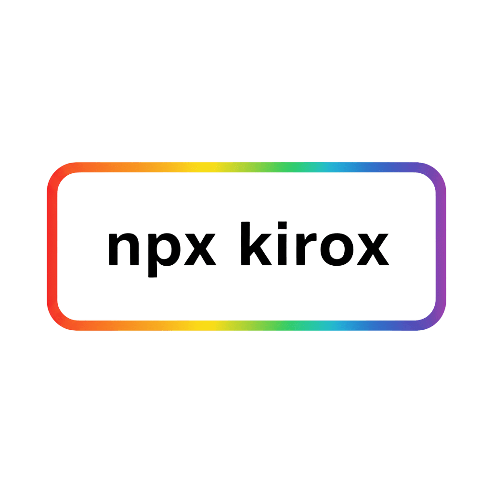

# Kirox (♻️ Recycle `.kiro` CLI)

<p align="center">
	
</p>
<h1 align="center" class="kirox-logo-text">Kirox</h1>

<style>
.kirox-logo-text {
  font-family: sans-serif;
  font-size: 50px;
  font-weight: 700;

  /* 文字の背景としてグラデーションを設定 */
  background: -webkit-linear-gradient(
    90deg,
    #6A37CC 20%,
    #8544FF 60%,
    #9B6FFF 100%
  );

  /* 背景をテキストの形にクリップ */
  -webkit-background-clip: text;
  background-clip: text;

  /* テキスト自体を透明にして背景グラデーションを表示 */
  -webkit-text-fill-color: transparent;
  color: transparent;
}
</style>

[](https://github.com/yukihirop/kirox/actions/workflows/ci.yml)
[](https://github.com/yukihirop/kirox/actions/workflows/release.yml)

CLI tool to fetch Kiro specification and steering files from remote GitHub repositories.

> **What are `.kiro` files?**
> `.kiro` files are specification and steering documents generated by [Claude Code Spec-Driven Development (cc-sdd)](https://github.com/gotalab/cc-sdd), a tool that helps structure AI-assisted development workflows using Claude Code slash commands and agents.

## Features

- 💬 **Interactive Mode** - Guided prompts with smart branch/project discovery and searchable UI
- 🎯 **Steering Mode** - Fetch only steering documents without project specs (`--steering`)
- ➕ **Add Command** - Incrementally add new projects without re-fetching everything
- 🔧 **Shell Completion** - Tab completion for bash, zsh, fish, PowerShell, and Elvish
- 📦 **Repository Support** - Fetch from any GitHub repository with branch/tag specification
- 🔄 **Update Tracking** - Detect remote changes and update only modified files (opt-in with `--track`)
- 🚀 **NPX Support** - No installation required, run instantly with `npx kirox`

## Quick Start

### Interactive Mode (Recommended)

<p align="center">
	
</p>


```bash
npx kirox
```

Follow the interactive prompts to:
1. Enter GitHub repository
2. Select branch (with smart detection)
3. Select projects (auto-discovered with searchable UI)
4. Choose output directory
5. Confirm and execute

### Non-Interactive Mode

```bash
# Fetch a single project
npx kirox owner/repo -p project-name

# Fetch multiple projects
npx kirox owner/repo -p project1,project2

# Fetch from specific branch
npx kirox owner/repo#branch -p project-name

# Fetch only steering files
npx kirox owner/repo --steering
```

## Installation

### Using NPX (Recommended)

No installation needed! Run directly:

```bash
npx kirox <owner>/<repo> -p <project>
```

### Global Installation

```bash
npm install -g kirox
```

## Basic Usage Examples

```bash
# Interactive mode
npx kirox

# Fetch from repository
npx kirox yukihirop/eg-kanban -p simple-kanban-board

# Fetch from specific branch
npx kirox owner/repo#develop -p project

# Fetch from subdirectory (monorepo)
npx kirox owner/repo --subdir packages/api -p project

# Fetch only steering files
npx kirox owner/repo --steering

# Add new projects incrementally
npx kirox add owner/repo -p new-project

# Enable update tracking
npx kirox owner/repo -p project --track

# Check for updates
npx kirox owner/repo -p project --check-updates

# Update changed files only
npx kirox owner/repo -p project --update
```

## Common Options

| Option | Alias | Description |
|--------|-------|-------------|
| `--project <name>` | `-p` | Project name(s) to fetch (required except in `--steering` mode) |
| `--output <path>` | `-o` | Output directory (default: current directory) |
| `--subdir <path>` | `-s` | Subdirectory path containing .kiro folder |
| `--steering` | - | Fetch only steering files (skip project specs) |
| `--track` | - | Track files for update detection (default: `false`) |
| `--force` | - | Force overwrite without confirmation |
| `--dry-run` | - | Preview mode (no actual writes) |
| `--verbose` | - | Verbose logging |

See [CLI Reference](https://yukihirop.github.io/kirox/cli/) for all options.

## Authentication

For private repositories or to avoid rate limits:

```bash
export GITHUB_TOKEN=your_github_personal_access_token
npx kirox owner/private-repo -p project
```

**Rate Limits:**
- Without token: 60 requests/hour
- With token: 5,000 requests/hour

## What it Fetches

**Normal Mode:**
```
.kiro/
├── specs/<project>/
│   ├── spec.json
│   ├── requirements.md
│   ├── design.md
│   └── tasks.md
└── steering/
    ├── product.md
    ├── tech.md
    └── structure.md
```

**Steering Mode** (`--steering`):
```
.kiro/
└── steering/
    ├── product.md
    ├── tech.md
    └── structure.md
```

## Documentation

**Full documentation is available at: https://yukihirop.github.io/kirox/**

- [Getting Started](https://yukihirop.github.io/kirox/guide/getting-started) - Installation and setup
- [Basic Usage](https://yukihirop.github.io/kirox/guide/basic-usage) - Common commands and options
- [Advanced Usage](https://yukihirop.github.io/kirox/guide/advanced-usage) - Configuration files, branch/subdirectory support
- [CLI Reference](https://yukihirop.github.io/kirox/cli/) - Complete command reference
- [API Documentation](https://yukihirop.github.io/kirox/api/) - API specifications
- [Configuration](https://yukihirop.github.io/kirox/config/) - Configuration file reference
- [Troubleshooting](https://yukihirop.github.io/kirox/guide/troubleshooting) - Common issues and solutions

## Development

```bash
# Clone repository
git clone https://github.com/yukihirop/kirox.git
cd kirox

# Install dependencies
npm install

# Run tests
npm test

# Build
npm run build

# Type check
npm run type-check

# Documentation
npm run docs:dev        # Start docs dev server
npm run docs:build      # Build docs
npm run docs:preview    # Preview built docs
```

### Requirements

- Node.js >= 18.0.0
- TypeScript 5.x

## Contributing

See [CONTRIBUTING.md](CONTRIBUTING.md) for documentation contribution guidelines.

## License

MIT
